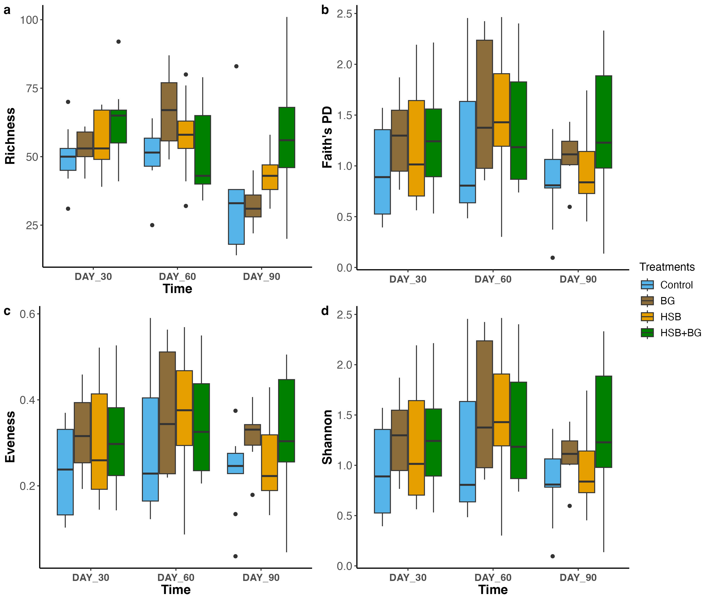
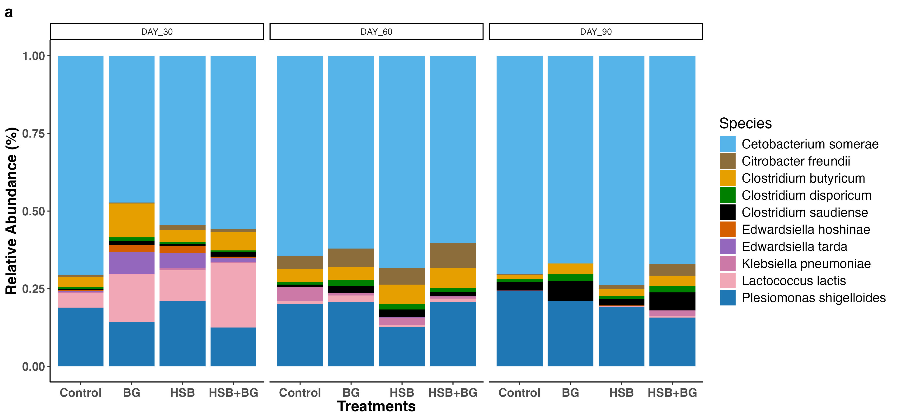

# 16S rRNA Microbiome EPI2ME to Phyloseq

## Written by Abdulmalik Oladipupo
## Project description
Since long reads technology has lower read quality than short reads, and several available pipelines or
packages are not designed to handle long reads appropriately, I plan to integrate several analytical
pipelines to process 16S read from Oxford Nanopore GridIon. *EPI2ME* is an analytical pipeline designed for processing ONT reads.
However, while this pipeline performs demultiplexing and primer removal steps, merging of reads, followed by
taxonomic assignment and preliminary alpha diversity metrics, the software does not perform other intergative analysis
such as phylogenetic analysis for beta diversity. This project intend to process EPI2ME output further and integrate into Phyloseq for intended downline analysis such as differential abundance, functional pathway analysis, and flexibility in graph generation. 

## Highlights of Analysis

* Demultiplexed 16S reads from ONT GridIon have been quality filtered and classified into taxa using EPI2ME. [Read about EPI2ME here](https://epi2me.nanoporetech.com/epi2me-docs/quickstart/) 
* Output from EPI2ME includes a taxonomy file and an OTU table which can be downloaded as CSV for reformatting. See correctly formatted [taxa file](https://github.com/aubclsc0239/Microbiome_ONT_2025/blob/main/R_data/Taxa_file.csv) and [OTU table](https://github.com/aubclsc0239/Microbiome_ONT_2025/blob/main/R_data/OTU_table_16s.csv).
* Depending on the database selected as reference when running EPI2ME (Silva 138 or NCBI 16s database), download the appropiate database from EPI2ME output. *NOTE: the database is not included on this project due to large size.* This database file will be included in EPI2ME output).
* Make a reference sequence file (fasta_file) for the identified taxa from EPI2ME
* The generated reference sequence will be aligned with MAFFT, using the aligned reads to make a
phylogenetic tree using FastTree. Read about MAFFT [here](https://open.bioqueue.org/home/knowledge/showKnowledge/sig/mafft)
* The taxonomy file, OTU table, fasta_file, tree, and metadata file will be read into R. Create an object using the Phyloseq package. See Phyloseq [here](https://www.rdocumentation.org/packages/phyloseq/versions/1.16.2).
* Perform statistics on diversity metrices and make fancy plots for publication using ggplot2. 


## Links to analysis
### Data Formating

- [Make a Ref_seq file](Bash_Scripts/Data_Formatting/species_replace.sh)
- [Convert CSV to a Fasta file](Bash_Scripts/Data_Formatting/CSV_to_fasta.sh)

### Alignment

- [Perform multiple alignment](Bash_Scripts/Ref_Seq_Alignment/Align.sh)

### Phylogentic tree

- [Make a phylogenetic tree](Bash_Scripts/Phylogenetic_Tree/tree.sh)

### Data Analysis in R (Taxonomy plot and Alpha diversity)

- [Files needed for Phyloseq](R_data)

- [Data Analysis in R](rcode.Rmd)

### Figures

See plots





### File tree

```bash
├── Bash_Scripts
│   ├── Data_Formatting
│   │   ├── CSV_to_fasta.sh # script to convert a csv to fasta file 
│   │   ├── fasta.csv
│   │   ├── fasta_file.fasta # 
│   │   ├── species_only.txt # text file with taxa list only
│   │   └── species_replace.sh # script to add sequence to taxa (this makes a fasta.csv)
│   ├── Ref_Seq_Alignment
│   │   ├── Align.sh # script to perform alignment
│   │   ├── fasta.align
│   │   └── fasta_file.fasta
│   └── Phylogenetic_Tree
│       ├── fasta.align
│       ├── tree.nwk
│       └── tree.sh # script to build tree
├── Microbiome_ONT_2025.Rproj
├── R_data
│   ├── OTU_table_16s.csv # OTU table
│   ├── Taxa_file.csv # taxa
│   ├── fasta_file.fasta # fasta file
│   ├── metadata_test.csv # metadata
│   └── tree.nwk # tree file
├──rcode.Rmd # R analysis
├── Plots
│   ├── AbunFig.jpg
│   ├── AbunFig.tiff
│   ├── AlphaFig.jpg
│   └── AlphaFig.tiff
└── README.md
```
