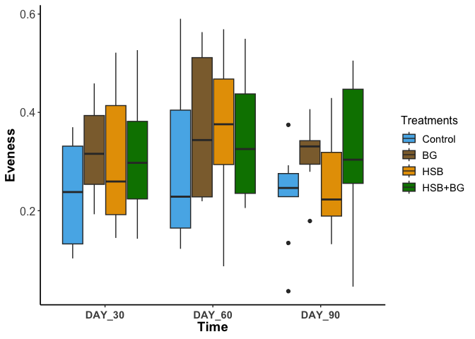
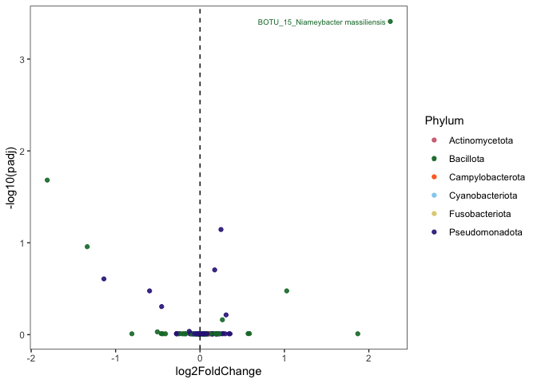
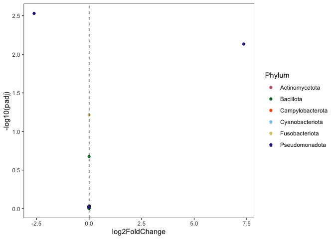

- [Install and Load all required
  packages](#install-and-load-all-required-packages)
- [Set up color pallet to use through this
  analysis](#set-up-color-pallet-to-use-through-this-analysis)
- [Load in all required formatted files from the HPC or formatted epi2me
  output.](#load-in-all-required-formatted-files-from-the-hpc-or-formatted-epi2me-output.)
- [Format all CSV input data to ensure match rows and
  column](#format-all-csv-input-data-to-ensure-match-rows-and-column)
- [Load all file into phyloseq](#load-all-file-into-phyloseq)
- [Samples quality control and read
  distribution](#samples-quality-control-and-read-distribution)
- [ANALYSIS AND VISUALIZATION](#analysis-and-visualization)

### Install and Load all required packages

``` r
# Check and install missing packages only
required_packages <- c(
    "vegan", "phyloseq", "Biostrings", "metagenomeSeq", "ANCOMBC",
    "decontam", "indicspecies", "DESeq2", "ggpubr", "tidyverse", "picante", "nlme",
    "ggplot2", "dunn.test", "writexl", "pairwiseAdonis", "remotes", "emmeans", "multcompView", 
    "cluster", "devtools", "statmod", "gtools", "BiocStyle", "DECIPHER", "phangorn", "gridExtra"
)

# Install missing packages
for (pkg in required_packages) {
    if (!requireNamespace(pkg, quietly = TRUE)) {
        cat("Installing missing package:", pkg, "\n")
        if (pkg %in% c("vegan", "phyloseq", "Biostrings", "metagenomeSeq", 
                       "decontam", "indicspecies", "DESeq2", "ggpubr", "BiocStyle", "DECIPHER", "phangorn","picante", "nlme")) {
            BiocManager::install(pkg, lib = "~/R/library")
        } else {
            install.packages(pkg, repos = "http://cran.us.r-project.org", lib = "~/R/library")
        }
    }
}
```

    ## Registered S3 method overwritten by 'DescTools':
    ##   method         from  
    ##   reorder.factor gplots

``` r
# Load libraries
library("vegan")
```

    ## Loading required package: permute

``` r
library("phyloseq")
library(ANCOMBC)
```

    ## Warning: package 'ANCOMBC' was built under R version 4.4.2

``` r
library("nlme")
library("Biostrings")
```

    ## Warning: package 'Biostrings' was built under R version 4.4.2

    ## Loading required package: BiocGenerics

    ## 
    ## Attaching package: 'BiocGenerics'

    ## The following objects are masked from 'package:stats':
    ## 
    ##     IQR, mad, sd, var, xtabs

    ## The following objects are masked from 'package:base':
    ## 
    ##     anyDuplicated, aperm, append, as.data.frame, basename, cbind,
    ##     colnames, dirname, do.call, duplicated, eval, evalq, Filter, Find,
    ##     get, grep, grepl, intersect, is.unsorted, lapply, Map, mapply,
    ##     match, mget, order, paste, pmax, pmax.int, pmin, pmin.int,
    ##     Position, rank, rbind, Reduce, rownames, sapply, saveRDS, setdiff,
    ##     table, tapply, union, unique, unsplit, which.max, which.min

    ## Loading required package: S4Vectors

    ## Loading required package: stats4

    ## 
    ## Attaching package: 'S4Vectors'

    ## The following object is masked from 'package:utils':
    ## 
    ##     findMatches

    ## The following objects are masked from 'package:base':
    ## 
    ##     expand.grid, I, unname

    ## Loading required package: IRanges

    ## Warning: package 'IRanges' was built under R version 4.4.2

    ## 
    ## Attaching package: 'IRanges'

    ## The following object is masked from 'package:nlme':
    ## 
    ##     collapse

    ## The following object is masked from 'package:phyloseq':
    ## 
    ##     distance

    ## Loading required package: XVector

    ## Loading required package: GenomeInfoDb

    ## Warning: package 'GenomeInfoDb' was built under R version 4.4.2

    ## 
    ## Attaching package: 'Biostrings'

    ## The following object is masked from 'package:base':
    ## 
    ##     strsplit

``` r
library("metagenomeSeq")
```

    ## Warning: package 'metagenomeSeq' was built under R version 4.4.2

    ## Loading required package: Biobase

    ## Welcome to Bioconductor
    ## 
    ##     Vignettes contain introductory material; view with
    ##     'browseVignettes()'. To cite Bioconductor, see
    ##     'citation("Biobase")', and for packages 'citation("pkgname")'.

    ## 
    ## Attaching package: 'Biobase'

    ## The following object is masked from 'package:phyloseq':
    ## 
    ##     sampleNames

    ## Loading required package: limma

    ## Warning: package 'limma' was built under R version 4.4.2

    ## 
    ## Attaching package: 'limma'

    ## The following object is masked from 'package:BiocGenerics':
    ## 
    ##     plotMA

    ## Loading required package: glmnet

    ## Loading required package: Matrix

    ## 
    ## Attaching package: 'Matrix'

    ## The following object is masked from 'package:S4Vectors':
    ## 
    ##     expand

    ## Loaded glmnet 4.1-9

    ## Loading required package: RColorBrewer

``` r
library("decontam")
library("indicspecies")
```

    ## 
    ## Attaching package: 'indicspecies'

    ## The following object is masked from 'package:Biostrings':
    ## 
    ##     coverage

    ## The following object is masked from 'package:IRanges':
    ## 
    ##     coverage

``` r
library("DESeq2")
```

    ## Loading required package: GenomicRanges

    ## Loading required package: SummarizedExperiment

    ## Loading required package: MatrixGenerics

    ## Warning: package 'MatrixGenerics' was built under R version 4.4.2

    ## Loading required package: matrixStats

    ## 
    ## Attaching package: 'matrixStats'

    ## The following objects are masked from 'package:Biobase':
    ## 
    ##     anyMissing, rowMedians

    ## 
    ## Attaching package: 'MatrixGenerics'

    ## The following objects are masked from 'package:matrixStats':
    ## 
    ##     colAlls, colAnyNAs, colAnys, colAvgsPerRowSet, colCollapse,
    ##     colCounts, colCummaxs, colCummins, colCumprods, colCumsums,
    ##     colDiffs, colIQRDiffs, colIQRs, colLogSumExps, colMadDiffs,
    ##     colMads, colMaxs, colMeans2, colMedians, colMins, colOrderStats,
    ##     colProds, colQuantiles, colRanges, colRanks, colSdDiffs, colSds,
    ##     colSums2, colTabulates, colVarDiffs, colVars, colWeightedMads,
    ##     colWeightedMeans, colWeightedMedians, colWeightedSds,
    ##     colWeightedVars, rowAlls, rowAnyNAs, rowAnys, rowAvgsPerColSet,
    ##     rowCollapse, rowCounts, rowCummaxs, rowCummins, rowCumprods,
    ##     rowCumsums, rowDiffs, rowIQRDiffs, rowIQRs, rowLogSumExps,
    ##     rowMadDiffs, rowMads, rowMaxs, rowMeans2, rowMedians, rowMins,
    ##     rowOrderStats, rowProds, rowQuantiles, rowRanges, rowRanks,
    ##     rowSdDiffs, rowSds, rowSums2, rowTabulates, rowVarDiffs, rowVars,
    ##     rowWeightedMads, rowWeightedMeans, rowWeightedMedians,
    ##     rowWeightedSds, rowWeightedVars

    ## The following object is masked from 'package:Biobase':
    ## 
    ##     rowMedians

``` r
library("ggpubr")
```

    ## Loading required package: ggplot2

``` r
library("tidyverse")
```

    ## ── Attaching core tidyverse packages ──────────────────────── tidyverse 2.0.0 ──
    ## ✔ dplyr     1.1.4     ✔ readr     2.1.5
    ## ✔ forcats   1.0.0     ✔ stringr   1.5.1
    ## ✔ lubridate 1.9.4     ✔ tibble    3.3.0
    ## ✔ purrr     1.0.4     ✔ tidyr     1.3.1

    ## ── Conflicts ────────────────────────────────────────── tidyverse_conflicts() ──
    ## ✖ lubridate::%within%() masks IRanges::%within%()
    ## ✖ dplyr::collapse()     masks Biostrings::collapse(), IRanges::collapse(), nlme::collapse()
    ## ✖ dplyr::combine()      masks Biobase::combine(), BiocGenerics::combine()
    ## ✖ purrr::compact()      masks XVector::compact()
    ## ✖ dplyr::count()        masks matrixStats::count()
    ## ✖ dplyr::desc()         masks IRanges::desc()
    ## ✖ tidyr::expand()       masks Matrix::expand(), S4Vectors::expand()
    ## ✖ dplyr::filter()       masks stats::filter()
    ## ✖ dplyr::first()        masks S4Vectors::first()
    ## ✖ dplyr::lag()          masks stats::lag()
    ## ✖ tidyr::pack()         masks Matrix::pack()
    ## ✖ ggplot2::Position()   masks BiocGenerics::Position(), base::Position()
    ## ✖ purrr::reduce()       masks GenomicRanges::reduce(), IRanges::reduce()
    ## ✖ dplyr::rename()       masks S4Vectors::rename()
    ## ✖ lubridate::second()   masks S4Vectors::second()
    ## ✖ lubridate::second<-() masks S4Vectors::second<-()
    ## ✖ dplyr::slice()        masks XVector::slice(), IRanges::slice()
    ## ✖ tidyr::unpack()       masks Matrix::unpack()
    ## ℹ Use the conflicted package (<http://conflicted.r-lib.org/>) to force all conflicts to become errors

``` r
library("ggplot2")
library("dunn.test")
library("writexl")
library("lme4")
```

    ## 
    ## Attaching package: 'lme4'
    ## 
    ## The following object is masked from 'package:nlme':
    ## 
    ##     lmList

``` r
library("emmeans")
```

    ## Welcome to emmeans.
    ## Caution: You lose important information if you filter this package's results.
    ## See '? untidy'

``` r
library("multcomp")
```

    ## Loading required package: mvtnorm
    ## Loading required package: survival
    ## Loading required package: TH.data
    ## Loading required package: MASS
    ## 
    ## Attaching package: 'MASS'
    ## 
    ## The following object is masked from 'package:dplyr':
    ## 
    ##     select
    ## 
    ## 
    ## Attaching package: 'TH.data'
    ## 
    ## The following object is masked from 'package:MASS':
    ## 
    ##     geyser

``` r
library("multcompView")
library("pairwiseAdonis")
```

    ## Loading required package: cluster

``` r
library("cluster")
library("devtools")
```

    ## Loading required package: usethis
    ## 
    ## Attaching package: 'devtools'
    ## 
    ## The following object is masked from 'package:emmeans':
    ## 
    ##     test
    ## 
    ## The following object is masked from 'package:permute':
    ## 
    ##     check

``` r
library("picante")
```

    ## Loading required package: ape
    ## 
    ## Attaching package: 'ape'
    ## 
    ## The following object is masked from 'package:dplyr':
    ## 
    ##     where
    ## 
    ## The following object is masked from 'package:ggpubr':
    ## 
    ##     rotate
    ## 
    ## The following object is masked from 'package:Biostrings':
    ## 
    ##     complement

``` r
library("phangorn")
```

    ## 
    ## Attaching package: 'phangorn'
    ## 
    ## The following objects are masked from 'package:vegan':
    ## 
    ##     diversity, treedist

``` r
library(car)
```

    ## Loading required package: carData
    ## 
    ## Attaching package: 'car'
    ## 
    ## The following object is masked from 'package:dplyr':
    ## 
    ##     recode
    ## 
    ## The following object is masked from 'package:purrr':
    ## 
    ##     some

### Set up color pallet to use through this analysis

``` r
# color blind pallet
cbbPalette <- c("#56B4E9", "#8C6D3B", "#E69F00", "#008000", "#000000", 
                "#D55E00", "#9467BD", "#CC79A7", "#F1A7B6", "#1F77B4", 
                "#8C564B", "#2CA02C", "#FF7F0E", "#009E73", "#E69F00", "#D55E00")
```

### Load in all required formatted files from the HPC or formatted epi2me output.

``` r
taxa <- read.csv("R_data/Taxa_file.csv", header = TRUE, row.names = 1, na.strings = "na")
otu.table <- read.csv("R_data/OTU_table_16s.csv", na.strings = "na")
metadata <- read.csv("R_data/metadata_test.csv", na.strings = "na")
tree.read <- "R_data/tree.nwk"
fasta.read <- "R_data/fasta_file.fasta"
```

### Format all CSV input data to ensure match rows and column

``` r
taxa$OTU <- rownames(taxa)
rownames(otu.table) <- otu.table$OTU
otu.table <- otu.table[,-1]
rownames(metadata) <- metadata$SampleID #row names must match OTU table headers
```

### Load all file into phyloseq

``` r
# read data into plysoseq
phy.tax <- phyloseq::tax_table(as.matrix(taxa))
phy.OTU.table <- phyloseq::otu_table(otu.table, taxa_are_rows = TRUE)
phy.data <- phyloseq::sample_data(metadata)
phy.fasta <- Biostrings::readDNAStringSet(fasta.read, format="fasta", seek.first.rec=TRUE, use.names=TRUE)
phy.tree <- phyloseq::read_tree(tree.read)

phyloseq.data <- phyloseq(phy.tax, phy.OTU.table, phy.data, phy.fasta, phy.tree)
phyloseq.data
```

    ## phyloseq-class experiment-level object
    ## otu_table()   OTU Table:         [ 378 taxa and 106 samples ]
    ## sample_data() Sample Data:       [ 106 samples by 4 sample variables ]
    ## tax_table()   Taxonomy Table:    [ 378 taxa by 9 taxonomic ranks ]
    ## phy_tree()    Phylogenetic Tree: [ 378 tips and 376 internal nodes ]
    ## refseq()      DNAStringSet:      [ 378 reference sequences ]

### Samples quality control and read distribution

``` r
# filter out taxa that have non-zero abundance in less than 2 samples
ps.clean <- filter_taxa(phyloseq.data, function (x) {sum(x > 0) >= 2}, prune=TRUE)
# see read distribution from the highest to lowest
sort(sample_sums(ps.clean), decreasing = T)
```

    ##     barcode11     barcode02     barcode12  barcode09_92     barcode10 
    ##        225630        218996        217666        204938        193991 
    ##  barcode02_70     barcode06     barcode03     barcode09  barcode17_85 
    ##        193941        193532        166669        165747        154874 
    ##     barcode08  barcode18_86 barcode19_100     barcode04  barcode10_78 
    ##        152689        152467        149304        149160        145952 
    ##  barcode12_18 barcode21_102  barcode18_99     barcode01 barcode23_104 
    ##        145524        144279        142339        136918        135315 
    ##  barcode09_77  barcode11_93  barcode20_28     barcode05  barcode14_96 
    ##        134846        124679        123693        123216        120269 
    ##  barcode05_73  barcode01_69  barcode21_42  barcode22_43     barcode07 
    ##        118954        112040        111028        107493        106874 
    ## barcode20_101  barcode14_24  barcode05_50  barcode15_97 barcode24_105 
    ##        105088        103672        103189        102764        102304 
    ##  barcode13_95  barcode22_66  barcode12_94  barcode21_65  barcode08_53 
    ##        101072        100874        100027         98721         93841 
    ##  barcode07_52  barcode09_16  barcode16_98  barcode23_67  barcode19_27 
    ##         91825         90029         89462         88681         88290 
    ##  barcode05_29  barcode19_64  barcode02_47  barcode07_75  barcode23_44 
    ##         87822         85925         85613         85403         84847 
    ##  barcode17_21  barcode16_84  barcode15_83  barcode18_22  barcode08_15 
    ##         84084         82097         82046         80244         79227 
    ##  barcode12_57  barcode01_46  barcode18_63  barcode06_51  barcode23_91 
    ##         79005         76676         76218         75988         75682 
    ##  barcode15_40  barcode13_19  barcode07_14  barcode01_13  barcode24_68 
    ##         74513         74066         74040         73644         72997 
    ##  barcode18_33  barcode12_38  barcode22_90  barcode17_62  barcode16_61 
    ##         72473         72236         71988         71113         70088 
    ##  barcode11_17  barcode04_49  barcode03_48  barcode15_20  barcode11_56 
    ##         69268         69049         68582         68023         66064 
    ##  barcode18_26  barcode20_23  barcode16_41  barcode11_37  barcode17_32 
    ##         66005         64623         64611         64453         64242 
    ##  barcode10_36  barcode24_45  barcode08_76  barcode15_60  barcode13_58 
    ##         63770         63712         61711         61649         61578 
    ##  barcode06_74  barcode14_59  barcode19_87  barcode21_89  barcode12_80 
    ##         61205         61204         60397         60285         60134 
    ##  barcode10_55  barcode07_31  barcode09_35  barcode09_54  barcode15_25 
    ##         60089         59928         59812         59071         58888 
    ##  barcode13_81 barcode04_106  barcode06_30  barcode04_72  barcode20_34 
    ##         58710         58561         58265         57870         55018 
    ##  barcode11_79  barcode20_88  barcode03_71  barcode14_82  barcode14_39 
    ##         54916         54713         52606         52394         51350 
    ## barcode22_103 
    ##         31999

``` r
# check total reads
sum(sample_sums(ps.clean))
```

    ## [1] 10145652

``` r
# chech mean read 
mean(sample_sums(ps.clean))
```

    ## [1] 95713.7

``` r
# median read
median(sample_sums(ps.clean))
```

    ## [1] 81145

``` r
# Normalize Sampling reads based on cumulative sum scaling (CSS normalization)
MGS <- phyloseq_to_metagenomeSeq(ps.clean)
p <- metagenomeSeq::cumNormStatFast(MGS)
```

    ## Default value being used.

``` r
MGS <- metagenomeSeq::cumNorm(MGS, p =p)
metagenomeSeq::normFactors(MGS) # exports the normalized factors for each sample
```

    ##     barcode01  barcode01_13  barcode01_46  barcode01_69     barcode02 
    ##           194           127            28           147           421 
    ##  barcode02_47  barcode02_70     barcode03  barcode03_48  barcode03_71 
    ##           237           155           101            72           112 
    ##     barcode04 barcode04_106  barcode04_49  barcode04_72     barcode05 
    ##           113            87            71            64           130 
    ##  barcode05_29  barcode05_50  barcode05_73     barcode06  barcode06_30 
    ##           241            87           332           317           283 
    ##  barcode06_51  barcode06_74     barcode07  barcode07_14  barcode07_31 
    ##            68            63           397            75           157 
    ##  barcode07_52  barcode07_75     barcode08  barcode08_15  barcode08_53 
    ##            48            97           157           151            91 
    ##  barcode08_76     barcode09  barcode09_16  barcode09_35  barcode09_54 
    ##           151           107            93           135            56 
    ##  barcode09_77  barcode09_92     barcode10  barcode10_36  barcode10_55 
    ##           121           176           110           170            36 
    ##  barcode10_78     barcode11  barcode11_17  barcode11_37  barcode11_56 
    ##           164            96           246            92            56 
    ##  barcode11_79  barcode11_93     barcode12  barcode12_18  barcode12_38 
    ##           108           144           207           186            74 
    ##  barcode12_57  barcode12_80  barcode12_94  barcode13_19  barcode13_58 
    ##            17            68           115            34            34 
    ##  barcode13_81  barcode13_95  barcode14_24  barcode14_39  barcode14_59 
    ##           127            54           190            84           104 
    ##  barcode14_82  barcode14_96  barcode15_20  barcode15_25  barcode15_40 
    ##            32           281           197           193           140 
    ##  barcode15_60  barcode15_83  barcode15_97  barcode16_41  barcode16_61 
    ##            64           123           194            92            39 
    ##  barcode16_84  barcode16_98  barcode17_21  barcode17_32  barcode17_62 
    ##            71            94           174            52            66 
    ##  barcode17_85  barcode18_22  barcode18_26  barcode18_33  barcode18_63 
    ##           101            84           199           174            35 
    ##  barcode18_86  barcode18_99 barcode19_100  barcode19_27  barcode19_64 
    ##           129           115           227           147            48 
    ##  barcode19_87 barcode20_101  barcode20_23  barcode20_28  barcode20_34 
    ##            33           203            87           179           129 
    ##  barcode20_88 barcode21_102  barcode21_42  barcode21_65  barcode21_89 
    ##            33            28            32            33            33 
    ## barcode22_103  barcode22_43  barcode22_66  barcode22_90 barcode23_104 
    ##           148           178            50            34           151 
    ##  barcode23_44  barcode23_67  barcode23_91 barcode24_105  barcode24_45 
    ##            39            54            59           147            46 
    ##  barcode24_68 
    ##            50

``` r
norm.bacteria <- metagenomeSeq::MRcounts(MGS, norm = T)
norm.bacteria.OTU <- phyloseq::otu_table(norm.bacteria, taxa_are_rows = TRUE)

physeq.css <- phyloseq::phyloseq(norm.bacteria.OTU, phy.data, phy.tax, phy.fasta, phy.tree)

# Save RDS files of each type of normalized reads for easy loading in the future and reproducibility 
# Save an object to a file
saveRDS(physeq.css, file = "Bacteria_CCF_EXP242301_12102024.rds")
saveRDS(ps.clean, file = "Bacteria_CCF_nonnorm_12102024.rds")

physeq.css <- readRDS(file = "Bacteria_CCF_EXP242301_12102024.rds")
ps.clean <- readRDS(file = "Bacteria_CCF_nonnorm_12102024.rds")
```

### ANALYSIS AND VISUALIZATION

#### Relative Abundance Plot

``` r
# fecal samples Relative Abundance/treatment*day
top20 <- names(sort(taxa_sums(ps.clean), decreasing=TRUE))[1:10]
ps.top20 <- transform_sample_counts(ps.clean, function(OTU) OTU/sum(OTU))
ps.top20 <- prune_taxa(top20, ps.top20)
dat.dataframe <- psmelt(ps.top20)
```

    ## Warning in psmelt(ps.top20): The rank names: 
    ## OTU
    ##  have been renamed to: 
    ## taxa_OTU
    ## to avoid conflicts with special phyloseq plot attribute names.

``` r
dat.agr <- aggregate(Abundance ~ Treatments*Time + Species + genus + Phylum, data = dat.dataframe, FUN = mean)
dat.agr$Treatments <- factor(dat.agr$Treatments, levels = c("Control", "BG", "HSB", "HSB+BG"))
rel_abun_treatment <-ggplot(dat.agr, aes(x = Treatments, y = Abundance, fill = Species)) +
  facet_wrap(~Time) +
  geom_bar(stat = "identity", position = "fill") +
  theme_classic() +
  scale_fill_manual(values=cbbPalette) +
  labs(title = "",
       x = "Treatments",
       y = "Relative Abundance (%)") +
  theme(axis.text.x = element_text(size = 12, face = "bold", vjust = 0.5, hjust=0.5),
        axis.text.y = element_text(size = 12, face = "bold"),
        axis.title.y = element_text(size = 15, face = "bold"),
        axis.title.x = element_text(size = 15, face = "bold"),
        legend.text = element_text(size = 13),    # Adjust legend text size
        legend.title = element_text(size = 15))     # Adjust legend title size 

rel_abun_treatment
```

<!-- -->

#### Alpha diversity

``` r
# Estimate multiple richness measures at once
alpha_diversity <- estimate_richness(ps.clean, measures = c("Shannon", "InvSimpson", "Observed"))

# Add the measures to the sample data
ps.clean@sam_data$shannon <- alpha_diversity$Shannon
ps.clean@sam_data$invsimpson <- alpha_diversity$InvSimpson
ps.clean@sam_data$richness <- alpha_diversity$Observed

# Compute evenness (Shannon / log(richness))
ps.clean@sam_data$even <- ps.clean@sam_data$shannon / log(ps.clean@sam_data$richness)

# extract data from phyloseq object into a dataframe
sample.df <- data.frame(ps.clean@sam_data)

# Faith's phylogenetic diversity
otu <- ps.clean@otu_table %>%
  as.data.frame()

is.rooted(ps.clean@phy_tree)  # Should return TRUE or FALSE
```

    ## [1] FALSE

``` r
# if FLASE, now root tree
phy_tree_rooted <- midpoint(ps.clean@phy_tree)
ps.diversity <- pd(t(otu), phy_tree_rooted, include.root = TRUE)
ps.diversity$SampleID <- rownames(ps.diversity)
```

#### Prepare data for Analysis

``` r
# arrange order
sample.df$Treatments <- factor(sample.df$Treatments, levels = c("Control", "BG", "HSB", "HSB+BG"))
ps.diversity.join <- left_join(ps.diversity, as.data.frame(ps.clean@sam_data), by = "SampleID")
ps.diversity.join$Time <- factor(ps.diversity.join$Time, levels = c("DAY_30", "DAY_60", "DAY_90"))
ps.diversity.join$Treatments <- factor(ps.diversity.join$Treatments, levels = c("Control", "BG", "HSB", "HSB+BG"))
```

#### Richness Visualization

``` r
compare_means(richness ~ Treatments, sample.df, group.by = "Time", method = "kruskal")
```

    ## # A tibble: 3 × 7
    ##   Time   .y.           p p.adj p.format p.signif method        
    ##   <chr>  <chr>     <dbl> <dbl> <chr>    <chr>    <chr>         
    ## 1 DAY_30 richness 0.161  0.23  0.161    ns       Kruskal-Wallis
    ## 2 DAY_90 richness 0.0140 0.042 0.014    *        Kruskal-Wallis
    ## 3 DAY_60 richness 0.115  0.23  0.115    ns       Kruskal-Wallis

``` r
compare_means(richness ~ Time, sample.df)
```

    ## # A tibble: 3 × 8
    ##   .y.      group1 group2         p   p.adj p.format p.signif method  
    ##   <chr>    <chr>  <chr>      <dbl>   <dbl> <chr>    <chr>    <chr>   
    ## 1 richness DAY_30 DAY_90 0.0000373 0.00011 3.7e-05  ****     Wilcoxon
    ## 2 richness DAY_30 DAY_60 1         1       1.00000  ns       Wilcoxon
    ## 3 richness DAY_90 DAY_60 0.000190  0.00038 0.00019  ***      Wilcoxon

``` r
# Richness by treatment*time interaction
richness.treatment.time <- ggplot(sample.df, aes(x = Time, y = richness, fill = Treatments)) +
  geom_boxplot(position = position_dodge(width = 0.8)) +
  #geom_jitter() + 
  ylab("Richness") +
  xlab("Time") +
  theme_classic() +
  #facet_wrap(~Time) +
  scale_fill_manual(values=cbbPalette) +
  theme(axis.text.x = element_text(size = 11, vjust = 0.5, hjust=0.5, face = "bold"),
        axis.text.y = element_text(size = 12),
        axis.title.y = element_text(size = 14, face = "bold"),
        axis.title.x = element_text(size = 14, face = "bold"),
        axis.line = element_line(size = 0.6),
        legend.text = element_text(size = 11),    # Adjust legend text size
        legend.title = element_text(size = 12))     # Adjust legend title size
```

    ## Warning: The `size` argument of `element_line()` is deprecated as of ggplot2 3.4.0.
    ## ℹ Please use the `linewidth` argument instead.
    ## This warning is displayed once every 8 hours.
    ## Call `lifecycle::last_lifecycle_warnings()` to see where this warning was
    ## generated.

``` r
richness.treatment.time
```

<!-- -->

#### Richness analysis

``` r
rich.trt.time <- lm(richness ~ Treatments*Time, data = sample.df)
anova(rich.trt.time) #treatment=0.027, day=3.02e-05, inter=0.015
```

    ## Analysis of Variance Table
    ## 
    ## Response: richness
    ##                 Df  Sum Sq Mean Sq F value    Pr(>F)    
    ## Treatments       3  1975.0  658.33  3.1841   0.02742 *  
    ## Time             2  4999.6 2499.80 12.0905 2.125e-05 ***
    ## Treatments:Time  6  3475.9  579.31  2.8019   0.01494 *  
    ## Residuals       94 19435.2  206.76                      
    ## ---
    ## Signif. codes:  0 '***' 0.001 '**' 0.01 '*' 0.05 '.' 0.1 ' ' 1

``` r
# Since there is significant interaction, split data by day
sample.df.d30 <- subset(sample.df, Time == "DAY_30")
sample.df.d60 <- subset(sample.df, Time == "DAY_60")
sample.df.d90 <- subset(sample.df, Time == "DAY_90")

# run an lm to compare treatments at each time points
rich.30 <- lm(richness ~ Treatments, data = sample.df.d30)
aov.rich.30 <- anova(rich.30) # 0.098
print(aov.rich.30)
```

    ## Analysis of Variance Table
    ## 
    ## Response: richness
    ##            Df Sum Sq Mean Sq F value  Pr(>F)  
    ## Treatments  3  859.3  286.44  2.2815 0.09803 .
    ## Residuals  32 4017.6  125.55                  
    ## ---
    ## Signif. codes:  0 '***' 0.001 '**' 0.01 '*' 0.05 '.' 0.1 ' ' 1

``` r
rich.60 <- lm(richness ~ Treatments, data = sample.df.d60)
aov.rich.60 <- anova(rich.60) # 0.084
print(aov.rich.60)
```

    ## Analysis of Variance Table
    ## 
    ## Response: richness
    ##            Df Sum Sq Mean Sq F value  Pr(>F)  
    ## Treatments  3 1519.2  506.41  2.4416 0.08358 .
    ## Residuals  30 6222.3  207.41                  
    ## ---
    ## Signif. codes:  0 '***' 0.001 '**' 0.01 '*' 0.05 '.' 0.1 ' ' 1

``` r
rich.90 <- lm(richness ~ Treatments, data = sample.df.d90)
aov.rich.90 <- anova(rich.90) # 0.027
print(aov.rich.90)
```

    ## Analysis of Variance Table
    ## 
    ## Response: richness
    ##            Df Sum Sq Mean Sq F value  Pr(>F)  
    ## Treatments  3 3000.2 1000.07  3.4803 0.02709 *
    ## Residuals  32 9195.3  287.35                  
    ## ---
    ## Signif. codes:  0 '***' 0.001 '**' 0.01 '*' 0.05 '.' 0.1 ' ' 1

``` r
# perform pairwise comparison at 90 d
lsmeans <- emmeans(rich.90, ~Treatments)
Results_lsmeans <- cld(lsmeans, alpha = 0.05, reversed = TRUE, details = TRUE) # contrast with Tukey ajustment
Results_lsmeans
```

    ## $emmeans
    ##  Treatments emmean   SE df lower.CL upper.CL .group
    ##  HSB+BG       54.6 5.65 32     43.0     66.1  1    
    ##  HSB          44.4 5.65 32     32.9     56.0  12   
    ##  Control      33.3 5.65 32     21.8     44.8  12   
    ##  BG           32.1 5.65 32     20.6     43.6   2   
    ## 
    ## Confidence level used: 0.95 
    ## P value adjustment: tukey method for comparing a family of 4 estimates 
    ## significance level used: alpha = 0.05 
    ## NOTE: If two or more means share the same grouping symbol,
    ##       then we cannot show them to be different.
    ##       But we also did not show them to be the same. 
    ## 
    ## $comparisons
    ##  contrast           estimate   SE df t.ratio p.value
    ##  Control - BG           1.22 7.99 32   0.153  0.9987
    ##  HSB - BG              12.33 7.99 32   1.543  0.4244
    ##  HSB - Control         11.11 7.99 32   1.390  0.5143
    ##  (HSB+BG) - BG         22.44 7.99 32   2.809  0.0399
    ##  (HSB+BG) - Control    21.22 7.99 32   2.656  0.0564
    ##  (HSB+BG) - HSB        10.11 7.99 32   1.265  0.5910
    ## 
    ## P value adjustment: tukey method for comparing a family of 4 estimates

#### Evenness Visualization

``` r
compare_means(even ~ Treatments, sample.df, group.by = "Time", method = "kruskal")
```

    ## # A tibble: 3 × 7
    ##   Time   .y.        p p.adj p.format p.signif method        
    ##   <chr>  <chr>  <dbl> <dbl> <chr>    <chr>    <chr>         
    ## 1 DAY_30 even  0.364   0.73 0.364    ns       Kruskal-Wallis
    ## 2 DAY_90 even  0.0727  0.22 0.073    ns       Kruskal-Wallis
    ## 3 DAY_60 even  0.710   0.73 0.710    ns       Kruskal-Wallis

``` r
compare_means(even ~ Time, sample.df)
```

    ## # A tibble: 3 × 8
    ##   .y.   group1 group2     p p.adj p.format p.signif method  
    ##   <chr> <chr>  <chr>  <dbl> <dbl> <chr>    <chr>    <chr>   
    ## 1 even  DAY_30 DAY_90 0.557  0.57 0.56     ns       Wilcoxon
    ## 2 even  DAY_30 DAY_60 0.284  0.57 0.28     ns       Wilcoxon
    ## 3 even  DAY_90 DAY_60 0.138  0.41 0.14     ns       Wilcoxon

``` r
# Richness by treatment*time interaction
even.treatment.time <- ggplot(sample.df, aes(x = Time, y = even, fill = Treatments)) +
  geom_boxplot(position = position_dodge(width = 0.8)) +
  #geom_jitter() + 
  ylab("Eveness") + 
  xlab("Time")+
  theme_classic() +
  #facet_wrap(~Time) +
  scale_fill_manual(values=cbbPalette) +
  theme(axis.text.x = element_text(size = 11, vjust = 0.5, hjust=0.5, face = "bold"),
        axis.text.y = element_text(size = 12),
        axis.title.y = element_text(size = 14, face = "bold"),
        axis.title.x = element_text(size = 14, face = "bold"),
        axis.line = element_line(size = 0.6),
        legend.text = element_text(size = 11),    # Adjust legend text size
        legend.title = element_text(size = 12))     # Adjust legend title size

even.treatment.time
```

<!-- -->

#### Eveness analysis

``` r
even.trt.time <- lm(even ~ Treatments*Time, data = sample.df)
anova(even.trt.time) #treatment=0.088, day=0.126, inter=0.971
```

    ## Analysis of Variance Table
    ## 
    ## Response: even
    ##                 Df  Sum Sq  Mean Sq F value  Pr(>F)  
    ## Treatments       3 0.10430 0.034765  2.2494 0.08767 .
    ## Time             2 0.06534 0.032669  2.1137 0.12649  
    ## Treatments:Time  6 0.02007 0.003345  0.2164 0.97073  
    ## Residuals       94 1.45283 0.015456                  
    ## ---
    ## Signif. codes:  0 '***' 0.001 '**' 0.01 '*' 0.05 '.' 0.1 ' ' 1

``` r
# Histogram
hist(residuals(even.trt.time), main = "Histogram of Residuals")
```

<!-- -->

``` r
# Shapiro-Wilk Test (for normality)
shapiro.test(residuals(even.trt.time))  #0.517
```

    ## 
    ##  Shapiro-Wilk normality test
    ## 
    ## data:  residuals(even.trt.time)
    ## W = 0.98868, p-value = 0.5166

``` r
# Levene’s Test (from car package)
leveneTest(even ~ Treatments*Time, data = sample.df) #0.381
```

    ## Levene's Test for Homogeneity of Variance (center = median)
    ##       Df F value Pr(>F)
    ## group 11  1.0863 0.3807
    ##       94

#### Shannon Visualization

``` r
compare_means(shannon ~ Treatments, sample.df, group.by = "Time", method = "kruskal")
```

    ## # A tibble: 3 × 7
    ##   Time   .y.         p p.adj p.format p.signif method        
    ##   <chr>  <chr>   <dbl> <dbl> <chr>    <chr>    <chr>         
    ## 1 DAY_30 shannon 0.446  0.89 0.45     ns       Kruskal-Wallis
    ## 2 DAY_90 shannon 0.113  0.34 0.11     ns       Kruskal-Wallis
    ## 3 DAY_60 shannon 0.562  0.89 0.56     ns       Kruskal-Wallis

``` r
compare_means(shannon ~ Time, sample.df)
```

    ## # A tibble: 3 × 8
    ##   .y.     group1 group2      p p.adj p.format p.signif method  
    ##   <chr>   <chr>  <chr>   <dbl> <dbl> <chr>    <chr>    <chr>   
    ## 1 shannon DAY_30 DAY_90 0.211   0.42 0.211    ns       Wilcoxon
    ## 2 shannon DAY_30 DAY_60 0.352   0.42 0.352    ns       Wilcoxon
    ## 3 shannon DAY_90 DAY_60 0.0514  0.15 0.051    ns       Wilcoxon

``` r
# Shannon by treatment*time interaction
shannon.treatment.time <- ggplot(sample.df, aes(x = Time, y = shannon, fill = Treatments)) +
  geom_boxplot(position = position_dodge(width = 0.8)) +
  #geom_jitter() + 
  ylab("Shannon") + 
  xlab("Time")+
  theme_classic() +
  #facet_wrap(~day) +
  scale_fill_manual(values=cbbPalette) +
  theme(axis.text.x = element_text(size = 11, vjust = 0.5, hjust=0.5, face = "bold"),
        axis.text.y = element_text(size = 12),
        axis.title.y = element_text(size = 14, face = "bold"),
        axis.title.x = element_text(size = 14, face = "bold"),
        axis.line = element_line(size = 0.6),
        legend.text = element_text(size = 11),    # Adjust legend text size
        legend.title = element_text(size = 12))     # Adjust legend title size

shannon.treatment.time
```

<!-- -->

#### Shannon analysis

``` r
shan.trt.time <- lm(shannon ~ Treatments*Time, data = sample.df)
anova(shan.trt.time) #treatment=0.076, day=0.039, inter=0.927
```

    ## Analysis of Variance Table
    ## 
    ## Response: shannon
    ##                 Df  Sum Sq Mean Sq F value Pr(>F)  
    ## Treatments       3  2.1248 0.70827  2.3614 0.0763 .
    ## Time             2  2.0084 1.00418  3.3480 0.0394 *
    ## Treatments:Time  6  0.5705 0.09509  0.3170 0.9266  
    ## Residuals       94 28.1940 0.29994                 
    ## ---
    ## Signif. codes:  0 '***' 0.001 '**' 0.01 '*' 0.05 '.' 0.1 ' ' 1

``` r
# Histogram
hist(residuals(shan.trt.time), main = "Histogram of Residuals")
```

<!-- -->

``` r
# Shapiro-Wilk Test (for normality)
shapiro.test(residuals(shan.trt.time))  #0.179
```

    ## 
    ##  Shapiro-Wilk normality test
    ## 
    ## data:  residuals(shan.trt.time)
    ## W = 0.98255, p-value = 0.1786

``` r
# Levene’s Test (from car package)
leveneTest(shannon ~ Treatments*Time, data = sample.df) #0.277
```

    ## Levene's Test for Homogeneity of Variance (center = median)
    ##       Df F value Pr(>F)
    ## group 11   1.232 0.2772
    ##       94

``` r
# perform pairwise comparison at 90 d
shan.lsmeans <- emmeans(shan.trt.time, ~Time)
```

    ## NOTE: Results may be misleading due to involvement in interactions

``` r
shan.results_lsmeans <- cld(shan.lsmeans, alpha = 0.05, reversed = TRUE, details = TRUE)
shan.results_lsmeans
```

    ## $emmeans
    ##  Time   emmean     SE df lower.CL upper.CL .group
    ##  DAY_60   1.38 0.0941 94    1.190     1.56  1    
    ##  DAY_30   1.20 0.0913 94    1.020     1.38  12   
    ##  DAY_90   1.04 0.0913 94    0.854     1.22   2   
    ## 
    ## Results are averaged over the levels of: Treatments 
    ## Confidence level used: 0.95 
    ## P value adjustment: tukey method for comparing a family of 3 estimates 
    ## significance level used: alpha = 0.05 
    ## NOTE: If two or more means share the same grouping symbol,
    ##       then we cannot show them to be different.
    ##       But we also did not show them to be the same. 
    ## 
    ## $comparisons
    ##  contrast        estimate    SE df t.ratio p.value
    ##  DAY_30 - DAY_90    0.166 0.129 94   1.283  0.4081
    ##  DAY_60 - DAY_90    0.341 0.131 94   2.601  0.0288
    ##  DAY_60 - DAY_30    0.175 0.131 94   1.338  0.3781
    ## 
    ## Results are averaged over the levels of: Treatments 
    ## P value adjustment: tukey method for comparing a family of 3 estimates

#### Faith’s Phylogentic diversity

``` r
compare_means(PD ~ Treatments, ps.diversity.join, group.by = "Time")
```

    ## # A tibble: 18 × 9
    ##    Time   .y.   group1  group2      p p.adj p.format p.signif method  
    ##    <fct>  <chr> <chr>   <chr>   <dbl> <dbl> <chr>    <chr>    <chr>   
    ##  1 DAY_30 PD    Control BG     1       1    1.000    ns       Wilcoxon
    ##  2 DAY_30 PD    Control HSB    0.796   1    0.796    ns       Wilcoxon
    ##  3 DAY_30 PD    Control HSB+BG 0.0400  0.68 0.040    *        Wilcoxon
    ##  4 DAY_30 PD    BG      HSB    0.730   1    0.730    ns       Wilcoxon
    ##  5 DAY_30 PD    BG      HSB+BG 0.0939  1    0.094    ns       Wilcoxon
    ##  6 DAY_30 PD    HSB     HSB+BG 0.0770  1    0.077    ns       Wilcoxon
    ##  7 DAY_90 PD    Control BG     0.863   1    0.863    ns       Wilcoxon
    ##  8 DAY_90 PD    Control HSB    0.190   1    0.190    ns       Wilcoxon
    ##  9 DAY_90 PD    Control HSB+BG 0.161   1    0.161    ns       Wilcoxon
    ## 10 DAY_90 PD    BG      HSB    0.0188  0.34 0.019    *        Wilcoxon
    ## 11 DAY_90 PD    BG      HSB+BG 0.0770  1    0.077    ns       Wilcoxon
    ## 12 DAY_90 PD    HSB     HSB+BG 0.605   1    0.605    ns       Wilcoxon
    ## 13 DAY_60 PD    Control BG     0.234   1    0.234    ns       Wilcoxon
    ## 14 DAY_60 PD    Control HSB    0.743   1    0.743    ns       Wilcoxon
    ## 15 DAY_60 PD    Control HSB+BG 0.743   1    0.743    ns       Wilcoxon
    ## 16 DAY_60 PD    BG      HSB    0.423   1    0.423    ns       Wilcoxon
    ## 17 DAY_60 PD    BG      HSB+BG 0.139   1    0.139    ns       Wilcoxon
    ## 18 DAY_60 PD    HSB     HSB+BG 0.340   1    0.340    ns       Wilcoxon

``` r
compare_means(PD ~ Time, ps.diversity.join, method = "kruskal")
```

    ## # A tibble: 1 × 6
    ##   .y.          p   p.adj p.format p.signif method        
    ##   <chr>    <dbl>   <dbl> <chr>    <chr>    <chr>         
    ## 1 PD    0.000165 0.00016 0.00016  ***      Kruskal-Wallis

``` r
# PD by treatment*time interaction
pd.treatment.time <- ggplot(ps.diversity.join, aes(x = Time, y = shannon, fill = Treatments)) +
  geom_boxplot(position = position_dodge(width = 0.8)) +
  #geom_jitter() + 
  ylab("Faith's PD") + 
  xlab("")+
  theme_classic() +
  #facet_wrap(~day) +
  scale_fill_manual(values=cbbPalette) +
  theme(axis.text.x = element_text(size = 11, vjust = 0.5, hjust=0.5, face = "bold"),
        axis.text.y = element_text(size = 12),
        axis.title.y = element_text(size = 14, face = "bold"),
        axis.line = element_line(size = 0.6),
        legend.text = element_text(size = 11),    # Adjust legend text size
        legend.title = element_text(size = 12))     # Adjust legend title size

pd.treatment.time
```

<!-- -->

#### Faith PD analysis

``` r
pd.trt.time <- lm(PD ~ Treatments*Time, data = ps.diversity.join)
anova(pd.trt.time) #treatment=0.157, day=2.819e-05, inter=0.095
```

    ## Analysis of Variance Table
    ## 
    ## Response: PD
    ##                 Df  Sum Sq Mean Sq F value    Pr(>F)    
    ## Treatments       3  1.3842 0.46140  1.7775   0.15678    
    ## Time             2  6.0930 3.04648 11.7362 2.819e-05 ***
    ## Treatments:Time  6  2.9080 0.48467  1.8671   0.09458 .  
    ## Residuals       94 24.4005 0.25958                      
    ## ---
    ## Signif. codes:  0 '***' 0.001 '**' 0.01 '*' 0.05 '.' 0.1 ' ' 1

``` r
# Histogram
hist(residuals(pd.trt.time), main = "Histogram of Residuals")
```

<!-- -->

``` r
# Shapiro-Wilk Test (for normality)
shapiro.test(residuals(pd.trt.time))  #0.465
```

    ## 
    ##  Shapiro-Wilk normality test
    ## 
    ## data:  residuals(pd.trt.time)
    ## W = 0.98801, p-value = 0.4654

``` r
# Levene’s Test (from car package)
leveneTest(PD ~ Treatments*Time, data = ps.diversity.join) #0.674
```

    ## Levene's Test for Homogeneity of Variance (center = median)
    ##       Df F value Pr(>F)
    ## group 11  0.7648 0.6737
    ##       94

``` r
# perform pairwise comparison at 90 d
pd.lsmeans <- emmeans(pd.trt.time, ~Time)
```

    ## NOTE: Results may be misleading due to involvement in interactions

``` r
pd.results_lsmeans <- cld(shan.lsmeans, alpha = 0.05, reversed = TRUE, details = TRUE)
pd.results_lsmeans
```

    ## $emmeans
    ##  Time   emmean     SE df lower.CL upper.CL .group
    ##  DAY_60   1.38 0.0941 94    1.190     1.56  1    
    ##  DAY_30   1.20 0.0913 94    1.020     1.38  12   
    ##  DAY_90   1.04 0.0913 94    0.854     1.22   2   
    ## 
    ## Results are averaged over the levels of: Treatments 
    ## Confidence level used: 0.95 
    ## P value adjustment: tukey method for comparing a family of 3 estimates 
    ## significance level used: alpha = 0.05 
    ## NOTE: If two or more means share the same grouping symbol,
    ##       then we cannot show them to be different.
    ##       But we also did not show them to be the same. 
    ## 
    ## $comparisons
    ##  contrast        estimate    SE df t.ratio p.value
    ##  DAY_30 - DAY_90    0.166 0.129 94   1.283  0.4081
    ##  DAY_60 - DAY_90    0.341 0.131 94   2.601  0.0288
    ##  DAY_60 - DAY_30    0.175 0.131 94   1.338  0.3781
    ## 
    ## Results are averaged over the levels of: Treatments 
    ## P value adjustment: tukey method for comparing a family of 3 estimates

#### Beta Diversity (Bray)

``` r
# split data by time
phy30 <- physeq.css %>% subset_samples(Time == "DAY_30")
phy60 <- physeq.css %>% subset_samples(Time == "DAY_60")
phy90 <- physeq.css %>% subset_samples(Time == "DAY_90")

# Principle coordinates analysis with Bray-Curtis distances
set.seed(9000)
ordination.pcoa <- ordinate(physeq.css, "PCoA", "bray") # calculate the resemblance and ordinate using PCoA
ordination.pcoa$vectors # positions of your points on the pcoa graph
```

    ##                     Axis.1       Axis.2        Axis.3       Axis.4
    ## barcode01     -0.140783964 -0.149137667  0.0742748857  0.046776784
    ## barcode01_13  -0.071055166 -0.201588683 -0.0393714227 -0.082239509
    ## barcode01_46   0.372214483  0.247833314 -0.0582616131  0.103062503
    ## barcode01_69  -0.080373117 -0.116256729  0.0152768276 -0.062698065
    ## barcode02     -0.325151923  0.163276204 -0.0522691413 -0.054816984
    ## barcode02_47  -0.365249045  0.001773788 -0.1970854019 -0.015176598
    ## barcode02_70   0.084818622  0.009337724  0.2217781175 -0.191104983
    ## barcode03      0.322391758  0.114799433 -0.1415834546 -0.060869520
    ## barcode03_48   0.125042436 -0.128536040 -0.0689089955 -0.073333343
    ## barcode03_71  -0.272367483 -0.104970250 -0.0995384530 -0.010205465
    ## barcode04      0.285503830  0.022205567 -0.1376884509 -0.070799836
    ## barcode04_106 -0.096098760 -0.179631597  0.0985014508  0.074582522
    ## barcode04_49   0.121964739 -0.106564663 -0.0938683071 -0.066445660
    ## barcode04_72   0.155619366 -0.112948020 -0.1211768437 -0.131801889
    ## barcode05      0.006713268 -0.138844500  0.2300106371  0.084180667
    ## barcode05_29  -0.444122659  0.178121247 -0.1232158637  0.091304683
    ## barcode05_50   0.004520882 -0.084537337  0.2155948026  0.094666976
    ## barcode05_73  -0.335813255  0.374692540  0.1050785146 -0.218592075
    ## barcode06     -0.286467362  0.493805667  0.2447398072 -0.443579053
    ## barcode06_30  -0.426277577  0.093668698 -0.2028875412 -0.018701102
    ## barcode06_51   0.131608236 -0.132164878  0.0701788554  0.018268274
    ## barcode06_74   0.178163265 -0.114493400 -0.1070856625 -0.141748661
    ## barcode07     -0.413178949  0.179400052 -0.0613374102 -0.109672234
    ## barcode07_14   0.192584970 -0.108416602 -0.0992375932 -0.109618329
    ## barcode07_31  -0.288725219 -0.114332699 -0.1296495796 -0.047292915
    ## barcode07_52   0.303845877  0.024722704  0.1098355590  0.082294518
    ## barcode07_75   0.178892639 -0.126480347 -0.1211903103 -0.152576027
    ## barcode08      0.064897948 -0.104535180  0.1552855822 -0.047007895
    ## barcode08_15  -0.415717865  0.207734053 -0.1967192627  0.077676892
    ## barcode08_53   0.236920725 -0.082473933 -0.1221652065 -0.133808901
    ## barcode08_76  -0.266902255 -0.128861909 -0.0747051024 -0.028575749
    ## barcode09     -0.007405128  0.034755196  0.3735434954 -0.018685438
    ## barcode09_16   0.216499198 -0.105591573 -0.1212929479 -0.148680090
    ## barcode09_35  -0.307173515 -0.006051528  0.1010823556  0.213059630
    ## barcode09_54   0.171458926 -0.116562215  0.0477701845  0.000941519
    ## barcode09_77  -0.001686108 -0.126957112  0.2106011400  0.094158886
    ## barcode09_92  -0.172997815  0.017208390  0.2022512792  0.146218507
    ## barcode10     -0.190230628  0.476648098  0.5021729345 -0.092914420
    ## barcode10_36  -0.352626261  0.125590645  0.1344563500  0.296690156
    ## barcode10_55   0.276705886 -0.016553103  0.0971290045  0.070015652
    ## barcode10_78  -0.216903306 -0.007817628  0.1155494339  0.121161869
    ## barcode11      0.353623949  0.209803334 -0.0137022475  0.083005909
    ## barcode11_17  -0.320300106 -0.101735636 -0.1631362339 -0.063166980
    ## barcode11_37   0.001351025 -0.182627478 -0.0036147762 -0.043669373
    ## barcode11_56   0.199586451 -0.085470170  0.0685417072  0.020672399
    ## barcode11_79  -0.329479563 -0.018141243 -0.0590410144  0.003281333
    ## barcode11_93   0.018370081 -0.173978973  0.1097519886  0.049653577
    ## barcode12     -0.072861715  0.061482757  0.1892096210 -0.439930149
    ## barcode12_18  -0.228783861 -0.048677679 -0.1088676325  0.019177843
    ## barcode12_38   0.138307577 -0.068041860 -0.1413195702 -0.110158582
    ## barcode12_57   0.331551849  0.419520846 -0.1941585667  0.056225540
    ## barcode12_80   0.111825770 -0.136926631 -0.0427991787 -0.068287453
    ## barcode12_94   0.083474066 -0.158244080 -0.0521666636 -0.070708502
    ## barcode13_19   0.356572944  0.149265612 -0.0009620901  0.096464910
    ## barcode13_58   0.310718638  0.040915396  0.0832107195  0.078043439
    ## barcode13_81  -0.187426067 -0.171531504 -0.1030871587 -0.085361564
    ## barcode13_95   0.340858363  0.139859365 -0.1529969597 -0.007969213
    ## barcode14_24  -0.151933123 -0.171503750 -0.0425706660 -0.076055828
    ## barcode14_39  -0.125963878 -0.163991084  0.0366184460  0.031255491
    ## barcode14_59  -0.094726442 -0.183960694  0.1039379526  0.056691943
    ## barcode14_82   0.321066385  0.084127116 -0.1162056725 -0.004326754
    ## barcode14_96  -0.429599018  0.133796755 -0.1780943666  0.094279848
    ## barcode15_20  -0.340482021 -0.031210567 -0.0119645343  0.133094041
    ## barcode15_25  -0.377491130 -0.019930808 -0.1130387640  0.021388096
    ## barcode15_40  -0.366374262  0.115821023  0.0070943520  0.266656776
    ## barcode15_60   0.053399328 -0.151667355  0.1767334356  0.073875683
    ## barcode15_83   0.017118631 -0.199069279 -0.0540553644 -0.120294277
    ## barcode15_97  -0.158426067 -0.176350909 -0.0351498792 -0.038681694
    ## barcode16_41  -0.185296067 -0.103761967 -0.0400160966  0.078448085
    ## barcode16_61   0.270994911 -0.020021437  0.1299872405  0.052091921
    ## barcode16_84   0.143114684 -0.125679202  0.0660533266  0.024903014
    ## barcode16_98   0.117725554 -0.153450701 -0.0496129765 -0.078986126
    ## barcode17_21  -0.187813288 -0.173203038 -0.0718332457 -0.047575054
    ## barcode17_32   0.237200913 -0.068503764  0.0546976752  0.010931066
    ## barcode17_62   0.168963791 -0.111102075  0.0048275525 -0.007472983
    ## barcode17_85  -0.218840687  0.347394430  0.2896398082 -0.302208136
    ## barcode18_22  -0.011449745 -0.160595382  0.1797859091  0.101361809
    ## barcode18_26  -0.374094560  0.026829167 -0.0275902528 -0.005259202
    ## barcode18_33  -0.417383604  0.095721873 -0.1450401568  0.128640774
    ## barcode18_63   0.343748422  0.144602717  0.0327588052  0.109296584
    ## barcode18_86   0.229046845 -0.048656656 -0.0920954124 -0.107613600
    ## barcode18_99   0.270225786 -0.022350526 -0.1024882411 -0.062055333
    ## barcode19_100 -0.246863986 -0.067338127 -0.0324604267  0.084848567
    ## barcode19_27  -0.207246264 -0.126191286  0.0366505791  0.036942661
    ## barcode19_64   0.338273165  0.097737945 -0.0306422121  0.056094337
    ## barcode19_87   0.302547312  0.029305195  0.0554707242  0.089651779
    ## barcode20_101 -0.313103974 -0.037821100 -0.1044169406 -0.012270651
    ## barcode20_23   0.046340621 -0.178064751 -0.0156497528 -0.054903890
    ## barcode20_28  -0.345437213  0.187955960  0.1415831159  0.001288235
    ## barcode20_34  -0.408731057  0.330671868 -0.1622107526  0.145167627
    ## barcode20_88   0.135154673 -0.077735055  0.2378033187  0.076225268
    ## barcode21_102  0.318052088  0.414101333 -0.1612093151  0.089259317
    ## barcode21_42   0.363286201  0.324907901 -0.1196669911  0.107853497
    ## barcode21_65   0.391784289  0.333867263 -0.2114702859  0.009218628
    ## barcode21_89   0.326734611  0.078481898 -0.0067863709  0.083035336
    ## barcode22_103 -0.398925995  0.026005333 -0.2053366055 -0.033105970
    ## barcode22_43  -0.165919992 -0.117019254  0.1369642582  0.128855912
    ## barcode22_66   0.314750529  0.126536237 -0.0791350297  0.043750766
    ## barcode22_90   0.343217022  0.117637857 -0.0244514342  0.089787967
    ## barcode23_104  0.073996311 -0.142292857  0.0443059348  0.007179032
    ## barcode23_44   0.362005044  0.136380434  0.0331963904  0.094837504
    ## barcode23_67   0.314527454  0.029626387  0.0042257734  0.043195883
    ## barcode23_91   0.201204932 -0.081685486  0.0623199745  0.033414572
    ## barcode24_105 -0.013163625 -0.179915334 -0.0021291814 -0.036829560
    ## barcode24_45   0.216036709 -0.080922631  0.1138796419  0.055396590
    ## barcode24_68   0.258300691 -0.034251404 -0.0839478845 -0.072667979
    ##                      Axis.5       Axis.6        Axis.7        Axis.8
    ## barcode01      7.542488e-02 -0.060688465  1.458263e-01 -0.0204415037
    ## barcode01_13   3.673946e-02  0.069241129  4.591452e-02  0.0045392679
    ## barcode01_46   8.033502e-02  0.075745293  5.199764e-02 -0.0088035870
    ## barcode01_69  -5.533254e-02  0.039084182  3.283128e-02 -0.0583214720
    ## barcode02      1.875138e-01 -0.044522226 -1.727168e-01 -0.1548416432
    ## barcode02_47  -4.137197e-02  0.108823039 -1.496201e-02  0.0570663206
    ## barcode02_70  -4.580141e-02 -0.026544948 -3.074993e-02 -0.0368946826
    ## barcode03      2.420538e-02 -0.062232517  1.913763e-02  0.0036524769
    ## barcode03_48  -3.344375e-02 -0.089865665  9.595461e-03 -0.0018183213
    ## barcode03_71  -3.155692e-02  0.081706024  5.228613e-02  0.0002507867
    ## barcode04     -1.043195e-02  0.004034368 -5.095768e-02 -0.0280341021
    ## barcode04_106  7.715505e-02  0.014288220  6.944623e-02 -0.0149207780
    ## barcode04_49  -8.627550e-02 -0.053610239 -2.130741e-02 -0.0161833000
    ## barcode04_72  -5.231343e-02 -0.031728091 -5.773574e-02 -0.0022490399
    ## barcode05      1.135372e-02  0.177963330 -4.341220e-02  0.1528550197
    ## barcode05_29  -1.165675e-01 -0.097236156  8.462518e-03  0.0200011577
    ## barcode05_50  -5.866760e-02 -0.036584892  6.331244e-02  0.0970086317
    ## barcode05_73   2.092160e-02 -0.341222009  8.049211e-02  0.2162448698
    ## barcode06     -4.385684e-02  0.007920468  9.337922e-03  0.0488803615
    ## barcode06_30   1.331799e-01 -0.047717627 -1.431455e-01  0.1165335543
    ## barcode06_51  -1.726379e-02 -0.096353625  2.912793e-03 -0.0347447660
    ## barcode06_74  -5.457218e-02 -0.031564232 -4.137891e-02 -0.0012853965
    ## barcode07      1.635834e-01 -0.173634479 -7.760429e-02  0.1784451128
    ## barcode07_14  -3.702641e-02 -0.024925068 -3.601315e-02 -0.0184047463
    ## barcode07_31   1.024967e-01 -0.016164513  4.945015e-02  0.0713218033
    ## barcode07_52  -2.826404e-02 -0.053392065 -6.264294e-02  0.1144231883
    ## barcode07_75  -4.245654e-02 -0.026670478 -5.532860e-02  0.0219827760
    ## barcode08     -1.829758e-03  0.026040290 -4.832892e-02 -0.0284344448
    ## barcode08_15  -2.409009e-01  0.004497560 -5.658596e-03  0.0445518391
    ## barcode08_53  -4.806916e-02 -0.042567961 -4.222639e-02  0.0200646920
    ## barcode08_76   9.274350e-02  0.107009339  1.912364e-02 -0.0423210230
    ## barcode09     -2.330079e-02  0.162655227 -1.127707e-02  0.2865096008
    ## barcode09_16  -5.215227e-02 -0.025703587 -4.921732e-02  0.0112130657
    ## barcode09_35   1.037496e-01  0.028897231 -1.422699e-01 -0.0241758507
    ## barcode09_54  -1.780705e-02  0.011640466 -7.149627e-02 -0.0646362267
    ## barcode09_77   3.595725e-02 -0.047621689  1.229691e-01  0.0144424343
    ## barcode09_92  -1.119880e-01 -0.084047869  1.824720e-01 -0.0080316047
    ## barcode10     -1.070400e-01  0.104625315 -8.618847e-02 -0.2124196550
    ## barcode10_36  -1.217036e-02 -0.046126200 -9.156871e-02 -0.0506453251
    ## barcode10_55  -2.885642e-02 -0.086009442 -3.458792e-02  0.0409960540
    ## barcode10_78   1.735509e-01 -0.213450373  1.743154e-01 -0.1094876763
    ## barcode11      5.166181e-02  0.080914338 -6.714363e-03 -0.0043344151
    ## barcode11_17   1.390465e-01  0.125486592 -2.978250e-02  0.0446046420
    ## barcode11_37   6.148045e-03  0.063962811 -7.432606e-03 -0.0517393141
    ## barcode11_56  -3.591947e-02  0.012900460 -9.699462e-02 -0.0213096821
    ## barcode11_79   1.166468e-01 -0.091847070  6.852665e-02  0.0156528471
    ## barcode11_93   3.626080e-02 -0.023645019  4.685863e-02 -0.0344383000
    ## barcode12     -4.125622e-02  0.099004801  1.361591e-01 -0.0135024921
    ## barcode12_18  -2.314234e-01  0.101546728  1.492234e-01  0.0014772153
    ## barcode12_38  -2.263051e-01 -0.021367108 -3.347108e-02 -0.0147163315
    ## barcode12_57   1.449545e-01  0.149260152  1.603672e-01  0.0217797329
    ## barcode12_80   5.106259e-05 -0.023609144 -3.923450e-02 -0.0595201993
    ## barcode12_94  -1.498873e-02 -0.062944168  2.398010e-02 -0.0215296756
    ## barcode13_19   2.995340e-02  0.025906202 -7.413703e-03  0.0110625614
    ## barcode13_58  -1.057178e-02  0.019859758 -1.047959e-01  0.0942659981
    ## barcode13_81  -2.091192e-02  0.144779617  6.364761e-02  0.0388065920
    ## barcode13_95   3.681919e-02  0.012511227  9.779665e-03 -0.0298499098
    ## barcode14_24   4.994468e-02  0.022926986  7.481100e-02  0.0449825674
    ## barcode14_39   1.211091e-02  0.082632523  4.827635e-02 -0.0358310535
    ## barcode14_59   6.155325e-02  0.158012015 -7.537392e-04 -0.0324645993
    ## barcode14_82   3.010893e-02  0.005531117 -1.517050e-02 -0.0544147370
    ## barcode14_96  -1.731340e-01  0.068972890 -6.613846e-02 -0.0262375473
    ## barcode15_20   1.879662e-01 -0.026341746 -1.106698e-01 -0.0576827105
    ## barcode15_25   1.694275e-01 -0.044489202 -6.248545e-02  0.0305432294
    ## barcode15_40  -1.608121e-01 -0.054977833 -2.929955e-02 -0.0862834195
    ## barcode15_60  -2.661018e-04  0.046282813 -1.908420e-02  0.0695572684
    ## barcode15_83   5.158346e-03  0.052132145  2.166211e-02  0.0021697466
    ## barcode15_97   5.914114e-02  0.035227888  5.882933e-02  0.0180899836
    ## barcode16_41  -1.342812e-01  0.004261465  1.232207e-01 -0.0168364410
    ## barcode16_61  -7.576986e-02 -0.041940542 -1.187513e-01  0.1198415356
    ## barcode16_84   3.708438e-03 -0.119734383  3.573313e-02 -0.0724936300
    ## barcode16_98  -2.127051e-02 -0.121937212  5.559273e-02  0.0058097197
    ## barcode17_21   1.941202e-02  0.110201353  6.791836e-02 -0.0093749999
    ## barcode17_32  -2.982914e-02  0.020672299 -8.672526e-02 -0.0369426081
    ## barcode17_62  -2.163106e-02 -0.059948150 -3.372131e-02 -0.0601240297
    ## barcode17_85   1.974773e-02  0.133108105  1.718274e-02 -0.1750484504
    ## barcode18_22   5.133722e-02 -0.034895466  1.197588e-01 -0.0119808887
    ## barcode18_26   1.489962e-01  0.050868193 -9.307251e-02 -0.0132671553
    ## barcode18_33  -1.353389e-01  0.065174531 -6.203627e-02 -0.0568674975
    ## barcode18_63   1.381459e-02  0.059775816 -6.198897e-02  0.0900063085
    ## barcode18_86  -3.836537e-02 -0.002750058 -6.283964e-02 -0.0444605058
    ## barcode18_99  -9.211752e-03  0.013239731 -5.233326e-02 -0.0552989056
    ## barcode19_100 -1.025761e-01  0.013535829  9.827329e-02 -0.0584056363
    ## barcode19_27   9.633816e-02 -0.070884779  1.239864e-01 -0.0142193973
    ## barcode19_64   2.680740e-02  0.047513029 -3.522136e-02 -0.0500796019
    ## barcode19_87   1.044816e-03 -0.110669794  1.620418e-02 -0.0309328520
    ## barcode20_101 -5.441903e-02 -0.047071175  9.795946e-02  0.0475687492
    ## barcode20_23   1.337560e-02  0.039080233 -2.510842e-02 -0.0543267739
    ## barcode20_28   1.424920e-01 -0.129901669 -7.702086e-02 -0.1467819104
    ## barcode20_34  -4.120269e-01 -0.008486874 -3.513165e-05  0.0278676587
    ## barcode20_88  -4.868596e-02  0.033736183 -4.849977e-02  0.2123142047
    ## barcode21_102  1.453639e-01  0.093221673  1.864116e-01  0.0253022097
    ## barcode21_42   1.120957e-01  0.065990990  1.198363e-01 -0.0107187871
    ## barcode21_65   9.161084e-02  0.078127732  1.013831e-01  0.0302161935
    ## barcode21_89   2.195975e-02 -0.038397170 -6.894061e-03 -0.0313784258
    ## barcode22_103  1.498775e-01  0.055768574 -1.572791e-01  0.0843402490
    ## barcode22_43   3.981427e-02  0.156732561 -3.235228e-02  0.0066439944
    ## barcode22_66  -5.382223e-02 -0.047045927  3.428652e-03 -0.0457835998
    ## barcode22_90   3.448094e-02 -0.082248287  3.515363e-02 -0.0305414447
    ## barcode23_104 -1.028091e-02 -0.009180552 -3.857601e-02 -0.0414770017
    ## barcode23_44   1.339378e-02  0.042415844 -4.037392e-02  0.0734204935
    ## barcode23_67  -1.432950e-02 -0.025492400 -4.678805e-02 -0.0454174740
    ## barcode23_91  -4.396338e-02 -0.077232562 -3.945525e-02 -0.0283959278
    ## barcode24_105  2.143060e-02  0.019976340  1.138436e-02 -0.0295837074
    ## barcode24_45  -3.888147e-02 -0.068315558 -4.619617e-02  0.0278217326
    ## barcode24_68  -6.337556e-02 -0.129884760 -2.994743e-02 -0.0134412625
    ##                      Axis.9       Axis.10      Axis.11      Axis.12
    ## barcode01     -0.0101703192 -2.441032e-02  0.027462937 -0.025131291
    ## barcode01_13   0.0070878852  3.326038e-02 -0.030610573  0.016520414
    ## barcode01_46  -0.0224267319  2.514783e-02 -0.012315482 -0.046371496
    ## barcode01_69   0.0030222773  1.244520e-01  0.037276804 -0.002197595
    ## barcode02      0.4064734444  7.530471e-02 -0.047243162 -0.065229477
    ## barcode02_47   0.0619831273 -1.148556e-01 -0.004842474  0.008595972
    ## barcode02_70  -0.1031025821  5.180866e-02 -0.011058418 -0.052152408
    ## barcode03      0.0012441427 -4.660217e-02  0.145504923 -0.053508332
    ## barcode03_48  -0.0127838325 -6.368221e-03 -0.031358259 -0.004709473
    ## barcode03_71  -0.0162259791  4.953213e-03  0.053031273  0.016288212
    ## barcode04     -0.0171139609 -2.101003e-02  0.105501577  0.010508071
    ## barcode04_106 -0.0379995413 -3.160331e-02 -0.003218139 -0.053062494
    ## barcode04_49  -0.0174509453  1.964172e-02 -0.023492864  0.008790999
    ## barcode04_72   0.0240100855  8.657131e-03 -0.007304739 -0.056059504
    ## barcode05      0.0602822802  2.081071e-02  0.031017300  0.015797369
    ## barcode05_29  -0.0647218652  1.036006e-01  0.099639778  0.062764031
    ## barcode05_50   0.0242908981 -3.904848e-02 -0.036095900  0.015078760
    ## barcode05_73  -0.0776020446  1.331526e-01 -0.003980339  0.040217350
    ## barcode06     -0.1386558771 -7.663989e-02 -0.047391508 -0.035133346
    ## barcode06_30   0.0158865925 -4.071154e-02 -0.073105188 -0.040368290
    ## barcode06_51  -0.0375700531  1.493553e-02 -0.112515699  0.034454620
    ## barcode06_74   0.0180294371  1.542071e-02 -0.024787424 -0.008649092
    ## barcode07     -0.0660565257 -2.345238e-02  0.031739846 -0.132397923
    ## barcode07_14   0.0072934531  1.007353e-02 -0.012426714  0.033139153
    ## barcode07_31   0.0350096140 -2.775315e-02 -0.006124116  0.027424597
    ## barcode07_52   0.0557982698 -4.812714e-02  0.026975103  0.050918717
    ## barcode07_75   0.0326499759 -3.252727e-03 -0.030542263 -0.060622178
    ## barcode08     -0.0132630241  1.000989e-01  0.036512924 -0.068943907
    ## barcode08_15   0.1059058699 -5.511017e-02  0.038929113 -0.029224902
    ## barcode08_53   0.0347589649 -2.425562e-02 -0.027426870  0.003394302
    ## barcode08_76   0.0070049676  7.099969e-03  0.051329911  0.051149153
    ## barcode09      0.0632768540  6.997747e-02  0.055542021  0.070078987
    ## barcode09_16   0.0347539367 -1.407543e-02 -0.033942859 -0.018329950
    ## barcode09_35  -0.0896849253 -2.500421e-02 -0.015679305 -0.019653782
    ## barcode09_54  -0.0261985938  1.656296e-02 -0.017850905 -0.039228838
    ## barcode09_77   0.0589954365 -6.381310e-02 -0.015698720 -0.084859351
    ## barcode09_92   0.0283714550 -3.433623e-02  0.123375029 -0.074650787
    ## barcode10      0.1369019295 -2.722957e-02 -0.017599925 -0.027779214
    ## barcode10_36  -0.2385759845  5.610173e-02 -0.043246453 -0.066527524
    ## barcode10_55   0.0310270221 -6.391201e-02 -0.002030557  0.014139985
    ## barcode10_78   0.1623656837 -9.979470e-02  0.016599828  0.033651661
    ## barcode11     -0.0153502887  2.011235e-02  0.086174842 -0.065342285
    ## barcode11_17   0.0244603130 -9.124790e-02  0.004401673  0.011996580
    ## barcode11_37  -0.0342921571  6.163656e-02 -0.025739368  0.005780110
    ## barcode11_56  -0.0082929975  1.312462e-02  0.003609237 -0.046106711
    ## barcode11_79  -0.0003464621  1.558062e-02  0.116035479  0.083239945
    ## barcode11_93  -0.0283293159 -9.709850e-03 -0.018799926 -0.084864978
    ## barcode12     -0.0161726201 -1.376888e-02 -0.007047650 -0.040654879
    ## barcode12_18   0.0641423593  1.769676e-02  0.041636565 -0.052040053
    ## barcode12_38   0.0374585068  2.000289e-02  0.003236812 -0.053760774
    ## barcode12_57   0.0061830570  7.758678e-02 -0.089811915 -0.034583144
    ## barcode12_80  -0.0387852310  4.389301e-02  0.016940815 -0.003643917
    ## barcode12_94  -0.0140645457 -2.713767e-03  0.006213509 -0.046725200
    ## barcode13_19   0.0046411137 -1.017957e-02  0.016032230 -0.001948684
    ## barcode13_58   0.0261083807 -2.949728e-02  0.096005279  0.001528079
    ## barcode13_81   0.0169146667  1.602861e-05  0.017179070 -0.052376442
    ## barcode13_95  -0.0289522209  1.186299e-02  0.079331169  0.030250046
    ## barcode14_24  -0.0144550730  2.775659e-02  0.041718786 -0.039116435
    ## barcode14_39  -0.0412662031  3.705121e-02 -0.045670395  0.036977792
    ## barcode14_59  -0.0538588694  4.613969e-03  0.008563506 -0.037742227
    ## barcode14_82  -0.0400173135  1.364097e-02  0.079730182  0.040363127
    ## barcode14_96   0.0123408998 -3.294931e-02 -0.006527236 -0.008386627
    ## barcode15_20  -0.0728887538 -5.337333e-03 -0.081304408  0.066773695
    ## barcode15_25  -0.0532132403 -7.195482e-02  0.013492965 -0.001368167
    ## barcode15_40  -0.0819473623  2.126067e-02 -0.096117910  0.018584865
    ## barcode15_60   0.0219081018  3.277129e-02 -0.043106317 -0.010423253
    ## barcode15_83   0.0083960476  5.423477e-02 -0.039025954  0.011810557
    ## barcode15_97  -0.0216368371  3.194370e-02  0.004311176  0.023204576
    ## barcode16_41   0.0207201415 -4.683382e-02 -0.069215522  0.099717656
    ## barcode16_61   0.0668099381 -1.175400e-02 -0.052850789  0.097606386
    ## barcode16_84  -0.0091877560 -2.824317e-02 -0.030890987 -0.070582050
    ## barcode16_98   0.0276685871 -2.896046e-02 -0.077801309 -0.001633766
    ## barcode17_21   0.0113557917  9.170334e-03  0.006491993  0.043562270
    ## barcode17_32  -0.0194563158  2.301627e-03  0.010656142 -0.021174692
    ## barcode17_62  -0.0274830537  2.934161e-02 -0.067906182  0.038588709
    ## barcode17_85  -0.0666473061 -1.668975e-01 -0.011674075  0.150736106
    ## barcode18_22   0.0306081015 -7.054525e-02 -0.041528281 -0.070299393
    ## barcode18_26  -0.1140842941  1.907841e-02  0.051085973  0.060534619
    ## barcode18_33  -0.0097383695  4.561508e-03  0.018623089  0.034164035
    ## barcode18_63   0.0103057458 -5.268953e-03  0.087014872  0.007000645
    ## barcode18_86  -0.0252445095  2.843392e-04  0.063898435  0.028111789
    ## barcode18_99  -0.0238916153 -5.305411e-03  0.068604857  0.051784677
    ## barcode19_100  0.0225711974  3.177902e-02 -0.012207631  0.120536019
    ## barcode19_27  -0.0108613604 -3.691267e-03  0.074460396  0.012093604
    ## barcode19_64  -0.0546725977 -7.550779e-03  0.063307867 -0.030204021
    ## barcode19_87   0.0125291034 -1.140683e-01  0.026660870 -0.019675190
    ## barcode20_101  0.0321255662  4.058221e-03  0.026943212  0.041447779
    ## barcode20_23  -0.0345019995  6.039194e-02 -0.021398651  0.005435937
    ## barcode20_28   0.1342392779  2.127364e-01  0.101615620  0.036714475
    ## barcode20_34  -0.0003777238  1.494852e-02 -0.044691080 -0.082667167
    ## barcode20_88   0.0993023737  6.781663e-02 -0.092557340  0.073846981
    ## barcode21_102  0.0140710546  7.634743e-02 -0.155596108  0.013122298
    ## barcode21_42  -0.0155122431  3.725652e-02 -0.090073199  0.001816581
    ## barcode21_65   0.0196837719  1.994386e-02 -0.036939538 -0.043799975
    ## barcode21_89  -0.0368556303 -4.177240e-02  0.022425193 -0.001408062
    ## barcode22_103  0.0097327114 -1.096583e-01 -0.080699029 -0.029533276
    ## barcode22_43  -0.0340463032 -4.832687e-02  0.043306940 -0.038291419
    ## barcode22_66  -0.0195835199 -4.632262e-02  0.030114153  0.113597749
    ## barcode22_90  -0.0275736206 -6.642604e-02  0.010199454  0.024204840
    ## barcode23_104 -0.0583326265  5.633062e-02 -0.038374366 -0.032898325
    ## barcode23_44   0.0277532985 -1.060796e-02  0.035502820  0.038669081
    ## barcode23_67  -0.0286945682 -3.609580e-02 -0.002466706  0.045492119
    ## barcode23_91  -0.0195770704 -5.017568e-03 -0.051943180 -0.003937890
    ## barcode24_105 -0.0297867498  6.731832e-02 -0.039600053  0.018692354
    ## barcode24_45   0.0233286758 -4.310170e-02 -0.030146022 -0.029528514
    ## barcode24_68   0.0177991247 -3.433860e-02 -0.062363566  0.118610231
    ##                     Axis.13       Axis.14       Axis.15       Axis.16
    ## barcode01     -2.715140e-02  0.0204794769 -3.356585e-02 -0.0670352029
    ## barcode01_13   1.391939e-03  0.0411318843 -3.486797e-02 -0.0110367457
    ## barcode01_46   5.810057e-02 -0.0271403616 -4.806305e-03 -0.0009309566
    ## barcode01_69  -4.862134e-03  0.0681886480 -7.016728e-02  0.0736983234
    ## barcode02     -2.170865e-02  0.0857945379  6.212876e-02 -0.0347014176
    ## barcode02_47   1.000770e-01  0.0067723042 -2.334724e-02  0.1015976794
    ## barcode02_70   4.156607e-02 -0.0382534032 -3.493973e-03  0.0230010996
    ## barcode03     -4.159100e-02  0.0583683931  5.874407e-03 -0.0189386834
    ## barcode03_48  -6.044349e-02 -0.0129520091  2.616836e-02  0.0220843036
    ## barcode03_71  -5.956202e-03  0.0173428886  4.941400e-02  0.0279123452
    ## barcode04     -4.097826e-02  0.0240829864  7.892719e-03 -0.0185877973
    ## barcode04_106 -4.224324e-02  0.0347449165  4.174981e-02 -0.0358295596
    ## barcode04_49  -1.982029e-02 -0.0175556517  2.413089e-02  0.0221201885
    ## barcode04_72  -1.122917e-02 -0.0347826438  2.476820e-02 -0.0252006117
    ## barcode05     -1.638481e-02  0.0033576063 -8.582061e-03 -0.0319211851
    ## barcode05_29  -4.361255e-02 -0.0893771828  6.652474e-02  0.0139774137
    ## barcode05_50   2.689486e-02  0.1210971488  2.831864e-02  0.1149655943
    ## barcode05_73   1.414647e-01  0.0010684060 -1.605428e-02 -0.0382996986
    ## barcode06      6.300560e-03  0.0384960547 -9.274066e-03 -0.0242590270
    ## barcode06_30   7.053471e-02 -0.0337177680 -3.097447e-02 -0.0812971370
    ## barcode06_51   1.192839e-02  0.0430019713  3.524281e-02  0.0449565336
    ## barcode06_74   3.025334e-02 -0.0553201985 -5.160292e-03 -0.0116953821
    ## barcode07     -7.718261e-02  0.0706729329  2.336767e-02  0.0580092041
    ## barcode07_14   9.682375e-03 -0.0350871861  5.046704e-03 -0.0103727685
    ## barcode07_31   7.778756e-02 -0.0590746658  6.496503e-02 -0.0751469863
    ## barcode07_52  -5.534061e-02 -0.0107157415 -1.091452e-02 -0.0258194115
    ## barcode07_75   2.297535e-02 -0.0206435558 -8.687620e-03 -0.0057753235
    ## barcode08      4.751245e-02 -0.0021692012 -2.410751e-02  0.0945417425
    ## barcode08_15   2.767108e-02 -0.0102214143 -9.771278e-02  0.0637648309
    ## barcode08_53   4.813191e-02 -0.0016648374 -1.107748e-02 -0.0191703549
    ## barcode08_76   1.659054e-02 -0.0225677013  2.469846e-02  0.0135200660
    ## barcode09     -5.109370e-02 -0.0025542973 -3.379804e-02 -0.0297386234
    ## barcode09_16   4.537867e-02 -0.0230729137 -1.021199e-02 -0.0183790725
    ## barcode09_35   9.384523e-02 -0.0676045963  1.317545e-02  0.0198630747
    ## barcode09_54   3.605781e-02 -0.0528622190  2.631973e-03  0.0039172792
    ## barcode09_77   1.511751e-02  0.0068351513 -8.206249e-02  0.0054407765
    ## barcode09_92   6.327383e-02 -0.0698214393 -2.593793e-03  0.0311472852
    ## barcode10     -2.011154e-03 -0.0095985421  8.506170e-02 -0.0040437584
    ## barcode10_36  -5.157242e-02  0.0350078487  5.905497e-02 -0.0264265328
    ## barcode10_55  -1.106605e-02  0.0002362520  1.636863e-02  0.0159152413
    ## barcode10_78  -1.734574e-02 -0.0703827826 -1.230023e-01  0.0025008872
    ## barcode11      2.968591e-02  0.0001459162 -4.761064e-03  0.0356768456
    ## barcode11_17   3.215867e-02 -0.0422360753  3.501338e-02  0.0096407436
    ## barcode11_37  -1.096450e-02 -0.0072448427 -6.553068e-02  0.0008423368
    ## barcode11_56   3.170316e-02 -0.0630105476  2.105041e-02  0.0006103307
    ## barcode11_79  -2.200817e-02 -0.0971163571  5.883197e-02  0.0562622519
    ## barcode11_93  -3.870118e-02 -0.0065109096 -2.452394e-02  0.0012807055
    ## barcode12      4.216977e-03  0.0506479552 -1.512762e-02 -0.0265293034
    ## barcode12_18  -3.998043e-02  0.0078747614  3.209373e-02 -0.0781031826
    ## barcode12_38   9.822532e-03 -0.0580728570 -1.816180e-02  0.0253537128
    ## barcode12_57  -5.750480e-02 -0.0706591261  1.188275e-02  0.0493418253
    ## barcode12_80  -8.119376e-02 -0.0369190334  2.929237e-05  0.0175676747
    ## barcode12_94  -9.865441e-02 -0.0355818302  7.140477e-03  0.0255047181
    ## barcode13_19   5.597596e-02  0.0163719104  1.147327e-02 -0.0135798354
    ## barcode13_58  -7.973330e-02 -0.0202808524 -7.809143e-05 -0.0308815076
    ## barcode13_81   5.631656e-03  0.0490893473  2.798401e-02 -0.0057772768
    ## barcode13_95  -1.063240e-02  0.0272946849 -3.039724e-03 -0.0517583229
    ## barcode14_24  -7.918186e-02  0.0570972693  5.314883e-02 -0.0006609872
    ## barcode14_39   6.012320e-02  0.0617555847 -2.669480e-02 -0.0588765688
    ## barcode14_59   4.919201e-02  0.0195182644  3.480060e-02 -0.0077248564
    ## barcode14_82  -7.198251e-03  0.0395731855 -4.032887e-02 -0.0525530035
    ## barcode14_96  -4.234727e-02  0.0018016430 -1.423495e-02 -0.0007145734
    ## barcode15_20  -3.185251e-02  0.0088909381 -3.708052e-02 -0.0637850982
    ## barcode15_25  -1.351736e-01 -0.0010431663  4.677255e-02  0.0362760724
    ## barcode15_40  -3.429363e-02  0.0334377192 -3.897522e-02 -0.0687073126
    ## barcode15_60  -4.159378e-03 -0.0011463823  2.238899e-02 -0.0007535788
    ## barcode15_83  -1.664349e-02  0.0174353362 -3.245781e-02  0.0351924436
    ## barcode15_97  -1.362369e-02  0.0294560674  1.736771e-02 -0.0554641574
    ## barcode16_41  -2.326384e-02  0.0943701391  6.583630e-02  0.0337635436
    ## barcode16_61  -1.522164e-02 -0.0277303904  2.145921e-02  0.0150452053
    ## barcode16_84  -3.658302e-02 -0.0538568577 -5.058041e-02 -0.0185327001
    ## barcode16_98  -5.787871e-02  0.0069027737  2.317882e-02  0.0254421856
    ## barcode17_21   1.161185e-02  0.0227730203  3.622217e-02 -0.0176354056
    ## barcode17_32   6.341883e-02 -0.0465158740  2.870640e-03  0.0012263069
    ## barcode17_62   1.214924e-02 -0.0001892358  4.644222e-03 -0.0172268733
    ## barcode17_85  -8.846586e-02 -0.0903127975 -1.647545e-02 -0.0029449178
    ## barcode18_22   1.103053e-02  0.0115237688 -1.922751e-02 -0.0239298732
    ## barcode18_26  -2.310568e-03  0.0354931580 -9.487108e-02  0.0925806286
    ## barcode18_33  -6.362990e-02 -0.0189351548 -7.132878e-02  0.0091247524
    ## barcode18_63  -1.812198e-02  0.0067588745 -1.701470e-03 -0.0457524199
    ## barcode18_86  -3.992092e-02 -0.0196405289 -1.243115e-02  0.0144416857
    ## barcode18_99  -2.312949e-02  0.0092554999 -2.377339e-02 -0.0222333406
    ## barcode19_100  1.029575e-01 -0.0362973355  2.866352e-03 -0.0390305067
    ## barcode19_27  -1.809436e-02 -0.0207866016  2.246799e-03 -0.0285950271
    ## barcode19_64   5.653696e-02  0.0130577273 -2.141259e-02 -0.0316324264
    ## barcode19_87   9.507591e-03  0.0182607550 -1.051260e-02  0.0007289506
    ## barcode20_101  7.931296e-02 -0.0369719326  7.802120e-02 -0.0209183575
    ## barcode20_23  -3.257584e-02 -0.0087664816 -5.359521e-02  0.0097786240
    ## barcode20_28   2.563387e-02  0.0436346115 -1.004228e-02  0.0249370956
    ## barcode20_34  -3.891593e-02  0.0285631730 -1.490001e-02 -0.0352829893
    ## barcode20_88  -9.760016e-02 -0.0395536604 -4.241550e-02  0.0030191867
    ## barcode21_102 -4.014500e-02 -0.0544288049  1.389307e-02  0.0543090961
    ## barcode21_42  -9.451727e-03 -0.0075106515  1.374093e-02  0.0209689470
    ## barcode21_65   1.677857e-02 -0.0052210831 -1.379617e-02 -0.0165765727
    ## barcode21_89   1.325855e-02  0.0429965655  4.355577e-02 -0.0068791945
    ## barcode22_103  3.064071e-02  0.0233071920 -5.465537e-02  0.0084412184
    ## barcode22_43   1.048950e-01 -0.0153854407  5.559354e-02  0.0439019450
    ## barcode22_66   6.786033e-02  0.1253114340 -2.866787e-02  0.0401176133
    ## barcode22_90   9.309595e-03  0.0777873771  1.936861e-02 -0.0148138395
    ## barcode23_104  1.602123e-02 -0.0168479916  1.258595e-03 -0.0151778233
    ## barcode23_44   3.624845e-02  0.0294529846 -1.942808e-02 -0.0210110084
    ## barcode23_67   6.504427e-02  0.0402732098  9.884136e-03  0.0009853718
    ## barcode23_91   4.582080e-02 -0.0239519339  5.266841e-02  0.0221394242
    ## barcode24_105 -4.387409e-03  0.0141164535 -5.288543e-02 -0.0224416106
    ## barcode24_45  -3.389963e-02 -0.0474880835  3.140507e-02  0.0302738486
    ## barcode24_68  -4.726094e-05  0.0364444237  5.288196e-02  0.0333815292
    ##                     Axis.17       Axis.18       Axis.19       Axis.20
    ## barcode01      0.0189546862  0.0558979995  0.0195413223  0.0287123093
    ## barcode01_13  -0.0313193181 -0.0260275975 -0.0709612628  0.0175670630
    ## barcode01_46   0.0092880670 -0.0090663051 -0.0158575589  0.0047547066
    ## barcode01_69  -0.0580007711 -0.0395505027  0.0126680305  0.0054641853
    ## barcode02      0.0061890078  0.0051351185  0.0072907710 -0.0143201219
    ## barcode02_47  -0.0028848426 -0.0292441897  0.1272428627  0.0089665729
    ## barcode02_70   0.0448198180 -0.0087662320  0.0145365385 -0.0247846791
    ## barcode03      0.0088945775 -0.0428624304  0.0225965265 -0.0129207575
    ## barcode03_48  -0.0046710340 -0.0210058027  0.0228367394  0.0276569881
    ## barcode03_71  -0.0185224672  0.0114264797  0.0359991622  0.0235031172
    ## barcode04     -0.0271599607  0.0129519451 -0.0060366603 -0.0136175408
    ## barcode04_106  0.0238194981  0.0173721081  0.0221298714 -0.0299195025
    ## barcode04_49  -0.0095324092 -0.0223345560  0.0544448365  0.0565224292
    ## barcode04_72   0.0207992839  0.0053511217  0.0250675839  0.0155267969
    ## barcode05     -0.0359886103 -0.0029099663 -0.0165403987  0.0384110904
    ## barcode05_29  -0.0342614382 -0.0428173998 -0.0389905480  0.0186397744
    ## barcode05_50   0.0001154449 -0.0432719720 -0.0264759474  0.0432532273
    ## barcode05_73  -0.0331200781  0.0039244372 -0.0171987544  0.0151163859
    ## barcode06     -0.0244182065  0.0210907716  0.0429835367 -0.0135545479
    ## barcode06_30   0.0142962844 -0.0295249639 -0.0406425653 -0.0014485512
    ## barcode06_51   0.0299586280 -0.0167572835 -0.0098384197 -0.0776925274
    ## barcode06_74  -0.0230425939  0.0082395104 -0.0007167924 -0.0114378876
    ## barcode07      0.0753368757  0.0386567732 -0.0329885772  0.0049203406
    ## barcode07_14  -0.0288841887  0.0155878135 -0.0233680919  0.0153820143
    ## barcode07_31   0.0008491051 -0.0356061343 -0.0075605910 -0.0198132850
    ## barcode07_52  -0.0182320720  0.0355958655  0.0123926855 -0.0099356541
    ## barcode07_75   0.0099393357  0.0022358193  0.0118327622 -0.0054901247
    ## barcode08     -0.0044051913 -0.0022556234 -0.0345563403 -0.0279035521
    ## barcode08_15   0.1339047454 -0.0113209254  0.0034829117  0.0122329243
    ## barcode08_53  -0.0284336547  0.0229180751  0.0021683867  0.0045523086
    ## barcode08_76  -0.0332427622  0.0169277437  0.0119322344 -0.0139533473
    ## barcode09      0.0352959746  0.0708652862  0.0439471935 -0.0274673247
    ## barcode09_16  -0.0030398597  0.0211407135  0.0047765018  0.0016849691
    ## barcode09_35   0.0380798884 -0.0336283423 -0.0212310997 -0.0433701923
    ## barcode09_54   0.0097374544  0.0223398615  0.0113399331 -0.0074863041
    ## barcode09_77  -0.0986264348 -0.0285509971 -0.0452509297  0.0328553665
    ## barcode09_92   0.0704644076  0.0516818991 -0.0521549561 -0.0303167139
    ## barcode10     -0.0308768545 -0.0271903063 -0.0138682869  0.0187965910
    ## barcode10_36  -0.1007886463  0.0039935550  0.0756680202 -0.0312462101
    ## barcode10_55  -0.0268702645  0.0192986171 -0.0310349589  0.0300586823
    ## barcode10_78  -0.0905222054 -0.0015823571  0.0572434305 -0.0119969952
    ## barcode11     -0.0090203773 -0.0226311643 -0.0138948335  0.0281206937
    ## barcode11_17  -0.0288463007  0.0132497371  0.0246483999 -0.0426984851
    ## barcode11_37   0.0017644337 -0.0341686262  0.0122784312 -0.0312756943
    ## barcode11_56  -0.0046003322  0.0069039633 -0.0112523181  0.0547633353
    ## barcode11_79  -0.0239024107 -0.0535588565  0.0348561743 -0.0075575447
    ## barcode11_93   0.0101638834 -0.0407481572  0.0001641831 -0.0490475759
    ## barcode12     -0.0075728998 -0.0208837805 -0.0136955409  0.0054464218
    ## barcode12_18   0.0567311480  0.0179933356 -0.0508783174 -0.0395622605
    ## barcode12_38   0.0385353369  0.0113859660  0.0087294450  0.0333326469
    ## barcode12_57  -0.0216697089  0.0497481090 -0.0031799911  0.0001110397
    ## barcode12_80   0.0226359060  0.0076999599  0.0167944355  0.0136895815
    ## barcode12_94   0.0065452353 -0.0276624574  0.0131779090 -0.0207356081
    ## barcode13_19   0.0029593165 -0.0516636378 -0.0312829075  0.0295665283
    ## barcode13_58  -0.0064881075  0.0168249715  0.0223401225 -0.0138378800
    ## barcode13_81  -0.0217963750  0.0248499968  0.0264837917 -0.0051060726
    ## barcode13_95   0.0053843430 -0.0547804859 -0.0173657817 -0.0106857545
    ## barcode14_24   0.0043104511  0.0039076758 -0.0193621852  0.0276149820
    ## barcode14_39   0.0083549306  0.0406442763  0.0523004003  0.0518650694
    ## barcode14_59   0.0154016542  0.0437486504 -0.0012694408 -0.0358309589
    ## barcode14_82   0.0055883901 -0.0296156246  0.0041704805  0.0030688911
    ## barcode14_96  -0.0566587455  0.0118300695 -0.0086359367 -0.0037766274
    ## barcode15_20   0.0539201635 -0.0004949255 -0.0251349422  0.0272296315
    ## barcode15_25  -0.0138230459 -0.0282427256 -0.0208213627  0.0092964925
    ## barcode15_40   0.0476737250  0.0039450612  0.0201253150  0.0741792584
    ## barcode15_60  -0.0028949810 -0.0888773644 -0.0272775962  0.0483324441
    ## barcode15_83  -0.0385534149 -0.0551468517 -0.0531279777 -0.0357570518
    ## barcode15_97   0.0108470311  0.0125469976 -0.0357640216  0.0200692914
    ## barcode16_41   0.0440735454  0.0184036279  0.0049577644  0.0299820429
    ## barcode16_61  -0.0107548793  0.0593716396  0.0010080701 -0.0014886412
    ## barcode16_84   0.0057993001  0.0334274895  0.0410511288  0.0054718525
    ## barcode16_98   0.0241961427 -0.0319057232 -0.0085129059 -0.0256261514
    ## barcode17_21  -0.0162494757  0.0349011820 -0.0209004656 -0.0081178014
    ## barcode17_32  -0.0281338218  0.0373321087 -0.0333430387  0.0197614914
    ## barcode17_62   0.0294862777  0.0294849550  0.0348315799  0.0345766289
    ## barcode17_85   0.0553502910 -0.0423523704 -0.0227366786  0.0129418830
    ## barcode18_22  -0.0134115893  0.0043264832 -0.0319534122  0.0068294501
    ## barcode18_26  -0.0111965991  0.0634965430 -0.0306088843  0.0159831497
    ## barcode18_33   0.0224466181  0.0107209577 -0.0840873341 -0.0125751998
    ## barcode18_63   0.0145319658 -0.0557666302  0.0230542663  0.0229454887
    ## barcode18_86  -0.0391605872  0.0673360828 -0.0174333653  0.0211227895
    ## barcode18_99  -0.0227195152  0.0442807888 -0.0137431925 -0.0050295694
    ## barcode19_100 -0.0002416528 -0.0042605618 -0.0114085736 -0.0365169663
    ## barcode19_27   0.0289782101  0.0221512457  0.0205071921  0.0086214767
    ## barcode19_64   0.0142909804 -0.0118521837  0.0189565133 -0.0214287541
    ## barcode19_87  -0.0192982397  0.0475102333 -0.0294040755 -0.0167101887
    ## barcode20_101  0.0059370348 -0.0369602161  0.0275739154  0.0180427934
    ## barcode20_23   0.0231804732 -0.0157138281  0.0103627168 -0.0233667019
    ## barcode20_28   0.0360727538  0.0403220765  0.0267529861  0.0004728911
    ## barcode20_34  -0.1053494089  0.0017309803  0.0083793122 -0.0514959768
    ## barcode20_88   0.0311081459 -0.0561716514  0.0397654117 -0.0766763575
    ## barcode21_102 -0.0069451152  0.0455909381 -0.0217773839 -0.0024370920
    ## barcode21_42   0.0356123722  0.0151282557  0.0214348562  0.0106207453
    ## barcode21_65   0.0134353872 -0.0149111314  0.0277948453  0.0193697947
    ## barcode21_89   0.0389399503 -0.0279711684  0.0083330286 -0.0137820845
    ## barcode22_103 -0.0178712621  0.0040005279 -0.0162254115  0.0018623348
    ## barcode22_43  -0.0101140426  0.0274142710  0.0060221735  0.0173122752
    ## barcode22_66   0.0165700732 -0.0036226138  0.0415527530 -0.0193976973
    ## barcode22_90   0.0230174651 -0.0241943979 -0.0053521942 -0.0505114808
    ## barcode23_104  0.0259266932 -0.0309253830  0.0322963672 -0.0155629468
    ## barcode23_44  -0.0255904384 -0.0546496671 -0.0180210232  0.0142020106
    ## barcode23_67  -0.0068042371  0.0311034802 -0.0126945175 -0.0610637386
    ## barcode23_91   0.0180853483  0.0175775888 -0.0152443567  0.0024434788
    ## barcode24_105  0.0174340369 -0.0436151387  0.0031918534  0.0195050661
    ## barcode24_45   0.0078501152  0.0069249766  0.0161788449  0.0561506877
    ## barcode24_68  -0.0373707842  0.0471744938 -0.0605338021 -0.0231478002
    ##                     Axis.21       Axis.22       Axis.23       Axis.24
    ## barcode01      0.0288659511 -0.0133949526  2.466689e-02 -1.130500e-02
    ## barcode01_13  -0.0130832271  0.0154559678  1.495335e-02  3.336786e-04
    ## barcode01_46  -0.0255420787 -0.0188729269 -8.591720e-03 -1.712694e-02
    ## barcode01_69   0.0383238882  0.0136915221  1.989166e-02  4.442990e-03
    ## barcode02     -0.0133923096 -0.0005989461 -4.871498e-03  1.180587e-03
    ## barcode02_47  -0.0286912495  0.0167134501  2.537732e-02  2.623852e-02
    ## barcode02_70  -0.0462410170  0.0167982255 -3.949704e-02  1.702032e-02
    ## barcode03      0.0280515476 -0.0342200477  7.997658e-04 -5.585783e-03
    ## barcode03_48  -0.0299360318 -0.0009362818 -2.805602e-02 -2.024383e-02
    ## barcode03_71  -0.0431422413  0.0124067370 -3.890269e-02  4.751730e-02
    ## barcode04     -0.0133524103  0.0125219482  7.956894e-03 -1.270025e-02
    ## barcode04_106  0.0140429115  0.0183918772  2.042873e-02  1.648030e-02
    ## barcode04_49  -0.0375296185  0.0230528667 -2.868237e-02 -1.956669e-02
    ## barcode04_72   0.0245472503  0.0207159615  6.605276e-03 -6.667184e-03
    ## barcode05      0.0174071513  0.0234881464  3.231089e-02  3.046073e-02
    ## barcode05_29  -0.0589062856  0.0127289582  1.043504e-01 -6.598310e-03
    ## barcode05_50   0.0526159191  0.0093305165  2.880197e-02  1.929814e-02
    ## barcode05_73   0.0115073551  0.0220756132 -4.065468e-02 -1.663508e-02
    ## barcode06     -0.0726475905  0.0207777885  9.289689e-03  4.120255e-02
    ## barcode06_30   0.0422194662  0.0245165960  7.123843e-02 -4.457329e-03
    ## barcode06_51   0.0142937985  0.0175884401 -1.629294e-02 -9.088328e-03
    ## barcode06_74   0.0360139678 -0.0111793257 -1.367147e-02 -2.274693e-02
    ## barcode07      0.0002216322 -0.0622203154  7.235138e-04  1.222562e-02
    ## barcode07_14  -0.0169233977 -0.0205172744 -4.740978e-03 -7.555334e-03
    ## barcode07_31   0.0311936779 -0.0019201242 -2.731786e-02  1.940236e-02
    ## barcode07_52   0.0009590535 -0.0083375556  1.147956e-02  2.148772e-02
    ## barcode07_75   0.0172954246  0.0229475393 -1.160624e-02  2.164507e-02
    ## barcode08      0.0120608395 -0.0619923706 -1.834272e-02 -1.101469e-02
    ## barcode08_15   0.0399132652  0.0824280607 -8.853994e-03 -4.590231e-03
    ## barcode08_53   0.0103474670 -0.0115572677 -8.360492e-03 -1.293476e-04
    ## barcode08_76  -0.0165334105 -0.0082304017 -3.087461e-02  3.545661e-02
    ## barcode09     -0.0207464026 -0.0084803849 -1.234581e-02 -3.785275e-02
    ## barcode09_16   0.0153460161 -0.0220508979 -2.945092e-03  8.206302e-03
    ## barcode09_35  -0.0055003173  0.0531279058  2.624462e-02 -2.387538e-02
    ## barcode09_54  -0.0112613854  0.0023537599  6.613328e-03 -1.727569e-02
    ## barcode09_77  -0.0125008793  0.0357912604 -3.822088e-02 -2.741667e-02
    ## barcode09_92  -0.0296948916 -0.0378147068  9.622624e-03  7.491921e-03
    ## barcode10      0.0094126858 -0.0184821415  9.230705e-03  2.421182e-03
    ## barcode10_36   0.0480356470  0.0248221230 -3.426523e-03  4.797216e-03
    ## barcode10_55   0.0262316589  0.0040646320  1.214560e-02  4.333070e-02
    ## barcode10_78  -0.0233551774  0.0137662050 -1.422296e-02 -1.535694e-02
    ## barcode11      0.0128167217 -0.0034834160 -2.510854e-02 -8.032722e-03
    ## barcode11_17  -0.0029662500 -0.0472521012 -5.342151e-05  6.929872e-03
    ## barcode11_37   0.0231451228 -0.0139195974  3.748212e-02  1.719097e-02
    ## barcode11_56   0.0108260563  0.0174853559 -1.020232e-02 -2.448168e-03
    ## barcode11_79   0.0054051726  0.0438980366 -6.657054e-03 -4.370272e-02
    ## barcode11_93   0.0027323047  0.0071378032  3.756426e-02  1.670389e-02
    ## barcode12      0.0053065734  0.0218286409  4.009547e-02  4.007606e-03
    ## barcode12_18   0.0297026019  0.0485279316 -7.415267e-02 -2.651104e-03
    ## barcode12_38  -0.0252851922 -0.0288442989  5.525353e-02 -1.409540e-02
    ## barcode12_57   0.0097954517  0.0192973620  1.581362e-02  1.109119e-02
    ## barcode12_80   0.0328418825  0.0009702165 -2.859772e-02 -4.782587e-03
    ## barcode12_94  -0.0164241830  0.0082733472  5.380210e-03  3.797517e-02
    ## barcode13_19  -0.0194817281 -0.0206617971 -2.501358e-02  6.104792e-04
    ## barcode13_58   0.0023336814  0.0142420450  1.779095e-02  1.658468e-02
    ## barcode13_81   0.0164466797  0.0138603807  2.690034e-02 -3.750839e-02
    ## barcode13_95  -0.0342534309 -0.0042735535 -3.766300e-02  3.161622e-03
    ## barcode14_24   0.0083901719  0.0054833145  4.162384e-03 -4.850143e-02
    ## barcode14_39   0.0070146541 -0.0070133366  6.974555e-03 -4.530230e-02
    ## barcode14_59  -0.0047523939  0.0259406830  2.805307e-02 -4.072556e-02
    ## barcode14_82   0.0047127000  0.0087816060 -1.088375e-02  2.175038e-02
    ## barcode14_96   0.0257598671 -0.0540817612 -1.300310e-02 -6.275364e-02
    ## barcode15_20  -0.0230790965 -0.0121703436  1.434727e-03  3.368993e-02
    ## barcode15_25  -0.0112207509  0.0088439810 -3.210598e-02 -2.443910e-02
    ## barcode15_40  -0.0369992042 -0.0366277853 -1.447417e-02  5.701510e-03
    ## barcode15_60   0.0022481229 -0.0056067032  2.734152e-03  2.249064e-02
    ## barcode15_83  -0.0237945017 -0.0085076865  1.219833e-04 -7.029079e-03
    ## barcode15_97  -0.0018209796  0.0227508421 -2.053955e-02 -9.587289e-03
    ## barcode16_41  -0.0356798525 -0.0024557465  2.199191e-03 -1.745449e-02
    ## barcode16_61   0.0096399014  0.0318738081  1.445960e-03 -8.552604e-03
    ## barcode16_84  -0.0065574958 -0.0153367127  5.339883e-03 -1.167942e-02
    ## barcode16_98  -0.0081925778 -0.0467612136  1.171663e-03  1.274666e-02
    ## barcode17_21  -0.0583463571 -0.0048966044  1.984244e-02  4.717459e-03
    ## barcode17_32   0.0052481248  0.0048660724 -6.549972e-03  5.560934e-03
    ## barcode17_62   0.0024941067  0.0042045870  3.199171e-03 -5.327444e-03
    ## barcode17_85   0.0731788187 -0.0151954262 -1.118057e-02 -3.536733e-02
    ## barcode18_22  -0.0461420785 -0.0112095654  2.097772e-02 -1.843284e-02
    ## barcode18_26   0.0363594450 -0.0624313768 -1.214272e-02 -1.773930e-02
    ## barcode18_33  -0.0561478595  0.0352855253 -1.415270e-02  1.930788e-02
    ## barcode18_63   0.0060643048  0.0045094911 -4.570995e-03  7.051684e-03
    ## barcode18_86   0.0140555156  0.0210894393  2.133540e-02  1.336170e-02
    ## barcode18_99  -0.0151807294 -0.0091857236  1.419099e-02  2.530483e-02
    ## barcode19_100  0.0277183668 -0.0528152519  7.139560e-03  4.135196e-02
    ## barcode19_27   0.0636945743  0.0014630505 -9.478206e-03  6.137368e-02
    ## barcode19_64  -0.0106948199  0.0008907049  9.445726e-03 -2.498744e-02
    ## barcode19_87  -0.0227836124  0.0047638197  2.057543e-02  8.711658e-05
    ## barcode20_101  0.0162550533 -0.0763322802  2.194471e-02 -4.452145e-03
    ## barcode20_23  -0.0015506198 -0.0069136208 -7.454362e-03  3.398541e-02
    ## barcode20_28  -0.0037934507  0.0178293644  5.298436e-03  6.883251e-03
    ## barcode20_34   0.0292536470 -0.0300269458 -1.786170e-02  1.570613e-02
    ## barcode20_88  -0.0248647460 -0.0392970432 -1.780622e-02 -2.139075e-02
    ## barcode21_102  0.0233090170  0.0096999440 -3.642019e-03  3.017930e-02
    ## barcode21_42   0.0029992419  0.0030810640  1.757037e-02 -5.456918e-03
    ## barcode21_65  -0.0074781259 -0.0106339722  6.722471e-03 -2.292468e-02
    ## barcode21_89  -0.0173145036 -0.0044636858 -2.228761e-04 -2.438064e-02
    ## barcode22_103 -0.0208107880  0.0066963301 -2.859961e-02 -3.931223e-03
    ## barcode22_43  -0.0065546479 -0.0030708849 -7.224939e-02  3.023981e-02
    ## barcode22_66   0.0089505944  0.0061846165  6.898944e-03  1.119115e-03
    ## barcode22_90   0.0128938554  0.0105703648  8.136486e-03  1.836095e-03
    ## barcode23_104 -0.0044754225  0.0210836418 -1.593998e-02 -1.437739e-02
    ## barcode23_44  -0.0128838116 -0.0241788903 -7.725175e-03  3.455446e-03
    ## barcode23_67  -0.0087939554  0.0074401080  2.507040e-02 -1.766469e-02
    ## barcode23_91   0.0019433521 -0.0152164246 -6.815621e-03 -1.281409e-02
    ## barcode24_105  0.0054515693 -0.0025955920  9.450134e-04  1.296275e-02
    ## barcode24_45   0.0202033524 -0.0084810643  2.703005e-03  1.739662e-02
    ## barcode24_68   0.0092059065  0.0463367480 -9.319992e-03 -6.874028e-03
    ##                     Axis.25       Axis.26       Axis.27       Axis.28
    ## barcode01      0.0275540541 -1.396705e-02  0.0105666681  0.0068378981
    ## barcode01_13  -0.0151502570  7.943720e-03 -0.0008688008 -0.0297217742
    ## barcode01_46  -0.0054803887  4.852443e-03 -0.0093096599 -0.0170720225
    ## barcode01_69   0.0191648649  2.544237e-02 -0.0118653142  0.0182366961
    ## barcode02      0.0105233828  5.923401e-03  0.0003949584 -0.0138300502
    ## barcode02_47   0.0321031265  4.824640e-02 -0.0188568243  0.0007442795
    ## barcode02_70  -0.0019013197 -3.395585e-03  0.0217897916  0.0055495916
    ## barcode03      0.0105510651  8.856814e-03 -0.0012333586 -0.0139373775
    ## barcode03_48  -0.0179273158  1.295631e-02 -0.0047458976  0.0008778411
    ## barcode03_71   0.0516644420 -3.041170e-02  0.0134955043  0.0101168043
    ## barcode04      0.0134601495 -4.741625e-02 -0.0183278716  0.0183239239
    ## barcode04_106 -0.0173495478  4.419186e-02  0.0158848591 -0.0118808654
    ## barcode04_49   0.0165264600 -2.291536e-03  0.0020535290  0.0008301006
    ## barcode04_72   0.0019977188 -3.104328e-02 -0.0053605359 -0.0210384048
    ## barcode05      0.0026544037  1.567418e-02  0.0205752528 -0.0092592971
    ## barcode05_29   0.0124723867 -1.123400e-02  0.0092874737  0.0404640205
    ## barcode05_50  -0.0141730525 -2.813324e-05  0.0146125766 -0.0200008982
    ## barcode05_73  -0.0049737260  9.152237e-03 -0.0049199182 -0.0030995554
    ## barcode06     -0.0180595296 -1.948508e-02  0.0084789864 -0.0018966097
    ## barcode06_30  -0.0006879209 -1.839106e-02  0.0317792283  0.0192610884
    ## barcode06_51   0.0244062700  5.102337e-03  0.0159853418  0.0068264810
    ## barcode06_74  -0.0016655096  1.926745e-03  0.0473394217  0.0170171880
    ## barcode07      0.0160009818  2.793437e-02 -0.0185995943  0.0165535875
    ## barcode07_14   0.0054855135  1.156361e-02  0.0169249844 -0.0248818755
    ## barcode07_31   0.0032145508 -1.303727e-02 -0.0227906960  0.0095901859
    ## barcode07_52   0.0018371758  7.426098e-03 -0.0029395119 -0.0082724121
    ## barcode07_75  -0.0043963059  1.259709e-02 -0.0022301531  0.0016055002
    ## barcode08      0.0141456363 -4.029671e-03 -0.0049247256  0.0109826757
    ## barcode08_15   0.0185243645 -3.840445e-02  0.0029040874 -0.0134280090
    ## barcode08_53  -0.0069575858  1.219021e-02 -0.0333934626  0.0191259177
    ## barcode08_76  -0.0211169283  1.168485e-02  0.0189431618  0.0189764788
    ## barcode09      0.0019014737  5.486393e-03  0.0102011732 -0.0003180849
    ## barcode09_16   0.0129586311  1.744955e-02 -0.0080292337 -0.0115964152
    ## barcode09_35   0.0090777250  2.038953e-02  0.0038572827  0.0103327178
    ## barcode09_54  -0.0211258149  1.265750e-02  0.0151842469 -0.0382041629
    ## barcode09_77   0.0269651777  6.990857e-03  0.0143078775  0.0136351379
    ## barcode09_92  -0.0091559223  3.952309e-03  0.0005883547 -0.0259318740
    ## barcode10      0.0097124414  5.907855e-03 -0.0056854429  0.0080803926
    ## barcode10_36   0.0035112180 -3.635685e-03  0.0029411769  0.0022901236
    ## barcode10_55  -0.0185168611  8.291924e-03 -0.0052528037 -0.0002055649
    ## barcode10_78  -0.0194207720  7.187449e-03 -0.0072438307  0.0324049249
    ## barcode11     -0.0061911783 -1.669304e-02  0.0115821031  0.0069304213
    ## barcode11_17  -0.0280182851  5.523421e-03 -0.0255134293  0.0208437029
    ## barcode11_37  -0.0207829465 -2.608499e-02 -0.0123516420 -0.0038335330
    ## barcode11_56   0.0081959060 -1.069472e-02  0.0075977943  0.0109110307
    ## barcode11_79  -0.0458937201 -6.249185e-03 -0.0322287981 -0.0786464464
    ## barcode11_93  -0.0027675078 -2.753753e-03 -0.0264894464 -0.0078717850
    ## barcode12     -0.0159359591 -2.566306e-02 -0.0059899707 -0.0098904539
    ## barcode12_18  -0.0159520128  2.628597e-02 -0.0337711493  0.0185180007
    ## barcode12_38  -0.0009251455  1.663695e-02  0.0103936561  0.0120041426
    ## barcode12_57   0.0264829915 -3.637751e-03 -0.0007845619 -0.0155009852
    ## barcode12_80  -0.0054132124  1.228230e-02 -0.0009842559  0.0244687037
    ## barcode12_94   0.0006470339  1.814347e-02  0.0302988148 -0.0189015541
    ## barcode13_19  -0.0051683606 -1.471457e-02  0.0168191983  0.0054352280
    ## barcode13_58   0.0240570993 -1.569960e-02 -0.0316093396 -0.0033589461
    ## barcode13_81  -0.0113438631 -8.553373e-03  0.0311699488  0.0324167698
    ## barcode13_95   0.0039134236  1.540517e-02  0.0392782798  0.0076258410
    ## barcode14_24   0.0338885169 -7.849446e-03 -0.0139899368 -0.0169224621
    ## barcode14_39   0.0064671870  1.411026e-02 -0.0013800102 -0.0199170618
    ## barcode14_59  -0.0094983455  1.730678e-02 -0.0071598770  0.0120597602
    ## barcode14_82   0.0012928471  8.477753e-03 -0.0096632287  0.0044987053
    ## barcode14_96  -0.0206091404 -6.301135e-02  0.0442807135 -0.0147815551
    ## barcode15_20   0.0161998101 -1.878523e-02 -0.0156121123 -0.0402353027
    ## barcode15_25   0.0258628239  5.671552e-04  0.0174138477  0.0019961903
    ## barcode15_40   0.0187573424  9.294955e-03 -0.0222138807 -0.0124692501
    ## barcode15_60  -0.0255460528 -1.903909e-03 -0.0474647891  0.0142284209
    ## barcode15_83   0.0108542518 -1.054109e-02 -0.0165880591 -0.0291710232
    ## barcode15_97   0.0131513736  2.619212e-02  0.0004235133  0.0189638326
    ## barcode16_41  -0.0482360145 -1.351190e-02 -0.0020608372  0.0304825237
    ## barcode16_61   0.0036065176  8.953467e-03  0.0028772786  0.0102519655
    ## barcode16_84   0.0186710617  1.316880e-02  0.0196114281 -0.0070786172
    ## barcode16_98  -0.0133178598 -2.393698e-02  0.0321534799  0.0034451133
    ## barcode17_21   0.0035199536  1.090180e-02  0.0295520682 -0.0442022209
    ## barcode17_32   0.0312599143  2.864992e-03 -0.0089927417 -0.0136941291
    ## barcode17_62  -0.0271434565 -7.291745e-03 -0.0015202271  0.0077680945
    ## barcode17_85   0.0253973265  2.412592e-02 -0.0045684046  0.0022116738
    ## barcode18_22   0.0179269113 -1.539760e-02 -0.0103370530  0.0010396221
    ## barcode18_26  -0.0190630765  1.749397e-02 -0.0073906154  0.0107378059
    ## barcode18_33  -0.0257383885  3.965707e-02  0.0091358751  0.0189793355
    ## barcode18_63   0.0047299397  1.453805e-02  0.0151793543  0.0059632589
    ## barcode18_86  -0.0158452567 -2.978320e-03 -0.0247688913 -0.0208609036
    ## barcode18_99  -0.0043115928  3.263878e-03 -0.0182193713 -0.0032787437
    ## barcode19_100  0.0162136182 -8.411547e-03  0.0245669708 -0.0051481094
    ## barcode19_27  -0.0252738094 -2.851550e-02  0.0208263507 -0.0077832410
    ## barcode19_64   0.0043343234  1.733054e-02  0.0038753631 -0.0051684465
    ## barcode19_87   0.0266469489 -4.417025e-02 -0.0240787723  0.0183914290
    ## barcode20_101  0.0463455345  2.010712e-02 -0.0150146156  0.0147881807
    ## barcode20_23  -0.0014333525 -2.377806e-02  0.0031621618  0.0237885359
    ## barcode20_28  -0.0228185430 -1.010014e-02  0.0090289240  0.0055221037
    ## barcode20_34  -0.0206387816  2.020951e-02 -0.0230348252 -0.0251949636
    ## barcode20_88   0.0118597080 -2.804650e-02 -0.0073053606  0.0022838001
    ## barcode21_102  0.0431526873  6.366033e-03  0.0026942857 -0.0036823172
    ## barcode21_42  -0.0520803389 -1.580886e-02 -0.0078420707  0.0228773585
    ## barcode21_65  -0.0287646650  4.693882e-03 -0.0126687688  0.0102119776
    ## barcode21_89  -0.0252055893 -4.572916e-03 -0.0341189682  0.0075058973
    ## barcode22_103 -0.0245094271 -8.973808e-03  0.0014234428 -0.0169429347
    ## barcode22_43  -0.0006235705 -5.127626e-02 -0.0055615242  0.0050227524
    ## barcode22_66   0.0324292162 -1.170963e-02  0.0136875527 -0.0234579887
    ## barcode22_90  -0.0063263630  2.075911e-02  0.0435007837 -0.0013697581
    ## barcode23_104  0.0187736100 -1.853079e-03  0.0041641623  0.0020266767
    ## barcode23_44  -0.0212125446  1.749037e-02  0.0214322411 -0.0085290774
    ## barcode23_67  -0.0043132691 -7.628663e-03 -0.0273400223  0.0162681964
    ## barcode23_91  -0.0034014419  5.204768e-03 -0.0222984840 -0.0258771017
    ## barcode24_105 -0.0006098672 -1.651323e-02 -0.0375605053  0.0244516336
    ## barcode24_45  -0.0551438585  1.210625e-02  0.0286798083  0.0100048767
    ## barcode24_68   0.0170644625  2.640531e-03 -0.0078511565  0.0147570475
    ##                     Axis.29       Axis.30       Axis.31       Axis.32
    ## barcode01     -0.0054531775 -3.656568e-05  0.0188782623 -0.0007388265
    ## barcode01_13   0.0180857297  1.429327e-02 -0.0229389567 -0.0029797635
    ## barcode01_46  -0.0049839931  1.542221e-02  0.0116062191  0.0082823496
    ## barcode01_69   0.0170539340  1.542568e-02 -0.0090848554 -0.0097251835
    ## barcode02      0.0077952967  8.937512e-03 -0.0016010288  0.0038114757
    ## barcode02_47  -0.0015415575  6.413077e-03  0.0031340950  0.0068020669
    ## barcode02_70  -0.0131545190 -5.836595e-03 -0.0187895870  0.0107007602
    ## barcode03     -0.0026478188 -8.655807e-03 -0.0063257124 -0.0154395786
    ## barcode03_48  -0.0011698865  2.028308e-02 -0.0101960666  0.0050299320
    ## barcode03_71   0.0129108812  1.172291e-02  0.0068963444 -0.0246921664
    ## barcode04     -0.0054242169  2.690023e-02 -0.0262521992  0.0130417091
    ## barcode04_106 -0.0130978692  1.356571e-02  0.0035221358 -0.0008842996
    ## barcode04_49  -0.0180424093  1.638828e-02 -0.0094894415 -0.0070190399
    ## barcode04_72   0.0358283328 -1.493605e-02  0.0103887000  0.0036301029
    ## barcode05     -0.0052355410 -4.389636e-02 -0.0344290141  0.0110868367
    ## barcode05_29  -0.0029217294 -9.176415e-03  0.0108646872 -0.0242001165
    ## barcode05_50  -0.0101983642  1.124487e-02 -0.0020897139  0.0119498047
    ## barcode05_73  -0.0193274186  2.112795e-02 -0.0053251387 -0.0077250929
    ## barcode06      0.0072927356 -3.013668e-02 -0.0037845815  0.0136858915
    ## barcode06_30   0.0392135564  4.037637e-02  0.0152577195  0.0210814843
    ## barcode06_51  -0.0107451365 -2.075354e-02  0.0043999887  0.0067335241
    ## barcode06_74  -0.0175862519 -2.029634e-02 -0.0210090800  0.0037437940
    ## barcode07      0.0170997749 -9.183889e-03  0.0041751227 -0.0052244906
    ## barcode07_14  -0.0036632546  1.485399e-03  0.0006278931 -0.0043512627
    ## barcode07_31  -0.0124695278 -4.576755e-03 -0.0166045866 -0.0257889184
    ## barcode07_52  -0.0291589678  3.822072e-02 -0.0192198792  0.0149611230
    ## barcode07_75   0.0286074730  9.823342e-03 -0.0162123408 -0.0237119176
    ## barcode08     -0.0092186042 -7.178041e-03  0.0116421620  0.0130167093
    ## barcode08_15  -0.0119041660 -1.494883e-02 -0.0105197004  0.0231052492
    ## barcode08_53  -0.0223178715  3.965193e-03  0.0104442820  0.0084478775
    ## barcode08_76   0.0404429176  2.679115e-02  0.0005941188  0.0067960462
    ## barcode09      0.0096796856  2.294901e-02  0.0154913411 -0.0103138166
    ## barcode09_16  -0.0020255817  2.126527e-03  0.0032013174  0.0026392668
    ## barcode09_35  -0.0136463556  2.719788e-03 -0.0125267828  0.0069620103
    ## barcode09_54   0.0158960775  2.588917e-03 -0.0208242974 -0.0140983858
    ## barcode09_77   0.0122893756  2.438792e-03  0.0018040419 -0.0059381316
    ## barcode09_92   0.0146658316  2.231507e-03 -0.0052576004 -0.0191026918
    ## barcode10     -0.0103008950  5.772402e-03  0.0035351398 -0.0045269274
    ## barcode10_36   0.0116316839  1.439094e-03  0.0014485685  0.0131715366
    ## barcode10_55  -0.0344895849  7.224528e-03  0.0102519671  0.0122284603
    ## barcode10_78   0.0032511660 -2.489530e-02 -0.0039088808  0.0075944900
    ## barcode11      0.0268923757 -1.286306e-03  0.0329970055  0.0080885493
    ## barcode11_17  -0.0126007984 -4.834698e-02  0.0127010278  0.0007220293
    ## barcode11_37   0.0155826129 -2.565895e-03  0.0134735879  0.0002717045
    ## barcode11_56   0.0075177599  6.393515e-03  0.0201112321  0.0009921146
    ## barcode11_79   0.0081542030 -1.447614e-02  0.0054261689  0.0170439237
    ## barcode11_93  -0.0171025206  1.213376e-02  0.0089157115 -0.0276044943
    ## barcode12      0.0026339449 -2.075263e-02 -0.0057232771  0.0054971255
    ## barcode12_18  -0.0250590345 -2.142960e-02  0.0116608206  0.0097346384
    ## barcode12_38  -0.0064297637 -8.092497e-04 -0.0024895804 -0.0166597162
    ## barcode12_57  -0.0167252646 -6.465443e-03 -0.0118649992 -0.0174735665
    ## barcode12_80   0.0298744455 -1.755899e-02 -0.0230594160 -0.0016990886
    ## barcode12_94  -0.0282522709  1.568709e-02  0.0253193723  0.0117058103
    ## barcode13_19   0.0078686829  1.109716e-03  0.0047798742  0.0246319275
    ## barcode13_58  -0.0103239290 -1.077055e-03 -0.0263375976  0.0105694546
    ## barcode13_81  -0.0108666041  1.256557e-02 -0.0019711292 -0.0119643554
    ## barcode13_95   0.0109106103 -1.795536e-02  0.0077171317  0.0191682607
    ## barcode14_24   0.0304135135 -1.250023e-02 -0.0073270730  0.0111340427
    ## barcode14_39  -0.0203916824  7.574384e-03  0.0134807455  0.0211262873
    ## barcode14_59  -0.0041375996 -8.721307e-03 -0.0075585560 -0.0116369519
    ## barcode14_82   0.0141886504  6.417572e-03 -0.0115946800 -0.0351298031
    ## barcode14_96  -0.0432251489 -1.851113e-02 -0.0162352922 -0.0149239664
    ## barcode15_20   0.0068538021 -3.313349e-02  0.0042787540 -0.0037065655
    ## barcode15_25  -0.0109949589  1.715656e-02 -0.0084495177  0.0128591094
    ## barcode15_40  -0.0231664675 -1.032560e-02  0.0044985618 -0.0093188851
    ## barcode15_60  -0.0156608400 -1.234162e-02 -0.0013992769 -0.0026685741
    ## barcode15_83  -0.0204126114  5.928248e-03  0.0163344585 -0.0293352643
    ## barcode15_97   0.0091249158  9.265414e-04 -0.0084067932  0.0124132309
    ## barcode16_41   0.0086772293  1.273422e-02 -0.0117123865 -0.0145950813
    ## barcode16_61   0.0280728587 -3.858692e-02  0.0165114384 -0.0226477987
    ## barcode16_84   0.0212945315 -1.089358e-02 -0.0027133945 -0.0057969659
    ## barcode16_98  -0.0145407047  3.259654e-03 -0.0113392019  0.0278946077
    ## barcode17_21  -0.0089205895  7.587964e-03  0.0191223203  0.0129030826
    ## barcode17_32  -0.0210842684  7.382563e-03  0.0249502479  0.0005498358
    ## barcode17_62   0.0115393546 -8.627233e-04 -0.0062482904 -0.0079839321
    ## barcode17_85   0.0082916522  3.381354e-02  0.0082063100 -0.0130099950
    ## barcode18_22   0.0220966527 -1.547908e-02 -0.0079525934  0.0180188018
    ## barcode18_26  -0.0012909189 -1.031789e-02 -0.0093722061  0.0103925070
    ## barcode18_33   0.0129459975  1.622613e-02  0.0035732501  0.0162443327
    ## barcode18_63   0.0067226186 -2.975194e-02 -0.0016947831 -0.0058906865
    ## barcode18_86   0.0015317749 -1.632552e-02  0.0394643141  0.0226277425
    ## barcode18_99  -0.0195474048  2.486730e-02 -0.0184918517  0.0238875434
    ## barcode19_100  0.0353674041  4.937875e-03 -0.0192851238  0.0170769817
    ## barcode19_27  -0.0220600286  2.821186e-02  0.0080389102 -0.0200135804
    ## barcode19_64  -0.0209908070  5.238356e-03 -0.0026952945 -0.0262843951
    ## barcode19_87   0.0053132536  1.389348e-02  0.0037025070 -0.0061221966
    ## barcode20_101 -0.0127473345 -1.582749e-02  0.0051782192  0.0224390500
    ## barcode20_23  -0.0016219806 -2.376525e-02  0.0036521518  0.0100066855
    ## barcode20_28  -0.0200963322 -4.952339e-03 -0.0007165437 -0.0057877225
    ## barcode20_34   0.0347022231  1.135708e-02  0.0047946889  0.0001872107
    ## barcode20_88   0.0161926998  2.187078e-02  0.0206966999  0.0022339692
    ## barcode21_102 -0.0103906765 -5.830094e-03 -0.0362857300  0.0005708373
    ## barcode21_42   0.0153930725  4.317010e-03  0.0131549712  0.0038586891
    ## barcode21_65   0.0004307108  1.607115e-02  0.0293978565  0.0178192901
    ## barcode21_89   0.0153632383  4.568607e-03 -0.0252178056  0.0038481099
    ## barcode22_103 -0.0218515846  6.770769e-03 -0.0020459960 -0.0412340846
    ## barcode22_43   0.0078478261  1.417241e-02  0.0106487252 -0.0056411904
    ## barcode22_66   0.0222105169 -7.764046e-03  0.0043314308 -0.0088103283
    ## barcode22_90  -0.0071598294 -1.636354e-02  0.0306722237 -0.0225415695
    ## barcode23_104 -0.0234348901  4.371400e-03  0.0107128228  0.0194680872
    ## barcode23_44  -0.0047113199 -2.065140e-02 -0.0142368010 -0.0134700584
    ## barcode23_67  -0.0241245119  1.157956e-02 -0.0264178017  0.0193465088
    ## barcode23_91   0.0509931454  8.579450e-03 -0.0250611972 -0.0047536831
    ## barcode24_105 -0.0100133423  3.814660e-03  0.0074619375 -0.0130806148
    ## barcode24_45  -0.0020098803 -6.850089e-04 -0.0009765972 -0.0054381998
    ## barcode24_68   0.0059238670 -2.257529e-02  0.0371406465 -0.0121506581
    ##                     Axis.33       Axis.34       Axis.35       Axis.36
    ## barcode01      5.103004e-03 -1.639095e-02 -0.0066114156  0.0101922334
    ## barcode01_13  -1.846188e-03  1.023188e-02 -0.0294245886 -0.0141632379
    ## barcode01_46   6.181217e-03  1.647133e-02 -0.0212903848 -0.0067087806
    ## barcode01_69   4.969046e-03  7.017732e-03 -0.0086056509  0.0079720927
    ## barcode02      5.126621e-04  6.474766e-03 -0.0083849765  0.0029395351
    ## barcode02_47  -6.447171e-03  2.866601e-03  0.0127786940 -0.0113812693
    ## barcode02_70  -5.967351e-03 -5.516223e-03 -0.0047984534  0.0042959722
    ## barcode03      8.117876e-03 -3.277596e-04  0.0050921311  0.0085687173
    ## barcode03_48  -1.198543e-02 -1.231302e-02 -0.0046631006  0.0054317635
    ## barcode03_71   4.398209e-03  2.484448e-02 -0.0155298275  0.0136317194
    ## barcode04     -2.873440e-02 -4.151136e-03 -0.0140667113  0.0135194920
    ## barcode04_106 -7.285257e-03  2.107773e-02  0.0109098975  0.0042368854
    ## barcode04_49   3.315263e-02 -2.266696e-02 -0.0126607346  0.0009506715
    ## barcode04_72  -8.355731e-03 -1.601193e-02 -0.0003841868  0.0234156333
    ## barcode05     -1.380374e-02  2.714910e-03 -0.0147150114 -0.0092466406
    ## barcode05_29  -4.156226e-04  1.784821e-02  0.0145756614  0.0063547339
    ## barcode05_50   8.522341e-03 -1.673009e-02 -0.0118233591  0.0133121872
    ## barcode05_73  -3.674563e-03  6.356508e-03 -0.0010754343  0.0018698669
    ## barcode06      3.027741e-04 -6.901659e-03 -0.0024550623  0.0057687820
    ## barcode06_30  -2.356889e-02 -2.510815e-02  0.0062518790 -0.0179315850
    ## barcode06_51  -3.114329e-02  9.109762e-03  0.0013911098 -0.0165788542
    ## barcode06_74   9.026202e-03 -1.306959e-02  0.0029148078  0.0079155505
    ## barcode07     -1.018684e-02 -3.436673e-03  0.0058999804 -0.0103162836
    ## barcode07_14  -1.254190e-02  3.942537e-03 -0.0073792615  0.0177428212
    ## barcode07_31   8.716340e-03  5.677517e-03 -0.0078947985 -0.0069003762
    ## barcode07_52   2.066961e-03  2.063709e-02  0.0064878366  0.0020191710
    ## barcode07_75  -5.012260e-03  1.444047e-02  0.0091899484 -0.0016671645
    ## barcode08     -7.016567e-03 -4.050482e-03  0.0091727284 -0.0062721435
    ## barcode08_15   3.896461e-03  2.842093e-02 -0.0019632348  0.0016758295
    ## barcode08_53   9.757568e-03  5.483567e-03 -0.0029835349 -0.0116239830
    ## barcode08_76  -1.488777e-02 -2.448142e-02 -0.0295490368 -0.0212082289
    ## barcode09      6.583923e-03  5.905239e-03  0.0049926381  0.0067716776
    ## barcode09_16   8.398751e-03  3.789194e-04  0.0123952008 -0.0047637161
    ## barcode09_35   2.635300e-02 -8.954914e-03 -0.0108338273  0.0215694056
    ## barcode09_54  -1.274935e-03  2.041933e-03 -0.0132224227  0.0034706179
    ## barcode09_77  -1.592859e-02  8.530975e-03  0.0232593814  0.0002191577
    ## barcode09_92  -1.754728e-03 -1.460897e-02 -0.0052176312 -0.0097818771
    ## barcode10     -8.047977e-03  3.813021e-03  0.0068468955 -0.0070803190
    ## barcode10_36   3.561203e-03  1.153452e-02  0.0030303810 -0.0056613848
    ## barcode10_55   8.596205e-03  8.794261e-03  0.0021599405 -0.0028955371
    ## barcode10_78   2.331025e-03  3.510435e-03  0.0068000459  0.0046961750
    ## barcode11     -9.501791e-03  1.395397e-02  0.0026142579  0.0066401175
    ## barcode11_17  -2.158289e-02 -7.074549e-05  0.0070543331  0.0125469504
    ## barcode11_37   1.671755e-02 -3.812545e-02  0.0147322675  0.0064340431
    ## barcode11_56  -6.613441e-03 -4.076530e-03  0.0191203906  0.0090685547
    ## barcode11_79  -2.103091e-02 -7.531339e-03  0.0151557026 -0.0200287302
    ## barcode11_93   1.372997e-02 -6.442675e-03 -0.0121931300 -0.0003880356
    ## barcode12      1.156088e-02  6.294317e-03 -0.0059343046 -0.0114759020
    ## barcode12_18  -1.004939e-02 -2.039009e-02  0.0005868351  0.0208422062
    ## barcode12_38  -2.243504e-02  1.341172e-02  0.0051378718 -0.0139413128
    ## barcode12_57  -2.006643e-03 -1.834510e-02  0.0038002840 -0.0038572278
    ## barcode12_80  -4.040067e-03  6.103973e-03 -0.0001951774 -0.0202350828
    ## barcode12_94  -3.178800e-03 -1.546801e-02  0.0020762510 -0.0081475218
    ## barcode13_19   7.373449e-03  8.818728e-03  0.0314985329  0.0144724653
    ## barcode13_58  -1.163313e-02 -5.906520e-03 -0.0029458233  0.0007616295
    ## barcode13_81   1.325039e-02 -9.141652e-03  0.0128597590 -0.0029410169
    ## barcode13_95   2.339276e-02  1.369890e-03  0.0071862966 -0.0111657259
    ## barcode14_24  -1.116850e-02  1.897469e-02  0.0052690663  0.0048917226
    ## barcode14_39  -2.400248e-02 -1.574632e-02  0.0009248249  0.0007961289
    ## barcode14_59   7.226344e-03  2.379889e-02  0.0143605755  0.0037023709
    ## barcode14_82  -7.561761e-03  2.713909e-03  0.0133235085  0.0039132367
    ## barcode14_96   7.185254e-03 -2.147103e-03 -0.0052624451 -0.0227232646
    ## barcode15_20   5.770833e-04  1.332620e-02  0.0119355619  0.0073262656
    ## barcode15_25   6.001753e-03  1.282858e-03 -0.0168064041  0.0125929414
    ## barcode15_40  -2.260613e-02 -1.085523e-02 -0.0009197805 -0.0164050864
    ## barcode15_60  -5.129764e-03 -9.939775e-03 -0.0038272431  0.0025169070
    ## barcode15_83  -2.849046e-02  5.825938e-03  0.0003007927  0.0071348738
    ## barcode15_97   2.185343e-02 -5.804946e-03  0.0254456691 -0.0234880058
    ## barcode16_41   4.924620e-03  2.744958e-03  0.0108684467 -0.0218975799
    ## barcode16_61  -2.825260e-03 -7.095637e-03 -0.0239936705 -0.0038695966
    ## barcode16_84  -2.463927e-03  4.974662e-03 -0.0195104169 -0.0006473278
    ## barcode16_98   7.137243e-03  9.586366e-03  0.0017133453  0.0013812545
    ## barcode17_21   2.847381e-03 -1.194343e-02  0.0200741607  0.0205816746
    ## barcode17_32   1.101129e-02  8.931934e-03  0.0068881166 -0.0204824035
    ## barcode17_62  -1.366475e-02  1.691509e-02  0.0025497626  0.0263884661
    ## barcode17_85  -6.759278e-05  1.056535e-03  0.0011545803  0.0052573241
    ## barcode18_22   2.271739e-02  4.466684e-03 -0.0108462638 -0.0019466648
    ## barcode18_26   3.662966e-05  3.315159e-03 -0.0104686052  0.0105776579
    ## barcode18_33   1.925465e-03 -1.314175e-02 -0.0087967828  0.0091120539
    ## barcode18_63   6.725870e-03 -2.460382e-02 -0.0137344472 -0.0186462342
    ## barcode18_86   4.442205e-02  2.048661e-02 -0.0116082029 -0.0124666154
    ## barcode18_99  -3.137771e-03  6.343300e-04  0.0147414788 -0.0085620701
    ## barcode19_100 -2.326716e-03  2.347829e-02 -0.0028492424 -0.0007984861
    ## barcode19_27  -3.449954e-03  1.397827e-02  0.0012696548 -0.0025246057
    ## barcode19_64   7.950896e-03 -7.371128e-03 -0.0020079242 -0.0044785885
    ## barcode19_87  -1.082904e-02 -2.541751e-02 -0.0044856524 -0.0026713214
    ## barcode20_101  2.087473e-02 -6.655639e-03 -0.0235840898  0.0189817053
    ## barcode20_23   2.639113e-03  1.181528e-02  0.0155606962 -0.0016028850
    ## barcode20_28   1.329606e-02 -1.624825e-02  0.0033832356  0.0001602993
    ## barcode20_34   7.450885e-03 -2.885546e-03  0.0024454907  0.0118600749
    ## barcode20_88   1.500595e-02  4.221063e-03  0.0076955690 -0.0048715697
    ## barcode21_102  5.914411e-03 -1.642484e-02  0.0200472367 -0.0016195003
    ## barcode21_42  -4.720220e-03  1.462487e-02 -0.0204049602  0.0150270582
    ## barcode21_65  -6.967906e-03  1.700771e-02 -0.0167302390 -0.0070748400
    ## barcode21_89   1.785439e-02 -4.751610e-04  0.0141615641 -0.0119088613
    ## barcode22_103  2.520199e-02  7.049038e-03  0.0048444248  0.0056407746
    ## barcode22_43  -8.201234e-03 -8.104278e-03  0.0005912865 -0.0097411403
    ## barcode22_66  -2.236143e-03 -2.368783e-02  0.0130287930  0.0043193363
    ## barcode22_90  -3.230830e-03  1.041337e-02 -0.0179928588 -0.0062760110
    ## barcode23_104 -1.000488e-02  1.118095e-02 -0.0170018047 -0.0097699732
    ## barcode23_44  -1.722908e-02 -1.694683e-04 -0.0011811196  0.0117394614
    ## barcode23_67  -1.948001e-02  8.182024e-04 -0.0052828050  0.0082042416
    ## barcode23_91   3.045713e-02 -3.586565e-03  0.0094900060  0.0058280877
    ## barcode24_105  7.239053e-03 -6.687587e-03 -0.0064116566  0.0002179031
    ## barcode24_45  -3.636595e-03 -7.421738e-03  0.0147376239  0.0169137618
    ## barcode24_68   3.335170e-04 -5.068150e-03 -0.0022697159 -0.0035376718
    ##                     Axis.37       Axis.38       Axis.39       Axis.40
    ## barcode01     -1.872955e-02  0.0158518101  1.364959e-02  0.0070538483
    ## barcode01_13   2.137509e-03 -0.0334219030 -4.444113e-03  0.0046423698
    ## barcode01_46  -1.900182e-02  0.0039873391 -1.761986e-02 -0.0012460753
    ## barcode01_69  -7.647382e-03 -0.0095685302  4.035328e-03 -0.0082552993
    ## barcode02      3.472686e-03  0.0044004127  1.652602e-03  0.0027783634
    ## barcode02_47   1.508032e-04  0.0041689957 -2.167455e-03  0.0076389000
    ## barcode02_70  -1.730893e-03 -0.0003328660 -6.567355e-03 -0.0078473451
    ## barcode03      8.594406e-03 -0.0133837890  9.811655e-03 -0.0087830598
    ## barcode03_48   2.016524e-02  0.0148884250 -4.103790e-04 -0.0059592445
    ## barcode03_71   1.618564e-04  0.0011226793  6.492687e-03  0.0036783044
    ## barcode04      1.417804e-03  0.0043601451 -5.712571e-03  0.0063522323
    ## barcode04_106 -1.400627e-03 -0.0119947935 -5.939816e-03 -0.0006770712
    ## barcode04_49  -1.874579e-02  0.0003617407 -7.267573e-04  0.0035185666
    ## barcode04_72  -5.699967e-03 -0.0118083555  7.801106e-03 -0.0142651776
    ## barcode05     -1.118110e-02  0.0028161228  1.621301e-03 -0.0009100153
    ## barcode05_29  -7.451963e-04 -0.0026629516 -2.612718e-03 -0.0034529638
    ## barcode05_50  -2.897747e-03 -0.0084584531 -7.860509e-03  0.0033831728
    ## barcode05_73  -3.356832e-03  0.0050371518 -1.652089e-03 -0.0011508051
    ## barcode06      1.196902e-02  0.0007621555 -7.126151e-04  0.0021923102
    ## barcode06_30   1.309011e-02  0.0040079472  9.749451e-03 -0.0066201136
    ## barcode06_51  -1.151700e-02  0.0041802929  6.723166e-04 -0.0011158355
    ## barcode06_74  -4.947025e-03  0.0057848449  1.153270e-02  0.0147914220
    ## barcode07     -5.511331e-03 -0.0003624730  1.722376e-03  0.0020523279
    ## barcode07_14   2.197887e-02 -0.0046885447 -2.622033e-02  0.0060810582
    ## barcode07_31  -4.331767e-03 -0.0010857024  1.523560e-03  0.0059485244
    ## barcode07_52   2.110645e-03 -0.0191827952  1.393005e-02 -0.0003057035
    ## barcode07_75  -1.969797e-02  0.0048077726  1.100513e-02  0.0059283761
    ## barcode08     -6.032557e-03 -0.0047378089  8.441250e-03  0.0014903413
    ## barcode08_15   7.078826e-03  0.0088948623  2.670253e-03 -0.0006050330
    ## barcode08_53  -3.449066e-03 -0.0002597906 -2.576514e-03 -0.0313941809
    ## barcode08_76   9.951124e-03 -0.0036802070  1.504861e-02 -0.0054009643
    ## barcode09      3.856400e-03 -0.0020380320 -4.198939e-03 -0.0001403283
    ## barcode09_16   7.811012e-03  0.0020782077 -2.147823e-02  0.0189595342
    ## barcode09_35   1.156210e-03 -0.0017209999  1.677268e-03 -0.0038707973
    ## barcode09_54  -1.143266e-03  0.0074533181  1.042053e-02  0.0007180637
    ## barcode09_77   7.020643e-03 -0.0070708032  1.849376e-03  0.0025338858
    ## barcode09_92  -5.441541e-03  0.0041429786  2.286563e-03  0.0011576299
    ## barcode10      2.104423e-03  0.0006636182  1.541161e-05  0.0017484903
    ## barcode10_36  -8.838267e-04  0.0082588525  4.445223e-03  0.0011247843
    ## barcode10_55   1.036554e-03  0.0302762444 -6.263546e-04 -0.0021226199
    ## barcode10_78   7.453709e-03 -0.0023109974 -2.884405e-03 -0.0010910712
    ## barcode11     -1.173714e-02 -0.0076283233 -5.422475e-04  0.0038128880
    ## barcode11_17   7.514415e-03 -0.0102777922 -4.879370e-03 -0.0016827086
    ## barcode11_37   6.185936e-03  0.0057052455 -1.315486e-02  0.0035844307
    ## barcode11_56   7.912965e-03 -0.0127314634 -1.406114e-02  0.0115471011
    ## barcode11_79  -1.277380e-02 -0.0098772184  2.635234e-03  0.0066103773
    ## barcode11_93   1.205711e-02  0.0001565327  8.728932e-03  0.0186281251
    ## barcode12      7.841223e-03 -0.0040391193  2.476135e-03  0.0047148676
    ## barcode12_18   6.837188e-03 -0.0018030965  3.595950e-04 -0.0018247440
    ## barcode12_38   8.456958e-03 -0.0035416122  3.279269e-03  0.0018763411
    ## barcode12_57   1.003079e-02  0.0023599472 -3.358881e-03 -0.0032765196
    ## barcode12_80  -1.880801e-03  0.0098622466 -5.097056e-03  0.0037776378
    ## barcode12_94  -1.656920e-02 -0.0175656169 -9.081222e-03 -0.0078996498
    ## barcode13_19   5.117859e-03 -0.0117233510  6.497805e-03  0.0105980923
    ## barcode13_58  -1.124064e-02  0.0044304297 -1.254526e-02  0.0042557126
    ## barcode13_81  -2.018579e-02  0.0011872218 -1.180986e-02 -0.0088457019
    ## barcode13_95  -7.933292e-03  0.0014272059  6.695712e-03  0.0182042227
    ## barcode14_24   1.380619e-02  0.0059895914 -8.922681e-03 -0.0021304681
    ## barcode14_39   8.355090e-03 -0.0039163123 -1.843146e-03 -0.0087020984
    ## barcode14_59   6.078015e-03  0.0082532519 -3.176626e-03  0.0049527091
    ## barcode14_82  -1.506993e-03 -0.0049441260 -1.323946e-02 -0.0194649789
    ## barcode14_96  -2.493046e-03 -0.0051689101 -1.804336e-03 -0.0021152515
    ## barcode15_20  -1.354416e-02 -0.0038015656 -6.064204e-04 -0.0005463178
    ## barcode15_25   1.810913e-02  0.0162535507 -1.128173e-02 -0.0023832252
    ## barcode15_40   6.865022e-03 -0.0102623442  1.018324e-03  0.0051585944
    ## barcode15_60  -9.139601e-03  0.0240772847  1.609360e-03  0.0013503286
    ## barcode15_83   6.757650e-04  0.0250396954  1.649106e-02 -0.0013270686
    ## barcode15_97  -8.287298e-03  0.0016820926  5.308591e-03  0.0109095260
    ## barcode16_41  -9.907135e-06  0.0023606727  6.027733e-03  0.0012100687
    ## barcode16_61  -6.025755e-03 -0.0098640564 -9.204343e-03 -0.0036053396
    ## barcode16_84  -7.608472e-03  0.0213114326  1.613080e-03  0.0030691276
    ## barcode16_98   3.795460e-03 -0.0051158627 -1.301995e-03 -0.0047262141
    ## barcode17_21  -1.204650e-02  0.0193211278  6.348612e-03 -0.0022399232
    ## barcode17_32   7.568191e-03 -0.0028818488 -2.265136e-03 -0.0159316068
    ## barcode17_62  -2.818976e-03 -0.0203057021  2.945939e-02  0.0041321367
    ## barcode17_85  -1.850853e-02  0.0004389263  2.531566e-03 -0.0044110054
    ## barcode18_22  -4.545603e-03 -0.0059529997 -7.389317e-03 -0.0186077473
    ## barcode18_26   7.911569e-03  0.0005661234  3.010319e-04  0.0066894311
    ## barcode18_33   1.241130e-03 -0.0025724517  6.783185e-04 -0.0034290767
    ## barcode18_63   5.728659e-03 -0.0023025935 -4.404613e-03  0.0055252171
    ## barcode18_86   2.294416e-02  0.0063105415  2.451197e-02 -0.0002737872
    ## barcode18_99  -2.030852e-02  0.0010369650  2.465432e-03  0.0067820857
    ## barcode19_100  6.882969e-03  0.0180274042 -1.845151e-02  0.0011129604
    ## barcode19_27   1.556521e-02 -0.0003537397 -7.397015e-03 -0.0041073916
    ## barcode19_64   2.825427e-02  0.0044629555  6.143720e-03 -0.0004999614
    ## barcode19_87  -1.696680e-02 -0.0063103683  1.978251e-03  0.0049809550
    ## barcode20_101 -4.322461e-03 -0.0152442910  1.069847e-02 -0.0031908538
    ## barcode20_23  -1.581699e-02 -0.0018022000 -8.392930e-03 -0.0178974767
    ## barcode20_28  -4.398336e-03 -0.0006370803 -7.078029e-03 -0.0021878278
    ## barcode20_34  -9.793858e-03 -0.0013773815 -3.075225e-03  0.0016521114
    ## barcode20_88   1.069924e-02 -0.0025761028  7.622681e-03  0.0021360411
    ## barcode21_102  1.284553e-02 -0.0121793662  1.426792e-02 -0.0041566770
    ## barcode21_42  -1.139640e-02  0.0005108793 -1.875351e-03  0.0037646065
    ## barcode21_65  -1.319559e-02  0.0147628131 -9.016992e-03  0.0049071054
    ## barcode21_89   1.564868e-02  0.0048092702  2.832156e-03 -0.0180516030
    ## barcode22_103 -1.910770e-02 -0.0070940742 -3.879649e-03 -0.0002531332
    ## barcode22_43   6.126488e-03 -0.0023787501  5.769535e-03 -0.0019568446
    ## barcode22_66   3.839613e-03  0.0101906607 -2.844030e-03 -0.0028101448
    ## barcode22_90   6.791446e-03 -0.0120838693 -3.997728e-03  0.0046537654
    ## barcode23_104  2.130681e-03 -0.0086850526  5.245845e-03 -0.0052170635
    ## barcode23_44  -1.433043e-03  0.0221185234  1.838243e-02 -0.0172177119
    ## barcode23_67  -4.385212e-03 -0.0096327009  1.006857e-03  0.0139895143
    ## barcode23_91   2.906317e-03  0.0001934302 -9.710404e-03 -0.0021354857
    ## barcode24_105  1.561154e-02 -0.0017248066 -8.754519e-03  0.0149850201
    ## barcode24_45   7.674100e-03  0.0027660382 -3.526098e-03  0.0013739705
    ## barcode24_68   1.345897e-03  0.0032079689 -2.659144e-03  0.0036017347
    ##                     Axis.41       Axis.42       Axis.43       Axis.44
    ## barcode01     -3.310731e-03  0.0070801671 -7.937294e-03  2.855505e-03
    ## barcode01_13  -4.080553e-03  0.0101664859  5.421887e-03  6.804521e-03
    ## barcode01_46   8.439948e-03 -0.0151935402  5.078156e-03  6.251037e-03
    ## barcode01_69  -9.531920e-03 -0.0022650071 -6.806479e-04 -3.655760e-04
    ## barcode02     -2.354698e-03  0.0008300488 -4.268244e-03  1.851527e-03
    ## barcode02_47   5.715955e-03 -0.0004211902 -1.817000e-03  3.391368e-03
    ## barcode02_70  -7.474937e-03 -0.0009844294 -6.301464e-03  5.035189e-03
    ## barcode03     -3.728980e-03  0.0015282213  2.367423e-04 -4.047491e-03
    ## barcode03_48   9.131152e-03  0.0020627285  1.612830e-02 -2.346268e-04
    ## barcode03_71   9.635847e-03  0.0034251405  1.451168e-03  3.034786e-03
    ## barcode04      8.124173e-03  0.0099650679 -1.578432e-03  7.376515e-03
    ## barcode04_106 -1.028862e-03  0.0016608004  4.917498e-03  8.185056e-03
    ## barcode04_49  -2.579212e-03  0.0003000476  3.924085e-03 -5.643724e-03
    ## barcode04_72  -1.612567e-02 -0.0076221976 -4.755530e-03 -6.449393e-04
    ## barcode05      1.930510e-02 -0.0080286296 -3.119721e-03 -6.977417e-03
    ## barcode05_29   2.928990e-03 -0.0024251202  1.973268e-04 -6.441687e-03
    ## barcode05_50   2.918478e-03  0.0024535363 -3.783476e-04  2.260856e-03
    ## barcode05_73   1.833433e-03  0.0022032251 -2.497619e-03 -6.507264e-04
    ## barcode06     -5.470891e-03 -0.0055687769 -1.534349e-03  3.665786e-04
    ## barcode06_30   5.107595e-03  0.0013964561 -6.980920e-04  1.064429e-03
    ## barcode06_51  -2.904624e-03 -0.0022734570  5.496532e-03 -4.231646e-03
    ## barcode06_74   6.966907e-03 -0.0145644756  1.638064e-02  1.362847e-02
    ## barcode07      7.535925e-04  0.0004932952  6.796544e-03  1.285597e-03
    ## barcode07_14   1.107816e-03  0.0007804675 -1.464240e-02  2.748678e-03
    ## barcode07_31   5.681942e-03 -0.0027766639  1.750180e-04 -1.844169e-03
    ## barcode07_52  -3.288171e-04 -0.0185361124 -4.584878e-03 -1.066583e-03
    ## barcode07_75   1.780748e-02  0.0062435716 -2.072621e-03  5.255184e-03
    ## barcode08      1.747614e-02  0.0012193716  9.127945e-04 -7.478871e-03
    ## barcode08_15  -6.309384e-03 -0.0036250477  1.075094e-03 -1.204326e-03
    ## barcode08_53  -2.409769e-03  0.0021819776  4.700401e-03 -8.746258e-04
    ## barcode08_76  -1.342662e-02 -0.0020911180  5.421541e-03 -1.049342e-02
    ## barcode09     -1.160495e-02  0.0037184155  1.463274e-03  5.492454e-03
    ## barcode09_16  -6.201675e-03  0.0123804644 -3.660540e-03 -1.910331e-02
    ## barcode09_35  -1.883570e-03 -0.0004581980 -1.500497e-03 -2.806405e-03
    ## barcode09_54  -1.313589e-02  0.0048976719  1.017519e-02 -2.161215e-03
    ## barcode09_77  -6.885474e-03 -0.0070764254  1.325856e-04 -2.026738e-03
    ## barcode09_92   1.680614e-03  0.0019651409  3.710271e-04  2.454959e-03
    ## barcode10      2.884298e-03  0.0009888526 -2.154655e-04  4.754821e-04
    ## barcode10_36   5.056681e-04  0.0004553973 -4.368012e-04 -8.586852e-04
    ## barcode10_55  -1.635211e-02  0.0062669103 -5.202378e-04  1.223458e-02
    ## barcode10_78   4.109048e-03 -0.0016983857 -9.214975e-05 -1.313052e-03
    ## barcode11     -1.325630e-02 -0.0056750010  2.157145e-03 -5.454317e-03
    ## barcode11_17  -2.883121e-03 -0.0038025415 -1.823956e-04  1.108319e-02
    ## barcode11_37   4.199942e-03 -0.0119276866  2.684649e-04 -1.083160e-03
    ## barcode11_56  -9.511876e-03  0.0024821443  1.223579e-05  2.931514e-03
    ## barcode11_79  -1.890093e-03  0.0092831137 -2.016619e-03  4.204022e-03
    ## barcode11_93  -3.347852e-03 -0.0067818118  8.933684e-04  2.750941e-03
    ## barcode12     -7.201479e-04 -0.0020483547  3.374136e-03 -1.689148e-03
    ## barcode12_18   8.116766e-03 -0.0025363088 -2.745531e-03 -5.141890e-03
    ## barcode12_38   4.995187e-05 -0.0006749955  5.378693e-04  1.425026e-03
    ## barcode12_57   1.643372e-03  0.0084527887 -1.573053e-03  1.646786e-03
    ## barcode12_80  -1.739566e-02 -0.0037582181 -5.356393e-03 -4.090882e-03
    ## barcode12_94   3.784978e-03 -0.0008145177  3.273872e-06  3.592275e-03
    ## barcode13_19  -3.738382e-03  0.0132799718  2.344609e-03  2.863871e-03
    ## barcode13_58   1.539488e-03  0.0052730458  1.143968e-02 -2.041413e-03
    ## barcode13_81  -8.410590e-03  0.0056480651 -2.738474e-04  5.633763e-03
    ## barcode13_95   3.143033e-03  0.0025461166  6.728338e-03  9.441598e-04
    ## barcode14_24   3.338818e-03 -0.0054692160  8.565151e-03 -4.119038e-03
    ## barcode14_39   7.279264e-03 -0.0003371170  6.978838e-03  6.692797e-04
    ## barcode14_59  -6.978677e-03  0.0009331241 -8.801454e-04 -3.549771e-03
    ## barcode14_82  -1.257411e-03  0.0020591050 -4.806963e-03  7.841204e-03
    ## barcode14_96  -4.339465e-03 -0.0023436790 -8.157596e-04  3.331499e-03
    ## barcode15_20  -7.646206e-03 -0.0026568841  1.549230e-03  7.546821e-05
    ## barcode15_25   4.567779e-03 -0.0065003707 -1.425155e-03  4.047655e-04
    ## barcode15_40  -8.626394e-04 -0.0010851959  3.752766e-03  6.461706e-04
    ## barcode15_60  -1.645716e-02  0.0078573271  1.754149e-03  3.507470e-03
    ## barcode15_83   5.220723e-04 -0.0099264868 -1.089351e-02  1.685311e-03
    ## barcode15_97   5.254964e-03  0.0006198094 -1.324739e-02  6.265617e-03
    ## barcode16_41  -1.149380e-03 -0.0022752240 -6.828010e-03 -1.609742e-03
    ## barcode16_61   4.135434e-03  0.0022802580 -4.538161e-03 -7.019446e-03
    ## barcode16_84  -6.359224e-03  0.0060168331 -3.016723e-03  2.101003e-03
    ## barcode16_98  -8.853716e-05  0.0063382117 -1.198768e-02 -4.896013e-03
    ## barcode17_21   5.018252e-03  0.0013223655 -2.185942e-04 -1.075065e-02
    ## barcode17_32   4.318032e-03 -0.0064681460  3.605375e-03  3.860260e-03
    ## barcode17_62   9.854755e-03 -0.0028121676  2.442065e-03  2.081351e-03
    ## barcode17_85   7.017168e-03  0.0041529783  1.766357e-03 -2.404225e-03
    ## barcode18_22   4.671366e-03  0.0019806477  3.438550e-03 -2.617924e-03
    ## barcode18_26   2.892224e-03  0.0021772161 -1.038270e-02  1.679153e-03
    ## barcode18_33  -3.274133e-03  0.0007889219  2.209514e-03  4.580762e-03
    ## barcode18_63   7.430414e-03 -0.0027597614 -8.950001e-03  2.328262e-03
    ## barcode18_86   1.011796e-02  0.0107307494  9.265230e-04  1.581224e-03
    ## barcode18_99  -1.519544e-02 -0.0206089270 -5.810402e-03 -5.578899e-03
    ## barcode19_100 -3.169278e-03  0.0043355391  4.214887e-03  4.273208e-03
    ## barcode19_27   2.386254e-03 -0.0054325661  4.795721e-03 -9.814263e-03
    ## barcode19_64   1.152511e-03  0.0068752682 -3.162187e-03 -2.004348e-03
    ## barcode19_87   4.920056e-03  0.0045273138 -4.898210e-03  3.190548e-04
    ## barcode20_101 -1.413116e-02 -0.0019995912 -5.879006e-04  9.646942e-04
    ## barcode20_23   1.196240e-02  0.0142015278  5.972980e-03 -1.395173e-04
    ## barcode20_28   3.683848e-03 -0.0014815259  4.316186e-03  1.047509e-03
    ## barcode20_34   4.094495e-03  0.0050054384 -1.264161e-03 -1.036660e-03
    ## barcode20_88  -7.996888e-05  0.0013464706  3.193665e-03  1.387812e-03
    ## barcode21_102 -8.770934e-03  0.0030590524  1.886031e-03 -1.079644e-03
    ## barcode21_42   6.688488e-03 -0.0012438290 -5.877419e-03  3.316177e-03
    ## barcode21_65   2.621543e-03 -0.0095680211  9.361460e-04 -7.097346e-03
    ## barcode21_89   1.497931e-04 -0.0014433651 -2.417399e-03  4.886294e-04
    ## barcode22_103 -9.402209e-04  0.0052730279  2.991512e-03 -9.221905e-03
    ## barcode22_43   9.157639e-04 -0.0018837577 -1.732206e-03  1.448289e-03
    ## barcode22_66   2.422948e-03 -0.0040061581  5.974391e-04  1.553024e-03
    ## barcode22_90  -3.049289e-03 -0.0017716416  1.410906e-03 -1.356729e-03
    ## barcode23_104  4.624470e-03  0.0080597772 -2.084499e-02 -4.030781e-04
    ## barcode23_44  -4.253085e-04  0.0043501693  2.430522e-04 -4.046888e-03
    ## barcode23_67  -1.403947e-03  0.0094980051  7.164377e-03 -8.074597e-03
    ## barcode23_91   1.352996e-02 -0.0161236140 -5.708022e-03  3.472931e-03
    ## barcode24_105  1.390290e-03 -0.0007290320  6.239172e-03 -1.399424e-03
    ## barcode24_45   8.835661e-03  0.0018612310 -9.963935e-05 -6.676272e-03
    ## barcode24_68  -6.526950e-03 -0.0047245883  6.667976e-03  4.827965e-03
    ##                     Axis.45       Axis.46       Axis.47
    ## barcode01     -5.004548e-03  2.283343e-03  3.497298e-03
    ## barcode01_13   5.084456e-04 -1.520704e-03  2.417812e-04
    ## barcode01_46   3.809464e-03  4.497562e-03  3.156796e-03
    ## barcode01_69   6.469044e-03  2.900584e-03  1.721149e-04
    ## barcode02      5.624644e-04  1.188071e-03 -1.565311e-04
    ## barcode02_47   3.465995e-03  1.562137e-03 -3.549957e-04
    ## barcode02_70  -9.029850e-04 -1.609709e-04  2.449233e-04
    ## barcode03      1.748815e-03 -1.368339e-03  1.504550e-03
    ## barcode03_48   6.853706e-03 -2.173032e-03  7.906526e-04
    ## barcode03_71  -3.381657e-03  8.656240e-04 -2.026015e-03
    ## barcode04     -2.764105e-05 -8.592607e-04 -5.615142e-04
    ## barcode04_106  6.138720e-04 -5.113445e-03 -1.345341e-03
    ## barcode04_49   2.407326e-03 -4.150571e-03  7.197896e-04
    ## barcode04_72   1.918407e-03  5.114235e-03 -4.300527e-03
    ## barcode05     -5.067717e-03  1.315631e-03 -1.123583e-04
    ## barcode05_29   8.082181e-04 -2.885479e-04  7.757145e-05
    ## barcode05_50   4.122924e-03 -2.357081e-03  1.700600e-04
    ## barcode05_73  -7.598413e-04  9.876655e-04 -1.144238e-03
    ## barcode06      2.684066e-03 -5.374644e-04  9.856354e-04
    ## barcode06_30   4.513300e-03  1.344401e-03  4.005936e-04
    ## barcode06_51  -7.050801e-03  1.602680e-03  2.837355e-03
    ## barcode06_74  -3.390824e-03  5.185271e-03 -7.610803e-04
    ## barcode07     -1.556488e-03 -4.670321e-04  2.277736e-04
    ## barcode07_14  -6.898382e-05  2.048641e-03  3.994386e-03
    ## barcode07_31   2.931767e-03 -6.726837e-03  4.937085e-04
    ## barcode07_52  -3.299918e-03  1.715390e-03 -1.696858e-04
    ## barcode07_75   2.400693e-03 -2.837972e-03  1.743223e-03
    ## barcode08      2.151370e-03 -7.198600e-04 -1.757436e-03
    ## barcode08_15   3.138935e-03 -1.828066e-03  2.083453e-04
    ## barcode08_53  -3.346369e-03 -2.262127e-03  6.213728e-04
    ## barcode08_76  -8.238878e-03 -3.577159e-03  1.180497e-03
    ## barcode09      9.390194e-04 -2.264169e-04 -4.022366e-04
    ## barcode09_16  -2.655842e-03 -3.104969e-04 -2.194679e-03
    ## barcode09_35  -1.641260e-03 -1.128454e-03  2.024199e-04
    ## barcode09_54   1.316484e-02  5.200721e-03 -2.095344e-04
    ## barcode09_77  -5.645107e-03 -2.339605e-03  2.022085e-03
    ## barcode09_92  -3.792332e-03 -8.514440e-04 -3.128196e-04
    ## barcode10      1.718908e-04  2.746477e-04 -1.658856e-05
    ## barcode10_36   4.730504e-03  2.895811e-04  1.480117e-04
    ## barcode10_55  -6.026977e-03 -1.181166e-03 -9.906063e-04
    ## barcode10_78   1.267010e-03 -1.074644e-03 -3.099852e-04
    ## barcode11     -7.218275e-03  6.404790e-04  1.093979e-03
    ## barcode11_17   4.949851e-04  1.218024e-03  1.267159e-04
    ## barcode11_37  -5.122612e-03 -1.208946e-02  9.791750e-04
    ## barcode11_56  -8.985761e-03  8.217120e-04  2.312582e-03
    ## barcode11_79  -1.413581e-03  3.223754e-03 -7.303035e-04
    ## barcode11_93   4.717449e-03  2.732360e-03  9.197099e-04
    ## barcode12     -1.196886e-03 -1.356718e-03  9.606987e-04
    ## barcode12_18   5.654853e-03  3.554107e-05  6.926570e-04
    ## barcode12_38  -2.052933e-03 -2.117491e-04  5.151619e-04
    ## barcode12_57   5.589013e-04 -4.342546e-03 -4.397184e-03
    ## barcode12_80   7.273569e-03 -3.452036e-03  1.610047e-03
    ## barcode12_94  -5.023478e-03  8.649974e-04  9.079345e-04
    ## barcode13_19   1.192558e-02 -6.202563e-03  1.861044e-04
    ## barcode13_58  -1.107159e-03 -2.826135e-03  1.241730e-03
    ## barcode13_81  -3.838097e-03  2.392948e-03 -1.134251e-03
    ## barcode13_95  -4.547453e-03  9.248871e-04 -3.632438e-03
    ## barcode14_24  -7.482999e-03 -1.599573e-03 -2.399241e-03
    ## barcode14_39  -3.675732e-03 -1.749455e-03 -1.968471e-03
    ## barcode14_59  -2.615224e-03  7.619994e-05  1.094402e-03
    ## barcode14_82   5.153920e-03  1.445154e-03  4.140870e-03
    ## barcode14_96   2.974154e-03 -2.087224e-03  1.946092e-03
    ## barcode15_20   1.364842e-03 -1.019766e-03  2.163701e-04
    ## barcode15_25  -2.004674e-04 -2.512372e-04  9.539734e-04
    ## barcode15_40  -3.123009e-03  3.515954e-04  3.887862e-04
    ## barcode15_60   2.833286e-05 -5.715969e-04 -1.912525e-04
    ## barcode15_83  -1.213237e-03 -1.634784e-03 -1.723889e-03
    ## barcode15_97   6.068569e-03  1.390210e-03  6.687056e-04
    ## barcode16_41   4.342688e-04  5.978594e-04  1.864849e-04
    ## barcode16_61   6.277459e-03 -6.845913e-04  1.109686e-03
    ## barcode16_84   4.623250e-04 -3.529624e-03 -1.005621e-03
    ## barcode16_98   1.691269e-03  9.664134e-04 -1.114003e-03
    ## barcode17_21   1.186581e-02  1.766964e-03  3.529670e-03
    ## barcode17_32   1.272071e-02 -5.423054e-03 -1.970146e-03
    ## barcode17_62   1.518672e-03 -5.009685e-03 -3.927735e-04
    ## barcode17_85  -1.578060e-03  1.065154e-03 -1.144813e-03
    ## barcode18_22   6.373465e-03  3.900116e-03 -3.878569e-03
    ## barcode18_26   8.429036e-03  6.529249e-04 -8.355276e-04
    ## barcode18_33  -4.238715e-03  1.496675e-04 -7.931061e-04
    ## barcode18_63   2.886092e-03  1.964638e-03 -1.714280e-03
    ## barcode18_86  -8.002700e-03  1.361184e-03  4.062434e-03
    ## barcode18_99   3.180276e-03 -7.078056e-04 -4.895580e-03
    ## barcode19_100 -1.433820e-03  2.073526e-04 -1.426810e-03
    ## barcode19_27   2.032246e-03  3.698971e-03 -3.269379e-04
    ## barcode19_64  -3.314996e-03 -4.307139e-05 -3.683821e-03
    ## barcode19_87   4.417745e-03  1.262713e-03  5.108583e-05
    ## barcode20_101 -1.467414e-03 -1.257781e-03  1.385611e-03
    ## barcode20_23   2.241674e-04  3.419324e-03  2.815425e-04
    ## barcode20_28  -2.044597e-03 -1.612793e-03  5.045031e-04
    ## barcode20_34  -3.153762e-03  1.430948e-03 -1.188069e-03
    ## barcode20_88   1.855425e-03 -2.475708e-04  7.547296e-04
    ## barcode21_102 -1.785435e-03  4.419699e-03  3.349957e-03
    ## barcode21_42  -6.159186e-03 -3.707152e-03 -2.663236e-03
    ## barcode21_65   6.173481e-03  7.194053e-04  2.901780e-03
    ## barcode21_89  -4.014648e-03  3.832059e-03 -1.060430e-04
    ## barcode22_103 -1.097044e-02  6.901746e-04 -1.093386e-03
    ## barcode22_43   3.358345e-03  2.069702e-03  2.407664e-04
    ## barcode22_66  -5.015152e-03  5.561610e-04  7.477877e-04
    ## barcode22_90   5.473081e-03 -1.807481e-03 -7.970009e-04
    ## barcode23_104 -8.357301e-03 -1.197694e-04 -1.210560e-03
    ## barcode23_44  -5.883976e-03  3.524358e-04  4.815038e-04
    ## barcode23_67  -2.680804e-03  7.691987e-04  2.404892e-03
    ## barcode23_91  -1.029606e-02 -3.507534e-04  1.373019e-03
    ## barcode24_105 -4.299964e-04  1.212103e-02 -1.480095e-03
    ## barcode24_45   1.395254e-03  4.508722e-03 -1.735080e-03
    ## barcode24_68   3.135763e-03  9.798046e-04 -3.203431e-03

``` r
ordination.pcoa$values #values to calculate the variance explained on each axis (dimension)
```

    ##       Eigenvalues  Relative_eig Rel_corr_eig Broken_stick Cum_corr_eig
    ## 1    7.1505239990  4.194537e-01  0.160055886 5.025391e-02    0.1600559
    ## 2    2.8512567805  1.672563e-01  0.067445420 4.063852e-02    0.2275013
    ## 3    1.9142104657  1.122886e-01  0.047260517 3.583083e-02    0.2747618
    ## 4    1.3685471418  8.027973e-02  0.035506389 3.262570e-02    0.3102682
    ## 5    0.9619016241  5.642568e-02  0.026746843 3.022186e-02    0.3370151
    ## 6    0.7364517738  4.320067e-02  0.021890430 2.829878e-02    0.3589055
    ## 7    0.6144840251  3.604597e-02  0.019263125 2.669622e-02    0.3781686
    ## 8    0.5597708682  3.283647e-02  0.018084549 2.532259e-02    0.3962532
    ## 9    0.4698067115  2.755912e-02  0.016146632 2.412067e-02    0.4123998
    ## 10   0.3141685578  1.842930e-02  0.012794033 2.305229e-02    0.4251938
    ## 11   0.3135540245  1.839325e-02  0.012780795 2.209075e-02    0.4379746
    ## 12   0.2700893562  1.584359e-02  0.011844523 2.121663e-02    0.4498191
    ## 13   0.2545803324  1.493382e-02  0.011510443 2.041534e-02    0.4613296
    ## 14   0.1961176134  1.150437e-02  0.010251099 1.967570e-02    0.4715807
    ## 15   0.1580702645  9.272489e-03  0.009431521 1.898889e-02    0.4810122
    ## 16   0.1506363246  8.836410e-03  0.009271387 1.834786e-02    0.4902836
    ## 17   0.1315371023  7.716039e-03  0.008859971 1.774690e-02    0.4991436
    ## 18   0.1142670847  6.702970e-03  0.008487957 1.718129e-02    0.5076315
    ## 19   0.1031807353  6.052639e-03  0.008249146 1.664710e-02    0.5158807
    ## 20   0.0846249464  4.964146e-03  0.007849436 1.614103e-02    0.5237301
    ## 21   0.0726888481  4.263968e-03  0.007592321 1.566026e-02    0.5313224
    ## 22   0.0706573639  4.144800e-03  0.007548561 1.520238e-02    0.5388710
    ## 23   0.0648527433  3.804298e-03  0.007423524 1.476532e-02    0.5462945
    ## 24   0.0522809983  3.066832e-03  0.007152716 1.434726e-02    0.5534472
    ## 25   0.0443988790  2.604463e-03  0.006982927 1.394662e-02    0.5604302
    ## 26   0.0389044628  2.282157e-03  0.006864572 1.356200e-02    0.5672947
    ## 27   0.0382279762  2.242474e-03  0.006850000 1.319218e-02    0.5741447
    ## 28   0.0353107074  2.071346e-03  0.006787159 1.283606e-02    0.5809319
    ## 29   0.0348688218  2.045424e-03  0.006777640 1.249265e-02    0.5877095
    ## 30   0.0298219621  1.749373e-03  0.006668926 1.216108e-02    0.5943784
    ## 31   0.0240443279  1.410454e-03  0.006544470 1.184057e-02    0.6009229
    ## 32   0.0229684613  1.347343e-03  0.006521295 1.153040e-02    0.6074442
    ## 33   0.0191810862  1.125173e-03  0.006439711 1.122992e-02    0.6138839
    ## 34   0.0176594573  1.035914e-03  0.006406934 1.093854e-02    0.6202909
    ## 35   0.0151012692  8.858488e-04  0.006351828 1.065574e-02    0.6266427
    ## 36   0.0130842279  7.675280e-04  0.006308379 1.038101e-02    0.6329511
    ## 37   0.0115272978  6.761977e-04  0.006274841 1.011392e-02    0.6392259
    ## 38   0.0103442899  6.068018e-04  0.006249358 9.854042e-03    0.6454753
    ## 39   0.0081944818  4.806928e-04  0.006203049 9.601005e-03    0.6516783
    ## 40   0.0067066840  3.934178e-04  0.006171000 9.354457e-03    0.6578493
    ## 41   0.0057582235  3.377806e-04  0.006150569 9.114072e-03    0.6639999
    ## 42   0.0042022713  2.465076e-04  0.006117052 8.879551e-03    0.6701169
    ## 43   0.0032734549  1.920227e-04  0.006097045 8.650613e-03    0.6762140
    ## 44   0.0025796276  1.513224e-04  0.006082099 8.426999e-03    0.6822961
    ## 45   0.0024811989  1.455485e-04  0.006079979 8.208468e-03    0.6883761
    ## 46   0.0009026638  5.295076e-05  0.006045976 7.994793e-03    0.6944220
    ## 47   0.0003371046  1.977474e-05  0.006033793 7.785763e-03    0.7004558
    ## 48   0.0000000000  0.000000e+00  0.006004990 7.581180e-03    0.7064608
    ## 49  -0.0010000410 -5.866296e-05  0.005992516 7.380859e-03    0.7124533
    ## 50  -0.0015790857 -9.263004e-05  0.005980455 7.184627e-03    0.7184338
    ## 51  -0.0021390154 -1.254758e-04  0.005972349 6.992319e-03    0.7244061
    ## 52  -0.0025153203 -1.475501e-04  0.005971089 6.803782e-03    0.7303772
    ## 53  -0.0025738236 -1.509819e-04  0.005946357 6.618871e-03    0.7363236
    ## 54  -0.0037219262 -2.183302e-04  0.005934307 6.437449e-03    0.7422579
    ## 55  -0.0042813286 -2.511451e-04  0.005915590 6.259386e-03    0.7481735
    ## 56  -0.0051502493 -3.021165e-04  0.005900268 6.084561e-03    0.7540737
    ## 57  -0.0058615479 -3.438416e-04  0.005892258 5.912858e-03    0.7599660
    ## 58  -0.0062334117 -3.656554e-04  0.005882613 5.744167e-03    0.7658486
    ## 59  -0.0066811629 -3.919207e-04  0.005877163 5.578384e-03    0.7717258
    ## 60  -0.0069341622 -4.067618e-04  0.005858061 5.415412e-03    0.7775838
    ## 61  -0.0078209291 -4.587800e-04  0.005843661 5.255155e-03    0.7834275
    ## 62  -0.0084893932 -4.979925e-04  0.005838306 5.097526e-03    0.7892658
    ## 63  -0.0087380182 -5.125770e-04  0.005823795 4.942439e-03    0.7950896
    ## 64  -0.0094116598 -5.520932e-04  0.005801822 4.789814e-03    0.8008914
    ## 65  -0.0104317282 -6.119309e-04  0.005799604 4.639574e-03    0.8066910
    ## 66  -0.0105346840 -6.179704e-04  0.005791024 4.491645e-03    0.8124821
    ## 67  -0.0109329910 -6.413353e-04  0.005761556 4.345957e-03    0.8182436
    ## 68  -0.0123010055 -7.215838e-04  0.005735140 4.202444e-03    0.8239787
    ## 69  -0.0135273094 -7.935195e-04  0.005711709 4.061041e-03    0.8296905
    ## 70  -0.0146150408 -8.573264e-04  0.005707836 3.921688e-03    0.8353983
    ## 71  -0.0147948268 -8.678727e-04  0.005679625 3.784325e-03    0.8410779
    ## 72  -0.0161044636 -9.446967e-04  0.005674113 3.648897e-03    0.8467520
    ## 73  -0.0163603775 -9.597088e-04  0.005638904 3.515350e-03    0.8523909
    ## 74  -0.0179948695 -1.055589e-03  0.005584853 3.383632e-03    0.8579758
    ## 75  -0.0205040821 -1.202781e-03  0.005579038 3.253695e-03    0.8635548
    ## 76  -0.0207740575 -1.218618e-03  0.005566460 3.125490e-03    0.8691213
    ## 77  -0.0213579720 -1.252870e-03  0.005548139 2.998971e-03    0.8746694
    ## 78  -0.0222084751 -1.302761e-03  0.005540204 2.874096e-03    0.8802096
    ## 79  -0.0225768468 -1.324370e-03  0.005497172 2.750822e-03    0.8857068
    ## 80  -0.0245745036 -1.441554e-03  0.005478057 2.629108e-03    0.8911849
    ## 81  -0.0254619075 -1.493610e-03  0.005446365 2.508916e-03    0.8966312
    ## 82  -0.0269331256 -1.579912e-03  0.005402591 2.390208e-03    0.9020338
    ## 83  -0.0289652554 -1.699118e-03  0.005338573 2.272947e-03    0.9073724
    ## 84  -0.0319371725 -1.873452e-03  0.005328407 2.157099e-03    0.9127008
    ## 85  -0.0324091154 -1.901137e-03  0.005285576 2.042630e-03    0.9179864
    ## 86  -0.0343974675 -2.017774e-03  0.005199854 1.929508e-03    0.9231862
    ## 87  -0.0383769357 -2.251212e-03  0.005163422 1.817701e-03    0.9283496
    ## 88  -0.0400682302 -2.350425e-03  0.005043624 1.707179e-03    0.9333933
    ## 89  -0.0456296169 -2.676659e-03  0.005040145 1.597914e-03    0.9384334
    ## 90  -0.0457911604 -2.686135e-03  0.004934130 1.489876e-03    0.9433675
    ## 91  -0.0507126880 -2.974834e-03  0.004910189 1.383038e-03    0.9482777
    ## 92  -0.0518240810 -3.040029e-03  0.004830408 1.277374e-03    0.9531081
    ## 93  -0.0555278011 -3.257292e-03  0.004716628 1.172859e-03    0.9578248
    ## 94  -0.0608098310 -3.567138e-03  0.004682237 1.069468e-03    0.9625070
    ## 95  -0.0624063525 -3.660791e-03  0.004613641 9.671768e-04    0.9671206
    ## 96  -0.0655907682 -3.847591e-03  0.004499702 8.659622e-04    0.9716203
    ## 97  -0.0708801761 -4.157870e-03  0.004329377 7.658020e-04    0.9759497
    ## 98  -0.0787872324 -4.621703e-03  0.004115206 6.666743e-04    0.9800649
    ## 99  -0.0887297205 -5.204934e-03  0.003919459 5.685581e-04    0.9839844
    ## 100 -0.0978168950 -5.737993e-03  0.003900463 4.714330e-04    0.9878849
    ## 101 -0.0986987384 -5.789723e-03  0.003800886 3.752792e-04    0.9916857
    ## 102 -0.1033214133 -6.060891e-03  0.003554483 2.800773e-04    0.9952402
    ## 103 -0.1147602020 -6.731897e-03  0.002545584 1.858089e-04    0.9977858
    ## 104 -0.1615964479 -9.479337e-03  0.002214195 9.245562e-05    1.0000000
    ## 105 -0.1769805809 -1.038178e-02  0.000000000 0.000000e+00    1.0000000
    ## 106 -0.2797704216 -1.641149e-02  0.000000000 0.000000e+00    1.0000000
    ##     Cumul_br_stick
    ## 1       0.05025391
    ## 2       0.09089243
    ## 3       0.12672327
    ## 4       0.15934897
    ## 5       0.18957083
    ## 6       0.21786961
    ## 7       0.24456583
    ## 8       0.26988842
    ## 9       0.29400908
    ## 10      0.31706137
    ## 11      0.33915213
    ## 12      0.36036875
    ## 13      0.38078410
    ## 14      0.40045980
    ## 15      0.41944869
    ## 16      0.43779655
    ## 17      0.45554345
    ## 18      0.47272474
    ## 19      0.48937184
    ## 20      0.50551286
    ## 21      0.52117312
    ## 22      0.53637551
    ## 23      0.55114083
    ## 24      0.56548809
    ## 25      0.57943471
    ## 26      0.59299671
    ## 27      0.60618889
    ## 28      0.61902495
    ## 29      0.63151759
    ## 30      0.64367868
    ## 31      0.65551925
    ## 32      0.66704965
    ## 33      0.67827956
    ## 34      0.68921811
    ## 35      0.69987384
    ## 36      0.71025485
    ## 37      0.72036877
    ## 38      0.73022281
    ## 39      0.73982382
    ## 40      0.74917827
    ## 41      0.75829235
    ## 42      0.76717190
    ## 43      0.77582251
    ## 44      0.78424951
    ## 45      0.79245798
    ## 46      0.80045277
    ## 47      0.80823853
    ## 48      0.81581971
    ## 49      0.82320057
    ## 50      0.83038520
    ## 51      0.83737752
    ## 52      0.84418130
    ## 53      0.85080017
    ## 54      0.85723762
    ## 55      0.86349701
    ## 56      0.86958157
    ## 57      0.87549443
    ## 58      0.88123859
    ## 59      0.88681698
    ## 60      0.89223239
    ## 61      0.89748754
    ## 62      0.90258507
    ## 63      0.90752751
    ## 64      0.91231732
    ## 65      0.91695690
    ## 66      0.92144854
    ## 67      0.92579450
    ## 68      0.92999694
    ## 69      0.93405798
    ## 70      0.93797967
    ## 71      0.94176399
    ## 72      0.94541289
    ## 73      0.94892824
    ## 74      0.95231187
    ## 75      0.95556557
    ## 76      0.95869106
    ## 77      0.96169003
    ## 78      0.96456413
    ## 79      0.96731495
    ## 80      0.96994406
    ## 81      0.97245297
    ## 82      0.97484318
    ## 83      0.97711613
    ## 84      0.97927323
    ## 85      0.98131586
    ## 86      0.98324536
    ## 87      0.98506306
    ## 88      0.98677024
    ## 89      0.98836816
    ## 90      0.98985803
    ## 91      0.99124107
    ## 92      0.99251845
    ## 93      0.99369130
    ## 94      0.99476077
    ## 95      0.99572795
    ## 96      0.99659391
    ## 97      0.99735971
    ## 98      0.99802639
    ## 99      0.99859495
    ## 100     0.99906638
    ## 101     0.99944166
    ## 102     0.99972174
    ## 103     0.99990754
    ## 104     1.00000000
    ## 105     1.00000000
    ## 106     1.00000000

``` r
ord.values.bray <- data.frame(ordination.pcoa$values)

# percent variation
variation.axis1.bray <- round(100*ord.values.bray$Relative_eig[[1]], 2)
variation.axis2.bray <- round(100*ord.values.bray$Relative_eig[[2]], 2)

pcoa <- plot_ordination(physeq.css, ordination = ordination.pcoa, type = "samples", color = "treatment") +
  theme_classic() + 
  scale_color_manual(values = cbbPalette)
```

    ## Warning in plot_ordination(physeq.css, ordination = ordination.pcoa, type =
    ## "samples", : Color variable was not found in the available data you provided.No
    ## color mapped.

``` r
pcoa
```

<!-- -->

``` r
pcoa.data <- pcoa$data # taking the data to make a fancy plot
pcoa.data$Treatments <- factor(pcoa.data$Treatments, levels = c("Control", "BG", "HSB", "HSB+BG"))

pcoa.plot <- ggplot(data = pcoa.data, aes(x = Axis.1, y = Axis.2, shape = Time, fill = Treatments)) + 
  geom_point(alpha = 0.8, size = 3, aes(color = Treatments)) +
  #stat_ellipse(aes(group = Time, color = Time), type = "t", linetype = "solid", linewidth = 0.6, alpha = 0.5) +
  theme_bw() +
  ylab(paste("PcoA2 -", variation.axis2.bray, "%")) + 
  xlab(paste("PcoA1 -", variation.axis1.bray, "%")) +
  scale_color_manual(values = cbbPalette) +
  scale_fill_manual(values = cbbPalette) +  # Use scale_fill_manual for fill colors
  #stat_ellipse(geom = "polygon", alpha = 0.05, linewidth = 0.5, aes(color = treatment))+
  scale_shape_manual(values=c(21, 24, 23, 22)) +
  #facet_wrap(~Time) +
  #guides(fill=guide_legend(override.aes=list(shape=21))) +
  theme(axis.text.x = element_text(size = 11, vjust = 0.5, hjust=0.5),
        axis.text.y = element_text(size = 11),
        axis.title.y = element_text(size = 14, face = "bold"),
        axis.title.x = element_text(size = 14, face = "bold"))

# PERMANOVA - testing for differences in centroids
# split data by time
phy30 <- physeq.css %>% subset_samples(Time == "DAY_30")
phy60 <- physeq.css %>% subset_samples(Time == "DAY_60")
phy90 <- physeq.css %>% subset_samples(Time == "DAY_90")

# bray-curtis centriod comparison
set.seed(2000)
prok.dist.bray = phyloseq::distance(physeq.css, "bray") # create bray-curtis distance matrix

result.bray <- adonis2(prok.dist.bray~Treatments*Time, as(sample_data(physeq.css), "data.frame"),  by = "terms") 
result.bray #interaction model=0.809, treatment=0.318, day=0.001
```

    ## Permutation test for adonis under reduced model
    ## Terms added sequentially (first to last)
    ## Permutation: free
    ## Number of permutations: 999
    ## 
    ## adonis2(formula = prok.dist.bray ~ Treatments * Time, data = as(sample_data(physeq.css), "data.frame"), by = "terms")
    ##                  Df SumOfSqs      R2      F Pr(>F)    
    ## Treatments        3   0.5191 0.03045 1.1880  0.247    
    ## Time              2   2.1340 0.12518 7.3263  0.001 ***
    ## Treatments:Time   6   0.7040 0.04130 0.8056  0.742    
    ## Residual         94  13.6902 0.80307                  
    ## Total           105  17.0472 1.00000                  
    ## ---
    ## Signif. codes:  0 '***' 0.001 '**' 0.01 '*' 0.05 '.' 0.1 ' ' 1

``` r
# pairwise comparison
set.seed(2000)
pairwise.adonis2(prok.dist.bray~Time, as(sample_data(physeq.css), "data.frame"), p.adjust.m = "bonferroni")
```

    ## $parent_call
    ## [1] "prok.dist.bray ~ Time , strata = Null , permutations 999"
    ## 
    ## $DAY_30_vs_DAY_90
    ##          Df SumOfSqs      R2      F Pr(>F)    
    ## Model     1   1.3473 0.12129 9.6626  0.001 ***
    ## Residual 70   9.7606 0.87871                  
    ## Total    71  11.1079 1.00000                  
    ## ---
    ## Signif. codes:  0 '***' 0.001 '**' 0.01 '*' 0.05 '.' 0.1 ' ' 1
    ## 
    ## $DAY_30_vs_DAY_60
    ##          Df SumOfSqs      R2      F Pr(>F)  
    ## Model     1   0.4511 0.03865 2.7335  0.025 *
    ## Residual 68  11.2225 0.96135                
    ## Total    69  11.6737 1.00000                
    ## ---
    ## Signif. codes:  0 '***' 0.001 '**' 0.01 '*' 0.05 '.' 0.1 ' ' 1
    ## 
    ## $DAY_90_vs_DAY_60
    ##          Df SumOfSqs      R2      F Pr(>F)    
    ## Model     1   1.4162 0.13842 10.925  0.001 ***
    ## Residual 68   8.8147 0.86158                  
    ## Total    69  10.2309 1.00000                  
    ## ---
    ## Signif. codes:  0 '***' 0.001 '**' 0.01 '*' 0.05 '.' 0.1 ' ' 1
    ## 
    ## attr(,"class")
    ## [1] "pwadstrata" "list"

``` r
# 30vs90 = 0.001 (); 30vs60 = 0.025; 90vTreatments# 30vs90 = 0.001; 30vs60 = 0.025; 90vs60 = 0.001
```

#### Beta Diversity (Weighted Unifrac)

``` r
set.seed(9000)
unifrac <- UniFrac(physeq.css, weighted = TRUE)
```

    ## Warning in UniFrac(physeq.css, weighted = TRUE): Randomly assigning root as --
    ## BOTU_48 -- in the phylogenetic tree in the data you provided.

``` r
ordination.unifrac.pcoa <- ordinate(physeq.css, "PCoA", distance = unifrac) # calculate the resemblance and ordinate using PCoA
ordination.unifrac.pcoa$vectors # positions of your points on the pcoa graph
```

    ##                      Axis.1       Axis.2       Axis.3        Axis.4
    ## barcode01      0.0077894924  0.008292373  0.096870986  0.0044109078
    ## barcode01_13  -0.0849469039 -0.021871147 -0.008287425 -0.0125403854
    ## barcode01_46  -0.1439643638 -0.010587067 -0.048245795 -0.0019518090
    ## barcode01_69  -0.0012977768 -0.020271827 -0.015925832  0.0243346404
    ## barcode02      0.3034688460 -0.128041303 -0.067127362 -0.0622955041
    ## barcode02_47   0.0297192805  0.037372722 -0.012248362  0.0464790157
    ## barcode02_70  -0.0034218298  0.113642880 -0.017036415  0.0766707132
    ## barcode03     -0.1321893987 -0.001771126 -0.052505206 -0.0369643852
    ## barcode03_48  -0.0957625183 -0.005434902  0.012987740 -0.0477353790
    ## barcode03_71   0.0121045500 -0.022128878 -0.003472371  0.0064854351
    ## barcode04     -0.1530773389 -0.006218874 -0.055979641 -0.0066597743
    ## barcode04_106 -0.0004926537 -0.029687424  0.071510229  0.0157446020
    ## barcode04_49  -0.0909499318 -0.008693159 -0.020640833 -0.0378941833
    ## barcode04_72  -0.1332169907 -0.009134893 -0.047363175 -0.0251169542
    ## barcode05      0.1211104690 -0.109399988 -0.057837831  0.0873462868
    ## barcode05_29   0.3425853377 -0.034164085 -0.018354834 -0.0621871797
    ## barcode05_50   0.1077450899  0.012360400  0.081747045  0.0151357769
    ## barcode05_73   0.0807881056  0.328565508  0.121328191 -0.0472313667
    ## barcode06     -0.0280005746  0.419410816 -0.079477083 -0.0639186784
    ## barcode06_30   0.0201950609 -0.022912732  0.062651636 -0.0017809878
    ## barcode06_51  -0.0486505556  0.002240624  0.081334830 -0.0106273099
    ## barcode06_74  -0.1229094679 -0.001880386 -0.029600590 -0.0314656416
    ## barcode07      0.0165771180  0.178252456  0.065250630  0.0055498216
    ## barcode07_14  -0.1288027173 -0.008849220 -0.037293254 -0.0217491727
    ## barcode07_31  -0.0354153315 -0.019304703  0.052030411 -0.0150539521
    ## barcode07_52   0.0041063222 -0.049307683  0.030688360  0.0226233835
    ## barcode07_75  -0.1433482406 -0.007608962 -0.048042424 -0.0247068555
    ## barcode08      0.0081545027 -0.018827533 -0.023268733  0.0492855169
    ## barcode08_15   0.2544565536  0.035993906 -0.059168914  0.0334425897
    ## barcode08_53  -0.1377104468 -0.007910952 -0.037854122 -0.0341788193
    ## barcode08_76  -0.0150773655 -0.057730780 -0.008923113  0.0446050104
    ## barcode09      0.2764719295  0.014263672 -0.119909200  0.0501969946
    ## barcode09_16  -0.1383496171 -0.007179311 -0.041470005 -0.0297777545
    ## barcode09_35   0.1962323070 -0.098059046 -0.014841703  0.0084555973
    ## barcode09_54  -0.0740817634 -0.035612733 -0.015382264  0.0198670985
    ## barcode09_77   0.0416653173  0.013146360  0.128583820  0.0186159651
    ## barcode09_92   0.2317386764  0.015523781  0.084673770 -0.0028736897
    ## barcode10      0.2454034201  0.384788894 -0.051440076  0.1634275600
    ## barcode10_36   0.3670218469 -0.042490284  0.022675180 -0.1178699996
    ## barcode10_55  -0.0290452411 -0.023575606  0.056297009 -0.0002343071
    ## barcode10_78   0.1030195308  0.055454747  0.186755893 -0.0125524143
    ## barcode11     -0.1265506026 -0.014173998 -0.042579378  0.0134313210
    ## barcode11_17  -0.0788828834 -0.032953141 -0.019767849  0.0157047534
    ## barcode11_37  -0.0850122492 -0.032990326 -0.021950877  0.0229109460
    ## barcode11_56  -0.0602652644 -0.045725332 -0.013880533  0.0358186239
    ## barcode11_79   0.1629847759 -0.037546820  0.042108051  0.0254160988
    ## barcode11_93  -0.0215001427 -0.022793731  0.068619209  0.0045838925
    ## barcode12     -0.0233184836  0.236804406 -0.034226728  0.0452057479
    ## barcode12_18   0.1673765551 -0.106725935 -0.046912124  0.0467362500
    ## barcode12_38  -0.1043109021 -0.014198912 -0.040217360 -0.0102012861
    ## barcode12_57  -0.1816243412 -0.007551427 -0.062887826 -0.0057633373
    ## barcode12_80  -0.1076030756 -0.019412630 -0.031017963 -0.0062055688
    ## barcode12_94  -0.0936044699 -0.010368969  0.013555860 -0.0431846799
    ## barcode13_19  -0.1039920544 -0.020246248 -0.027402965 -0.0047057188
    ## barcode13_58  -0.0322080655 -0.058694429 -0.011907181  0.0500492378
    ## barcode13_81  -0.0820335737 -0.026058914 -0.028702702  0.0119939741
    ## barcode13_95  -0.1490051661 -0.007128364 -0.050653681 -0.0157544409
    ## barcode14_24  -0.0521590406 -0.001249487  0.009585325 -0.0347996231
    ## barcode14_39  -0.0060388310 -0.042615347  0.014094687  0.0205286202
    ## barcode14_59  -0.0122021929 -0.072773691 -0.024818485  0.0837312036
    ## barcode14_82  -0.1471843795 -0.009000361 -0.049733991 -0.0079080584
    ## barcode14_96   0.2572999408 -0.068835425 -0.090089434  0.0138846448
    ## barcode15_20   0.0929885434 -0.036664871  0.085145207  0.0362859085
    ## barcode15_25   0.0342940994 -0.004644481  0.072746991  0.0102855675
    ## barcode15_40   0.3315911128 -0.035341338  0.068555223 -0.0843331776
    ## barcode15_60   0.0475998943 -0.068797367  0.011436812  0.0476791625
    ## barcode15_83  -0.1106419803 -0.013425729 -0.023611780 -0.0129733889
    ## barcode15_97  -0.0480002609 -0.017412500  0.019192322 -0.0177759477
    ## barcode16_41   0.0506720562 -0.002566098  0.088250533  0.0060733686
    ## barcode16_61   0.0344793152 -0.040979498  0.064627749  0.0353322394
    ## barcode16_84  -0.0548575998 -0.005387558  0.070487503 -0.0174381372
    ## barcode16_98  -0.0971433249  0.008587683  0.056808702 -0.0472035408
    ## barcode17_21  -0.0530405468 -0.032170618  0.002799950  0.0028897707
    ## barcode17_32  -0.0819581032 -0.034406536 -0.017425054  0.0311808595
    ## barcode17_62  -0.0779804160 -0.017092589  0.018521875 -0.0246461532
    ## barcode17_85  -0.0139750597  0.402740676 -0.067900579 -0.0432715590
    ## barcode18_22   0.0177356194 -0.001006546  0.119937023  0.0231669325
    ## barcode18_26   0.0859595922  0.042613234 -0.030782168  0.1078408190
    ## barcode18_33   0.2573768617 -0.101513212 -0.075515259  0.0033459873
    ## barcode18_63  -0.0783298710 -0.039082499 -0.020231231  0.0367456945
    ## barcode18_86  -0.1087378058 -0.003253051 -0.015842735 -0.0442386110
    ## barcode18_99  -0.1463188603 -0.009063385 -0.048593629 -0.0024312164
    ## barcode19_100  0.1126729160 -0.049994630  0.054143997  0.0272032011
    ## barcode19_27   0.0366684111 -0.010493830  0.084665904  0.0138747037
    ## barcode19_64  -0.1326265902 -0.016116130 -0.041605228  0.0104133376
    ## barcode19_87  -0.0681835645 -0.002337455  0.065037119 -0.0259200986
    ## barcode20_101  0.0697518744 -0.001177089  0.062821731  0.0021909191
    ## barcode20_23  -0.1007250945 -0.024502755 -0.027463514  0.0090796653
    ## barcode20_28   0.3569374048  0.061287411 -0.089384972 -0.0015601781
    ## barcode20_34   0.4564330817 -0.009271154 -0.150062810 -0.1801762152
    ## barcode20_88   0.1801058481 -0.106111273 -0.022855245  0.0130964950
    ## barcode21_102 -0.1635683286 -0.008332183 -0.056984293 -0.0158698705
    ## barcode21_42  -0.1521578535 -0.009303391 -0.051882280 -0.0188023725
    ## barcode21_65  -0.1762636242 -0.008439496 -0.062283540 -0.0125107374
    ## barcode21_89  -0.0991549200 -0.017514224 -0.007562768 -0.0280289741
    ## barcode22_103 -0.0235916377  0.009598530  0.001784495 -0.0191848785
    ## barcode22_43   0.0966024575 -0.061817533 -0.045957214  0.0830000587
    ## barcode22_66  -0.0781177060  0.010367390  0.016665571 -0.0494274635
    ## barcode22_90  -0.0974171260 -0.001416695  0.033047325 -0.0431534283
    ## barcode23_104 -0.0541554195 -0.033956878 -0.006802906  0.0054718080
    ## barcode23_44  -0.0800634031 -0.031070121 -0.015150969  0.0155206229
    ## barcode23_67  -0.0890993570 -0.012845343  0.015664283 -0.0284460023
    ## barcode23_91  -0.0430348435 -0.025118133  0.038476541 -0.0089286907
    ## barcode24_105 -0.0714335124 -0.026500111 -0.007224080 -0.0084789003
    ## barcode24_45  -0.0130762615 -0.035490457  0.050917524  0.0095488313
    ## barcode24_68  -0.0980242997  0.023006382  0.068484654 -0.0422094235
    ##                      Axis.5        Axis.6        Axis.7        Axis.8
    ## barcode01     -0.0023806436  0.0007268391  0.0066057029  0.0213095539
    ## barcode01_13   0.0060008941  0.0017749377  0.0142999832 -0.0144286312
    ## barcode01_46   0.0097570650 -0.0039964084 -0.0041973319  0.0072507498
    ## barcode01_69  -0.0549131792  0.0290222165  0.0094845815 -0.0137474429
    ## barcode02      0.1058740195 -0.0183398994  0.1147362172 -0.0473529951
    ## barcode02_47  -0.0795074140  0.0391885210  0.0248343692  0.0264987984
    ## barcode02_70  -0.0268902545  0.0604365440  0.0079170409  0.0066236497
    ## barcode03     -0.0068303951 -0.0144157450 -0.0020322701  0.0149923387
    ## barcode03_48   0.0093161473 -0.0076880178 -0.0175093274 -0.0048579450
    ## barcode03_71  -0.0552654898  0.0212120093  0.0025596188 -0.0069691976
    ## barcode04      0.0089885407 -0.0066157976 -0.0066178846  0.0107547991
    ## barcode04_106  0.0070421684  0.0157205372 -0.0050826904  0.0033201509
    ## barcode04_49  -0.0073867852 -0.0079856663 -0.0036411894 -0.0016653323
    ## barcode04_72   0.0011332487 -0.0204093106  0.0102222375  0.0043392502
    ## barcode05      0.0711875477 -0.0159334145 -0.0320376752  0.0124291329
    ## barcode05_29  -0.0091305111  0.0202996925 -0.0026942385  0.0096021821
    ## barcode05_50  -0.0021387092 -0.0076602831 -0.0311685800  0.0382948689
    ## barcode05_73  -0.0430708607  0.0407642640  0.0195439303 -0.0502756464
    ## barcode06      0.0415354986 -0.0244769349 -0.0041972307  0.0143908533
    ## barcode06_30  -0.0383803666  0.0065259968  0.0049639588 -0.0213047424
    ## barcode06_51   0.0055562960  0.0030708423  0.0049535605  0.0070518631
    ## barcode06_74   0.0029783314 -0.0075492351 -0.0013219427 -0.0035329548
    ## barcode07      0.0270389702 -0.0290900051 -0.0111664729  0.0584452485
    ## barcode07_14   0.0067291520 -0.0144969269  0.0081033276  0.0007360395
    ## barcode07_31  -0.0167811897  0.0134603439  0.0049910901 -0.0229434974
    ## barcode07_52   0.0106339347  0.0139559331 -0.0042906969 -0.0202745713
    ## barcode07_75   0.0045590197 -0.0158033538  0.0055389770  0.0070070308
    ## barcode08     -0.0314940700  0.0400817801 -0.0076437418  0.0058512051
    ## barcode08_15  -0.0804702300 -0.0283825282  0.0462933454  0.0693668165
    ## barcode08_53   0.0095112773 -0.0178483143  0.0077464524 -0.0010491366
    ## barcode08_76  -0.0184495913  0.0025168487  0.0315729962 -0.0249431332
    ## barcode09      0.1010830476  0.0865156910 -0.0173538080  0.0620777913
    ## barcode09_16   0.0065823548 -0.0177356422  0.0073336578  0.0024671708
    ## barcode09_35   0.0652684033 -0.0152971520 -0.0054123401 -0.0120084688
    ## barcode09_54  -0.0053323738  0.0130023693  0.0178949588 -0.0102501826
    ## barcode09_77   0.0254176337 -0.0255948915  0.0277451567  0.0298424748
    ## barcode09_92  -0.0044218240 -0.0127973431 -0.0171685311  0.0400426666
    ## barcode10      0.0031506213 -0.0375453984 -0.0142234593 -0.0806719710
    ## barcode10_36   0.0445429611  0.0579736765 -0.0803471265 -0.0453316326
    ## barcode10_55   0.0034978516  0.0190866477 -0.0042103405 -0.0119856124
    ## barcode10_78   0.0266523581 -0.0010472291  0.1085634121  0.0104991080
    ## barcode11      0.0011645389  0.0110659318 -0.0069075225  0.0065654679
    ## barcode11_17  -0.0125237100  0.0115751471  0.0151446449 -0.0085517497
    ## barcode11_37  -0.0098492114  0.0160704891  0.0109643734 -0.0093261634
    ## barcode11_56  -0.0048248384  0.0147474398  0.0134951228 -0.0058607784
    ## barcode11_79  -0.0254685678 -0.0390789987 -0.0438785813 -0.0355127592
    ## barcode11_93   0.0045921243  0.0188665806 -0.0028466426  0.0020515925
    ## barcode12      0.0171413077 -0.0684361877 -0.0070783247 -0.0065241735
    ## barcode12_18  -0.0564192713 -0.0892473250  0.0053270414 -0.0068948860
    ## barcode12_38  -0.0338600743 -0.0066498159  0.0044717070 -0.0006019424
    ## barcode12_57   0.0114182759 -0.0023787356 -0.0123539476  0.0092684824
    ## barcode12_80  -0.0019930831 -0.0009388330  0.0109816289 -0.0002897898
    ## barcode12_94   0.0089630043 -0.0034953226 -0.0184781982 -0.0053465405
    ## barcode13_19   0.0006161308 -0.0022670344  0.0129054238 -0.0002657081
    ## barcode13_58  -0.0006275363  0.0130292438  0.0101300279 -0.0083675234
    ## barcode13_81  -0.0341787869  0.0103800576  0.0074854776 -0.0125037962
    ## barcode13_95   0.0066908028 -0.0111948657  0.0001033997  0.0084615116
    ## barcode14_24  -0.0129406821  0.0186834153 -0.0240774947 -0.0025147558
    ## barcode14_39  -0.0085459067  0.0072067676  0.0135238447 -0.0217427270
    ## barcode14_59   0.0100890518  0.0134480439 -0.0183982867 -0.0141429413
    ## barcode14_82   0.0093383876 -0.0081887455 -0.0026462584  0.0086358837
    ## barcode14_96  -0.0588871584 -0.0446057746 -0.0023575339  0.0261495568
    ## barcode15_20   0.0469583667 -0.0388464622 -0.0222657449  0.0024632357
    ## barcode15_25  -0.0142490729  0.0127261438 -0.0174558283  0.0195937759
    ## barcode15_40   0.0167984253 -0.0169313186 -0.0328961586  0.0004067146
    ## barcode15_60   0.0221213633 -0.0033200740 -0.0178968664 -0.0254079584
    ## barcode15_83   0.0074750154 -0.0021276203  0.0085151673 -0.0079228238
    ## barcode15_97  -0.0044621969  0.0153571824 -0.0044509398 -0.0171347092
    ## barcode16_41  -0.0450391076 -0.0123413785 -0.0093617463  0.0146095448
    ## barcode16_61   0.0193173898  0.0005490218 -0.0176486975 -0.0022508437
    ## barcode16_84   0.0076417176  0.0059947228  0.0014141278  0.0113996748
    ## barcode16_98   0.0138780118 -0.0178329493 -0.0071056934  0.0202655540
    ## barcode17_21  -0.0137872049  0.0054967168  0.0222744702 -0.0234459400
    ## barcode17_32  -0.0022114584  0.0191781069  0.0109404273 -0.0077741510
    ## barcode17_62   0.0091018480  0.0047644321 -0.0075412128 -0.0142009425
    ## barcode17_85   0.0383569516  0.0101880564 -0.0033930085 -0.0011768448
    ## barcode18_22   0.0262320637 -0.0187695955  0.0210766646  0.0228029355
    ## barcode18_26  -0.0158439992  0.0342407659 -0.0208804644  0.0318471567
    ## barcode18_33  -0.0175097715 -0.0452576453  0.0169708399  0.0128255165
    ## barcode18_63  -0.0039050530  0.0213532095  0.0064502626 -0.0076931205
    ## barcode18_86   0.0084203833 -0.0081301070 -0.0187665177 -0.0020261633
    ## barcode18_99   0.0108102024 -0.0046790604 -0.0044486282  0.0079907287
    ## barcode19_100 -0.0226321304 -0.0577695542 -0.0087273263 -0.0332695134
    ## barcode19_27  -0.0152802162  0.0035951325 -0.0001005593  0.0125731609
    ## barcode19_64   0.0068879140  0.0054984200 -0.0041894429  0.0050235209
    ## barcode19_87   0.0095896935  0.0003258950 -0.0046959732  0.0135451296
    ## barcode20_101 -0.0579222925 -0.0012566536 -0.0141730668  0.0003957103
    ## barcode20_23  -0.0015043732  0.0075529660  0.0098962511 -0.0024361065
    ## barcode20_28   0.0254552311  0.0581775541  0.0586662996  0.0196172158
    ## barcode20_34  -0.1072458149 -0.0011913280 -0.0079207640 -0.0086750573
    ## barcode20_88   0.1004038311 -0.0109594217 -0.0071357878 -0.0020430888
    ## barcode21_102  0.0087363135 -0.0099121465 -0.0026367273  0.0098030090
    ## barcode21_42   0.0067968745 -0.0130505830  0.0002410346  0.0059971352
    ## barcode21_65   0.0091453794 -0.0054541007 -0.0090410259  0.0087549670
    ## barcode21_89   0.0118493835 -0.0039484127 -0.0018300257 -0.0127099918
    ## barcode22_103 -0.0323500896  0.0398231613 -0.0134705727  0.0119393493
    ## barcode22_43  -0.0003307758 -0.0054849756 -0.0556524934 -0.0083187313
    ## barcode22_66  -0.0141143859 -0.0002909840 -0.0330391229  0.0130608886
    ## barcode22_90   0.0130647432 -0.0086423337 -0.0128188429  0.0044253238
    ## barcode23_104 -0.0050063574  0.0100802302  0.0181282800 -0.0144430190
    ## barcode23_44  -0.0038867152  0.0145986720  0.0161472911 -0.0115073824
    ## barcode23_67   0.0115284000  0.0031760221 -0.0136931261 -0.0118008768
    ## barcode23_91  -0.0013488499  0.0162227319 -0.0029967713 -0.0187992197
    ## barcode24_105  0.0018073419  0.0060404490  0.0155146519 -0.0163894822
    ## barcode24_45   0.0045145873  0.0197619188 -0.0076819880 -0.0139321679
    ## barcode24_68   0.0106501817 -0.0217224779 -0.0014182432  0.0217309770
    ##                      Axis.9       Axis.10       Axis.11       Axis.12
    ## barcode01      0.0099310107 -2.742524e-02 -2.353071e-02  2.191601e-02
    ## barcode01_13  -0.0159780457 -1.526696e-02  1.140575e-03 -2.768393e-03
    ## barcode01_46   0.0078332995  1.250317e-03 -6.586534e-03 -8.102024e-03
    ## barcode01_69   0.0206265774  1.345838e-02 -2.911918e-03  1.811024e-02
    ## barcode02     -0.0196501142  2.274072e-02 -4.776598e-03  1.931894e-02
    ## barcode02_47  -0.0217615976  9.085325e-03  1.628828e-02  5.071452e-03
    ## barcode02_70  -0.0402681542 -3.095916e-02  3.857792e-03  1.300403e-02
    ## barcode03      0.0041529199  1.751976e-02 -1.075654e-02  2.371614e-02
    ## barcode03_48  -0.0082177234  1.356186e-02 -1.074028e-02 -9.750175e-03
    ## barcode03_71   0.0136945530  4.681115e-03 -2.049925e-03  1.039401e-02
    ## barcode04      0.0138512664  1.194649e-02 -5.627965e-03  6.021348e-04
    ## barcode04_106  0.0086830713  6.025193e-03 -3.086771e-03  6.100024e-03
    ## barcode04_49  -0.0091211571 -2.343592e-03 -1.795956e-02  1.219629e-05
    ## barcode04_72   0.0010205944  1.157328e-02 -4.387993e-03  4.748803e-03
    ## barcode05      0.0088209081 -2.107733e-02  7.044779e-04  1.270631e-02
    ## barcode05_29  -0.0381248200  2.407939e-02 -2.548132e-02 -3.723934e-03
    ## barcode05_50   0.0112693647 -1.739927e-02  2.985130e-02  8.248773e-03
    ## barcode05_73  -0.0316057240 -3.895530e-02  1.562371e-02 -9.373000e-03
    ## barcode06      0.0374549428  1.613916e-02  2.603930e-02  1.716956e-02
    ## barcode06_30  -0.0117633946  2.319249e-02 -3.327730e-03 -3.837622e-04
    ## barcode06_51  -0.0137322629 -2.178207e-02  2.007063e-02  6.954266e-04
    ## barcode06_74  -0.0087120394  8.205072e-05  1.328085e-02  6.651418e-03
    ## barcode07     -0.0476959412 -1.749458e-02 -4.555482e-02  2.070619e-03
    ## barcode07_14  -0.0069479488 -2.887322e-03  9.609780e-03  5.899510e-03
    ## barcode07_31  -0.0222612805  7.057230e-03  6.559768e-04 -1.381520e-02
    ## barcode07_52   0.0071055947  8.840885e-03  1.618571e-02  5.911779e-03
    ## barcode07_75   0.0013124573  5.885118e-03  1.397784e-02  1.256009e-02
    ## barcode08      0.0272033745  1.051560e-02  1.036249e-02  1.620602e-02
    ## barcode08_15  -0.0171024070  2.640754e-02  2.140478e-02 -5.335963e-02
    ## barcode08_53  -0.0063120511  6.879765e-03  2.091891e-02  1.463994e-02
    ## barcode08_76   0.0174949900  2.694038e-02  2.036017e-03  3.489021e-03
    ## barcode09      0.0059970157 -8.837113e-03  3.732970e-03 -1.140200e-02
    ## barcode09_16  -0.0042854222  6.279717e-03  1.837543e-02  1.204287e-02
    ## barcode09_35  -0.0054576298 -2.436130e-02 -1.333979e-02 -9.853868e-03
    ## barcode09_54   0.0006023733 -1.592863e-02 -6.307123e-04 -2.862230e-03
    ## barcode09_77   0.0306510456 -4.428215e-02 -1.134561e-02  1.790647e-02
    ## barcode09_92   0.0017974138  2.839253e-02 -1.723116e-02 -2.973261e-03
    ## barcode10      0.0251253625  1.876976e-02 -7.549865e-03 -9.821941e-03
    ## barcode10_36   0.0406367703  2.793398e-03 -1.822866e-02  1.836349e-02
    ## barcode10_55  -0.0100117396 -4.964680e-03  1.586078e-02 -5.600489e-03
    ## barcode10_78   0.0904154122  3.301534e-02 -1.863140e-02 -1.324353e-02
    ## barcode11      0.0077883765 -4.772334e-03 -2.634854e-02 -1.657618e-02
    ## barcode11_17  -0.0006548167 -2.025395e-02 -3.819510e-03 -7.760535e-03
    ## barcode11_37   0.0043551926 -1.756226e-02 -6.667756e-03 -9.863711e-03
    ## barcode11_56   0.0176852407 -6.007744e-03  5.344954e-04 -1.105380e-03
    ## barcode11_79  -0.0270963589  3.109460e-02 -4.169405e-02  1.141402e-02
    ## barcode11_93   0.0027220386 -1.013162e-03 -6.461150e-03  1.140560e-03
    ## barcode12     -0.0417773954 -1.054293e-02  4.241518e-05  3.357478e-02
    ## barcode12_18  -0.0197859684 -1.386368e-02 -1.281863e-02  2.174241e-02
    ## barcode12_38  -0.0026781912  2.755552e-03 -3.144851e-02 -1.168898e-02
    ## barcode12_57   0.0165268442  2.260807e-02  5.011573e-04 -6.142952e-03
    ## barcode12_80  -0.0059980065 -7.977708e-03 -1.993709e-02 -3.037537e-03
    ## barcode12_94  -0.0055911627  8.856118e-03 -2.437070e-02 -8.116829e-03
    ## barcode13_19  -0.0081028806 -1.391780e-02 -6.001647e-03 -3.234826e-03
    ## barcode13_58   0.0283850080  1.253444e-02  9.357147e-03 -2.026160e-03
    ## barcode13_81   0.0059624876 -1.238779e-02 -2.201425e-02 -1.634241e-02
    ## barcode13_95   0.0055684810  5.803197e-03  1.305675e-02  8.351265e-03
    ## barcode14_24  -0.0119369633  1.338629e-02 -2.802932e-02 -3.037154e-03
    ## barcode14_39   0.0107833043  6.935672e-03  1.206845e-02  4.035351e-03
    ## barcode14_59   0.0285985277  2.600834e-02  2.107309e-02 -2.517325e-02
    ## barcode14_82   0.0058275776  4.709932e-03  2.735148e-03  1.565281e-03
    ## barcode14_96   0.0304531939 -2.419727e-02 -1.075316e-02 -2.194512e-02
    ## barcode15_20  -0.0142359912  5.152954e-03  2.619555e-02 -2.086180e-02
    ## barcode15_25   0.0133678593  2.907396e-03 -1.701823e-02  1.843649e-02
    ## barcode15_40  -0.0109113330  2.196509e-02  2.724033e-02 -4.274760e-02
    ## barcode15_60  -0.0049964969  1.029333e-02  1.359864e-02  9.633646e-04
    ## barcode15_83  -0.0131946030 -1.410503e-02  3.048268e-03 -4.429919e-03
    ## barcode15_97  -0.0147122612 -6.561090e-03 -6.653578e-03 -3.200666e-03
    ## barcode16_41   0.0126098155 -4.192486e-03  1.696681e-03  7.208377e-03
    ## barcode16_61  -0.0020640299  7.477437e-03  3.075685e-02  3.078952e-03
    ## barcode16_84  -0.0029283304  2.550887e-03 -1.242992e-02 -7.124080e-03
    ## barcode16_98  -0.0033477100  1.567257e-02  1.057128e-02  4.061405e-03
    ## barcode17_21  -0.0110718460 -1.715393e-02  1.094255e-02 -2.453958e-03
    ## barcode17_32   0.0037661788 -1.819810e-02  5.039127e-03 -8.116719e-03
    ## barcode17_62  -0.0152082770 -8.298531e-04 -9.297726e-04 -1.416980e-02
    ## barcode17_85   0.0273176941 -1.447104e-02 -1.760280e-02 -3.571770e-02
    ## barcode18_22   0.0196075140 -3.448254e-02 -8.660229e-04  1.733100e-02
    ## barcode18_26  -0.0137067499  1.599187e-02  1.782278e-02  1.984082e-02
    ## barcode18_33   0.0094118476 -2.650690e-02 -1.363299e-02 -1.787422e-02
    ## barcode18_63   0.0163728325 -1.137860e-02 -5.955715e-03 -8.284150e-03
    ## barcode18_86  -0.0049656455  1.314218e-02 -1.388676e-02  7.880796e-03
    ## barcode18_99   0.0052259226  2.140005e-03  8.537763e-04 -4.317213e-03
    ## barcode19_100 -0.0222019886  4.762605e-03  3.262944e-02 -1.379793e-02
    ## barcode19_27   0.0070896869  1.208455e-02 -2.313578e-02  1.947982e-02
    ## barcode19_64   0.0055139865 -5.310733e-03 -1.565707e-02 -1.539117e-02
    ## barcode19_87  -0.0063903591  4.478639e-03 -4.539124e-03 -9.634516e-03
    ## barcode20_101 -0.0058766084  1.544647e-02  8.867853e-03  1.042451e-02
    ## barcode20_23  -0.0020217860 -1.707197e-02 -8.150142e-03 -7.169683e-03
    ## barcode20_28  -0.0689462480  4.257607e-02 -4.864338e-03  3.129488e-02
    ## barcode20_34   0.0475857559 -4.697275e-02  2.503022e-02  2.120698e-02
    ## barcode20_88  -0.0157427381 -3.945501e-02  2.444182e-02 -9.880366e-03
    ## barcode21_102  0.0104785256  1.544286e-02  7.139641e-03  6.402072e-03
    ## barcode21_42   0.0085929550  9.967191e-03  5.770822e-03  5.704886e-03
    ## barcode21_65   0.0155177869  2.092648e-02  2.834219e-03 -7.912301e-04
    ## barcode21_89  -0.0120654562 -4.478937e-03 -9.434548e-03 -9.024673e-03
    ## barcode22_103 -0.0191089603 -3.565257e-03  7.798063e-03 -6.358261e-03
    ## barcode22_43   0.0282317408  2.921834e-03 -1.647004e-02  1.835496e-02
    ## barcode22_66  -0.0103643285  1.476564e-02  9.216838e-03 -1.140726e-02
    ## barcode22_90  -0.0138525590  1.295720e-02  8.373329e-03 -1.269497e-02
    ## barcode23_104 -0.0004456626 -1.524312e-02 -4.285371e-03  4.616845e-03
    ## barcode23_44  -0.0068489243 -2.193776e-02  7.641557e-03 -1.994760e-03
    ## barcode23_67  -0.0151888450 -2.200536e-03  2.343970e-03 -1.274399e-02
    ## barcode23_91  -0.0113395348 -1.026144e-02  1.624268e-02 -5.970274e-03
    ## barcode24_105 -0.0107602652 -1.627531e-02 -5.816228e-03 -2.023882e-03
    ## barcode24_45   0.0063602295  3.732937e-03  5.819214e-03 -8.529257e-04
    ## barcode24_68   0.0077418131  7.952545e-03  4.416687e-02  2.645311e-02
    ##                     Axis.13       Axis.14       Axis.15       Axis.16
    ## barcode01      1.960260e-02 -0.0027752337  0.0076612309 -0.0131593970
    ## barcode01_13  -1.050092e-02  0.0042234367  0.0009454984  0.0040297219
    ## barcode01_46   1.941425e-03  0.0041124284  0.0063442933  0.0140441555
    ## barcode01_69  -3.697522e-03  0.0213012445 -0.0139584476  0.0072864204
    ## barcode02     -4.545374e-03  0.0228924223  0.0343464412  0.0042505763
    ## barcode02_47   1.641905e-02 -0.0353025200  0.0130314736  0.0084365343
    ## barcode02_70   1.132835e-02  0.0049520951  0.0094595333 -0.0143371719
    ## barcode03      4.895156e-03 -0.0098454966 -0.0034550081 -0.0167024836
    ## barcode03_48  -2.850462e-04 -0.0119059916 -0.0005518001  0.0046826643
    ## barcode03_71  -9.734007e-04 -0.0046381145 -0.0071777190  0.0055307682
    ## barcode04      4.455530e-03  0.0046821172 -0.0022035792  0.0003088301
    ## barcode04_106 -1.915675e-03 -0.0111029239  0.0134064502 -0.0048031583
    ## barcode04_49  -7.263608e-03 -0.0087615399 -0.0016890595  0.0077949395
    ## barcode04_72   7.665855e-03 -0.0037188293  0.0080679485  0.0016601920
    ## barcode05      3.200827e-02  0.0103392316 -0.0027674062  0.0042755727
    ## barcode05_29  -3.284230e-02  0.0038535805 -0.0412369208 -0.0044484253
    ## barcode05_50  -3.951449e-02  0.0196081323 -0.0006877063  0.0093395130
    ## barcode05_73   9.322456e-04  0.0075080197 -0.0003272956 -0.0134946098
    ## barcode06      1.250160e-02 -0.0093694121 -0.0103217982 -0.0288787626
    ## barcode06_30   1.902827e-02 -0.0068198167 -0.0064651502  0.0007293695
    ## barcode06_51   1.542129e-03  0.0225492431  0.0084187669  0.0069330333
    ## barcode06_74  -7.771878e-03  0.0002237927 -0.0142443555  0.0057431474
    ## barcode07     -1.568807e-02  0.0030910170  0.0097184757  0.0094388981
    ## barcode07_14  -4.293127e-03  0.0006528113 -0.0045579658  0.0115993961
    ## barcode07_31   2.304020e-03  0.0068949830 -0.0133873958 -0.0182464775
    ## barcode07_52  -1.358021e-02 -0.0185396677 -0.0095197418  0.0125317441
    ## barcode07_75   2.772043e-03 -0.0054959016 -0.0039248043 -0.0089472765
    ## barcode08     -2.419267e-02  0.0272131999 -0.0212557443  0.0136530680
    ## barcode08_15  -1.637007e-02 -0.0420739911  0.0163904269 -0.0141871732
    ## barcode08_53  -4.850255e-03 -0.0075722948 -0.0064861521 -0.0073759831
    ## barcode08_76  -1.544110e-03  0.0096117197 -0.0003286402  0.0036297439
    ## barcode09     -8.698981e-03  0.0043019341 -0.0076809714 -0.0004398138
    ## barcode09_16  -2.237238e-03 -0.0042921958 -0.0095595148 -0.0068696325
    ## barcode09_35  -1.158121e-02 -0.0178328307 -0.0237847407 -0.0127630491
    ## barcode09_54   3.785572e-03 -0.0009329642  0.0043907701 -0.0089023379
    ## barcode09_77  -5.705140e-03 -0.0145135783 -0.0278235640  0.0023633684
    ## barcode09_92  -2.498290e-02  0.0348285415  0.0247479510 -0.0332052566
    ## barcode10     -8.656631e-04  0.0093826161  0.0007786856 -0.0059613140
    ## barcode10_36   4.763077e-03 -0.0326068689  0.0132945293  0.0003013664
    ## barcode10_55   7.066286e-03  0.0018667704 -0.0050366946 -0.0074402546
    ## barcode10_78  -1.189197e-02 -0.0088884149 -0.0169663300  0.0097914100
    ## barcode11     -4.107311e-04  0.0110948410  0.0025204098  0.0134539698
    ## barcode11_17   5.340833e-03 -0.0020490281  0.0029750805 -0.0113137874
    ## barcode11_37  -5.189831e-04  0.0052267930  0.0006622485 -0.0124763819
    ## barcode11_56   5.797237e-03 -0.0097585887 -0.0007494265  0.0009423552
    ## barcode11_79  -1.825569e-02  0.0019794420 -0.0099970514 -0.0040779537
    ## barcode11_93  -1.300782e-03 -0.0010915465  0.0128870321 -0.0165038495
    ## barcode12     -5.623045e-03 -0.0065274316 -0.0167524594  0.0107742081
    ## barcode12_18   4.465464e-03 -0.0030206478  0.0184951192  0.0046814844
    ## barcode12_38   8.215373e-03  0.0113408330 -0.0016293991  0.0069303557
    ## barcode12_57  -1.048070e-03  0.0021069204 -0.0015731176 -0.0128002967
    ## barcode12_80  -5.111753e-03 -0.0038617728  0.0151877495  0.0061627237
    ## barcode12_94  -7.779128e-03 -0.0174948045  0.0064303478 -0.0022477500
    ## barcode13_19  -1.591149e-03 -0.0005494290  0.0094989472  0.0079891994
    ## barcode13_58  -7.500896e-03 -0.0073557259  0.0008997087  0.0068196447
    ## barcode13_81   1.529524e-02  0.0035003624 -0.0043169529 -0.0114979140
    ## barcode13_95   4.122480e-03  0.0030090973 -0.0060416996 -0.0049241203
    ## barcode14_24   1.239290e-03  0.0002033800 -0.0059490647 -0.0012909479
    ## barcode14_39   8.417551e-03 -0.0075284778 -0.0107137952  0.0167545879
    ## barcode14_59  -1.665388e-02  0.0136947870  0.0094388385 -0.0057681143
    ## barcode14_82   5.605873e-03  0.0024970821  0.0006181058  0.0073200920
    ## barcode14_96   9.222874e-04  0.0243487795 -0.0195427953 -0.0013437386
    ## barcode15_20   2.819764e-03 -0.0020059430  0.0151425366 -0.0038941108
    ## barcode15_25   1.401890e-02 -0.0057825598  0.0059621120 -0.0004037153
    ## barcode15_40   6.882836e-02  0.0102754912 -0.0128133677  0.0066652164
    ## barcode15_60  -2.207254e-02 -0.0233128592  0.0222822341 -0.0067135974
    ## barcode15_83  -1.098067e-02  0.0081901983 -0.0009583537  0.0152554522
    ## barcode15_97  -1.291817e-03 -0.0052849361 -0.0156015627 -0.0105628154
    ## barcode16_41   2.580499e-02  0.0051508080  0.0081844666  0.0155222376
    ## barcode16_61   2.507496e-04 -0.0029025810  0.0160520120  0.0126517944
    ## barcode16_84  -6.522462e-04  0.0182326128  0.0168056790 -0.0078892980
    ## barcode16_98   3.640314e-03  0.0111243452  0.0049667448 -0.0047777504
    ## barcode17_21   8.832402e-05  0.0024405957 -0.0075281828 -0.0047496220
    ## barcode17_32   9.768942e-03  0.0056916964 -0.0076950040 -0.0057794893
    ## barcode17_62  -5.923464e-05 -0.0008963808  0.0013058840  0.0057297182
    ## barcode17_85  -6.827832e-04  0.0001161981  0.0147671245  0.0332897329
    ## barcode18_22   1.225126e-02 -0.0142012442  0.0061850951  0.0038962699
    ## barcode18_26  -5.540429e-03 -0.0190397625  0.0067957098  0.0184419310
    ## barcode18_33   2.663461e-02 -0.0060480598 -0.0223905942 -0.0084942672
    ## barcode18_63   8.800704e-03 -0.0050246416  0.0007959502 -0.0058898560
    ## barcode18_86  -1.026547e-02 -0.0192298915 -0.0074111777  0.0061381771
    ## barcode18_99   4.760789e-03  0.0066329390 -0.0008077452  0.0152476355
    ## barcode19_100 -1.302724e-02 -0.0034323727 -0.0025242225  0.0078008976
    ## barcode19_27   9.613738e-03 -0.0012121179  0.0043631170 -0.0021781408
    ## barcode19_64  -1.620826e-03  0.0077157461  0.0068112726  0.0122023520
    ## barcode19_87  -4.419608e-04  0.0164046568  0.0147821460  0.0060267311
    ## barcode20_101  3.144989e-03  0.0038108055 -0.0145646768  0.0181081671
    ## barcode20_23   1.263176e-03  0.0039711468  0.0058722125 -0.0019744491
    ## barcode20_28   2.940395e-02  0.0083512833 -0.0061081860  0.0106827615
    ## barcode20_34  -1.872589e-02  0.0045409271  0.0269190739  0.0069375870
    ## barcode20_88  -1.353570e-02 -0.0101663435 -0.0135798671 -0.0014657904
    ## barcode21_102  6.889289e-03  0.0011584035 -0.0020870818 -0.0144766219
    ## barcode21_42  -1.895118e-04 -0.0057072080  0.0058495657 -0.0102248823
    ## barcode21_65   1.189800e-03  0.0009567720  0.0012132877 -0.0152874756
    ## barcode21_89  -1.821783e-02 -0.0113483867  0.0036458590  0.0077077325
    ## barcode22_103 -2.096681e-02  0.0072395421 -0.0070835289 -0.0126553273
    ## barcode22_43   1.646858e-02  0.0089080070  0.0153638445 -0.0087220932
    ## barcode22_66   1.196518e-02  0.0081875610 -0.0080437555  0.0130649696
    ## barcode22_90   4.576697e-03  0.0035039018  0.0098042367  0.0065036701
    ## barcode23_104 -9.296146e-04 -0.0052592318  0.0029288511 -0.0099643413
    ## barcode23_44   4.975279e-03  0.0023346409  0.0002892445 -0.0058873571
    ## barcode23_67  -4.340233e-03 -0.0024540514  0.0003336461  0.0135976771
    ## barcode23_91  -4.015182e-03  0.0063325593 -0.0004159257 -0.0072643997
    ## barcode24_105 -6.012922e-03 -0.0019321196  0.0029050064 -0.0078876351
    ## barcode24_45  -3.345165e-03 -0.0129982998 -0.0018857700  0.0023049749
    ## barcode24_68  -1.091469e-03  0.0201025376 -0.0067797048 -0.0064082726
    ##                     Axis.17       Axis.18       Axis.19       Axis.20
    ## barcode01      1.731060e-02 -3.427466e-03  0.0161378756 -1.393620e-02
    ## barcode01_13  -4.186573e-03  2.445795e-03  0.0010621910 -4.138058e-03
    ## barcode01_46   7.558433e-03  2.721345e-04 -0.0005344370  1.880896e-03
    ## barcode01_69  -1.448995e-02 -5.567436e-03 -0.0091237767 -1.960509e-03
    ## barcode02      1.042517e-02 -4.738548e-03  0.0011808154 -1.376972e-02
    ## barcode02_47  -2.154243e-03  2.445818e-03 -0.0025678429  6.787120e-03
    ## barcode02_70   2.225429e-03  7.648384e-03  0.0049620807 -8.053958e-05
    ## barcode03     -9.682925e-03  8.793269e-03  0.0003535944 -3.709534e-03
    ## barcode03_48   1.141797e-02 -1.243398e-03 -0.0020551423  3.356627e-03
    ## barcode03_71  -5.375250e-03  8.278099e-03  0.0010059985 -3.646659e-03
    ## barcode04      8.493753e-03 -6.268505e-03  0.0050561921 -5.290485e-03
    ## barcode04_106  1.661472e-03  2.041628e-03 -0.0051383077  1.203723e-02
    ## barcode04_49  -4.906816e-03  1.078889e-02  0.0187598919  9.538494e-04
    ## barcode04_72   4.450526e-03 -3.544340e-03  0.0088083748 -1.693159e-02
    ## barcode05      1.616630e-02 -1.661235e-02 -0.0116292182  1.259641e-02
    ## barcode05_29   3.411458e-02  2.177741e-02  0.0064636465  7.321351e-03
    ## barcode05_50  -1.304097e-02  7.996421e-03 -0.0005664310 -9.202999e-03
    ## barcode05_73   3.681357e-04 -5.307655e-03 -0.0030219360  1.611764e-04
    ## barcode06     -4.740038e-03  2.573368e-03 -0.0009589438  5.234427e-03
    ## barcode06_30   4.697512e-03 -6.120138e-03 -0.0009681927  7.073802e-03
    ## barcode06_51  -8.800104e-03  4.466203e-03  0.0140903667  9.467021e-03
    ## barcode06_74  -4.706069e-05 -2.451339e-02  0.0098382537 -3.564916e-03
    ## barcode07     -1.963824e-02 -9.392687e-04 -0.0061470159  4.328962e-03
    ## barcode07_14  -2.120182e-04 -4.413798e-03  0.0010821390 -1.899266e-03
    ## barcode07_31  -2.977947e-03 -1.976554e-02 -0.0039000766  4.080829e-03
    ## barcode07_52  -4.313440e-03  6.968328e-03  0.0005187964  9.653957e-03
    ## barcode07_75  -8.550794e-03 -3.366165e-04 -0.0057817399  6.091568e-03
    ## barcode08      4.636306e-03  3.173949e-03 -0.0022786458  2.035384e-03
    ## barcode08_15  -3.462967e-03 -9.526057e-03  0.0016251586 -1.161436e-02
    ## barcode08_53  -5.159135e-03  4.763717e-03 -0.0003222371  2.492415e-03
    ## barcode08_76  -1.944966e-02 -1.205600e-03  0.0013374887  8.774295e-03
    ## barcode09      1.086880e-02 -3.323243e-03  0.0040533941 -5.915163e-03
    ## barcode09_16  -5.575608e-03  2.043620e-05  0.0013089944  4.520874e-04
    ## barcode09_35  -1.469040e-02 -1.674391e-02  0.0271658575  9.760073e-03
    ## barcode09_54   6.385152e-03  4.638174e-03 -0.0064491485 -3.880939e-03
    ## barcode09_77  -7.755470e-03 -7.096231e-03 -0.0127521946 -1.197418e-02
    ## barcode09_92   1.075872e-02 -1.179379e-02  0.0063869924  1.652396e-02
    ## barcode10     -2.903998e-03  9.110901e-03  0.0001388779  1.990047e-03
    ## barcode10_36  -1.730012e-02 -2.102514e-02 -0.0038685398  3.638175e-04
    ## barcode10_55   3.301193e-03  2.294351e-03 -0.0074957864  1.065175e-03
    ## barcode10_78   3.725444e-03  3.180158e-03 -0.0019613149  5.785428e-03
    ## barcode11     -8.236786e-04 -2.608011e-03  0.0052231438 -7.286442e-03
    ## barcode11_17   2.240869e-03  2.698318e-03 -0.0056570362  2.270820e-03
    ## barcode11_37   1.389054e-02 -5.282248e-03  0.0010646052  2.980663e-03
    ## barcode11_56   7.339572e-03  4.364336e-03 -0.0099355022 -6.389698e-03
    ## barcode11_79  -5.539540e-03  7.979384e-03 -0.0275772024 -1.791460e-02
    ## barcode11_93   2.967808e-03  6.124061e-04 -0.0051248541  6.931945e-03
    ## barcode12      7.636098e-03 -1.557442e-03  0.0031782790 -1.876735e-03
    ## barcode12_18   1.422726e-02  1.152940e-02 -0.0048194183  6.126442e-03
    ## barcode12_38  -8.499407e-03 -1.009578e-02  0.0093745299  1.494462e-02
    ## barcode12_57   7.836136e-03  4.258271e-03 -0.0003506398 -2.620912e-03
    ## barcode12_80  -1.339735e-02  2.028960e-03 -0.0038672740  1.495902e-03
    ## barcode12_94   2.387510e-03 -7.650339e-03 -0.0103301084  5.580185e-03
    ## barcode13_19  -1.195667e-02  6.218752e-03 -0.0032657972  7.173718e-03
    ## barcode13_58  -9.212594e-03  7.337316e-03 -0.0055559224  1.679712e-03
    ## barcode13_81  -2.168189e-03 -1.161908e-02  0.0061716017  5.654247e-03
    ## barcode13_95  -3.407217e-03 -7.597446e-03 -0.0064146188  2.437424e-03
    ## barcode14_24  -6.380628e-03 -5.280898e-04 -0.0057208183 -2.261636e-02
    ## barcode14_39  -3.342592e-03  7.591904e-03  0.0212862428 -1.225435e-02
    ## barcode14_59  -1.019308e-02 -1.876692e-03  0.0031679691 -7.986524e-03
    ## barcode14_82   2.749798e-03 -1.852568e-03 -0.0047101808  2.112368e-03
    ## barcode14_96  -3.386935e-03 -8.243662e-03 -0.0082002838 -4.356651e-04
    ## barcode15_20  -6.336704e-03 -4.656304e-03 -0.0103592063 -1.935513e-02
    ## barcode15_25  -3.891613e-03  4.133577e-03  0.0026416967 -2.931972e-03
    ## barcode15_40  -1.267016e-04  1.898704e-02  0.0038466248 -3.196659e-03
    ## barcode15_60   4.522203e-03  1.563655e-02  0.0159078994  1.310181e-03
    ## barcode15_83  -6.441602e-03 -8.240147e-03  0.0025152296  1.266059e-03
    ## barcode15_97  -1.580148e-03 -5.890204e-03  0.0046679220 -8.904899e-03
    ## barcode16_41  -2.933799e-03  1.321508e-02  0.0110164034  1.849938e-04
    ## barcode16_61   4.949477e-03  3.250582e-03  0.0012951993  1.343686e-02
    ## barcode16_84  -1.456148e-02  1.689344e-03  0.0018181880 -1.754688e-03
    ## barcode16_98   4.454682e-03 -4.461799e-03 -0.0035566628 -9.879493e-03
    ## barcode17_21   1.754261e-03 -6.110193e-03  0.0101615860 -1.294634e-02
    ## barcode17_32   7.145360e-03 -4.817174e-03 -0.0085689316 -1.167083e-03
    ## barcode17_62  -1.005670e-03  2.473839e-03 -0.0067311685 -3.151176e-03
    ## barcode17_85   1.117037e-02 -3.602637e-04  0.0037260182 -2.917654e-03
    ## barcode18_22   2.337837e-02 -1.026455e-03 -0.0095466725 -6.467427e-04
    ## barcode18_26  -1.448010e-03 -1.927772e-02  0.0002163168 -3.822192e-03
    ## barcode18_33  -2.054594e-02  1.217242e-02  0.0045635443  6.019890e-03
    ## barcode18_63   1.312482e-02 -3.084465e-03 -0.0053279518 -4.050835e-03
    ## barcode18_86   8.193236e-03 -4.017912e-03  0.0091692021  1.413425e-03
    ## barcode18_99   5.995234e-03 -4.546254e-03 -0.0042196040  2.951950e-04
    ## barcode19_100  6.568977e-03 -3.575821e-02  0.0066427212  3.875728e-03
    ## barcode19_27  -8.173930e-03 -6.828029e-03  0.0112975328  5.778612e-03
    ## barcode19_64  -4.731290e-05  2.140705e-04 -0.0009239087  2.007669e-03
    ## barcode19_87  -1.653162e-02  9.593902e-03 -0.0004536877  2.700230e-03
    ## barcode20_101  2.382174e-02 -5.231246e-03  0.0004996645  6.969312e-03
    ## barcode20_23  -9.700400e-03 -1.066046e-03 -0.0029160238  6.694311e-03
    ## barcode20_28  -1.622612e-02 -3.605511e-03 -0.0074562221  3.567000e-03
    ## barcode20_34   3.695573e-03 -1.006093e-03 -0.0062474987  6.623744e-04
    ## barcode20_88  -1.161309e-02  2.107967e-02 -0.0105597291  7.168986e-03
    ## barcode21_102  2.504676e-04  1.513993e-03 -0.0072396455  7.391309e-03
    ## barcode21_42   2.371387e-03  9.195753e-03 -0.0034984992  4.707859e-03
    ## barcode21_65   5.601052e-03  3.452944e-03 -0.0049138683  1.875127e-03
    ## barcode21_89   4.508982e-03  1.646098e-02  0.0082183016  1.062678e-02
    ## barcode22_103  3.858104e-03  1.195775e-02  0.0004144457 -5.198650e-03
    ## barcode22_43   2.200435e-03  9.867630e-03  0.0182452486 -8.177344e-03
    ## barcode22_66   3.416235e-03  1.206402e-03  0.0008682529 -1.057747e-02
    ## barcode22_90   1.211203e-02  3.799220e-04 -0.0100479273  9.500157e-03
    ## barcode23_104  4.851308e-03  6.904812e-03  0.0044865207 -1.202205e-02
    ## barcode23_44  -1.115666e-03  2.266393e-03 -0.0096040592  1.222013e-03
    ## barcode23_67  -1.475657e-03  9.036574e-04 -0.0094255888  4.552114e-03
    ## barcode23_91   5.642514e-03  3.433336e-05 -0.0029314208  1.446484e-03
    ## barcode24_105  5.441648e-04  7.748393e-03  0.0062693736 -1.163857e-03
    ## barcode24_45   4.569934e-03  8.835028e-03 -0.0077291560  9.401928e-04
    ## barcode24_68  -7.064945e-03  9.372319e-04  0.0120167728 -2.508182e-03
    ##                     Axis.21       Axis.22       Axis.23       Axis.24
    ## barcode01     -7.349743e-03  1.262567e-02 -6.031847e-03  0.0060637794
    ## barcode01_13  -6.541132e-03 -8.272527e-04 -6.805077e-03 -0.0066157495
    ## barcode01_46   7.146344e-03 -9.503868e-04  3.311613e-03 -0.0032957633
    ## barcode01_69   1.953489e-03 -1.115742e-02 -5.687289e-03  0.0056482925
    ## barcode02     -4.735359e-03 -3.425486e-03 -5.652942e-03  0.0019115805
    ## barcode02_47   3.214872e-03 -1.760649e-02 -1.748763e-03  0.0030932575
    ## barcode02_70  -6.346248e-03  2.042216e-03 -1.648730e-03 -0.0062021696
    ## barcode03      6.831247e-03  4.757934e-03  2.383546e-03  0.0062891309
    ## barcode03_48   5.597373e-03  3.550819e-03  4.687905e-03  0.0012318498
    ## barcode03_71  -6.523420e-03 -1.238055e-02  4.792507e-03 -0.0097191026
    ## barcode04      1.863781e-03 -2.201771e-03  5.557434e-03  0.0067569152
    ## barcode04_106  7.030139e-03 -1.681389e-02 -2.375572e-03 -0.0065377896
    ## barcode04_49   7.344742e-03  6.546232e-03 -4.761744e-03 -0.0018280768
    ## barcode04_72   5.408838e-04  1.215186e-03  3.546590e-03 -0.0103195911
    ## barcode05     -7.079061e-03 -4.090707e-03  1.502689e-02  0.0033405745
    ## barcode05_29  -3.059671e-03  6.289714e-04  7.675195e-03  0.0020932171
    ## barcode05_50   1.326507e-02  1.787704e-02 -1.655083e-04  0.0046609139
    ## barcode05_73   2.962821e-03  1.016372e-03  8.198557e-04  0.0026099604
    ## barcode06     -1.245504e-02  3.194312e-03 -1.545385e-03 -0.0002882895
    ## barcode06_30   9.184339e-04 -7.410004e-03 -4.685059e-03  0.0011668157
    ## barcode06_51  -1.140280e-02 -1.272732e-02 -8.485673e-04  0.0043653276
    ## barcode06_74  -9.345446e-04 -1.219777e-02 -3.852837e-03  0.0048015305
    ## barcode07     -1.023465e-02  2.295989e-04 -4.956876e-03 -0.0000424480
    ## barcode07_14   1.318103e-02 -6.509979e-03 -4.171675e-04 -0.0063311703
    ## barcode07_31   6.403899e-04  5.815943e-03  7.840301e-03 -0.0045069898
    ## barcode07_52  -7.160930e-03 -1.129257e-03  2.491965e-03 -0.0050085999
    ## barcode07_75  -9.897168e-04  3.051715e-03 -4.163037e-04 -0.0025405698
    ## barcode08      1.719607e-03 -4.752240e-03 -3.010344e-03 -0.0103189916
    ## barcode08_15  -5.113239e-03 -3.322034e-03 -3.133117e-03  0.0004276585
    ## barcode08_53  -3.720496e-03 -2.099769e-03 -4.671834e-03 -0.0020880161
    ## barcode08_76   7.236381e-03  1.329282e-02  5.890598e-03 -0.0025723432
    ## barcode09      2.923131e-04 -6.191586e-03 -8.285410e-04  0.0069972100
    ## barcode09_16   6.479121e-04 -2.455560e-03 -4.780404e-03 -0.0027208120
    ## barcode09_35   1.041639e-02  9.894371e-03  5.448668e-03 -0.0078023344
    ## barcode09_54   7.803837e-03  2.989777e-03 -5.214723e-03  0.0019475479
    ## barcode09_77   8.970947e-03 -1.391613e-02 -9.494709e-04  0.0070079913
    ## barcode09_92   1.179529e-02 -1.279706e-02 -7.282082e-03 -0.0035695720
    ## barcode10      1.301967e-03 -2.238142e-03 -1.101301e-03 -0.0001467376
    ## barcode10_36  -3.443257e-03 -8.293273e-04  6.161965e-05  0.0002053209
    ## barcode10_55   5.204749e-03 -3.916919e-03  1.456888e-03  0.0020869945
    ## barcode10_78  -4.743790e-03  8.761986e-03 -1.499408e-03  0.0036254327
    ## barcode11     -4.005744e-03 -6.207466e-03  3.092911e-03  0.0113422628
    ## barcode11_17   2.860491e-03  6.298286e-03  1.450102e-03 -0.0013256201
    ## barcode11_37   2.487307e-03  7.259283e-03  1.536383e-04 -0.0014061512
    ## barcode11_56   7.588803e-03 -3.800998e-03 -7.705837e-03 -0.0033641420
    ## barcode11_79  -5.416158e-03  2.673743e-05 -6.253408e-03  0.0086301944
    ## barcode11_93   8.818515e-03 -1.480763e-02 -1.793830e-04 -0.0050260465
    ## barcode12      8.267223e-03 -4.040072e-03  3.128215e-03 -0.0026964899
    ## barcode12_18   7.380653e-03 -2.302082e-03  1.930863e-02  0.0059686542
    ## barcode12_38  -1.796502e-03  1.421312e-03 -3.377153e-03  0.0053378631
    ## barcode12_57  -4.649583e-03 -3.698011e-03 -2.560786e-03  0.0078511159
    ## barcode12_80   1.559180e-03  1.049974e-03  8.074053e-03  0.0006048653
    ## barcode12_94   1.652421e-03 -3.565085e-03  3.054351e-03 -0.0068397037
    ## barcode13_19  -9.686850e-04  1.071146e-03  2.983806e-03  0.0019741547
    ## barcode13_58   5.168117e-03  1.121806e-02  8.916714e-03 -0.0014268942
    ## barcode13_81   2.757255e-05  9.129992e-03  2.521872e-03  0.0066655535
    ## barcode13_95  -5.305666e-03  1.868928e-03 -1.068590e-03 -0.0053835655
    ## barcode14_24  -1.117663e-02  2.701796e-03  1.493821e-04 -0.0010981452
    ## barcode14_39  -5.022257e-03 -8.086534e-03  2.957887e-03 -0.0070095082
    ## barcode14_59   3.957779e-03 -4.108782e-03  1.479863e-02  0.0067904636
    ## barcode14_82   1.052078e-03  1.035505e-03  2.073966e-03 -0.0058906920
    ## barcode14_96  -1.973022e-02  2.789115e-03 -1.167029e-02 -0.0150647314
    ## barcode15_20   1.283196e-03  2.930102e-03  9.613242e-03 -0.0133198542
    ## barcode15_25   6.420721e-03 -4.396808e-03 -5.610468e-03 -0.0088095916
    ## barcode15_40  -1.351245e-03 -3.436943e-03  5.286320e-03 -0.0028323802
    ## barcode15_60  -9.095112e-03 -1.429288e-03 -6.208572e-03 -0.0035526378
    ## barcode15_83  -3.885810e-03 -1.048442e-02 -9.992076e-03 -0.0012763530
    ## barcode15_97  -4.297049e-04  1.787367e-03  1.251473e-02  0.0068327797
    ## barcode16_41  -9.585462e-03  1.926328e-03 -2.046288e-03  0.0074340011
    ## barcode16_61   1.688333e-03  1.540046e-02 -1.625726e-02  0.0106146485
    ## barcode16_84  -6.045810e-03 -6.405753e-03  1.267811e-02 -0.0087873667
    ## barcode16_98   1.574510e-02  6.065976e-03 -2.429966e-03 -0.0128481016
    ## barcode17_21  -2.810772e-03 -3.547809e-05 -1.849021e-03 -0.0108212652
    ## barcode17_32   1.304277e-03  2.614582e-03 -6.996314e-03 -0.0035087550
    ## barcode17_62  -1.539550e-02  4.461247e-03 -7.549750e-03  0.0036490502
    ## barcode17_85   1.187374e-02 -2.543933e-03  5.058353e-03 -0.0017883473
    ## barcode18_22  -1.491606e-02  3.414342e-03  9.439305e-03 -0.0019538439
    ## barcode18_26  -3.093015e-03  2.042706e-02  4.240274e-03  0.0042015959
    ## barcode18_33   1.692188e-02 -3.170355e-03 -3.588496e-03  0.0094193410
    ## barcode18_63   1.807538e-03  2.474967e-04 -8.967094e-03  0.0043344763
    ## barcode18_86   7.878265e-04 -6.372847e-03  2.421681e-03  0.0011705722
    ## barcode18_99   5.130123e-03 -1.571872e-03  4.401627e-03 -0.0063001445
    ## barcode19_100 -6.878877e-03 -3.716006e-03 -5.737634e-03  0.0113592316
    ## barcode19_27   4.561711e-03  7.575007e-03 -4.682606e-04 -0.0051876563
    ## barcode19_64  -7.073474e-03 -3.575593e-03  3.239708e-03  0.0018578013
    ## barcode19_87  -2.496166e-03  6.661608e-03  1.113247e-02  0.0019791657
    ## barcode20_101 -4.810709e-03  1.209863e-02  1.356389e-03 -0.0145275036
    ## barcode20_23  -9.953201e-03  4.622621e-04  2.013951e-03 -0.0031673484
    ## barcode20_28   4.122254e-03  6.686054e-03  6.469057e-04  0.0007995772
    ## barcode20_34   1.878230e-03  3.668438e-03  4.270187e-03  0.0012614227
    ## barcode20_88  -6.984864e-04 -1.468010e-03 -1.040791e-02 -0.0055245192
    ## barcode21_102 -1.080669e-02  6.855036e-03 -2.842345e-03 -0.0005969711
    ## barcode21_42  -1.074159e-03  1.561610e-03  8.957661e-04  0.0009147963
    ## barcode21_65  -7.301368e-03  1.798601e-03 -5.202015e-04  0.0069201023
    ## barcode21_89  -9.704431e-03  1.824189e-03 -1.892799e-03 -0.0010672799
    ## barcode22_103 -4.794710e-03  1.536095e-03  1.425059e-02  0.0012171321
    ## barcode22_43  -1.367218e-03 -4.749065e-04 -1.579043e-02 -0.0018016956
    ## barcode22_66   1.699084e-02  2.529062e-03 -1.730666e-02  0.0055988898
    ## barcode22_90   1.486816e-02  8.165811e-03 -1.054614e-02  0.0002544369
    ## barcode23_104  1.245488e-02  3.025401e-03 -1.030230e-03  0.0063081226
    ## barcode23_44   6.576528e-03  3.630962e-03 -2.790824e-03  0.0013509512
    ## barcode23_67  -9.943914e-03  3.851802e-03 -9.168626e-03  0.0087961945
    ## barcode23_91   2.490546e-03  6.028614e-03  5.832938e-03  0.0080836445
    ## barcode24_105  1.306010e-03  3.923074e-03 -1.144901e-03  0.0020838501
    ## barcode24_45   1.670638e-03 -1.288748e-02  5.609219e-03  0.0046914613
    ## barcode24_68  -5.166259e-03 -9.984910e-03  9.471114e-03  0.0140287482
    ##                     Axis.25       Axis.26       Axis.27       Axis.28
    ## barcode01     -1.288707e-02 -8.713490e-03 -0.0096701081  3.557778e-03
    ## barcode01_13   4.677235e-03 -3.174379e-03  0.0003649426  3.556893e-03
    ## barcode01_46  -6.856029e-03  6.495663e-03 -0.0058028778  3.040992e-03
    ## barcode01_69   1.504202e-03  9.797043e-03 -0.0045793264  9.037568e-04
    ## barcode02      4.386090e-03  1.275570e-04  0.0029269806  1.322544e-03
    ## barcode02_47   3.997092e-03  6.481128e-03 -0.0041876312 -2.819701e-03
    ## barcode02_70  -3.820913e-03 -4.634696e-03 -0.0010892850 -4.057242e-04
    ## barcode03     -8.430607e-04 -1.059816e-02  0.0044804233  6.335411e-03
    ## barcode03_48   5.774719e-03 -2.919100e-03 -0.0048215743  6.387356e-03
    ## barcode03_71   4.091576e-03  5.295951e-04  0.0069412832  4.453073e-03
    ## barcode04      1.571377e-03  3.843549e-03  0.0019289621  4.075990e-03
    ## barcode04_106  5.991520e-03  1.128627e-03 -0.0000212425 -2.427078e-03
    ## barcode04_49   8.753893e-03  1.660983e-03 -0.0103109342  6.023694e-03
    ## barcode04_72  -1.654706e-03  6.124986e-03 -0.0004316502 -8.881620e-04
    ## barcode05     -1.204040e-03  1.727854e-03  0.0023764802 -3.212366e-04
    ## barcode05_29  -1.992379e-03  9.397867e-04  0.0025474145 -1.217062e-03
    ## barcode05_50   9.355426e-03  2.026792e-04  0.0008754091  5.146605e-03
    ## barcode05_73   1.180794e-03  2.047634e-03  0.0055731559  7.463203e-04
    ## barcode06      5.868818e-03 -4.258362e-03 -0.0010951490 -5.634221e-04
    ## barcode06_30   3.906236e-03 -4.274701e-03 -0.0062033175  7.992078e-03
    ## barcode06_51  -8.922433e-03 -8.685795e-03  0.0104358228  8.206057e-03
    ## barcode06_74  -6.426135e-03  3.396291e-03  0.0047814349  3.046613e-03
    ## barcode07      9.324908e-03 -3.998250e-03 -0.0017286083 -2.376648e-03
    ## barcode07_14  -6.749070e-03  2.724437e-04 -0.0013835818 -2.823211e-03
    ## barcode07_31  -3.869859e-03  2.761839e-03 -0.0066664482  5.593044e-04
    ## barcode07_52  -7.580830e-03 -7.936808e-03  0.0035631654  3.525244e-03
    ## barcode07_75  -1.857808e-03 -3.233466e-03 -0.0037494814 -2.591526e-03
    ## barcode08     -1.630640e-03 -1.437450e-02  0.0048247243 -1.237422e-05
    ## barcode08_15  -7.266251e-03  8.018487e-04  0.0023103730  1.387584e-03
    ## barcode08_53   5.713261e-03 -8.157525e-03 -0.0018631999 -2.812491e-03
    ## barcode08_76  -5.411381e-03  5.305055e-03 -0.0031415516 -4.875487e-03
    ## barcode09      2.762532e-03 -1.561561e-03  0.0052416157 -2.424096e-03
    ## barcode09_16   3.355198e-03 -6.440405e-03 -0.0030445211 -6.509454e-03
    ## barcode09_35   1.373935e-02  7.059341e-03 -0.0002083860 -1.411329e-03
    ## barcode09_54  -2.667608e-03  1.109082e-03  0.0001562451 -9.990107e-04
    ## barcode09_77   3.468945e-03 -3.532412e-03 -0.0048091361  2.628165e-03
    ## barcode09_92  -1.832162e-03  1.681664e-03 -0.0003640120 -3.583587e-03
    ## barcode10      1.699755e-03 -4.659275e-04  0.0002673854 -1.021353e-03
    ## barcode10_36  -4.000183e-03  2.546210e-03  0.0012315277  8.176993e-05
    ## barcode10_55   1.258118e-03 -5.119660e-03 -0.0018238486  3.032244e-03
    ## barcode10_78  -5.807372e-03 -3.663135e-03 -0.0014696772  9.480567e-04
    ## barcode11      5.499096e-03 -1.326160e-02  0.0003212113 -4.771891e-03
    ## barcode11_17  -4.310499e-03 -5.797404e-04  0.0038490933  1.672310e-03
    ## barcode11_37   4.571554e-03  1.961147e-03 -0.0040969581 -3.382144e-05
    ## barcode11_56   6.857930e-03  1.168958e-02  0.0034746993 -7.919289e-03
    ## barcode11_79  -2.975858e-03  3.895605e-03 -0.0043097940  3.810013e-03
    ## barcode11_93   3.089863e-03 -1.856485e-03 -0.0011241474 -4.020897e-04
    ## barcode12     -4.088459e-03  9.146728e-03  0.0056906750  8.740535e-04
    ## barcode12_18   3.994073e-03 -1.084145e-02 -0.0007676637  1.559737e-03
    ## barcode12_38   5.388219e-03 -2.535662e-03  0.0014035675 -5.499691e-03
    ## barcode12_57   7.100139e-03 -2.164057e-03  0.0086132306 -4.293487e-03
    ## barcode12_80  -4.503799e-03 -2.986490e-03  0.0054352905 -1.913762e-03
    ## barcode12_94  -2.026200e-04 -3.430279e-03 -0.0012383109 -2.538948e-03
    ## barcode13_19  -4.248338e-03 -3.671608e-03 -0.0045780016 -6.739924e-03
    ## barcode13_58  -8.780570e-03  3.719237e-03  0.0095421042 -7.044749e-03
    ## barcode13_81   5.234725e-03  2.022919e-03  0.0075815370  9.027598e-03
    ## barcode13_95  -3.032009e-03 -4.182669e-03  0.0003345748  1.372659e-03
    ## barcode14_24  -9.995321e-03 -1.081972e-03  0.0062697938 -7.617304e-03
    ## barcode14_39   1.524695e-02 -5.389129e-03 -0.0076632320  4.291851e-03
    ## barcode14_59   3.517699e-03 -1.958638e-03 -0.0067094940  4.148572e-03
    ## barcode14_82  -7.171007e-03  8.753112e-03 -0.0012694987  6.385075e-03
    ## barcode14_96   1.769986e-03  1.004333e-02 -0.0025990793  7.358051e-03
    ## barcode15_20   2.192741e-03 -9.041820e-03  0.0044493080  2.943410e-03
    ## barcode15_25  -2.906151e-03 -4.231697e-03  0.0007672083 -4.238018e-03
    ## barcode15_40   1.961289e-03 -3.897062e-03 -0.0026876596  4.776060e-04
    ## barcode15_60  -7.871182e-03 -1.416001e-03 -0.0012880067  2.497868e-03
    ## barcode15_83  -1.706714e-03  4.334204e-04 -0.0008574597 -9.045192e-05
    ## barcode15_97  -6.643274e-03 -5.640010e-03  0.0056418718 -1.118559e-03
    ## barcode16_41   7.984351e-03  1.823293e-02  0.0129087009  3.483512e-03
    ## barcode16_61  -5.262526e-03  6.818186e-04  0.0006321393  9.381837e-04
    ## barcode16_84   9.279178e-05  6.812604e-05 -0.0064607916  2.086016e-03
    ## barcode16_98   4.700948e-03  5.377718e-03  0.0134253834 -2.987854e-05
    ## barcode17_21   4.709222e-03  2.041650e-03  0.0010466148 -1.095603e-02
    ## barcode17_32  -6.682432e-04 -6.140558e-03 -0.0015331544  2.848985e-03
    ## barcode17_62   2.234932e-03  5.400391e-03  0.0034265267 -2.068928e-03
    ## barcode17_85  -7.967362e-03  4.829822e-04 -0.0040287049  6.012320e-04
    ## barcode18_22   2.244057e-03  9.398106e-03 -0.0037324438 -7.650106e-03
    ## barcode18_26   7.116974e-03 -2.909479e-03 -0.0020601249  3.405375e-03
    ## barcode18_33  -1.035460e-02 -4.307126e-03  0.0051210622 -6.202715e-03
    ## barcode18_63   4.806120e-03  4.706542e-04 -0.0016130469  6.512035e-03
    ## barcode18_86  -8.382469e-03  3.297075e-03  0.0020573019  6.084856e-03
    ## barcode18_99  -6.284859e-03  1.475568e-03 -0.0031537145  5.023371e-03
    ## barcode19_100 -2.473091e-03 -1.880295e-03 -0.0007394214 -6.601600e-03
    ## barcode19_27  -1.110209e-03  1.753250e-03  0.0055368423  2.598335e-03
    ## barcode19_64   3.615705e-03 -3.027988e-03 -0.0032162699 -4.899956e-03
    ## barcode19_87   3.535390e-03  3.691234e-03 -0.0005637068 -8.094423e-03
    ## barcode20_101 -3.559152e-04 -1.024758e-02  0.0023041005 -1.135181e-02
    ## barcode20_23  -9.040430e-03  3.152244e-04  0.0020688865  3.396712e-03
    ## barcode20_28  -4.651702e-04  2.300983e-03 -0.0042003477  1.860816e-03
    ## barcode20_34   3.537373e-03 -4.218329e-03 -0.0017102739 -7.186850e-04
    ## barcode20_88  -6.052116e-03  3.878471e-03 -0.0047920493  1.021211e-03
    ## barcode21_102  5.651490e-03  2.814553e-04 -0.0028395842  1.482639e-03
    ## barcode21_42  -1.623578e-03  9.602851e-03  0.0001570446 -3.047621e-03
    ## barcode21_65   8.455653e-03 -1.291007e-03  0.0017506372 -1.015618e-03
    ## barcode21_89   9.720264e-04  6.019503e-03 -0.0006943915 -2.465475e-03
    ## barcode22_103 -6.828801e-03  1.177633e-02 -0.0087265770  3.749309e-03
    ## barcode22_43  -8.179764e-03  1.788928e-03 -0.0049412469 -3.496386e-03
    ## barcode22_66  -2.298245e-03 -5.952358e-04 -0.0054661150 -8.900352e-03
    ## barcode22_90   1.191908e-03 -2.075541e-04  0.0029291136  1.160095e-02
    ## barcode23_104  3.885260e-03 -1.737817e-04  0.0011285564 -4.302866e-03
    ## barcode23_44  -5.730321e-03 -3.145812e-03  0.0008107087  4.226570e-03
    ## barcode23_67   5.242383e-03 -3.756055e-03  0.0015447953 -2.155410e-03
    ## barcode23_91   2.498637e-03  3.561371e-03 -0.0077470831 -9.387581e-03
    ## barcode24_105  2.950587e-03  1.547286e-03  0.0049954500  4.241193e-03
    ## barcode24_45   9.724390e-03  5.088979e-03  0.0057131462  9.978150e-04
    ## barcode24_68  -9.162072e-03  9.570695e-03 -0.0058846202 -1.885072e-03
    ##                     Axis.29       Axis.30       Axis.31       Axis.32
    ## barcode01     -2.426176e-03  4.335541e-04 -3.135619e-03 -1.368465e-03
    ## barcode01_13   9.918263e-04  1.215692e-04  2.307539e-03  2.986438e-03
    ## barcode01_46  -7.214244e-04 -1.584558e-04 -3.273239e-03  5.400753e-03
    ## barcode01_69  -1.456023e-04 -2.994511e-04 -4.577087e-03  7.746150e-04
    ## barcode02      1.426703e-03 -1.860182e-03  1.680659e-04 -7.700180e-04
    ## barcode02_47   6.930666e-04  2.502820e-03  1.765496e-03  1.342263e-04
    ## barcode02_70   4.362797e-03  1.104003e-03 -1.324500e-03 -2.882994e-03
    ## barcode03      1.931603e-03  1.084144e-03 -2.612950e-03 -4.209334e-04
    ## barcode03_48   1.072471e-02 -2.232778e-03  3.096587e-03  2.722688e-03
    ## barcode03_71  -5.048080e-03 -4.028616e-03 -2.895312e-03  1.685589e-03
    ## barcode04      9.095048e-04  1.150458e-04  7.458591e-04  1.990550e-03
    ## barcode04_106  4.795191e-03  5.334082e-04 -3.113084e-04 -1.617441e-03
    ## barcode04_49   2.361310e-03 -1.377758e-03 -4.572879e-03  2.457520e-03
    ## barcode04_72   5.352237e-03 -5.357676e-03  3.864870e-03 -3.060812e-03
    ## barcode05     -1.206304e-03  2.442195e-03 -4.050880e-04  8.230636e-04
    ## barcode05_29  -5.596167e-04 -2.501193e-04 -2.703846e-03  1.498613e-03
    ## barcode05_50   2.279191e-03  3.779601e-03 -1.066564e-03  7.269027e-04
    ## barcode05_73  -5.145623e-04 -8.381699e-04  7.766521e-04 -7.582770e-04
    ## barcode06      4.374086e-04  6.032462e-04 -2.989805e-04  6.017223e-04
    ## barcode06_30   8.545754e-03  1.313179e-02 -2.914487e-03 -5.172042e-03
    ## barcode06_51   6.375152e-03  3.446396e-03  1.595241e-03  8.843767e-03
    ## barcode06_74   2.807910e-03 -5.488769e-03  2.769551e-04 -2.798355e-03
    ## barcode07      7.114473e-04 -2.302513e-03 -7.955661e-04 -1.140209e-03
    ## barcode07_14  -1.795096e-03  3.327472e-03  1.672142e-03  2.121914e-03
    ## barcode07_31   7.222208e-04 -2.234805e-03 -7.096223e-04  2.913082e-03
    ## barcode07_52  -1.482946e-03  1.899225e-03  1.524525e-03  4.631716e-03
    ## barcode07_75   2.287030e-03  4.968628e-04 -6.092214e-05 -4.619392e-04
    ## barcode08      1.825406e-03 -3.790015e-04  2.238668e-03 -2.441745e-03
    ## barcode08_15   2.630265e-04 -5.303729e-04  7.184619e-04 -1.130054e-03
    ## barcode08_53  -5.534260e-03  5.152954e-04 -3.547899e-04  3.915025e-03
    ## barcode08_76  -1.199038e-03 -4.731982e-03  3.819118e-03  2.222424e-03
    ## barcode09      3.498379e-04 -2.500849e-03  1.472391e-03 -1.450231e-03
    ## barcode09_16  -1.131878e-03  5.770272e-04  2.384726e-03  1.409931e-03
    ## barcode09_35   3.827566e-03  3.943840e-04  1.254141e-03 -7.194969e-05
    ## barcode09_54  -4.117232e-03 -2.245646e-03  3.616477e-03 -1.830747e-03
    ## barcode09_77   3.585310e-03  3.383887e-04  1.289925e-03 -1.377759e-03
    ## barcode09_92  -1.843221e-03  1.290554e-03  1.554628e-03 -6.250637e-04
    ## barcode10     -4.181460e-04  5.109818e-04  2.314963e-05 -1.897653e-04
    ## barcode10_36  -1.512138e-03  1.017693e-03 -5.701053e-04 -4.854180e-05
    ## barcode10_55  -6.450420e-03 -3.231226e-03 -5.996823e-03 -1.581604e-03
    ## barcode10_78  -6.057897e-04  4.514672e-04 -1.780472e-04  1.136708e-03
    ## barcode11      9.054640e-04  2.418297e-03  4.442317e-03 -4.652360e-03
    ## barcode11_17   2.232181e-03 -8.793028e-03 -2.408245e-03 -1.534963e-05
    ## barcode11_37   8.467717e-03 -5.744996e-04  3.344182e-03 -5.745819e-05
    ## barcode11_56   4.208931e-03  1.049601e-02  1.892458e-03  3.829931e-03
    ## barcode11_79   1.374845e-03 -1.262996e-03  2.073230e-03  9.751975e-04
    ## barcode11_93  -7.025814e-03 -2.028474e-03 -1.762915e-03 -6.137513e-05
    ## barcode12     -2.589504e-03 -2.103550e-03  2.293179e-03 -9.940146e-04
    ## barcode12_18   2.467783e-05  1.557043e-03 -8.722103e-04 -1.069690e-03
    ## barcode12_38  -5.180371e-03  5.128209e-03 -3.740349e-04 -4.373671e-03
    ## barcode12_57  -9.434367e-04 -3.979924e-03  2.655418e-03 -1.983146e-03
    ## barcode12_80   4.410528e-03 -2.455335e-03 -2.549453e-03 -2.515821e-03
    ## barcode12_94   6.221282e-04 -1.017115e-02 -2.817894e-03  3.090326e-03
    ## barcode13_19  -4.702538e-03  1.125276e-03  4.660811e-03  2.928928e-04
    ## barcode13_58   6.500013e-03 -4.755253e-04 -1.839087e-03 -7.755047e-03
    ## barcode13_81   4.743720e-04 -3.187607e-03  1.009797e-03  2.576236e-03
    ## barcode13_95   5.538826e-03  1.504150e-03 -4.642742e-03 -2.394345e-03
    ## barcode14_24  -1.061740e-03  1.782799e-03 -2.612759e-03  4.232913e-03
    ## barcode14_39  -4.820349e-03 -3.820082e-03  7.748701e-03 -5.772090e-03
    ## barcode14_59  -4.131662e-03  2.272007e-03 -3.019922e-03  4.292193e-03
    ## barcode14_82  -1.010039e-03  2.251356e-03 -1.843432e-03 -3.328166e-03
    ## barcode14_96   2.084051e-03  1.545767e-03 -4.821720e-05 -4.840353e-03
    ## barcode15_20   1.154973e-03 -1.949513e-03 -1.405481e-03 -2.037787e-03
    ## barcode15_25   3.881508e-04 -6.961997e-03  1.381487e-03  2.331561e-04
    ## barcode15_40   8.680014e-04  9.814674e-05  2.360395e-04 -5.724580e-04
    ## barcode15_60   2.882266e-03  5.431885e-03 -5.293202e-03 -6.143316e-04
    ## barcode15_83   3.784765e-03 -4.451424e-03 -6.919450e-03  1.025078e-03
    ## barcode15_97   4.338019e-03  6.610027e-03 -4.606011e-04 -3.926499e-03
    ## barcode16_41  -2.428015e-03 -4.263176e-03 -2.737260e-03  1.567440e-03
    ## barcode16_61  -1.057629e-03 -4.863441e-03  4.147021e-03 -3.117127e-03
    ## barcode16_84  -3.899725e-03 -9.683352e-04  8.229902e-03  2.395156e-03
    ## barcode16_98  -3.844729e-03  1.054244e-02 -1.388123e-03  2.531759e-03
    ## barcode17_21  -5.322965e-03 -1.525334e-03 -8.434229e-03 -7.908335e-04
    ## barcode17_32  -3.565064e-03  2.569019e-03 -3.313797e-03 -2.135649e-03
    ## barcode17_62  -6.592402e-04  4.165545e-03  7.542846e-03 -1.170460e-03
    ## barcode17_85   5.104072e-04  1.362864e-03 -1.348439e-03  8.280970e-04
    ## barcode18_22  -1.761724e-03  2.015204e-03  6.856568e-04  5.517110e-03
    ## barcode18_26  -3.093730e-03 -1.000195e-03 -1.806412e-03  4.416769e-03
    ## barcode18_33  -3.081228e-03 -3.093543e-03 -1.208739e-03  4.166826e-03
    ## barcode18_63  -4.265133e-03 -3.521093e-03 -5.620773e-03 -1.337389e-03
    ## barcode18_86  -1.131552e-02  4.570868e-03  5.623349e-03 -8.219811e-03
    ## barcode18_99  -3.728945e-03  3.201141e-03 -1.391825e-03  1.149925e-05
    ## barcode19_100 -2.639871e-03  1.043460e-03 -3.173028e-04  3.426990e-03
    ## barcode19_27  -4.515298e-03  3.796875e-03  1.833411e-03 -2.567606e-03
    ## barcode19_64  -1.061566e-03 -3.245615e-04 -4.009372e-03  3.524385e-03
    ## barcode19_87  -1.050453e-03  2.789301e-03 -6.091506e-03 -7.619783e-03
    ## barcode20_101  2.004985e-03 -4.561489e-03  1.934077e-03  7.725979e-04
    ## barcode20_23   4.367396e-03  3.217242e-03  5.685039e-03  5.337463e-03
    ## barcode20_28   4.691113e-04  1.473180e-03 -1.201133e-03  1.742829e-03
    ## barcode20_34  -9.522254e-05  5.397973e-04  1.083785e-03  2.387888e-05
    ## barcode20_88  -3.282637e-03  6.509341e-04  2.904440e-04 -1.447375e-03
    ## barcode21_102 -1.830047e-03  7.407749e-04  7.570456e-04  2.107887e-03
    ## barcode21_42   3.609399e-03 -1.197952e-05  3.250918e-03 -4.366987e-03
    ## barcode21_65  -1.933727e-03  1.973202e-04 -1.397250e-03  4.956567e-03
    ## barcode21_89   6.869257e-04  2.149413e-03 -8.557475e-03 -2.358674e-04
    ## barcode22_103 -4.471296e-03 -3.603557e-04  4.811907e-03  7.658054e-04
    ## barcode22_43   4.087852e-03 -1.489116e-03  1.782744e-03  1.296119e-03
    ## barcode22_66   3.684433e-03  1.134575e-03  2.969650e-03  5.753299e-03
    ## barcode22_90  -1.759884e-03 -5.870094e-03 -8.118321e-04 -2.814283e-03
    ## barcode23_104 -2.960730e-03  5.049493e-03 -2.532848e-03  1.716324e-03
    ## barcode23_44  -3.248333e-03 -2.712527e-04  4.585829e-03 -2.759363e-03
    ## barcode23_67  -4.502778e-03  1.748946e-04  6.967058e-04 -5.055472e-03
    ## barcode23_91   3.728452e-03 -1.100369e-03  2.215862e-03 -4.538410e-03
    ## barcode24_105 -1.980847e-03  1.202968e-03  5.701695e-03  6.589685e-03
    ## barcode24_45   7.368268e-03 -4.767083e-03  1.728015e-03  7.761140e-04
    ## barcode24_68   3.190374e-03 -4.670499e-03 -3.663444e-03 -3.430445e-03
    ##                     Axis.33       Axis.34       Axis.35       Axis.36
    ## barcode01     -2.980978e-03 -6.522152e-04 -2.001442e-03 -9.062548e-04
    ## barcode01_13   4.685959e-03 -8.946731e-04  2.970197e-03  1.979041e-03
    ## barcode01_46   4.646754e-04 -1.468124e-03 -4.531953e-04 -5.778831e-05
    ## barcode01_69   6.460785e-03 -2.262205e-03 -9.236688e-04  2.368304e-03
    ## barcode02     -3.763423e-04 -5.568121e-04  1.086597e-03 -2.477776e-04
    ## barcode02_47  -1.290838e-03 -6.472342e-04 -3.769671e-05 -1.028531e-03
    ## barcode02_70  -4.949101e-04 -1.173754e-04  2.451359e-03 -1.109168e-03
    ## barcode03     -6.329449e-04 -5.411071e-04 -4.520287e-04  1.244874e-03
    ## barcode03_48  -4.143594e-03 -4.193280e-04 -3.629900e-03  1.802840e-03
    ## barcode03_71  -8.339290e-03  1.307566e-03  3.674163e-03  1.362847e-03
    ## barcode04     -1.922812e-03 -1.349809e-03  4.679704e-03 -2.080902e-03
    ## barcode04_106  5.041350e-03 -2.256610e-03  1.940477e-03  6.075232e-04
    ## barcode04_49   1.214744e-03  1.696897e-03  2.141187e-04 -1.442443e-03
    ## barcode04_72  -6.141846e-03 -1.135766e-03  5.546789e-04  1.562845e-03
    ## barcode05     -6.185447e-04 -6.215733e-04  5.304050e-04 -8.922744e-04
    ## barcode05_29   1.658453e-03  1.842355e-03  3.581994e-04 -3.189447e-04
    ## barcode05_50  -3.611000e-03  2.471588e-03  9.540504e-04 -2.596313e-04
    ## barcode05_73   1.786980e-04  1.213490e-04 -9.861794e-04  3.460910e-04
    ## barcode06      2.677548e-04  6.173093e-04  4.638203e-04 -4.993484e-04
    ## barcode06_30  -3.188085e-03  4.404834e-04  1.935409e-03  1.129919e-03
    ## barcode06_51  -2.968403e-03  7.797844e-04 -7.720437e-04 -2.412756e-03
    ## barcode06_74   2.355860e-03  8.715268e-03 -5.534735e-03 -4.059830e-04
    ## barcode07     -5.170247e-04 -6.473877e-04  1.024879e-03 -1.745470e-04
    ## barcode07_14   9.116620e-05 -5.110218e-03 -1.821364e-03  3.580537e-04
    ## barcode07_31  -8.157715e-04 -5.949966e-03 -4.574413e-03 -2.553614e-03
    ## barcode07_52  -1.798979e-03  9.318022e-05  2.090753e-03 -3.300867e-03
    ## barcode07_75  -1.706859e-03  1.266064e-03  3.243025e-03  4.622312e-03
    ## barcode08     -4.126241e-03 -6.758137e-05 -1.970450e-03 -2.115533e-03
    ## barcode08_15  -8.855090e-04 -1.548242e-03  3.593820e-04 -2.545621e-04
    ## barcode08_53   2.095025e-04 -4.925260e-03  7.269859e-04 -1.569768e-05
    ## barcode08_76  -5.025309e-03  8.059353e-04  1.803518e-03  5.058087e-04
    ## barcode09     -5.412853e-05 -3.218636e-04  5.873906e-05  1.936990e-04
    ## barcode09_16   4.213156e-06 -3.753917e-03 -1.338963e-03 -4.583575e-04
    ## barcode09_35  -4.381550e-03 -4.487485e-04  1.619257e-04  1.158616e-03
    ## barcode09_54  -3.810693e-03 -5.482312e-04 -4.125977e-03 -3.109174e-03
    ## barcode09_77   3.009438e-03 -1.242455e-03  8.610286e-04  5.059938e-06
    ## barcode09_92  -3.721455e-04 -7.025732e-04  4.727672e-04  1.451875e-03
    ## barcode10      1.460546e-04  3.271470e-04  1.395106e-04  1.416796e-04
    ## barcode10_36  -5.922550e-04 -1.707311e-03 -2.020922e-04  2.195349e-04
    ## barcode10_55  -3.338656e-03  8.011485e-04 -3.432589e-03  6.400438e-03
    ## barcode10_78   4.578081e-04  4.920555e-04  6.774854e-06 -5.667396e-04
    ## barcode11      2.029950e-03 -3.617325e-03  5.536549e-04  1.202960e-03
    ## barcode11_17   1.102413e-03  2.315538e-03  3.577361e-03 -3.334604e-03
    ## barcode11_37   6.488140e-04  5.137290e-03 -5.798979e-04 -2.926706e-03
    ## barcode11_56   2.287787e-03  4.464581e-03 -1.002667e-03  7.653619e-05
    ## barcode11_79  -1.694624e-03 -4.193029e-04 -1.377308e-04 -1.866573e-03
    ## barcode11_93  -4.323249e-03  3.316638e-03 -3.523214e-06 -3.594402e-03
    ## barcode12     -1.692772e-03 -5.154393e-04 -9.509228e-05  7.725677e-04
    ## barcode12_18   3.699585e-03  1.194122e-03  5.484949e-05 -7.209997e-04
    ## barcode12_38  -2.640212e-03  3.227136e-03 -1.752340e-03  8.770484e-04
    ## barcode12_57  -5.324516e-05 -3.151695e-03 -1.001720e-03  4.466872e-03
    ## barcode12_80  -5.421939e-03  1.128274e-03 -1.246888e-03  1.248679e-03
    ## barcode12_94   2.066051e-03 -5.969632e-04  2.924738e-03 -5.404138e-03
    ## barcode13_19  -2.253796e-03  4.262853e-03 -4.502542e-03  3.326346e-04
    ## barcode13_58   6.028320e-03 -2.749010e-03  3.430151e-04  1.683535e-03
    ## barcode13_81   5.834853e-03 -3.971554e-03  1.780806e-03 -1.606615e-03
    ## barcode13_95  -1.712881e-03 -4.375505e-03  2.245229e-03 -1.655800e-04
    ## barcode14_24  -4.133757e-04  5.127971e-03 -1.401208e-04  1.853788e-03
    ## barcode14_39   4.298905e-03  2.375981e-03 -2.119486e-03 -1.228830e-03
    ## barcode14_59  -6.093709e-04  2.520470e-03  9.321920e-04 -8.916880e-04
    ## barcode14_82   2.071064e-04  1.563950e-03  3.862714e-03 -7.320144e-04
    ## barcode14_96  -1.531411e-03 -1.414262e-03 -4.883612e-04 -2.569195e-04
    ## barcode15_20   1.321090e-03  5.160339e-04 -3.055512e-03 -7.287650e-05
    ## barcode15_25   5.874017e-03  5.554467e-03  5.427014e-03  7.694754e-04
    ## barcode15_40   1.028088e-03  1.016176e-03 -2.826542e-04 -6.567077e-04
    ## barcode15_60   1.086108e-03 -7.655119e-04 -9.328214e-04 -9.470564e-05
    ## barcode15_83   4.291596e-03  2.805393e-03 -2.527849e-03 -1.385084e-03
    ## barcode15_97   6.387898e-03 -1.004999e-04  1.841543e-03 -7.438395e-04
    ## barcode16_41   1.393151e-04 -3.352503e-03  8.356826e-04 -1.012584e-03
    ## barcode16_61   4.270736e-04 -5.220980e-04  2.181359e-03 -4.676233e-04
    ## barcode16_84   4.621062e-03 -9.566645e-04  1.481073e-03  3.005914e-03
    ## barcode16_98   1.464279e-03  3.037689e-04 -3.611204e-04 -2.563088e-03
    ## barcode17_21   7.132189e-04  3.445966e-04  1.718952e-03 -7.508794e-04
    ## barcode17_32  -9.370676e-04  5.211094e-04  3.305434e-03 -2.809635e-04
    ## barcode17_62  -3.016681e-03  1.409737e-03  1.997151e-03 -5.096593e-04
    ## barcode17_85   4.922999e-04 -1.452178e-04 -3.105802e-04 -9.180626e-05
    ## barcode18_22  -1.544871e-03  8.431839e-04 -1.251322e-03  2.521637e-03
    ## barcode18_26   2.957210e-03  1.499620e-03 -1.165220e-03  6.439063e-04
    ## barcode18_33  -8.808023e-04  1.589392e-03  4.635851e-04  4.788379e-04
    ## barcode18_63  -3.006060e-03 -3.737027e-04 -1.390216e-03  4.403178e-03
    ## barcode18_86  -4.345659e-04  1.713311e-03  3.274493e-03  8.007840e-04
    ## barcode18_99  -1.099138e-03 -9.569506e-04  2.775634e-03 -8.851278e-04
    ## barcode19_100  1.315238e-03  1.346019e-03  1.431033e-03  1.196455e-03
    ## barcode19_27   1.780904e-03 -1.569216e-03 -5.306026e-03 -2.365312e-03
    ## barcode19_64  -8.885373e-04 -4.213386e-03  2.132954e-04 -2.876167e-03
    ## barcode19_87  -7.131434e-05  8.585318e-04 -1.950811e-03 -1.234755e-04
    ## barcode20_101  1.232457e-03 -2.662872e-03 -1.666863e-03  2.638453e-03
    ## barcode20_23   4.781061e-06  2.847921e-03 -1.086430e-03  7.059652e-03
    ## barcode20_28   1.640575e-04  2.059139e-04 -7.491072e-04 -4.600824e-05
    ## barcode20_34   6.847911e-04  4.382318e-04 -4.645015e-04 -1.361701e-04
    ## barcode20_88   2.037944e-03 -5.580342e-04 -6.133464e-04  2.072603e-04
    ## barcode21_102  2.663350e-03  7.305419e-03 -9.100859e-05 -1.741261e-03
    ## barcode21_42   1.310339e-03  1.526150e-03 -4.647176e-03 -6.093417e-03
    ## barcode21_65   3.361718e-03  2.180564e-03 -3.900851e-03 -1.991997e-04
    ## barcode21_89   2.677610e-03 -1.665189e-03 -3.096942e-03  3.197555e-03
    ## barcode22_103  2.695019e-03 -2.322314e-03 -1.284863e-03  7.557510e-04
    ## barcode22_43   2.234688e-04 -1.876969e-03 -1.710992e-03  8.782669e-04
    ## barcode22_66  -6.136557e-04 -1.330704e-03  1.112379e-03 -9.824269e-04
    ## barcode22_90   2.918091e-03  1.811558e-03  6.367430e-04  5.296286e-03
    ## barcode23_104 -2.631387e-03 -1.723857e-03 -6.206728e-05  3.151999e-04
    ## barcode23_44   3.380063e-03 -2.913237e-03 -5.413563e-03 -7.339949e-04
    ## barcode23_67  -2.811931e-03 -3.102980e-03  1.337194e-03 -4.625860e-03
    ## barcode23_91  -2.296843e-03  2.107945e-03  8.464577e-03  6.072712e-04
    ## barcode24_105  1.832389e-03 -2.885551e-03  4.277981e-03  1.463426e-03
    ## barcode24_45  -5.941304e-03 -1.344753e-03 -4.106765e-03  6.249645e-04
    ## barcode24_68  -8.799791e-04 -1.108122e-03  9.435625e-04 -4.620534e-04
    ##                     Axis.37       Axis.38       Axis.39       Axis.40
    ## barcode01      4.399149e-04  5.991862e-04  3.702042e-04 -7.674638e-05
    ## barcode01_13  -6.532362e-04 -6.830672e-04  2.764503e-03 -3.973217e-03
    ## barcode01_46  -4.484049e-03  1.552767e-03 -7.796085e-04 -1.400360e-03
    ## barcode01_69   5.681447e-04 -2.587207e-04  1.086880e-03  2.233034e-03
    ## barcode02      3.095003e-04  9.324509e-05  5.054092e-04  3.270390e-04
    ## barcode02_47   1.036285e-03  3.329243e-05  1.067563e-03  9.995290e-05
    ## barcode02_70  -9.967080e-04 -1.110435e-03 -3.608453e-04  4.050602e-04
    ## barcode03     -3.809588e-03  1.852712e-03 -1.474534e-03  1.538186e-03
    ## barcode03_48   2.884158e-04 -2.879208e-04  4.259482e-03  2.293004e-03
    ## barcode03_71  -3.041494e-03  2.167888e-03 -1.738597e-03 -1.486157e-03
    ## barcode04     -7.978586e-04 -6.980501e-03  2.027869e-03 -2.454087e-03
    ## barcode04_106  2.033090e-04  1.722135e-03 -7.946165e-05 -2.205834e-03
    ## barcode04_49   2.113022e-03  2.067648e-03  5.375430e-04  6.841726e-04
    ## barcode04_72   2.059150e-03  1.487831e-03 -5.501070e-03  9.262392e-05
    ## barcode05     -7.545309e-04  1.122562e-05  1.558286e-04 -3.136187e-04
    ## barcode05_29   6.899037e-05 -5.713548e-04 -3.991401e-04 -4.206795e-04
    ## barcode05_50   2.357392e-04  5.445452e-06 -9.628439e-04  3.523280e-04
    ## barcode05_73  -2.127029e-04  3.667441e-05  5.738374e-05  2.424277e-04
    ## barcode06     -1.875646e-04 -4.335820e-04  1.039149e-06 -2.686430e-04
    ## barcode06_30  -1.144289e-03  1.067614e-03 -1.631537e-03 -8.028555e-04
    ## barcode06_51   5.561769e-04  1.542145e-03  5.554636e-04 -2.909650e-04
    ## barcode06_74   2.494935e-03 -3.829929e-04  2.287382e-05 -1.838557e-03
    ## barcode07      1.593638e-04 -6.054035e-04 -8.761174e-05  3.389040e-04
    ## barcode07_14   1.899145e-03 -2.012166e-05  1.705290e-03  1.351019e-03
    ## barcode07_31  -1.981417e-03 -2.870788e-04  2.145776e-04 -1.301607e-03
    ## barcode07_52   5.116211e-03  2.340957e-03  1.998600e-03  1.280235e-04
    ## barcode07_75   4.396043e-03 -2.655395e-03 -2.195920e-03  9.073852e-04
    ## barcode08     -9.094787e-04 -1.320851e-03 -2.951005e-05  2.898503e-05
    ## barcode08_15  -3.020608e-04  1.377076e-04  6.522815e-04  2.079182e-04
    ## barcode08_53  -4.396019e-03  2.007777e-03  1.746939e-03 -2.647374e-03
    ## barcode08_76   3.829524e-03 -9.881403e-04 -1.120213e-03  9.692812e-05
    ## barcode09      1.985184e-04  1.801489e-04  2.116552e-04  8.247768e-04
    ## barcode09_16  -5.431177e-04  6.383271e-04 -1.069517e-03 -1.477152e-07
    ## barcode09_35  -3.851620e-04  2.640719e-04  1.193783e-04 -5.947748e-04
    ## barcode09_54  -4.406725e-03  1.142302e-03  8.489094e-04  2.065255e-03
    ## barcode09_77   2.856826e-05  2.130214e-04  5.746091e-04 -9.680272e-04
    ## barcode09_92   8.966492e-06  7.802346e-04  9.666338e-05 -2.558838e-04
    ## barcode10      4.628250e-04  1.760242e-04  4.347471e-05 -1.372028e-04
    ## barcode10_36  -8.856993e-05  1.926929e-04 -2.119935e-04 -4.188958e-05
    ## barcode10_55   8.549664e-04 -3.962341e-03  1.732986e-03  2.851875e-05
    ## barcode10_78   3.922502e-04 -3.306964e-05  1.136458e-04  1.225269e-04
    ## barcode11      5.478791e-04 -3.751089e-04  2.406142e-04 -1.135584e-03
    ## barcode11_17   1.928171e-04 -3.516078e-03 -3.469833e-03  1.026133e-03
    ## barcode11_37  -4.842795e-04  3.041880e-03  1.726115e-03 -6.811305e-04
    ## barcode11_56   9.641028e-04 -1.325564e-03 -3.420580e-03 -1.269141e-03
    ## barcode11_79  -4.331256e-04  1.580564e-04  9.316899e-04 -2.051099e-04
    ## barcode11_93   1.863326e-03  4.013156e-04 -1.133130e-04 -1.083325e-03
    ## barcode12     -7.910818e-05  6.303738e-04  1.890777e-04  3.015760e-04
    ## barcode12_18   6.211585e-04 -7.766133e-04  1.956683e-04  8.233341e-05
    ## barcode12_38  -6.980150e-05 -8.956310e-04 -1.377543e-03  2.745428e-05
    ## barcode12_57   1.912863e-03  4.619542e-03  1.518402e-03  2.819759e-03
    ## barcode12_80   1.840831e-03  2.047818e-03  1.308830e-03 -3.437185e-03
    ## barcode12_94   9.206373e-04 -1.687895e-04  2.181776e-04  9.758049e-04
    ## barcode13_19   8.207145e-04  1.814783e-04  3.210700e-03 -1.601968e-03
    ## barcode13_58  -2.650819e-03  2.361025e-03  1.978540e-03 -1.270498e-03
    ## barcode13_81   1.221999e-03  1.436881e-04  2.275339e-03  1.547391e-03
    ## barcode13_95   2.317559e-03 -3.956572e-03  3.661924e-04 -6.195652e-04
    ## barcode14_24  -2.314303e-03  2.624022e-04 -6.438973e-04 -9.217225e-04
    ## barcode14_39  -1.054736e-03 -1.032262e-03 -7.571215e-04  2.266979e-04
    ## barcode14_59  -1.561473e-03 -1.124023e-03 -1.217372e-03  1.677216e-04
    ## barcode14_82   4.589139e-04  1.826785e-04  3.846623e-03  1.358586e-03
    ## barcode14_96  -7.880176e-04 -2.415345e-04 -2.360969e-04  1.245874e-04
    ## barcode15_20   1.357826e-03  6.855252e-06  5.923577e-04  7.116891e-04
    ## barcode15_25   3.507936e-04 -2.078791e-03  5.286177e-04  1.355062e-03
    ## barcode15_40   3.728161e-04 -1.079880e-04  2.504442e-04  6.916188e-05
    ## barcode15_60  -9.507428e-04 -1.012715e-03 -3.326826e-04  1.624810e-03
    ## barcode15_83  -1.406230e-03  9.905920e-04 -7.214018e-04  3.831924e-03
    ## barcode15_97   1.572518e-03  4.797772e-04 -2.482377e-03 -1.499418e-03
    ## barcode16_41   1.936156e-03  1.257756e-03  1.370366e-03  3.009245e-04
    ## barcode16_61  -2.991893e-03 -2.437129e-03  5.210440e-04 -1.001541e-03
    ## barcode16_84  -1.635276e-03 -2.519665e-03 -8.632943e-04  1.969452e-03
    ## barcode16_98   3.098293e-03 -1.124574e-03  1.232116e-03  2.106702e-03
    ## barcode17_21  -2.805233e-03  6.225034e-04  2.738575e-03 -1.146203e-03
    ## barcode17_32   1.337002e-03  1.943651e-03  2.360370e-04  1.123950e-03
    ## barcode17_62  -1.368302e-03 -1.231594e-03  1.041718e-03  3.000070e-04
    ## barcode17_85  -3.242046e-04 -1.390360e-05 -2.219060e-04 -2.982888e-04
    ## barcode18_22  -7.877798e-05  1.136903e-03 -1.695789e-03  1.142249e-04
    ## barcode18_26  -7.865066e-04  8.657990e-05 -4.773134e-04 -2.375023e-05
    ## barcode18_33  -9.709190e-04 -1.849309e-04 -5.443454e-04  4.919699e-04
    ## barcode18_63   3.361881e-03 -1.093159e-03  1.660049e-03 -2.726783e-03
    ## barcode18_86  -8.178384e-04 -5.793536e-04  1.058795e-03  1.689198e-03
    ## barcode18_99  -1.774198e-03  3.749978e-03 -1.375020e-03  1.131144e-03
    ## barcode19_100  2.039810e-04  6.863316e-04 -1.313136e-03 -1.669103e-04
    ## barcode19_27  -3.340168e-03 -7.641522e-04 -1.575325e-03  1.169719e-03
    ## barcode19_64  -1.542227e-04 -9.832344e-04 -3.139144e-03  3.321315e-04
    ## barcode19_87   6.505426e-04  1.979194e-03  1.577594e-03 -2.211759e-03
    ## barcode20_101  3.374983e-04 -8.751229e-04  6.379813e-04  1.943691e-05
    ## barcode20_23  -2.800800e-03 -1.766522e-03  1.616743e-03  2.438297e-03
    ## barcode20_28   4.362278e-04  4.491052e-04 -2.363947e-04 -2.500052e-04
    ## barcode20_34  -1.831890e-05 -2.377441e-04  5.572032e-05  2.267755e-05
    ## barcode20_88  -9.730232e-05  5.455978e-05 -3.155650e-04 -2.249468e-04
    ## barcode21_102  2.926421e-04  2.718106e-03  1.900338e-03  3.867314e-04
    ## barcode21_42  -2.262078e-03 -4.001931e-03  6.122967e-04 -2.725376e-03
    ## barcode21_65   5.598592e-04  1.148637e-03 -2.104045e-03  7.588823e-05
    ## barcode21_89   6.097094e-04 -3.207929e-03 -2.069245e-03  2.324811e-03
    ## barcode22_103  4.750495e-03  1.525776e-03  2.652244e-05 -1.983706e-03
    ## barcode22_43   2.985319e-03  1.557873e-03  5.427080e-04 -1.360425e-03
    ## barcode22_66  -5.213845e-04 -2.528730e-04  8.181667e-05 -5.893891e-04
    ## barcode22_90  -2.338561e-03  1.432625e-03 -3.171505e-03 -3.558744e-03
    ## barcode23_104  3.529245e-04 -3.077076e-03  2.747547e-03  1.800414e-03
    ## barcode23_44   2.865086e-03  1.653423e-03 -4.182733e-03  1.567964e-03
    ## barcode23_67   2.987972e-03 -1.707046e-04 -2.710048e-03  6.375103e-04
    ## barcode23_91  -1.828993e-03  3.068725e-03  7.044546e-04  4.134767e-03
    ## barcode24_105 -3.235793e-04  4.395971e-04 -2.893464e-03 -3.007145e-03
    ## barcode24_45  -2.578113e-03 -1.320655e-03 -1.070820e-03  1.907925e-03
    ## barcode24_68  -1.118435e-03 -2.969783e-04 -8.371517e-04 -1.863598e-04
    ##                     Axis.41       Axis.42       Axis.43       Axis.44
    ## barcode01      3.378474e-04  2.438292e-04 -3.195357e-04 -1.434263e-04
    ## barcode01_13   7.109535e-05  5.058944e-04 -2.057566e-03 -2.351623e-03
    ## barcode01_46  -3.154747e-03 -1.062128e-03  2.471708e-03 -1.989909e-03
    ## barcode01_69   1.701979e-03 -7.990039e-04 -3.611616e-04 -1.517585e-04
    ## barcode02     -3.682286e-04 -1.104496e-04  9.276820e-05 -1.435980e-05
    ## barcode02_47  -7.432556e-04  2.935285e-05 -1.667185e-04 -1.679584e-04
    ## barcode02_70   3.511802e-04  1.079778e-04  1.068154e-04 -1.050410e-04
    ## barcode03     -2.128382e-04  6.544086e-04 -2.781787e-05  4.339085e-05
    ## barcode03_48  -3.485430e-04 -1.105630e-04 -1.985891e-05 -2.439445e-04
    ## barcode03_71   2.069174e-06  1.273126e-03 -5.998441e-05 -8.623645e-05
    ## barcode04     -1.193780e-03  4.800363e-04 -2.102001e-04  1.106167e-03
    ## barcode04_106  1.337264e-03 -1.905972e-04  2.024086e-06 -3.835021e-04
    ## barcode04_49  -1.974669e-03  1.687440e-04 -4.238992e-04  9.145802e-05
    ## barcode04_72   1.035076e-03  3.877258e-04  7.543644e-04  2.723136e-04
    ## barcode05      2.441800e-04  1.234671e-04 -1.430296e-04  5.489016e-05
    ## barcode05_29   1.491331e-04 -1.574314e-05 -1.366743e-04 -5.734150e-05
    ## barcode05_50   2.058382e-04  1.268768e-04 -2.239917e-04 -9.705322e-05
    ## barcode05_73  -3.814515e-05  2.747910e-05  6.147379e-05  9.359053e-05
    ## barcode06      8.833724e-05 -7.983777e-06 -3.623700e-05  5.939031e-06
    ## barcode06_30  -6.578288e-07  6.472686e-04  3.743723e-04  1.989675e-04
    ## barcode06_51   6.271586e-04  2.481520e-04  4.901619e-05 -1.530721e-04
    ## barcode06_74   5.367277e-05 -2.737297e-04 -5.696924e-04  7.970907e-05
    ## barcode07     -1.256517e-04  1.094440e-04  9.152615e-06 -5.699847e-05
    ## barcode07_14   3.887319e-03  1.897620e-04  1.041201e-03 -3.550236e-04
    ## barcode07_31   3.155917e-03  8.719229e-04  4.162455e-04  6.184591e-04
    ## barcode07_52  -1.484603e-03  4.042410e-04 -2.679097e-04 -7.007097e-04
    ## barcode07_75  -2.317035e-03  3.169222e-03  1.597185e-04 -4.814008e-04
    ## barcode08     -4.821101e-04  1.770100e-04  6.426175e-04  2.511904e-04
    ## barcode08_15   1.196248e-04 -1.171520e-04 -7.011293e-05  1.524105e-04
    ## barcode08_53   1.632942e-03  1.575008e-03 -1.046033e-03  1.929037e-03
    ## barcode08_76  -9.281547e-04 -2.951280e-04  6.312422e-05 -8.663227e-05
    ## barcode09     -1.768956e-04  5.127191e-05 -6.325395e-05 -7.786993e-05
    ## barcode09_16  -1.086546e-03 -1.173947e-03  1.248416e-03 -2.542138e-03
    ## barcode09_35   1.045540e-04  2.325916e-04  2.496216e-04 -1.879416e-04
    ## barcode09_54  -1.452395e-03 -2.837028e-03  1.782994e-05 -6.565999e-04
    ## barcode09_77   3.356239e-05 -2.220719e-04  2.160228e-04 -1.867040e-04
    ## barcode09_92  -3.438331e-04 -5.909367e-05 -6.585631e-06  6.047944e-05
    ## barcode10     -1.094784e-04 -9.506253e-06 -3.041057e-05  1.267851e-06
    ## barcode10_36   1.581210e-04 -7.164787e-05  1.267147e-05  9.926091e-06
    ## barcode10_55  -4.455763e-04 -2.702565e-04 -3.054327e-04  4.923530e-04
    ## barcode10_78   4.560791e-04  8.172243e-05 -9.470468e-05  3.058826e-05
    ## barcode11      9.028584e-04  1.418652e-03  9.999893e-04  2.160531e-05
    ## barcode11_17   4.032486e-03  5.332843e-04  9.604043e-04 -1.068572e-03
    ## barcode11_37   2.262021e-03  1.041982e-03 -1.209877e-03 -9.186807e-05
    ## barcode11_56  -6.632973e-04  3.373632e-04  2.738808e-04  5.680733e-04
    ## barcode11_79  -5.031703e-04  1.063649e-04  2.541357e-04 -1.423936e-05
    ## barcode11_93  -2.008050e-03  9.675038e-04  1.028732e-03 -3.868334e-04
    ## barcode12      4.357648e-04 -8.465720e-06 -1.052941e-04  2.902872e-05
    ## barcode12_18  -4.337519e-04  1.576311e-04  1.699748e-04 -1.293350e-05
    ## barcode12_38  -5.453004e-04 -8.453205e-04 -1.070025e-03 -3.298880e-04
    ## barcode12_57  -1.944728e-03  1.428806e-03  8.836590e-05  4.443491e-04
    ## barcode12_80   3.775888e-03 -2.762913e-03 -1.236759e-03  1.353912e-04
    ## barcode12_94  -2.087685e-03  9.780254e-04  1.167698e-04  4.048817e-04
    ## barcode13_19  -4.887606e-04  6.458929e-04  1.568049e-03  9.243540e-04
    ## barcode13_58  -9.072274e-04  7.453698e-05 -1.025036e-04  2.410833e-04
    ## barcode13_81  -1.712055e-03  2.248254e-04  5.611440e-04  1.664538e-04
    ## barcode13_95  -8.787298e-04 -4.451923e-03  3.116791e-05  6.095410e-04
    ## barcode14_24  -1.582627e-04  6.099937e-04 -8.738211e-04 -2.791143e-04
    ## barcode14_39   6.172282e-04 -7.679621e-04  3.591007e-05  3.083921e-04
    ## barcode14_59   6.384633e-04  3.451837e-04 -1.875793e-04 -1.539990e-04
    ## barcode14_82   3.099018e-03  3.196717e-03 -8.200798e-05 -3.210861e-05
    ## barcode14_96   1.592526e-04  5.448779e-04  5.860276e-04 -5.087232e-05
    ## barcode15_20  -5.357016e-04 -6.548269e-04  1.153824e-04  6.257457e-05
    ## barcode15_25   1.805196e-03 -4.254241e-04  1.162107e-04  7.427078e-04
    ## barcode15_40  -8.797107e-06  1.187840e-04 -5.395322e-05 -2.352813e-05
    ## barcode15_60   7.173931e-04 -4.487783e-04 -7.333546e-05  2.123072e-04
    ## barcode15_83  -2.502046e-03  1.516782e-04  7.647616e-04  1.678126e-03
    ## barcode15_97  -2.280877e-03  1.150256e-05  1.188552e-03 -5.627974e-04
    ## barcode16_41   3.635666e-05 -6.400651e-04  2.088503e-04 -6.660403e-04
    ## barcode16_61   7.111645e-04  1.303902e-03  8.060993e-04  4.975496e-06
    ## barcode16_84  -3.166700e-04 -9.579347e-04 -1.460203e-03 -3.647086e-04
    ## barcode16_98   1.074725e-04 -1.398729e-04 -5.807365e-04 -4.308109e-05
    ## barcode17_21  -1.166195e-03  1.032780e-03  3.684675e-04 -5.375474e-04
    ## barcode17_32  -6.551246e-04 -3.463450e-03  7.314721e-04  5.208531e-04
    ## barcode17_62  -9.511815e-05  1.775053e-03  1.653580e-03 -3.916762e-05
    ## barcode17_85  -2.091175e-04  1.566465e-05  6.349192e-05 -4.470545e-05
    ## barcode18_22  -3.396939e-04 -9.581346e-05 -7.380080e-05  3.590224e-04
    ## barcode18_26  -1.236307e-04 -1.723235e-04  1.123622e-04  7.292753e-06
    ## barcode18_33   4.112360e-04 -4.243629e-04 -6.323909e-04  4.398596e-05
    ## barcode18_63  -1.515842e-03  4.249715e-04 -1.098535e-03 -2.746344e-04
    ## barcode18_86   2.181572e-03 -1.709297e-03  6.209648e-04 -3.382688e-04
    ## barcode18_99  -1.098125e-03  2.223769e-04 -3.137953e-03  7.650148e-04
    ## barcode19_100  3.466551e-04 -8.939106e-05 -3.286281e-04  8.677820e-06
    ## barcode19_27  -1.217068e-03  5.608982e-04 -4.214915e-04  5.878600e-05
    ## barcode19_64   1.296211e-03  9.192125e-04  5.091924e-05  2.571215e-04
    ## barcode19_87   3.052700e-04  2.063497e-04  1.175936e-03  5.530087e-04
    ## barcode20_101 -4.235248e-04 -4.358113e-04 -3.664323e-04  4.855148e-05
    ## barcode20_23  -1.712849e-03 -3.931964e-04 -4.001891e-05 -4.111262e-04
    ## barcode20_28   1.171157e-04 -7.621848e-06  5.617519e-06 -9.837003e-05
    ## barcode20_34  -4.145668e-05  3.772029e-05  7.690625e-05  4.678042e-05
    ## barcode20_88   1.460242e-05  7.076191e-05 -1.284731e-04  1.048411e-04
    ## barcode21_102  1.555867e-03 -1.675073e-03  1.913121e-03  1.181484e-03
    ## barcode21_42  -2.996532e-03 -1.264576e-04 -2.265784e-03 -1.512978e-04
    ## barcode21_65   3.900055e-03 -9.824906e-04 -3.042088e-04 -1.831841e-03
    ## barcode21_89   1.405903e-03 -1.830823e-04 -2.166476e-04  3.030624e-04
    ## barcode22_103 -4.238630e-04 -7.177463e-04  4.038950e-04  3.782700e-04
    ## barcode22_43  -4.745322e-06 -2.816958e-04 -1.113421e-04  6.678265e-05
    ## barcode22_66   4.505019e-04 -6.693451e-04 -2.997700e-04  4.736807e-04
    ## barcode22_90   3.300509e-05  1.773296e-04  7.698810e-04 -3.069179e-04
    ## barcode23_104  1.049372e-03  1.278641e-03  6.688456e-04 -1.321488e-04
    ## barcode23_44  -9.215020e-05  3.314368e-03 -1.130872e-03  4.397532e-04
    ## barcode23_67  -7.118527e-05 -1.240908e-03 -1.418315e-03 -5.386912e-04
    ## barcode23_91  -3.109039e-04 -1.042121e-03 -1.422754e-03 -4.210512e-04
    ## barcode24_105 -6.706204e-04 -2.395091e-03  4.815797e-04  2.578346e-03
    ## barcode24_45   1.084619e-03 -6.925270e-04 -4.426568e-05  3.206180e-04
    ## barcode24_68  -1.075497e-03  4.071520e-04  1.579780e-04 -7.831772e-05
    ##                     Axis.45
    ## barcode01      2.375036e-05
    ## barcode01_13  -4.093977e-04
    ## barcode01_46  -1.254681e-03
    ## barcode01_69  -2.093082e-04
    ## barcode02     -4.866519e-06
    ## barcode02_47  -4.434283e-06
    ## barcode02_70  -7.032272e-05
    ## barcode03      1.804687e-05
    ## barcode03_48  -2.092334e-04
    ## barcode03_71   5.561014e-05
    ## barcode04      4.103789e-04
    ## barcode04_106  3.151930e-04
    ## barcode04_49   2.270516e-04
    ## barcode04_72   2.799922e-05
    ## barcode05      5.976625e-06
    ## barcode05_29  -3.563129e-05
    ## barcode05_50  -1.139552e-04
    ## barcode05_73   2.488308e-05
    ## barcode06     -5.261490e-06
    ## barcode06_30   1.081175e-04
    ## barcode06_51  -1.188417e-05
    ## barcode06_74   7.998797e-05
    ## barcode07      1.468009e-05
    ## barcode07_14   1.390532e-04
    ## barcode07_31  -1.377461e-04
    ## barcode07_52  -3.084730e-05
    ## barcode07_75   9.680145e-05
    ## barcode08      1.411203e-04
    ## barcode08_15  -1.588498e-05
    ## barcode08_53  -6.118686e-04
    ## barcode08_76  -1.528617e-06
    ## barcode09     -3.023201e-05
    ## barcode09_16   6.631252e-04
    ## barcode09_35   4.799547e-05
    ## barcode09_54   6.744212e-04
    ## barcode09_77   7.816202e-05
    ## barcode09_92  -1.181043e-05
    ## barcode10      8.965577e-06
    ## barcode10_36  -2.109684e-05
    ## barcode10_55   7.721544e-05
    ## barcode10_78  -5.465244e-07
    ## barcode11     -3.077856e-04
    ## barcode11_17  -6.846596e-04
    ## barcode11_37  -2.607451e-04
    ## barcode11_56  -2.659889e-04
    ## barcode11_79   5.267055e-05
    ## barcode11_93   8.896899e-05
    ## barcode12      1.410454e-05
    ## barcode12_18   5.878445e-07
    ## barcode12_38  -3.335204e-04
    ## barcode12_57  -6.309319e-04
    ## barcode12_80   6.833167e-05
    ## barcode12_94   9.080784e-05
    ## barcode13_19  -3.556856e-05
    ## barcode13_58   3.175532e-04
    ## barcode13_81   2.389670e-04
    ## barcode13_95  -5.225429e-04
    ## barcode14_24  -1.372153e-04
    ## barcode14_39  -6.978429e-05
    ## barcode14_59  -1.303207e-04
    ## barcode14_82   2.224310e-04
    ## barcode14_96   6.747782e-05
    ## barcode15_20   4.241580e-05
    ## barcode15_25  -1.951097e-05
    ## barcode15_40   2.812698e-05
    ## barcode15_60  -1.213189e-04
    ## barcode15_83   2.050163e-04
    ## barcode15_97   1.400872e-04
    ## barcode16_41  -3.314647e-05
    ## barcode16_61   1.005843e-04
    ## barcode16_84  -1.117949e-04
    ## barcode16_98  -1.716852e-04
    ## barcode17_21   7.986868e-05
    ## barcode17_32   5.557273e-05
    ## barcode17_62   4.395822e-04
    ## barcode17_85  -1.559144e-05
    ## barcode18_22  -1.278910e-04
    ## barcode18_26   2.992799e-05
    ## barcode18_33  -8.522608e-05
    ## barcode18_63   9.337035e-05
    ## barcode18_86  -1.640208e-04
    ## barcode18_99   4.645324e-04
    ## barcode19_100 -6.563195e-05
    ## barcode19_27  -1.668081e-04
    ## barcode19_64   8.303385e-04
    ## barcode19_87   7.654497e-05
    ## barcode20_101  1.153725e-04
    ## barcode20_23   3.498979e-04
    ## barcode20_28   4.493689e-06
    ## barcode20_34   2.465014e-05
    ## barcode20_88   8.672675e-06
    ## barcode21_102 -3.243660e-04
    ## barcode21_42  -5.608046e-05
    ## barcode21_65   9.367650e-04
    ## barcode21_89   2.715408e-05
    ## barcode22_103  1.156159e-04
    ## barcode22_43   1.973665e-05
    ## barcode22_66   1.640342e-05
    ## barcode22_90   2.823664e-04
    ## barcode23_104  5.434220e-05
    ## barcode23_44  -3.894143e-04
    ## barcode23_67  -4.875654e-04
    ## barcode23_91  -2.022430e-05
    ## barcode24_105  2.482100e-04
    ## barcode24_45  -2.709540e-04
    ## barcode24_68   1.074644e-05

``` r
ordination.unifrac.pcoa$values #values to calculate the variance explained on each axis (dimension)
```

    ##       Eigenvalues  Relative_eig Rel_corr_eig Broken_stick Cum_corr_eig
    ## 1    2.026280e+00  5.815278e-01  0.163130038 5.025391e-02    0.1631300
    ## 2    8.436079e-01  2.421093e-01  0.071982442 4.063852e-02    0.2351125
    ## 3    3.497781e-01  1.003838e-01  0.033923393 3.583083e-02    0.2690359
    ## 4    1.971325e-01  5.657559e-02  0.022159118 3.262570e-02    0.2911950
    ## 5    1.106018e-01  3.174192e-02  0.015490271 3.022186e-02    0.3066853
    ## 6    6.571313e-02  1.885919e-02  0.012030738 2.829878e-02    0.3187160
    ## 7    6.027525e-02  1.729856e-02  0.011611644 2.669622e-02    0.3303276
    ## 8    4.731206e-02  1.357822e-02  0.010612583 2.532259e-02    0.3409402
    ## 9    4.460508e-02  1.280133e-02  0.010403957 2.412067e-02    0.3513442
    ## 10   3.287040e-02  9.433567e-03  0.009499576 2.305229e-02    0.3608438
    ## 11   2.776544e-02  7.968480e-03  0.009106140 2.209075e-02    0.3699499
    ## 12   2.177650e-02  6.249697e-03  0.008644578 2.121663e-02    0.3785945
    ## 13   1.953723e-02  5.607044e-03  0.008471999 2.041534e-02    0.3870665
    ## 14   1.572570e-02  4.513161e-03  0.008178247 1.967570e-02    0.3952447
    ## 15   1.473612e-02  4.229158e-03  0.008101981 1.898889e-02    0.4033467
    ## 16   1.214266e-02  3.484856e-03  0.007902106 1.834786e-02    0.4112488
    ## 17   9.553910e-03  2.741903e-03  0.007702593 1.774690e-02    0.4189514
    ## 18   8.748338e-03  2.510709e-03  0.007640508 1.718129e-02    0.4265919
    ## 19   6.876395e-03  1.973475e-03  0.007496239 1.664710e-02    0.4340882
    ## 20   5.924836e-03  1.700385e-03  0.007422903 1.614103e-02    0.4415111
    ## 21   5.682950e-03  1.630965e-03  0.007404261 1.566026e-02    0.4489153
    ## 22   5.291980e-03  1.518760e-03  0.007374130 1.520238e-02    0.4562894
    ## 23   4.637156e-03  1.330830e-03  0.007323663 1.476532e-02    0.4636131
    ## 24   3.828659e-03  1.098797e-03  0.007261353 1.434726e-02    0.4708745
    ## 25   3.416088e-03  9.803925e-04  0.007229556 1.394662e-02    0.4781040
    ## 26   3.293368e-03  9.451728e-04  0.007220098 1.356200e-02    0.4853241
    ## 27   2.248416e-03  6.452791e-04  0.007139565 1.319218e-02    0.4924637
    ## 28   2.149206e-03  6.168067e-04  0.007131919 1.283606e-02    0.4995956
    ## 29   1.408138e-03  4.041253e-04  0.007074805 1.249265e-02    0.5066704
    ## 30   1.335376e-03  3.832432e-04  0.007069197 1.216108e-02    0.5137396
    ## 31   1.110145e-03  3.186034e-04  0.007051839 1.184057e-02    0.5207914
    ## 32   1.047791e-03  3.007085e-04  0.007047033 1.153040e-02    0.5278385
    ## 33   8.462726e-04  2.428741e-04  0.007031503 1.122992e-02    0.5348700
    ## 34   6.416582e-04  1.841513e-04  0.007015733 1.093854e-02    0.5418857
    ## 35   5.982567e-04  1.716953e-04  0.007012388 1.065574e-02    0.5488981
    ## 36   4.648732e-04  1.334152e-04  0.007002108 1.038101e-02    0.5559002
    ## 37   3.640042e-04  1.044666e-04  0.006994335 1.011392e-02    0.5628945
    ## 38   3.079108e-04  8.836816e-05  0.006990012 9.854042e-03    0.5698846
    ## 39   2.812231e-04  8.070898e-05  0.006987955 9.601005e-03    0.5768725
    ## 40   2.290040e-04  6.572250e-05  0.006983930 9.354457e-03    0.5838564
    ## 41   1.942044e-04  5.573525e-05  0.006981248 9.114072e-03    0.5908377
    ## 42   1.277189e-04  3.665439e-05  0.006976124 8.879551e-03    0.5978138
    ## 43   6.598729e-05  1.893787e-05  0.006971367 8.650613e-03    0.6047852
    ## 44   4.619979e-05  1.325900e-05  0.006969842 8.426999e-03    0.6117550
    ## 45   8.391447e-06  2.408284e-06  0.006966928 8.208468e-03    0.6187219
    ## 46   0.000000e+00  0.000000e+00  0.006966090 7.994793e-03    0.6256880
    ## 47  -2.477991e-06 -7.111654e-07  0.006965135 7.785763e-03    0.6326532
    ## 48  -1.487116e-05 -4.267914e-06  0.006964536 7.581180e-03    0.6396177
    ## 49  -2.264460e-05 -6.498837e-06  0.006962446 7.380859e-03    0.6465802
    ## 50  -4.976363e-05 -1.428180e-05  0.006961255 7.184627e-03    0.6535414
    ## 51  -6.521590e-05 -1.871649e-05  0.006959548 6.992319e-03    0.6605010
    ## 52  -8.735980e-05 -2.507163e-05  0.006956087 6.803782e-03    0.6674570
    ## 53  -1.322773e-04 -3.796263e-05  0.006955323 6.618871e-03    0.6744124
    ## 54  -1.421801e-04 -4.080465e-05  0.006953045 6.437449e-03    0.6813654
    ## 55  -1.717411e-04 -4.928844e-05  0.006952965 6.259386e-03    0.6883184
    ## 56  -1.727774e-04 -4.958586e-05  0.006948294 6.084561e-03    0.6952667
    ## 57  -2.333891e-04 -6.698099e-05  0.006947747 5.912858e-03    0.7022144
    ## 58  -2.404891e-04 -6.901862e-05  0.006946439 5.744167e-03    0.7091609
    ## 59  -2.574543e-04 -7.388752e-05  0.006945240 5.578384e-03    0.7161061
    ## 60  -2.730091e-04 -7.835162e-05  0.006938705 5.415412e-03    0.7230448
    ## 61  -3.578035e-04 -1.026870e-04  0.006932367 5.255155e-03    0.7299772
    ## 62  -4.400416e-04 -1.262887e-04  0.006926709 5.097526e-03    0.7369039
    ## 63  -5.134649e-04 -1.473607e-04  0.006924709 4.942439e-03    0.7438286
    ## 64  -5.394108e-04 -1.548070e-04  0.006916369 4.789814e-03    0.7507450
    ## 65  -6.476293e-04 -1.858649e-04  0.006913468 4.639574e-03    0.7576584
    ## 66  -6.852678e-04 -1.966669e-04  0.006910528 4.491645e-03    0.7645690
    ## 67  -7.234214e-04 -2.076167e-04  0.006907510 4.345957e-03    0.7714765
    ## 68  -7.625783e-04 -2.188545e-04  0.006897541 4.202444e-03    0.7783740
    ## 69  -8.919315e-04 -2.559779e-04  0.006887787 4.061041e-03    0.7852618
    ## 70  -1.018486e-03 -2.922980e-04  0.006881053 3.921688e-03    0.7921428
    ## 71  -1.105861e-03 -3.173741e-04  0.006874323 3.784325e-03    0.7990172
    ## 72  -1.193191e-03 -3.424373e-04  0.006863452 3.648897e-03    0.8058806
    ## 73  -1.334241e-03 -3.829175e-04  0.006855483 3.515350e-03    0.8127361
    ## 74  -1.437639e-03 -4.125920e-04  0.006849185 3.383632e-03    0.8195853
    ## 75  -1.519364e-03 -4.360463e-04  0.006844120 3.253695e-03    0.8264294
    ## 76  -1.585086e-03 -4.549082e-04  0.006839814 3.125490e-03    0.8332692
    ## 77  -1.640958e-03 -4.709429e-04  0.006825262 2.998971e-03    0.8400945
    ## 78  -1.829778e-03 -5.251332e-04  0.006803983 2.874096e-03    0.8468985
    ## 79  -2.105874e-03 -6.043707e-04  0.006763967 2.750822e-03    0.8536624
    ## 80  -2.625095e-03 -7.533832e-04  0.006748531 2.629108e-03    0.8604110
    ## 81  -2.825385e-03 -8.108651e-04  0.006734170 2.508916e-03    0.8671451
    ## 82  -3.011726e-03 -8.643436e-04  0.006721798 2.390208e-03    0.8738669
    ## 83  -3.172260e-03 -9.104157e-04  0.006678051 2.272947e-03    0.8805450
    ## 84  -3.739890e-03 -1.073321e-03  0.006650955 2.157099e-03    0.8871959
    ## 85  -4.091467e-03 -1.174221e-03  0.006617326 2.042630e-03    0.8938133
    ## 86  -4.527812e-03 -1.299449e-03  0.006593796 1.929508e-03    0.9004071
    ## 87  -4.833133e-03 -1.387074e-03  0.006548754 1.817701e-03    0.9069558
    ## 88  -5.417562e-03 -1.554801e-03  0.006498452 1.707179e-03    0.9134543
    ## 89  -6.070254e-03 -1.742119e-03  0.006481288 1.597914e-03    0.9199356
    ## 90  -6.292964e-03 -1.806035e-03  0.006443484 1.489876e-03    0.9263790
    ## 91  -6.783478e-03 -1.946809e-03  0.006393410 1.383038e-03    0.9327724
    ## 92  -7.433209e-03 -2.133277e-03  0.006361534 1.277374e-03    0.9391340
    ## 93  -7.846810e-03 -2.251977e-03  0.006249079 1.172859e-03    0.9453831
    ## 94  -9.305959e-03 -2.670743e-03  0.006169381 1.069468e-03    0.9515524
    ## 95  -1.034007e-02 -2.967524e-03  0.006073610 9.671768e-04    0.9576260
    ## 96  -1.158273e-02 -3.324159e-03  0.005979351 8.659622e-04    0.9636054
    ## 97  -1.280578e-02 -3.675165e-03  0.005894815 7.658020e-04    0.9695002
    ## 98  -1.390266e-02 -3.989963e-03  0.005725025 6.666743e-04    0.9752252
    ## 99  -1.610575e-02 -4.622232e-03  0.005437610 5.685581e-04    0.9806628
    ## 100 -1.983505e-02 -5.692516e-03  0.005177925 4.714330e-04    0.9858408
    ## 101 -2.320456e-02 -6.659541e-03  0.004744437 3.752792e-04    0.9905852
    ## 102 -2.882922e-02 -8.273778e-03  0.004420071 2.800773e-04    0.9950053
    ## 103 -3.303799e-02 -9.481663e-03  0.002920011 1.858089e-04    0.9979253
    ## 104 -5.250180e-02 -1.506764e-02  0.002074709 9.245562e-05    1.0000000
    ## 105 -6.346989e-02 -1.821540e-02  0.000000000 0.000000e+00    1.0000000
    ## 106 -9.038998e-02 -2.594127e-02  0.000000000 0.000000e+00    1.0000000
    ##     Cumul_br_stick
    ## 1       0.05025391
    ## 2       0.09089243
    ## 3       0.12672327
    ## 4       0.15934897
    ## 5       0.18957083
    ## 6       0.21786961
    ## 7       0.24456583
    ## 8       0.26988842
    ## 9       0.29400908
    ## 10      0.31706137
    ## 11      0.33915213
    ## 12      0.36036875
    ## 13      0.38078410
    ## 14      0.40045980
    ## 15      0.41944869
    ## 16      0.43779655
    ## 17      0.45554345
    ## 18      0.47272474
    ## 19      0.48937184
    ## 20      0.50551286
    ## 21      0.52117312
    ## 22      0.53637551
    ## 23      0.55114083
    ## 24      0.56548809
    ## 25      0.57943471
    ## 26      0.59299671
    ## 27      0.60618889
    ## 28      0.61902495
    ## 29      0.63151759
    ## 30      0.64367868
    ## 31      0.65551925
    ## 32      0.66704965
    ## 33      0.67827956
    ## 34      0.68921811
    ## 35      0.69987384
    ## 36      0.71025485
    ## 37      0.72036877
    ## 38      0.73022281
    ## 39      0.73982382
    ## 40      0.74917827
    ## 41      0.75829235
    ## 42      0.76717190
    ## 43      0.77582251
    ## 44      0.78424951
    ## 45      0.79245798
    ## 46      0.80045277
    ## 47      0.80823853
    ## 48      0.81581971
    ## 49      0.82320057
    ## 50      0.83038520
    ## 51      0.83737752
    ## 52      0.84418130
    ## 53      0.85080017
    ## 54      0.85723762
    ## 55      0.86349701
    ## 56      0.86958157
    ## 57      0.87549443
    ## 58      0.88123859
    ## 59      0.88681698
    ## 60      0.89223239
    ## 61      0.89748754
    ## 62      0.90258507
    ## 63      0.90752751
    ## 64      0.91231732
    ## 65      0.91695690
    ## 66      0.92144854
    ## 67      0.92579450
    ## 68      0.92999694
    ## 69      0.93405798
    ## 70      0.93797967
    ## 71      0.94176399
    ## 72      0.94541289
    ## 73      0.94892824
    ## 74      0.95231187
    ## 75      0.95556557
    ## 76      0.95869106
    ## 77      0.96169003
    ## 78      0.96456413
    ## 79      0.96731495
    ## 80      0.96994406
    ## 81      0.97245297
    ## 82      0.97484318
    ## 83      0.97711613
    ## 84      0.97927323
    ## 85      0.98131586
    ## 86      0.98324536
    ## 87      0.98506306
    ## 88      0.98677024
    ## 89      0.98836816
    ## 90      0.98985803
    ## 91      0.99124107
    ## 92      0.99251845
    ## 93      0.99369130
    ## 94      0.99476077
    ## 95      0.99572795
    ## 96      0.99659391
    ## 97      0.99735971
    ## 98      0.99802639
    ## 99      0.99859495
    ## 100     0.99906638
    ## 101     0.99944166
    ## 102     0.99972174
    ## 103     0.99990754
    ## 104     1.00000000
    ## 105     1.00000000
    ## 106     1.00000000

``` r
ord.values <- data.frame(ordination.unifrac.pcoa$values)

# percent variation
variation.axis1.uni <- round(100*ord.values$Relative_eig[[1]], 2)
variation.axis2.uni <- round(100*ord.values$Relative_eig[[2]], 2)

pcoa.unifrac <- plot_ordination(physeq.css, ordination = ordination.unifrac.pcoa, type = "samples", color = "Treatments") +
  theme_bw()
pcoa.unifrac
```

<!-- -->

``` r
unifrac.data <- pcoa.unifrac$data # taking the data to make a fancy plot
unifrac.data$Treatments <- factor(unifrac.data$Treatments, levels = c("Control", "BG", "HSB", "HSB+BG"))

unifrac.plot <- ggplot(unifrac.data, aes(x = Axis.1, y = Axis.2, shape = Time, fill = Treatments)) +
  geom_point(alpha = 0.8, size = 3, aes(color = Treatments)) +
  theme_bw() +
  ylab(paste("PcoA2 -", variation.axis2.uni, "%")) + 
  xlab(paste("PcoA1 -", variation.axis1.uni, "%")) +
  scale_color_manual(values = cbbPalette) +
  scale_fill_manual(values = cbbPalette) +  # Use scale_fill_manual for fill colors
  #stat_ellipse(geom = "polygon", alpha = 0.05, linewidth = 0.5, aes(color = Treatments))+
  scale_shape_manual(values = c(21, 24, 23, 22)) +
  #facet_wrap(~Time) +
  #guides(fill = guide_legend(override.aes = list(shape = 21)))
  theme(axis.text.x = element_text(size = 11, vjust = 0.5, hjust=0.5),
        axis.text.y = element_text(size = 11),
        axis.title.y = element_text(size = 14, face = "bold"),
        axis.title.x = element_text(size = 14, face = "bold"))

unifrac.plot
```

<!-- -->

``` r
# Centriod comparison
set.seed(2000)
result.unifrac <- adonis2(unifrac~Treatments*Time, as(sample_data(physeq.css), "data.frame"), by = "terms")
result.unifrac # interaction model=0.063, 0.001, day = 0.001
```

    ## Permutation test for adonis under reduced model
    ## Terms added sequentially (first to last)
    ## Permutation: free
    ## Number of permutations: 999
    ## 
    ## adonis2(formula = unifrac ~ Treatments * Time, data = as(sample_data(physeq.css), "data.frame"), by = "terms")
    ##                  Df SumOfSqs      R2      F Pr(>F)    
    ## Treatments        3   0.0772 0.02216 0.8038  0.571    
    ## Time              2   0.2398 0.06882 3.7450  0.001 ***
    ## Treatments:Time   6   0.1577 0.04526 0.8210  0.653    
    ## Residual         94   3.0097 0.86375                  
    ## Total           105   3.4844 1.00000                  
    ## ---
    ## Signif. codes:  0 '***' 0.001 '**' 0.01 '*' 0.05 '.' 0.1 ' ' 1

``` r
unifrac_30 <- UniFrac(phy30, weighted = FALSE)
```

    ## Warning in UniFrac(phy30, weighted = FALSE): Randomly assigning root as --
    ## BOTU_69 -- in the phylogenetic tree in the data you provided.

``` r
unifrac_60 <- UniFrac(phy60, weighted = FALSE)
```

    ## Warning in UniFrac(phy60, weighted = FALSE): Randomly assigning root as --
    ## BOTU_115 -- in the phylogenetic tree in the data you provided.

``` r
unifrac_90 <- UniFrac(phy90, weighted = FALSE)
```

    ## Warning in UniFrac(phy90, weighted = FALSE): Randomly assigning root as --
    ## BOTU_191 -- in the phylogenetic tree in the data you provided.

``` r
pairwise.adonis2(unifrac_30~Treatments, as(sample_data(phy30), "data.frame"))
```

    ## $parent_call
    ## [1] "unifrac_30 ~ Treatments , strata = Null , permutations 999"
    ## 
    ## $`BG_vs_HSB+BG`
    ##          Df SumOfSqs      R2      F Pr(>F)  
    ## Model     1  0.09923 0.09645 1.7078  0.099 .
    ## Residual 16  0.92965 0.90355                
    ## Total    17  1.02888 1.00000                
    ## ---
    ## Signif. codes:  0 '***' 0.001 '**' 0.01 '*' 0.05 '.' 0.1 ' ' 1
    ## 
    ## $BG_vs_Control
    ##          Df SumOfSqs     R2     F Pr(>F)
    ## Model     1  0.04327 0.0462 0.775  0.675
    ## Residual 16  0.89339 0.9538             
    ## Total    17  0.93667 1.0000             
    ## 
    ## $BG_vs_HSB
    ##          Df SumOfSqs      R2     F Pr(>F)
    ## Model     1  0.07766 0.07962 1.384  0.181
    ## Residual 16  0.89782 0.92038             
    ## Total    17  0.97548 1.00000             
    ## 
    ## $`HSB+BG_vs_Control`
    ##          Df SumOfSqs      R2     F Pr(>F)  
    ## Model     1  0.12312 0.12064 2.195   0.02 *
    ## Residual 16  0.89743 0.87936               
    ## Total    17  1.02055 1.00000               
    ## ---
    ## Signif. codes:  0 '***' 0.001 '**' 0.01 '*' 0.05 '.' 0.1 ' ' 1
    ## 
    ## $`HSB+BG_vs_HSB`
    ##          Df SumOfSqs      R2      F Pr(>F)  
    ## Model     1  0.11830 0.11597 2.0989  0.029 *
    ## Residual 16  0.90186 0.88403                
    ## Total    17  1.02016 1.00000                
    ## ---
    ## Signif. codes:  0 '***' 0.001 '**' 0.01 '*' 0.05 '.' 0.1 ' ' 1
    ## 
    ## $Control_vs_HSB
    ##          Df SumOfSqs      R2      F Pr(>F)
    ## Model     1  0.04894 0.05352 0.9047  0.522
    ## Residual 16  0.86560 0.94648              
    ## Total    17  0.91454 1.00000              
    ## 
    ## attr(,"class")
    ## [1] "pwadstrata" "list"

``` r
pairwise.adonis2(unifrac_60~Treatments, as(sample_data(phy60), "data.frame"))
```

    ## $parent_call
    ## [1] "unifrac_60 ~ Treatments , strata = Null , permutations 999"
    ## 
    ## $`HSB+BG_vs_BG`
    ##          Df SumOfSqs    R2      F Pr(>F)   
    ## Model     1  0.12916 0.158 2.8147  0.007 **
    ## Residual 15  0.68834 0.842                 
    ## Total    16  0.81751 1.000                 
    ## ---
    ## Signif. codes:  0 '***' 0.001 '**' 0.01 '*' 0.05 '.' 0.1 ' ' 1
    ## 
    ## $`HSB+BG_vs_HSB`
    ##          Df SumOfSqs      R2      F Pr(>F)
    ## Model     1  0.03192 0.03686 0.6124  0.775
    ## Residual 16  0.83390 0.96314              
    ## Total    17  0.86582 1.00000              
    ## 
    ## $`HSB+BG_vs_Control`
    ##          Df SumOfSqs      R2      F Pr(>F)
    ## Model     1  0.03365 0.04083 0.6386  0.788
    ## Residual 15  0.79031 0.95917              
    ## Total    16  0.82396 1.00000              
    ## 
    ## $BG_vs_HSB
    ##          Df SumOfSqs      R2      F Pr(>F)
    ## Model     1  0.07341 0.07979 1.3007   0.23
    ## Residual 15  0.84659 0.92021              
    ## Total    16  0.92000 1.00000              
    ## 
    ## $BG_vs_Control
    ##          Df SumOfSqs      R2     F Pr(>F)  
    ## Model     1  0.08959 0.10037 1.562  0.095 .
    ## Residual 14  0.80300 0.89963               
    ## Total    15  0.89259 1.00000               
    ## ---
    ## Signif. codes:  0 '***' 0.001 '**' 0.01 '*' 0.05 '.' 0.1 ' ' 1
    ## 
    ## $HSB_vs_Control
    ##          Df SumOfSqs     R2      F Pr(>F)
    ## Model     1  0.02752 0.0282 0.4352   0.94
    ## Residual 15  0.94856 0.9718              
    ## Total    16  0.97608 1.0000              
    ## 
    ## attr(,"class")
    ## [1] "pwadstrata" "list"

``` r
pairwise.adonis2(unifrac_90~Treatments, as(sample_data(phy90), "data.frame"))
```

    ## $parent_call
    ## [1] "unifrac_90 ~ Treatments , strata = Null , permutations 999"
    ## 
    ## $`HSB_vs_HSB+BG`
    ##          Df SumOfSqs      R2      F Pr(>F)
    ## Model     1  0.05270 0.05769 0.9796  0.425
    ## Residual 16  0.86088 0.94231              
    ## Total    17  0.91358 1.00000              
    ## 
    ## $HSB_vs_BG
    ##          Df SumOfSqs      R2      F Pr(>F)   
    ## Model     1  0.10400 0.13259 2.4457  0.009 **
    ## Residual 16  0.68041 0.86741                 
    ## Total    17  0.78441 1.00000                 
    ## ---
    ## Signif. codes:  0 '***' 0.001 '**' 0.01 '*' 0.05 '.' 0.1 ' ' 1
    ## 
    ## $HSB_vs_Control
    ##          Df SumOfSqs      R2      F Pr(>F)  
    ## Model     1  0.10827 0.10281 1.8335  0.081 .
    ## Residual 16  0.94483 0.89719                
    ## Total    17  1.05310 1.00000                
    ## ---
    ## Signif. codes:  0 '***' 0.001 '**' 0.01 '*' 0.05 '.' 0.1 ' ' 1
    ## 
    ## $`HSB+BG_vs_BG`
    ##          Df SumOfSqs      R2      F Pr(>F)   
    ## Model     1  0.15554 0.18515 3.6356  0.004 **
    ## Residual 16  0.68452 0.81485                 
    ## Total    17  0.84006 1.00000                 
    ## ---
    ## Signif. codes:  0 '***' 0.001 '**' 0.01 '*' 0.05 '.' 0.1 ' ' 1
    ## 
    ## $`HSB+BG_vs_Control`
    ##          Df SumOfSqs      R2      F Pr(>F)  
    ## Model     1  0.13390 0.12366 2.2577  0.061 .
    ## Residual 16  0.94895 0.87634                
    ## Total    17  1.08285 1.00000                
    ## ---
    ## Signif. codes:  0 '***' 0.001 '**' 0.01 '*' 0.05 '.' 0.1 ' ' 1
    ## 
    ## $BG_vs_Control
    ##          Df SumOfSqs      R2      F Pr(>F)
    ## Model     1  0.03675 0.04564 0.7651  0.588
    ## Residual 16  0.76847 0.95436              
    ## Total    17  0.80522 1.00000              
    ## 
    ## attr(,"class")
    ## [1] "pwadstrata" "list"

``` r
pairwise.adonis2(unifrac~Time, as(sample_data(physeq.css), "data.frame"))
```

    ## $parent_call
    ## [1] "unifrac ~ Time , strata = Null , permutations 999"
    ## 
    ## $DAY_30_vs_DAY_90
    ##          Df SumOfSqs      R2      F Pr(>F)   
    ## Model     1  0.13963 0.06444 4.8216  0.007 **
    ## Residual 70  2.02715 0.93556                 
    ## Total    71  2.16678 1.00000                 
    ## ---
    ## Signif. codes:  0 '***' 0.001 '**' 0.01 '*' 0.05 '.' 0.1 ' ' 1
    ## 
    ## $DAY_30_vs_DAY_60
    ##          Df SumOfSqs      R2      F Pr(>F)  
    ## Model     1  0.11709 0.04096 2.9043  0.042 *
    ## Residual 68  2.74159 0.95904                
    ## Total    69  2.85869 1.00000                
    ## ---
    ## Signif. codes:  0 '***' 0.001 '**' 0.01 '*' 0.05 '.' 0.1 ' ' 1
    ## 
    ## $DAY_90_vs_DAY_60
    ##          Df SumOfSqs      R2      F Pr(>F)  
    ## Model     1  0.10185 0.05587 4.0239  0.035 *
    ## Residual 68  1.72121 0.94413                
    ## Total    69  1.82306 1.00000                
    ## ---
    ## Signif. codes:  0 '***' 0.001 '**' 0.01 '*' 0.05 '.' 0.1 ' ' 1
    ## 
    ## attr(,"class")
    ## [1] "pwadstrata" "list"

#### NMDS

``` r
# Load necessary libraries
library(phyloseq)
library(vegan)
library(ggplot2)


# Extract OTU table and metadata for each time point 
otu.day30 <- as(otu_table(phy30), "matrix")
if (taxa_are_rows(phy30)) otu.day30 <- t(otu.day30)
meta.day30 <- as(sample_data(phy30), "data.frame")

otu.day60 <- as(otu_table(phy60), "matrix")
if (taxa_are_rows(phy60)) otu.day60 <- t(otu.day60)
meta.day60 <- as(sample_data(phy60), "data.frame")

otu.day90 <- as(otu_table(phy90), "matrix")
if (taxa_are_rows(phy60)) otu.day90 <- t(otu.day90)
meta.day90 <- as(sample_data(phy90), "data.frame")

# Bray-Curtis distance and NMDS
bray.day30 <- vegdist(otu.day30, method = "bray")
nmds.day30 <- metaMDS(bray.day30, k = 2, trymax = 100)
```

    ## Run 0 stress 0.1271217 
    ## Run 1 stress 0.1271217 
    ## ... Procrustes: rmse 1.638216e-05  max resid 4.106929e-05 
    ## ... Similar to previous best
    ## Run 2 stress 0.1479061 
    ## Run 3 stress 0.1271217 
    ## ... Procrustes: rmse 8.34388e-06  max resid 3.585868e-05 
    ## ... Similar to previous best
    ## Run 4 stress 0.1457546 
    ## Run 5 stress 0.1271217 
    ## ... Procrustes: rmse 2.715429e-05  max resid 0.0001132656 
    ## ... Similar to previous best
    ## Run 6 stress 0.1481425 
    ## Run 7 stress 0.1271217 
    ## ... New best solution
    ## ... Procrustes: rmse 1.542487e-05  max resid 6.445049e-05 
    ## ... Similar to previous best
    ## Run 8 stress 0.1481443 
    ## Run 9 stress 0.1457545 
    ## Run 10 stress 0.1271217 
    ## ... New best solution
    ## ... Procrustes: rmse 1.516092e-05  max resid 6.255066e-05 
    ## ... Similar to previous best
    ## Run 11 stress 0.1271217 
    ## ... Procrustes: rmse 5.13948e-06  max resid 1.69464e-05 
    ## ... Similar to previous best
    ## Run 12 stress 0.1457545 
    ## Run 13 stress 0.1271217 
    ## ... Procrustes: rmse 1.579333e-05  max resid 4.563708e-05 
    ## ... Similar to previous best
    ## Run 14 stress 0.1687336 
    ## Run 15 stress 0.1808693 
    ## Run 16 stress 0.132863 
    ## Run 17 stress 0.1457545 
    ## Run 18 stress 0.1481426 
    ## Run 19 stress 0.1460698 
    ## Run 20 stress 0.1328045 
    ## *** Best solution repeated 3 times

``` r
bray.day60 <- vegdist(otu.day60, method = "bray")
nmds.day60 <- metaMDS(bray.day60, k = 2, trymax = 100)
```

    ## Run 0 stress 0.1059021 
    ## Run 1 stress 0.1026018 
    ## ... New best solution
    ## ... Procrustes: rmse 0.02922693  max resid 0.1246783 
    ## Run 2 stress 0.1020857 
    ## ... New best solution
    ## ... Procrustes: rmse 0.07716237  max resid 0.2507092 
    ## Run 3 stress 0.1205783 
    ## Run 4 stress 0.1020857 
    ## ... Procrustes: rmse 6.756119e-05  max resid 0.000211233 
    ## ... Similar to previous best
    ## Run 5 stress 0.1169531 
    ## Run 6 stress 0.1026018 
    ## Run 7 stress 0.1079733 
    ## Run 8 stress 0.1026015 
    ## Run 9 stress 0.102602 
    ## Run 10 stress 0.1050938 
    ## Run 11 stress 0.1050933 
    ## Run 12 stress 0.1024354 
    ## ... Procrustes: rmse 0.04109328  max resid 0.1828869 
    ## Run 13 stress 0.1026024 
    ## Run 14 stress 0.1050935 
    ## Run 15 stress 0.1026017 
    ## Run 16 stress 0.1180765 
    ## Run 17 stress 0.1050938 
    ## Run 18 stress 0.1026021 
    ## Run 19 stress 0.1246031 
    ## Run 20 stress 0.1050934 
    ## *** Best solution repeated 1 times

``` r
bray.day90 <- vegdist(otu.day90, method = "bray")
nmds.day90 <- metaMDS(bray.day90, k = 2, trymax = 100)
```

    ## Run 0 stress 0.06974893 
    ## Run 1 stress 0.06974899 
    ## ... Procrustes: rmse 3.69797e-05  max resid 0.0001048136 
    ## ... Similar to previous best
    ## Run 2 stress 0.06974873 
    ## ... New best solution
    ## ... Procrustes: rmse 0.0002764579  max resid 0.0009802769 
    ## ... Similar to previous best
    ## Run 3 stress 0.07309385 
    ## Run 4 stress 0.07309401 
    ## Run 5 stress 0.0697424 
    ## ... New best solution
    ## ... Procrustes: rmse 0.00119346  max resid 0.005234738 
    ## ... Similar to previous best
    ## Run 6 stress 0.06974888 
    ## ... Procrustes: rmse 0.001184549  max resid 0.005222108 
    ## ... Similar to previous best
    ## Run 7 stress 0.07309377 
    ## Run 8 stress 0.06974255 
    ## ... Procrustes: rmse 5.894609e-05  max resid 0.0002425953 
    ## ... Similar to previous best
    ## Run 9 stress 0.09710808 
    ## Run 10 stress 0.07309401 
    ## Run 11 stress 0.07309384 
    ## Run 12 stress 0.06974903 
    ## ... Procrustes: rmse 0.001289581  max resid 0.005299082 
    ## ... Similar to previous best
    ## Run 13 stress 0.06974891 
    ## ... Procrustes: rmse 0.001182766  max resid 0.005215486 
    ## ... Similar to previous best
    ## Run 14 stress 0.07309385 
    ## Run 15 stress 0.07309387 
    ## Run 16 stress 0.06974894 
    ## ... Procrustes: rmse 0.001182033  max resid 0.005213293 
    ## ... Similar to previous best
    ## Run 17 stress 0.06974903 
    ## ... Procrustes: rmse 0.001181524  max resid 0.005210902 
    ## ... Similar to previous best
    ## Run 18 stress 0.0730938 
    ## Run 19 stress 0.0697489 
    ## ... Procrustes: rmse 0.001267641  max resid 0.005282069 
    ## ... Similar to previous best
    ## Run 20 stress 0.0697423 
    ## ... New best solution
    ## ... Procrustes: rmse 0.0003269725  max resid 0.001138755 
    ## ... Similar to previous best
    ## *** Best solution repeated 1 times

``` r
# Fit treatment group using envfit
env.day30 <- envfit(nmds.day30, meta.day30$Treatments, permutations = 1000)
env.day60 <- envfit(nmds.day60, meta.day60$Treatments, permutations = 1000)
env.day90 <- envfit(nmds.day90, meta.day90$Treatments, permutations = 1000)


# Prepare data for ggplot
scores.day30 <- as.data.frame(scores(nmds.day30))
scores.day30$SampleID <- rownames(scores.day30)
scores.day30$Treatments <- meta.day30$Treatments

scores.day60 <- as.data.frame(scores(nmds.day60))
scores.day60$SampleID <- rownames(scores.day60)
scores.day60$Treatments <- meta.day60$Treatments

scores.day90 <- as.data.frame(scores(nmds.day90))
scores.day90$SampleID <- rownames(scores.day90)
scores.day90$Treatments <- meta.day90$Treatments


# Plot NMDS using ggplot
#30d
scores.day30$Treatments <- factor(scores.day30$Treatments, levels = c("Control", "BG", "HSB", "HSB+BG"))
nmds.30 <- ggplot(scores.day30, aes(x = NMDS1, y = NMDS2, color = Treatments)) +
  geom_point(size = 2, alpha = 0.9) +
  theme_bw() +
  #stat_ellipse(level = 0.68, linetype = "dotted") +
  scale_color_manual(values = cbbPalette) +
  labs(title = "DAY 30") +
  theme(axis.text.x = element_text(size = 11, vjust = 0.5, hjust=0.5),
        axis.text.y = element_text(size = 11),
        axis.title.y = element_text(size = 12),
        axis.title.x = element_text(size = 12),
        panel.grid.major = element_blank(),
        panel.grid.minor = element_blank(),
  plot.title = element_text(size = 10, hjust = 0.5, face = "bold"))

nmds.30
```

<!-- -->

``` r
#60d
scores.day60$Treatments <- factor(scores.day60$Treatments, levels = c("Control", "BG", "HSB", "HSB+BG"))
nmds.60 <- ggplot(scores.day60, aes(x = NMDS1, y = NMDS2, color = Treatments)) +
  geom_point(size = 2, alpha = 0.9) +
  theme_bw() +
 #stat_ellipse(level = 0.68, linetype = "dotted") +
  scale_color_manual(values = cbbPalette) +
  labs(title = "DAY 60") +
  theme(axis.text.x = element_text(size = 11, vjust = 0.5, hjust=0.5),
        axis.text.y = element_text(size = 11),
        axis.title.y = element_text(size = 12),
        axis.title.x = element_text(size = 12),
        panel.grid.major = element_blank(),
        panel.grid.minor = element_blank(),
  plot.title = element_text(size = 10, hjust = 0.5, face = "bold"))

nmds.60
```

<!-- -->

``` r
#90d
scores.day90$Treatments <- factor(scores.day90$Treatments, levels = c("Control", "BG", "HSB", "HSB+BG"))
nmds.90 <- ggplot(scores.day90, aes(x = NMDS1, y = NMDS2, color = Treatments)) +
  geom_point(size = 2, alpha = 0.9) +
  theme_bw() +
  #stat_ellipse(level = 0.68, linetype = "dotted") +
  scale_color_manual(values = cbbPalette) +
  labs(title = "DAY 90") +
  theme(axis.text.x = element_text(size = 11, vjust = 0.5, hjust=0.5),
        axis.text.y = element_text(size = 11),
        axis.title.y = element_text(size = 12),
        axis.title.x = element_text(size = 12),
        panel.grid.major = element_blank(),
        panel.grid.minor = element_blank(),
  plot.title = element_text(size = 10, hjust = 0.5, face = "bold"))

nmds.90
```

<!-- -->

``` r
# Time comparison NMDS
# Extract OTU table and metadata
otu.day.time <- as(otu_table(physeq.css), "matrix")
if (taxa_are_rows(physeq.css)) otu.day.time <- t(otu.day.time)
meta.time <- as(sample_data(physeq.css), "data.frame")

# Bray-Curtis distance and NMDS
bray.time <- vegdist(otu.day.time, method = "bray")
nmds.time <- metaMDS(bray.time, k = 2, trymax = 100)
```

    ## Run 0 stress 0.1101356 
    ## Run 1 stress 0.1410098 
    ## Run 2 stress 0.1150076 
    ## Run 3 stress 0.1385776 
    ## Run 4 stress 0.1087131 
    ## ... New best solution
    ## ... Procrustes: rmse 0.01647598  max resid 0.160691 
    ## Run 5 stress 0.1367085 
    ## Run 6 stress 0.1209462 
    ## Run 7 stress 0.1244345 
    ## Run 8 stress 0.1110006 
    ## Run 9 stress 0.1394077 
    ## Run 10 stress 0.1288641 
    ## Run 11 stress 0.1167648 
    ## Run 12 stress 0.1360949 
    ## Run 13 stress 0.1185494 
    ## Run 14 stress 0.1298053 
    ## Run 15 stress 0.1202829 
    ## Run 16 stress 0.1340159 
    ## Run 17 stress 0.1087131 
    ## ... Procrustes: rmse 1.807678e-05  max resid 0.0001377884 
    ## ... Similar to previous best
    ## Run 18 stress 0.124313 
    ## Run 19 stress 0.1384279 
    ## Run 20 stress 0.1285824 
    ## *** Best solution repeated 1 times

``` r
# Fit treatment group using envfit
env.time <- envfit(nmds.time, meta.time$Time, permutations = 1000)

# Prepare data for ggplot
scores.time <- as.data.frame(scores(nmds.time))
scores.time$SampleID <- rownames(scores.time)
scores.time$Time <- meta.time$Time

# Plot NMDS using ggplot
nmds.time <- ggplot(scores.time, aes(x = NMDS1, y = NMDS2, color = Time)) +
  geom_point(size = 2, alpha = 0.9) +
  theme_bw() +
  stat_ellipse(level = 0.68, linetype = "solid", alpha = 0.4) +
  #scale_color_manual(values = cbbPalette) +
  labs(title = "Time.points") +
   theme(axis.text.x = element_text(size = 11, vjust = 0.5, hjust=0.5),
        axis.text.y = element_text(size = 11),
        axis.title.y = element_text(size = 12),
        axis.title.x = element_text(size = 12),
        panel.grid.major = element_blank(),
        panel.grid.minor = element_blank(),
  plot.title = element_text(size = 10, hjust = 0.5, face = "bold"))

nmds.time
```

<!-- -->

#### Differential Abundance analysis

``` r
# load packages

BiocManager::install("DESeq2")
```

    ## Bioconductor version 3.20 (BiocManager 1.30.26), R 4.4.1 (2024-06-14)

    ## Warning: package(s) not installed when version(s) same as or greater than current; use
    ##   `force = TRUE` to re-install: 'DESeq2'

    ## Old packages: 'ggbreak', 'aplot', 'commonmark', 'curl', 'data.table', 'Deriv',
    ##   'doBy', 'evaluate', 'ggfun', 'ggpubr', 'packrat', 'patchwork', 'permute',
    ##   'pillar', 'Rcpp', 'RcppArmadillo', 'rsconnect', 'shiny'

``` r
BiocManager::install("apeglm")
```

    ## Bioconductor version 3.20 (BiocManager 1.30.26), R 4.4.1 (2024-06-14)

    ## Warning: package(s) not installed when version(s) same as or greater than current; use
    ##   `force = TRUE` to re-install: 'apeglm'

    ## Old packages: 'ggbreak', 'aplot', 'commonmark', 'curl', 'data.table', 'Deriv',
    ##   'doBy', 'evaluate', 'ggfun', 'ggpubr', 'packrat', 'patchwork', 'permute',
    ##   'pillar', 'Rcpp', 'RcppArmadillo', 'rsconnect', 'shiny'

``` r
library(apeglm)
library(DESeq2)
library(ggrepel)
ibm.cbb <- c("#648FFF", "#785EF0", "#DC267F", "#FE6100", "#FFB000")
tol.cbb <- c("#CC6677", "#117733", "#FE6100", "#88CCEE", "#DDCC77", "#332288", "#AA4499", "#882255")

diffabund_30d <- ps.clean %>%
  phyloseq::subset_samples(Time %in% c("DAY_30")) %>%
  phyloseq::filter_taxa(function(x) sum(x) > 0, TRUE)

diffabund_60d <- ps.clean %>%
  phyloseq::subset_samples(Time %in% c("DAY_60")) %>%
  phyloseq::filter_taxa(function(x) sum(x) > 0, TRUE)

diffabund_90d <- ps.clean %>%
  phyloseq::subset_samples(Time %in% c("DAY_90")) %>%
  phyloseq::filter_taxa(function(x) sum(x) > 0, TRUE)

diffabund <- ps.clean %>%
  phyloseq::filter_taxa(function(x) sum(x) > 0, TRUE)


# Day 30 treatments comparison
sample_data(diffabund_30d)$Treatments <- factor(sample_data(diffabund_30d)$Treatments)
sample_data(diffabund_30d)$Treatments <- relevel(sample_data(diffabund_30d)$Treatments, ref = "Control")

diagdds = phyloseq_to_deseq2(diffabund_30d, ~Treatments)
```

    ## converting counts to integer mode

    ##   Note: levels of factors in the design contain characters other than
    ##   letters, numbers, '_' and '.'. It is recommended (but not required) to use
    ##   only letters, numbers, and delimiters '_' or '.', as these are safe characters
    ##   for column names in R. [This is a message, not a warning or an error]

``` r
diagdds = DESeq(diagdds, test="Wald", fitType="parametric")
```

    ## estimating size factors
    ##   Note: levels of factors in the design contain characters other than
    ##   letters, numbers, '_' and '.'. It is recommended (but not required) to use
    ##   only letters, numbers, and delimiters '_' or '.', as these are safe characters
    ##   for column names in R. [This is a message, not a warning or an error]

    ## estimating dispersions

    ## gene-wise dispersion estimates

    ## mean-dispersion relationship

    ##   Note: levels of factors in the design contain characters other than
    ##   letters, numbers, '_' and '.'. It is recommended (but not required) to use
    ##   only letters, numbers, and delimiters '_' or '.', as these are safe characters
    ##   for column names in R. [This is a message, not a warning or an error]

    ## final dispersion estimates

    ## fitting model and testing

    ##   Note: levels of factors in the design contain characters other than
    ##   letters, numbers, '_' and '.'. It is recommended (but not required) to use
    ##   only letters, numbers, and delimiters '_' or '.', as these are safe characters
    ##   for column names in R. [This is a message, not a warning or an error]

    ## -- replacing outliers and refitting for 34 genes
    ## -- DESeq argument 'minReplicatesForReplace' = 7 
    ## -- original counts are preserved in counts(dds)

    ## estimating dispersions

    ## fitting model and testing

    ##   Note: levels of factors in the design contain characters other than
    ##   letters, numbers, '_' and '.'. It is recommended (but not required) to use
    ##   only letters, numbers, and delimiters '_' or '.', as these are safe characters
    ##   for column names in R. [This is a message, not a warning or an error]

``` r
# Control vs BM
res.bm = results(diagdds, contrast = c("Treatments", "BG", "Control"), cooksCutoff = FALSE)
resultsNames(diagdds)
```

    ## [1] "Intercept"                    "Treatments_BG_vs_Control"    
    ## [3] "Treatments_HSB_vs_Control"    "Treatments_HSB.BG_vs_Control"

``` r
res.bm.shrunk <- lfcShrink(diagdds, coef = "Treatments_BG_vs_Control", type = "apeglm")
```

    ## using 'apeglm' for LFC shrinkage. If used in published research, please cite:
    ##     Zhu, A., Ibrahim, J.G., Love, M.I. (2018) Heavy-tailed prior distributions for
    ##     sequence count data: removing the noise and preserving large differences.
    ##     Bioinformatics. https://doi.org/10.1093/bioinformatics/bty895

``` r
head(res.bm.shrunk)
```

    ## log2 fold change (MAP): Treatments BG vs Control 
    ## Wald test p-value: Treatments BG vs Control 
    ## DataFrame with 6 rows and 5 columns
    ##           baseMean log2FoldChange     lfcSE    pvalue      padj
    ##          <numeric>      <numeric> <numeric> <numeric> <numeric>
    ## BOTU_90  0.2143266    0.040626266  0.681488  0.884000  0.970106
    ## BOTU_129 0.1138991   -0.012665746  0.682751  0.821618  0.970106
    ## BOTU_42  1.3537633    0.000272476  0.669959  0.969952  0.992918
    ## BOTU_77  0.0180112   -0.008056752  0.683009  0.821619  0.970106
    ## BOTU_62  4.9395846    0.185494954  0.715425  0.299561  0.970106
    ## BOTU_198 0.1136256   -0.012195994  0.682764  0.821617  0.970106

``` r
#alpha = 0.5
#sigtab.bm = res.bm.shrunk[which(res.bm.shrunk$padj < alpha), ]
sigtab.bm = cbind(as(res.bm.shrunk, "data.frame"), as(tax_table(diffabund_30d)[rownames(res.bm.shrunk), ], "matrix"))

volcano.30.bm <- ggplot(sigtab.bm, aes(x = log2FoldChange, y = -log10(padj), color = Phylum)) +
  geom_point(size = 3, alpha = 0.9) +
  geom_text_repel(data = sigtab.bm[sigtab.bm$padj <= 0.001 & abs(sigtab.bm$log2FoldChange) >= 2,],
                  aes(label = Label), size = 2.5) +
  scale_color_manual(values = tol.cbb) +
  labs(title = "Control-vs-BG") +
   theme(plot.title = element_text(size = 12, hjust = 0.5, face = "bold")) +
  theme_bw() +
  theme(
    panel.grid.major = element_blank(),
    panel.grid.minor = element_blank()) +
  scale_shape_manual(values = c(20,24), name = "p <= 0.05") + 
  geom_vline(xintercept = 0, linetype = "dashed")
  #geom_vline(xintercept = c(-1, 1), linetype = "dashed", color = "grey40") # ← These are your threshold lines

volcano.30.bm
```

<!-- -->

``` r
# Control vs HSB
res.hsb = results(diagdds, contrast = c("Treatments", "HSB", "Control"), cooksCutoff = FALSE)
resultsNames(diagdds)
```

    ## [1] "Intercept"                    "Treatments_BG_vs_Control"    
    ## [3] "Treatments_HSB_vs_Control"    "Treatments_HSB.BG_vs_Control"

``` r
res.hsb.shrunk <- lfcShrink(diagdds, coef = "Treatments_HSB_vs_Control", type = "apeglm")
```

    ## using 'apeglm' for LFC shrinkage. If used in published research, please cite:
    ##     Zhu, A., Ibrahim, J.G., Love, M.I. (2018) Heavy-tailed prior distributions for
    ##     sequence count data: removing the noise and preserving large differences.
    ##     Bioinformatics. https://doi.org/10.1093/bioinformatics/bty895

``` r
head(res.hsb.shrunk)
```

    ## log2 fold change (MAP): Treatments HSB vs Control 
    ## Wald test p-value: Treatments HSB vs Control 
    ## DataFrame with 6 rows and 5 columns
    ##           baseMean log2FoldChange     lfcSE    pvalue      padj
    ##          <numeric>      <numeric> <numeric> <numeric> <numeric>
    ## BOTU_90  0.2143266      0.1617937   1.02981 0.7994693        NA
    ## BOTU_129 0.1138991      0.1424327   1.02281 0.8911802        NA
    ## BOTU_42  1.3537633      0.3087669   1.07476 0.3037776 0.4976783
    ## BOTU_77  0.0180112     -0.0125978   1.01775 0.9620927        NA
    ## BOTU_62  4.9395846      0.5432662   1.24517 0.0210941 0.0676768
    ## BOTU_198 0.1136256      0.1614859   1.02802 0.7641638        NA

``` r
sigtab.hsb = cbind(as(res.hsb.shrunk, "data.frame"), as(tax_table(diffabund_30d)[rownames(res.hsb.shrunk), ], "matrix"))

volcano.30.hsb <- ggplot(sigtab.hsb, aes(x = log2FoldChange, y = -log10(padj), color = Phylum)) +
  geom_point(alpha = 0.9) +
  geom_text_repel(data = sigtab.hsb[sigtab.hsb$padj <= 0.001 & abs(sigtab.hsb$log2FoldChange) >= 2,],
                  aes(label = Label), size = 2.5) +
  scale_color_manual(values = tol.cbb) +
  labs(title = "Control-vs-HSB") +
  theme(plot.title = element_text(size = 12, hjust = 0.5, face = "bold")) +
  theme_bw() +
  theme(
    panel.grid.major = element_blank(),
    panel.grid.minor = element_blank()) +
  scale_shape_manual(values = c(20,24), name = "p <= 0.05") + 
  geom_vline(xintercept = 0, linetype = "dashed")
 
volcano.30.hsb
```

    ## Warning: Removed 92 rows containing missing values or values outside the scale range
    ## (`geom_point()`).

<!-- -->

``` r
# Control vs HSB.BM
res.hsb.bm = results(diagdds, contrast = c("Treatments", "HSB+BG", "Control"), cooksCutoff = FALSE)
res.hsb.bm.shrunk <- lfcShrink(diagdds, coef = "Treatments_HSB.BG_vs_Control", type = "apeglm")
```

    ## using 'apeglm' for LFC shrinkage. If used in published research, please cite:
    ##     Zhu, A., Ibrahim, J.G., Love, M.I. (2018) Heavy-tailed prior distributions for
    ##     sequence count data: removing the noise and preserving large differences.
    ##     Bioinformatics. https://doi.org/10.1093/bioinformatics/bty895

``` r
head(res.hsb.bm.shrunk)
```

    ## log2 fold change (MAP): Treatments HSB.BG vs Control 
    ## Wald test p-value: Treatments HSB.BG vs Control 
    ## DataFrame with 6 rows and 5 columns
    ##           baseMean log2FoldChange     lfcSE    pvalue      padj
    ##          <numeric>      <numeric> <numeric> <numeric> <numeric>
    ## BOTU_90  0.2143266     0.00981007  0.361915  0.854343  0.993557
    ## BOTU_129 0.1138991     0.01536318  0.362217  0.928551  0.993557
    ## BOTU_42  1.3537633     0.00933151  0.360440  0.837302  0.993557
    ## BOTU_77  0.0180112     0.01311065  0.362075  0.854345  0.993557
    ## BOTU_62  4.9395846     0.05358396  0.367566  0.230346  0.993557
    ## BOTU_198 0.1136256     0.01044775  0.361944  0.854343  0.993557

``` r
sigtab.hsb.bm = cbind(as(res.hsb.bm.shrunk, "data.frame"), as(tax_table(diffabund_30d)[rownames(res.hsb.bm.shrunk), ], "matrix"))

volcano.30.hsb.bm <- ggplot(sigtab.hsb.bm, aes(x = log2FoldChange, y = -log10(padj), color = Phylum)) +
  geom_point(alpha = 0.9) +
  geom_text_repel(data = sigtab.hsb.bm[sigtab.hsb.bm$padj <= 0.001 & abs(sigtab.hsb.bm$log2FoldChange) >= 2,],
                  aes(label = Label), size = 2.5) +
  scale_color_manual(values = tol.cbb) +
  labs(title = "") +
  theme(plot.title = element_text(size = 12, hjust = 0.5, face = "bold")) +
  theme_bw() +
  theme(
    panel.grid.major = element_blank(),
    panel.grid.minor = element_blank()) +
  scale_shape_manual(values = c(20,24), name = "p <= 0.05") + 
  geom_vline(xintercept = 0, linetype = "dashed")

volcano.30.hsb.bm
```

<!-- -->

``` r
# Day 60 treatments comparison
sample_data(diffabund_60d)$Treatments <- factor(sample_data(diffabund_60d)$Treatments)
sample_data(diffabund_60d)$Treatments <- relevel(sample_data(diffabund_60d)$Treatments, ref = "Control")

diagdds.60 = phyloseq_to_deseq2(diffabund_60d, ~Treatments)
```

    ## converting counts to integer mode
    ##   Note: levels of factors in the design contain characters other than
    ##   letters, numbers, '_' and '.'. It is recommended (but not required) to use
    ##   only letters, numbers, and delimiters '_' or '.', as these are safe characters
    ##   for column names in R. [This is a message, not a warning or an error]

``` r
diagdds.60 = DESeq(diagdds.60, test="Wald", fitType="parametric")
```

    ## estimating size factors
    ##   Note: levels of factors in the design contain characters other than
    ##   letters, numbers, '_' and '.'. It is recommended (but not required) to use
    ##   only letters, numbers, and delimiters '_' or '.', as these are safe characters
    ##   for column names in R. [This is a message, not a warning or an error]

    ## estimating dispersions

    ## gene-wise dispersion estimates

    ## mean-dispersion relationship

    ##   Note: levels of factors in the design contain characters other than
    ##   letters, numbers, '_' and '.'. It is recommended (but not required) to use
    ##   only letters, numbers, and delimiters '_' or '.', as these are safe characters
    ##   for column names in R. [This is a message, not a warning or an error]

    ## final dispersion estimates

    ## fitting model and testing

    ##   Note: levels of factors in the design contain characters other than
    ##   letters, numbers, '_' and '.'. It is recommended (but not required) to use
    ##   only letters, numbers, and delimiters '_' or '.', as these are safe characters
    ##   for column names in R. [This is a message, not a warning or an error]

    ## -- replacing outliers and refitting for 32 genes
    ## -- DESeq argument 'minReplicatesForReplace' = 7 
    ## -- original counts are preserved in counts(dds)

    ## estimating dispersions

    ## fitting model and testing

    ##   Note: levels of factors in the design contain characters other than
    ##   letters, numbers, '_' and '.'. It is recommended (but not required) to use
    ##   only letters, numbers, and delimiters '_' or '.', as these are safe characters
    ##   for column names in R. [This is a message, not a warning or an error]

``` r
# Control vs BM
res.bm.60 = results(diagdds.60, contrast = c("Treatments", "BG", "Control"), cooksCutoff = FALSE)
res.bm.60.shrunk <- lfcShrink(diagdds.60, coef = "Treatments_BG_vs_Control", type = "apeglm")
```

    ## using 'apeglm' for LFC shrinkage. If used in published research, please cite:
    ##     Zhu, A., Ibrahim, J.G., Love, M.I. (2018) Heavy-tailed prior distributions for
    ##     sequence count data: removing the noise and preserving large differences.
    ##     Bioinformatics. https://doi.org/10.1093/bioinformatics/bty895

``` r
head(res.bm.60.shrunk)
```

    ## log2 fold change (MAP): Treatments BG vs Control 
    ## Wald test p-value: Treatments BG vs Control 
    ## DataFrame with 6 rows and 5 columns
    ##           baseMean log2FoldChange     lfcSE    pvalue      padj
    ##          <numeric>      <numeric> <numeric> <numeric> <numeric>
    ## BOTU_90  0.3592989      0.0595056  0.663004 0.9405226  0.992826
    ## BOTU_129 0.1334193      0.0549557  0.664197 0.9232089  0.992826
    ## BOTU_42  6.2107846      0.3870923  0.816384 0.0382922  0.799350
    ## BOTU_77  0.9019747      0.2307517  0.715272 0.2542813  0.992826
    ## BOTU_275 0.0423601      0.0539900  0.663842 0.9296317  0.992826
    ## BOTU_62  2.3079509      0.2068668  0.685264 0.4134995  0.992826

``` r
sigtab.bm.60 = cbind(as(res.bm.60.shrunk, "data.frame"), as(tax_table(diffabund_60d)[rownames(res.bm.60.shrunk), ], "matrix"))

volcano.60.bm <- ggplot(sigtab.bm.60, aes(x = log2FoldChange, y = -log10(padj), color = Phylum)) +
  geom_point(alpha = 0.9) +
  geom_text_repel(data = sigtab.bm.60[sigtab.bm.60$padj <= 0.001 & abs(sigtab.bm.60$log2FoldChange) >= 2,],
                  aes(label = Label), size = 2.5) +
  scale_color_manual(values = tol.cbb) +
  theme_bw() +
  theme(
    panel.grid.major = element_blank(),
    panel.grid.minor = element_blank()) +
  scale_shape_manual(values = c(20,24), name = "p <= 0.05") + 
  geom_vline(xintercept = 0, linetype = "dashed")

volcano.60.bm
```

<!-- -->

``` r
# Control vs HSB
res.hsb.60 = results(diagdds.60, contrast = c("Treatments", "HSB", "Control"), cooksCutoff = FALSE)
res.hsb.60.shrunk <- lfcShrink(diagdds.60, coef = "Treatments_HSB_vs_Control", type = "apeglm")
```

    ## using 'apeglm' for LFC shrinkage. If used in published research, please cite:
    ##     Zhu, A., Ibrahim, J.G., Love, M.I. (2018) Heavy-tailed prior distributions for
    ##     sequence count data: removing the noise and preserving large differences.
    ##     Bioinformatics. https://doi.org/10.1093/bioinformatics/bty895

``` r
head(res.hsb.60.shrunk)
```

    ## log2 fold change (MAP): Treatments HSB vs Control 
    ## Wald test p-value: Treatments HSB vs Control 
    ## DataFrame with 6 rows and 5 columns
    ##           baseMean log2FoldChange     lfcSE    pvalue      padj
    ##          <numeric>      <numeric> <numeric> <numeric> <numeric>
    ## BOTU_90  0.3592989     0.09800467  0.638449  0.939192  0.978536
    ## BOTU_129 0.1334193     0.05096071  0.628598  0.949236  0.978536
    ## BOTU_42  6.2107846     0.27127321  0.690357  0.111296  0.973939
    ## BOTU_77  0.9019747     0.20262241  0.669411  0.264459  0.978536
    ## BOTU_275 0.0423601    -0.00717806  0.627688  0.826554  0.978536
    ## BOTU_62  2.3079509     0.14303779  0.626968  0.401614  0.978536

``` r
sigtab.hsb.60 = cbind(as(res.hsb.60.shrunk, "data.frame"), as(tax_table(diffabund_60d)[rownames(res.hsb.60.shrunk), ], "matrix"))

volcano.60.hsb <- ggplot(sigtab.hsb.60, aes(x = log2FoldChange, y = -log10(padj), color = Phylum)) +
  geom_point(alpha = 0.9) +
  geom_text_repel(data = sigtab.hsb.60[sigtab.hsb.60$padj <= 0.001 & abs(sigtab.hsb.60$log2FoldChange) >= 2,],
                  aes(label = Label), size = 2.5) +
  scale_color_manual(values = tol.cbb) +
  theme_bw() +
  theme(
    panel.grid.major = element_blank(),
    panel.grid.minor = element_blank()) +
  scale_shape_manual(values = c(20,24), name = "p <= 0.05") + 
  geom_vline(xintercept = 0, linetype = "dashed")

volcano.60.hsb
```

<!-- -->

``` r
# Control vs HSB.BM
res.hsb.bm.60 = results(diagdds.60, contrast = c("Treatments", "HSB+BG", "Control"), cooksCutoff = FALSE)
res.hsb.bm.60.shrunk <- lfcShrink(diagdds.60, coef = "Treatments_HSB.BG_vs_Control", type = "apeglm")
```

    ## using 'apeglm' for LFC shrinkage. If used in published research, please cite:
    ##     Zhu, A., Ibrahim, J.G., Love, M.I. (2018) Heavy-tailed prior distributions for
    ##     sequence count data: removing the noise and preserving large differences.
    ##     Bioinformatics. https://doi.org/10.1093/bioinformatics/bty895

``` r
head(res.hsb.bm.60.shrunk)
```

    ## log2 fold change (MAP): Treatments HSB.BG vs Control 
    ## Wald test p-value: Treatments HSB.BG vs Control 
    ## DataFrame with 6 rows and 5 columns
    ##           baseMean log2FoldChange     lfcSE    pvalue      padj
    ##          <numeric>      <numeric> <numeric> <numeric> <numeric>
    ## BOTU_90  0.3592989     0.03644484  0.435211  0.676780  0.999259
    ## BOTU_129 0.1334193    -0.00462520  0.433690  0.943265  0.999259
    ## BOTU_42  6.2107846    -0.02149892  0.423726  0.886728  0.999259
    ## BOTU_77  0.9019747     0.04009846  0.433571  0.921100  0.999259
    ## BOTU_275 0.0423601    -0.00296934  0.433758  0.943268  0.999259
    ## BOTU_62  2.3079509    -0.06466124  0.432471  0.504588  0.999259

``` r
sigtab.hsb.bm.60 = cbind(as(res.hsb.bm.60.shrunk, "data.frame"), as(tax_table(diffabund_60d)[rownames(res.hsb.bm.60.shrunk), ], "matrix"))

volcano.60.hsb.bm <- ggplot(sigtab.hsb.bm.60, aes(x = log2FoldChange, y = -log10(padj), color = Phylum)) +
  geom_point(alpha = 0.9) +
  geom_text_repel(data = sigtab.hsb.bm.60[sigtab.hsb.bm.60$padj <= 0.001 & abs(sigtab.hsb.bm.60$log2FoldChange) >= 2,],
                  aes(label = Label), size = 2.5) +
  scale_color_manual(values = tol.cbb) +
  theme_bw() +
  theme(
    panel.grid.major = element_blank(),
    panel.grid.minor = element_blank()) +
  scale_shape_manual(values = c(20,24), name = "p <= 0.05") + 
  geom_vline(xintercept = 0, linetype = "dashed")

volcano.60.hsb.bm
```

<!-- -->

``` r
# Day 90 treatments comparison
sample_data(diffabund_90d)$Treatments <- factor(sample_data(diffabund_90d)$Treatments)
sample_data(diffabund_90d)$Treatments <- relevel(sample_data(diffabund_90d)$Treatments, ref = "Control")

diagdds.90 = phyloseq_to_deseq2(diffabund_90d, ~Treatments)
```

    ## converting counts to integer mode
    ##   Note: levels of factors in the design contain characters other than
    ##   letters, numbers, '_' and '.'. It is recommended (but not required) to use
    ##   only letters, numbers, and delimiters '_' or '.', as these are safe characters
    ##   for column names in R. [This is a message, not a warning or an error]

``` r
diagdds.90 = DESeq(diagdds.90, test="Wald", fitType="parametric")
```

    ## estimating size factors
    ##   Note: levels of factors in the design contain characters other than
    ##   letters, numbers, '_' and '.'. It is recommended (but not required) to use
    ##   only letters, numbers, and delimiters '_' or '.', as these are safe characters
    ##   for column names in R. [This is a message, not a warning or an error]

    ## estimating dispersions

    ## gene-wise dispersion estimates

    ## mean-dispersion relationship

    ##   Note: levels of factors in the design contain characters other than
    ##   letters, numbers, '_' and '.'. It is recommended (but not required) to use
    ##   only letters, numbers, and delimiters '_' or '.', as these are safe characters
    ##   for column names in R. [This is a message, not a warning or an error]

    ## final dispersion estimates

    ## fitting model and testing

    ##   Note: levels of factors in the design contain characters other than
    ##   letters, numbers, '_' and '.'. It is recommended (but not required) to use
    ##   only letters, numbers, and delimiters '_' or '.', as these are safe characters
    ##   for column names in R. [This is a message, not a warning or an error]

    ## -- replacing outliers and refitting for 32 genes
    ## -- DESeq argument 'minReplicatesForReplace' = 7 
    ## -- original counts are preserved in counts(dds)

    ## estimating dispersions

    ## fitting model and testing

    ##   Note: levels of factors in the design contain characters other than
    ##   letters, numbers, '_' and '.'. It is recommended (but not required) to use
    ##   only letters, numbers, and delimiters '_' or '.', as these are safe characters
    ##   for column names in R. [This is a message, not a warning or an error]

``` r
# Control vs BM
res.bm.90 = results(diagdds.90, contrast = c("Treatments", "BG", "Control"), cooksCutoff = FALSE)
res.bm.90.shrunk <- lfcShrink(diagdds.90, coef = "Treatments_BG_vs_Control", type = "apeglm")
```

    ## using 'apeglm' for LFC shrinkage. If used in published research, please cite:
    ##     Zhu, A., Ibrahim, J.G., Love, M.I. (2018) Heavy-tailed prior distributions for
    ##     sequence count data: removing the noise and preserving large differences.
    ##     Bioinformatics. https://doi.org/10.1093/bioinformatics/bty895

``` r
head(res.bm.90.shrunk)
```

    ## log2 fold change (MAP): Treatments BG vs Control 
    ## Wald test p-value: Treatments BG vs Control 
    ## DataFrame with 6 rows and 5 columns
    ##           baseMean log2FoldChange     lfcSE    pvalue      padj
    ##          <numeric>      <numeric> <numeric> <numeric> <numeric>
    ## BOTU_90  1.2860166   -2.00293e-07 0.0014427  0.162323  0.303132
    ## BOTU_129 1.3021098   -1.80057e-07 0.0014427  0.162323  0.303132
    ## BOTU_42  2.9214662   -9.31066e-07 0.0014427  0.225681  0.320946
    ## BOTU_77  0.5722467   -1.83191e-07 0.0014427  0.661272        NA
    ## BOTU_62  0.3108270   -1.36645e-07 0.0014427  0.606734        NA
    ## BOTU_81  0.0175727   -1.92588e-08 0.0014427  0.606740        NA

``` r
sigtab.bm.90 = cbind(as(head(res.bm.90.shrunk), "data.frame"), as(tax_table(diffabund_90d)[rownames(head(res.bm.90.shrunk)), ], "matrix"))

volcano.90.bm <- ggplot(sigtab.bm.90, aes(x = log2FoldChange, y = -log10(padj), color = Phylum)) +
  geom_point(alpha = 0.9) +
  geom_text_repel(data = sigtab.bm.90[sigtab.bm.90$padj <= 0.001 & abs(sigtab.bm.90$log2FoldChange) >= 2,],
                  aes(label = Label), size = 2.5) +
  scale_color_manual(values = tol.cbb) +
  theme_bw() +
  theme(
    panel.grid.major = element_blank(),
    panel.grid.minor = element_blank()) +
  scale_shape_manual(values = c(20,24), name = "p <= 0.05") + 
  geom_vline(xintercept = 0, linetype = "dashed")

volcano.90.bm
```

    ## Warning: Removed 3 rows containing missing values or values outside the scale range
    ## (`geom_point()`).

<!-- -->

``` r
# Control vs HSB
res.hsb.90 = results(diagdds.90, contrast = c("Treatments", "HSB", "Control"), cooksCutoff = FALSE)
res.hsb.90.shrunk <- lfcShrink(diagdds.90, coef = "Treatments_HSB_vs_Control", type = "apeglm")
```

    ## using 'apeglm' for LFC shrinkage. If used in published research, please cite:
    ##     Zhu, A., Ibrahim, J.G., Love, M.I. (2018) Heavy-tailed prior distributions for
    ##     sequence count data: removing the noise and preserving large differences.
    ##     Bioinformatics. https://doi.org/10.1093/bioinformatics/bty895

    ## Warning in nbinomGLM(x = x, Y = YNZ, size = size, weights = weightsNZ, offset =
    ## offsetNZ, : the line search routine failed, possibly due to insufficient
    ## numeric precision

``` r
head(res.hsb.90.shrunk)
```

    ## log2 fold change (MAP): Treatments HSB vs Control 
    ## Wald test p-value: Treatments HSB vs Control 
    ## DataFrame with 6 rows and 5 columns
    ##           baseMean log2FoldChange     lfcSE    pvalue      padj
    ##          <numeric>      <numeric> <numeric> <numeric> <numeric>
    ## BOTU_90  1.2860166   -1.76496e-07 0.0014427 0.2850436  0.997289
    ## BOTU_129 1.3021098   -1.66353e-07 0.0014427 0.3756049  0.997289
    ## BOTU_42  2.9214662   -8.85431e-07 0.0014427 0.0455397  0.997289
    ## BOTU_77  0.5722467   -1.69469e-07 0.0014427 0.6434439  0.997289
    ## BOTU_62  0.3108270   -8.62006e-09 0.0014427 0.8500679  0.997289
    ## BOTU_81  0.0175727   -2.00214e-08 0.0014427 0.8500748  0.997289

``` r
sigtab.hsb.90 = cbind(as(res.hsb.90.shrunk, "data.frame"), as(tax_table(diffabund_90d)[rownames(res.hsb.90.shrunk), ], "matrix"))

volcano.90.hsb <- ggplot(sigtab.hsb.90, aes(x = log2FoldChange, y = -log10(padj), color = Phylum)) +
  geom_point(alpha = 0.9) +
  geom_text_repel(data = sigtab.hsb.90[sigtab.hsb.90$padj <= 0.001 & abs(sigtab.hsb.90$log2FoldChange) >= 2,],
                  aes(label = Label), size = 2.5) +
  scale_color_manual(values = tol.cbb) +
  theme_bw() +
  theme(
    panel.grid.major = element_blank(),
    panel.grid.minor = element_blank()) +
  scale_shape_manual(values = c(20,24), name = "p <= 0.05") + 
  geom_vline(xintercept = 0, linetype = "dashed")

volcano.90.hsb
```

    ## Warning: Removed 3 rows containing missing values or values outside the scale range
    ## (`geom_point()`).

<!-- -->

``` r
# Control vs HSB.BM
res.hsb.bm.90 = results(diagdds.90, contrast = c("Treatments", "HSB+BG", "Control"), cooksCutoff = FALSE)
res.hsb.bm.90.shrunk <- lfcShrink(diagdds.90, coef = "Treatments_HSB.BG_vs_Control", type = "apeglm")
```

    ## using 'apeglm' for LFC shrinkage. If used in published research, please cite:
    ##     Zhu, A., Ibrahim, J.G., Love, M.I. (2018) Heavy-tailed prior distributions for
    ##     sequence count data: removing the noise and preserving large differences.
    ##     Bioinformatics. https://doi.org/10.1093/bioinformatics/bty895

``` r
head(res.hsb.90.shrunk)
```

    ## log2 fold change (MAP): Treatments HSB vs Control 
    ## Wald test p-value: Treatments HSB vs Control 
    ## DataFrame with 6 rows and 5 columns
    ##           baseMean log2FoldChange     lfcSE    pvalue      padj
    ##          <numeric>      <numeric> <numeric> <numeric> <numeric>
    ## BOTU_90  1.2860166   -1.76496e-07 0.0014427 0.2850436  0.997289
    ## BOTU_129 1.3021098   -1.66353e-07 0.0014427 0.3756049  0.997289
    ## BOTU_42  2.9214662   -8.85431e-07 0.0014427 0.0455397  0.997289
    ## BOTU_77  0.5722467   -1.69469e-07 0.0014427 0.6434439  0.997289
    ## BOTU_62  0.3108270   -8.62006e-09 0.0014427 0.8500679  0.997289
    ## BOTU_81  0.0175727   -2.00214e-08 0.0014427 0.8500748  0.997289

``` r
sigtab.hsb.bm.90 = cbind(as(res.hsb.bm.90.shrunk, "data.frame"), as(tax_table(diffabund_90d)[rownames(res.hsb.bm.90.shrunk), ], "matrix"))

volcano.90.hsb.bm <- ggplot(sigtab.hsb.bm.90, aes(x = log2FoldChange, y = -log10(padj), color = Phylum)) +
  geom_point() +
  geom_text_repel(data = sigtab.hsb.bm.90[sigtab.hsb.bm.90$padj <= 0.001 & abs(sigtab.hsb.bm.90$log2FoldChange) >= 2,],
                  aes(label = Label), size = 2.5) +
  scale_color_manual(values = tol.cbb) +
  theme_bw() +
  theme(
    panel.grid.major = element_blank(),
    panel.grid.minor = element_blank()) +
  geom_vline(xintercept = 0, linetype = "dashed")

volcano.90.hsb.bm
```

    ## Warning: Removed 3 rows containing missing values or values outside the scale range
    ## (`geom_point()`).

<!-- -->

``` r
# Time_point comparison
sample_data(diffabund)$Time <- factor(sample_data(diffabund)$Time)
sample_data(diffabund)$Time <- relevel(sample_data(diffabund)$Time, ref = "DAY_30")

diagdds.time = phyloseq_to_deseq2(diffabund, ~Time)
```

    ## converting counts to integer mode

``` r
diagdds.time = DESeq(diagdds.time, test="Wald", fitType="parametric")
```

    ## estimating size factors

    ## estimating dispersions

    ## gene-wise dispersion estimates

    ## mean-dispersion relationship

    ## final dispersion estimates

    ## fitting model and testing

    ## -- replacing outliers and refitting for 70 genes
    ## -- DESeq argument 'minReplicatesForReplace' = 7 
    ## -- original counts are preserved in counts(dds)

    ## estimating dispersions

    ## fitting model and testing

``` r
# 30d vs 60d
res.30.60 = results(diagdds.time, contrast = c("Time", "DAY_60", "DAY_30"), cooksCutoff = FALSE)
res.30.60.shrunk <- lfcShrink(diagdds.time, coef = "Time_DAY_60_vs_DAY_30", type = "apeglm")
```

    ## using 'apeglm' for LFC shrinkage. If used in published research, please cite:
    ##     Zhu, A., Ibrahim, J.G., Love, M.I. (2018) Heavy-tailed prior distributions for
    ##     sequence count data: removing the noise and preserving large differences.
    ##     Bioinformatics. https://doi.org/10.1093/bioinformatics/bty895

``` r
head(res.30.60.shrunk)
```

    ## log2 fold change (MAP): Time DAY 60 vs DAY 30 
    ## Wald test p-value: Time DAY 60 vs DAY 30 
    ## DataFrame with 6 rows and 5 columns
    ##           baseMean log2FoldChange     lfcSE    pvalue      padj
    ##          <numeric>      <numeric> <numeric> <numeric> <numeric>
    ## BOTU_90  0.9097092       0.306516  0.993365 0.8600792 0.9429784
    ## BOTU_129 0.6168818      -0.194912  1.009091 0.9573028 0.9679395
    ## BOTU_42  3.5011322       0.387815  0.793717 0.0396862 0.0859867
    ## BOTU_77  0.5403574       3.133811  2.888972 0.2012606 0.3391614
    ## BOTU_275 0.0156931       0.163792  1.024251 0.9594827        NA
    ## BOTU_62  4.5497918      -0.262053  0.857968 0.6120632 0.7629829

``` r
sigtab.30.60 = cbind(as(res.30.60.shrunk, "data.frame"), as(tax_table(diffabund)[rownames(res.30.60.shrunk), ], "matrix"))

sigtab.30.60 <- sigtab.30.60[!is.na(sigtab.30.60$Phylum), ]
sigtab.30.60$Phylum <- factor(sigtab.30.60$Phylum)
volcano.30.60 <- ggplot(sigtab.30.60, aes(x = log2FoldChange, y = -log10(padj), color = Phylum)) +
  geom_point() +
  geom_text_repel(data = sigtab.30.60[sigtab.30.60$padj <= 0.001 & abs(sigtab.30.60$log2FoldChange) >= 2,],
                  aes(label = Label), size = 3.0) +
  scale_color_manual(values = tol.cbb, na.translate = FALSE) +
  ggtitle("30d-vs-60d volcano plot") +
  theme_bw() +
  theme(
    plot.title = element_text(hjust = 0.5, size = 10, face = "bold"),  # <- centers and sizes the title
    panel.grid.major = element_blank(),
    panel.grid.minor = element_blank()) +
  geom_vline(xintercept = 0, linetype = "dashed")

volcano.30.60
```

    ## Warning: Removed 126 rows containing missing values or values outside the scale range
    ## (`geom_point()`).

    ## Warning: Removed 2 rows containing missing values or values outside the scale range
    ## (`geom_text_repel()`).

<!-- -->

``` r
# 30d vs 90d
res.30.90 = results(diagdds.time, contrast = c("Time", "DAY_90", "DAY_30"), cooksCutoff = FALSE)
res.30.90.shrunk <- lfcShrink(diagdds.time, coef = "Time_DAY_90_vs_DAY_30", type = "apeglm")
```

    ## using 'apeglm' for LFC shrinkage. If used in published research, please cite:
    ##     Zhu, A., Ibrahim, J.G., Love, M.I. (2018) Heavy-tailed prior distributions for
    ##     sequence count data: removing the noise and preserving large differences.
    ##     Bioinformatics. https://doi.org/10.1093/bioinformatics/bty895

``` r
head(res.30.90.shrunk)
```

    ## log2 fold change (MAP): Time DAY 90 vs DAY 30 
    ## Wald test p-value: Time DAY 90 vs DAY 30 
    ## DataFrame with 6 rows and 5 columns
    ##           baseMean log2FoldChange     lfcSE     pvalue      padj
    ##          <numeric>      <numeric> <numeric>  <numeric> <numeric>
    ## BOTU_90  0.9097092      0.1772042  0.953150 0.29119709 0.6739133
    ## BOTU_129 0.6168818     -0.0223525  0.972638 0.78216361 0.9961894
    ## BOTU_42  3.5011322      2.5868160  1.202200 0.49752818 0.9187742
    ## BOTU_77  0.5403574      6.6088120  2.206926 0.44671817 0.8825408
    ## BOTU_275 0.0156931     -0.0189732  1.016995 0.96297361        NA
    ## BOTU_62  4.5497918     -3.7526935  1.687070 0.00294241 0.0153765

``` r
sigtab.30.90 = cbind(as(res.30.90.shrunk, "data.frame"), as(tax_table(diffabund)[rownames(res.30.90.shrunk), ], "matrix"))

sigtab.30.90 <- sigtab.30.90[!is.na(sigtab.30.90$Phylum), ]
sigtab.30.90$Phylum <- factor(sigtab.30.90$Phylum)

volcano.30.90 <- ggplot(sigtab.30.90, aes(x = log2FoldChange, y = -log10(padj), color = Phylum)) +
  geom_point() +
  geom_text_repel(data = sigtab.30.90[sigtab.30.90$padj <= 0.001 & abs(sigtab.30.90$log2FoldChange) >= 2,],
                  aes(label = Label), size = 3.0) +
  scale_color_manual(values = tol.cbb, na.translate = FALSE) +
  ggtitle("30d-vs-90d volcano plot") +
  theme_bw() +
  theme(
    plot.title = element_text(hjust = 0.5, size = 10, face = "bold"),  # <- centers and sizes the title
    panel.grid.major = element_blank(),
    panel.grid.minor = element_blank()) +
  geom_vline(xintercept = 0, linetype = "dashed")

volcano.30.90
```

    ## Warning: Removed 55 rows containing missing values or values outside the scale range
    ## (`geom_point()`).

    ## Warning: ggrepel: 1 unlabeled data points (too many overlaps). Consider
    ## increasing max.overlaps

<!-- -->

``` r
# 60d vs 90d
sample_data(diffabund)$Time <- factor(sample_data(diffabund)$Time)
sample_data(diffabund)$Time <- relevel(sample_data(diffabund)$Time, ref = "DAY_60")

diagdds.time = phyloseq_to_deseq2(diffabund, ~Time)
```

    ## converting counts to integer mode

``` r
diagdds.time = DESeq(diagdds.time, test="Wald", fitType="parametric")
```

    ## estimating size factors

    ## estimating dispersions

    ## gene-wise dispersion estimates

    ## mean-dispersion relationship

    ## final dispersion estimates

    ## fitting model and testing

    ## -- replacing outliers and refitting for 70 genes
    ## -- DESeq argument 'minReplicatesForReplace' = 7 
    ## -- original counts are preserved in counts(dds)

    ## estimating dispersions

    ## fitting model and testing

``` r
res.60.90 = results(diagdds.time, contrast = c("Time", "DAY_90", "DAY_60"), cooksCutoff = FALSE)
res.60.90.shrunk <- lfcShrink(diagdds.time, coef = "Time_DAY_90_vs_DAY_60", type = "apeglm")
```

    ## using 'apeglm' for LFC shrinkage. If used in published research, please cite:
    ##     Zhu, A., Ibrahim, J.G., Love, M.I. (2018) Heavy-tailed prior distributions for
    ##     sequence count data: removing the noise and preserving large differences.
    ##     Bioinformatics. https://doi.org/10.1093/bioinformatics/bty895

``` r
head(res.60.90.shrunk)
```

    ## log2 fold change (MAP): Time DAY 90 vs DAY 60 
    ## Wald test p-value: Time DAY 90 vs DAY 60 
    ## DataFrame with 6 rows and 5 columns
    ##           baseMean log2FoldChange     lfcSE    pvalue      padj
    ##          <numeric>      <numeric> <numeric> <numeric> <numeric>
    ## BOTU_90  0.9097092      -0.175954  0.914736 0.3878645 0.4902177
    ## BOTU_129 0.6168818       0.217493  1.006231 0.7443766 0.8362750
    ## BOTU_42  3.5011322       1.633641  1.182393 0.1639458 0.2745470
    ## BOTU_77  0.5403574       0.832710  1.211240 0.5988748 0.7170737
    ## BOTU_275 0.0156931      -0.166758  1.026144 0.9959750        NA
    ## BOTU_62  4.5497918      -2.723941  1.824220 0.0148804 0.0330271

``` r
sigtab.60.90 = cbind(as(res.60.90.shrunk, "data.frame"), as(tax_table(diffabund)[rownames(res.60.90.shrunk), ], "matrix"))

sigtab.60.90 <- sigtab.60.90[!is.na(sigtab.60.90$Phylum), ]
volcano.60.90 <- ggplot(sigtab.60.90, aes(x = log2FoldChange, y = -log10(padj), color = Phylum)) +
  geom_point() +
  geom_text_repel(data = sigtab.60.90[sigtab.60.90$padj <= 0.001 & abs(sigtab.60.90$log2FoldChange) >= 2,],
                  aes(label = Label), size = 2.5) +
  scale_color_manual(values = tol.cbb, na.translate = FALSE) +
  ggtitle("60d-vs-90d volcano plot") +
  theme_bw() +
  theme(
    plot.title = element_text(hjust = 0.5, size = 10, face = "bold"),  # <- centers and sizes the title
    panel.grid.major = element_blank(),
    panel.grid.minor = element_blank()) +
  geom_vline(xintercept = 0, linetype = "dashed")

volcano.60.90
```

    ## Warning: Removed 126 rows containing missing values or values outside the scale range
    ## (`geom_point()`).

    ## Warning: Removed 1 row containing missing values or values outside the scale range
    ## (`geom_text_repel()`).

<!-- -->

#### Publication figure

``` r
# Create the "Plots" folder. This checks if the folder exist or not
if (!dir.exists("Plots")) {
  dir.create("Plots")
}

# Create your plot
# Arrange Alpha diversity plots into a single figure
AlphaFig <- ggarrange(richness.treatment.time, 
                     pd.treatment.time, 
                     even.treatment.time,
                     shannon.treatment.time,
                     labels = "auto", 
                     nrow = 2, ncol = 2, 
                     common.legend = TRUE,
                     legend = "right")

AlphaFig2 <- ggarrange(richness.treatment.time, 
                     even.treatment.time,
                     labels = c("b","c"), 
                     nrow = 1, ncol = 2, 
                     common.legend = TRUE,
                     legend = "right")

# Relative abundance
AbunFig <- ggarrange(rel_abun_treatment, 
                     labels = "a",
                     font.label = list(size = 16, face = "bold", color = "black"))


# Arrange Beta diversity plots into a single figure
BetaFig <- ggarrange(pcoa.plot, 
                     unifrac.plot, 
                     labels = "auto", 
                     nrow = 1, ncol = 2, 
                     common.legend = TRUE,
                     legend = "top")

# Arrange NMDS plots into a single figure
NMDSFig <- ggarrange(nmds.30, 
                     nmds.60,
                     nmds.90,
                     labels = "auto", 
                     nrow = 1, ncol = 3, 
                     common.legend = TRUE,
                     legend = "top")

NMDSFig2 <- ggarrange(nmds.time, 
                     labels = "", 
                     nrow = 1, ncol = 1, 
                     legend = "right")


# Arrange NMDS plots into a single figure
DeseqFig <- ggarrange(volcano.30.60, 
                     volcano.30.90,
                     labels = "auto", 
                     nrow = 1, ncol = 2, 
                     common.legend = TRUE,
                     legend = "top")
```

    ## Warning: Removed 126 rows containing missing values or values outside the scale range
    ## (`geom_point()`).

    ## Warning: Removed 2 rows containing missing values or values outside the scale range
    ## (`geom_text_repel()`).

    ## Warning: Removed 126 rows containing missing values or values outside the scale range
    ## (`geom_point()`).

    ## Warning: Removed 2 rows containing missing values or values outside the scale range
    ## (`geom_text_repel()`).

    ## Warning: Removed 55 rows containing missing values or values outside the scale range
    ## (`geom_point()`).

``` r
# Save the plots in high quality to the "Plots" folder
ggsave("Plots/AlphaFig.tiff", plot = AlphaFig, dpi=300, width = 27, height = 20, units = "cm")
ggsave("Plots/AlphaFig2.tiff", plot = AlphaFig2, dpi=300, width = 25, height = 10, units = "cm")
ggsave("Plots/AbunFig.tiff", plot = AbunFig, dpi = 300, width = 33, height = 14, units = "cm")
ggsave("Plots/BetaFig.tiff", plot = BetaFig, dpi=300, width = 25, height = 15, units = "cm")
ggsave("Plots/NMDSFig.tiff", plot = NMDSFig, dpi=300, width = 25, height = 10, units = "cm")
ggsave("Plots/NMDSFig2.tiff", plot = NMDSFig2, dpi=300, width = 12, height = 8, units = "cm")
ggsave("Plots/DeseqFig.tiff", plot = DeseqFig, dpi=300, width = 27, height = 15, units = "cm")
 


# Or save in low size file
# Save the plots in high quality to the "Plots" folder
ggsave("Plots/AlphaFig.jpg", plot = AlphaFig, dpi=300, width = 27, height = 23, units = "cm")
ggsave("Plots/AbunFig.jpg", plot = AbunFig, dpi = 300, width = 32, height = 15, units = "cm")
```
