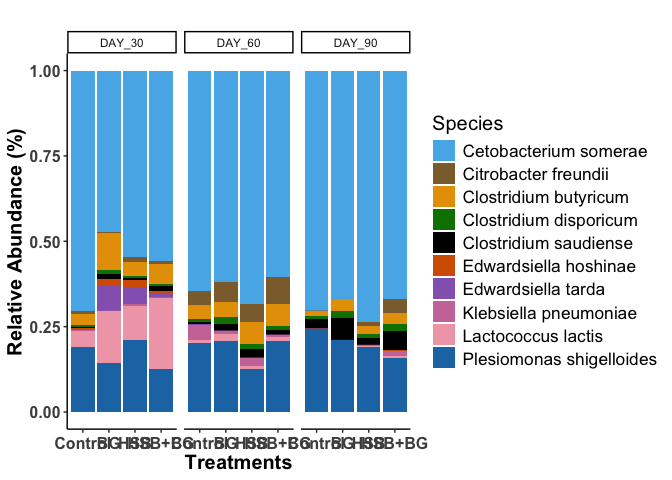
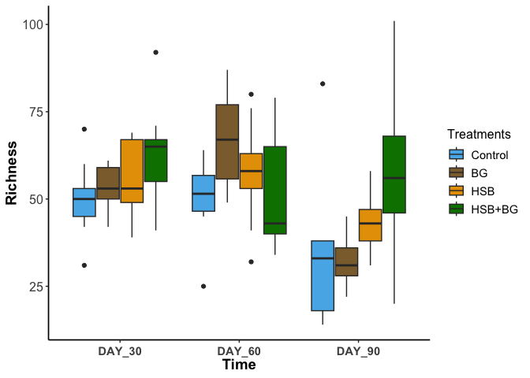

- [Install and Load all required
  packages](#install-and-load-all-required-packages)
- [Set up color pallet to use through this analysis
  F0E442](#set-up-color-pallet-to-use-through-this-analysis-f0e442)
- [Load in all required formatted files from the HPC or formatted epi2me
  output.](#load-in-all-required-formatted-files-from-the-hpc-or-formatted-epi2me-output.)
- [Format all CSV input data to ensure match rows and
  column](#format-all-csv-input-data-to-ensure-match-rows-and-column)
- [Load all file into phyloseq](#load-all-file-into-phyloseq)
- [Samples quality control and read
  distribution](#samples-quality-control-and-read-distribution)
- [ANALYSIS AND VISUALIZATION](#analysis-and-visualization)

### Install and Load all required packages

``` r
# Check and install missing packages only
required_packages <- c(
    "vegan", "phyloseq", "Biostrings", "metagenomeSeq", 
    "decontam", "indicspecies", "DESeq2", "ggpubr", "tidyverse", 
    "ggplot2", "dunn.test", "writexl", "pairwiseAdonis", "remotes", "emmeans", "multcompView", 
    "cluster", "devtools", "statmod", "gtools", "BiocStyle", "DECIPHER", "phangorn", "gridExtra"
)

# Install missing packages
for (pkg in required_packages) {
    if (!requireNamespace(pkg, quietly = TRUE)) {
        cat("Installing missing package:", pkg, "\n")
        if (pkg %in% c("vegan", "phyloseq", "Biostrings", "metagenomeSeq", 
                       "decontam", "indicspecies", "DESeq2", "ggpubr", "BiocStyle", "DECIPHER", "phangorn")) {
            BiocManager::install(pkg, lib = "~/R/library")
        } else {
            install.packages(pkg, repos = "http://cran.us.r-project.org", lib = "~/R/library")
        }
    }
}

# Load libraries
library("vegan")
```

    ## Loading required package: permute

    ## Loading required package: lattice

``` r
library("phyloseq")
library("Biostrings")
```

    ## Warning: package 'Biostrings' was built under R version 4.4.2

    ## Loading required package: BiocGenerics

    ## 
    ## Attaching package: 'BiocGenerics'

    ## The following objects are masked from 'package:stats':
    ## 
    ##     IQR, mad, sd, var, xtabs

    ## The following objects are masked from 'package:base':
    ## 
    ##     anyDuplicated, aperm, append, as.data.frame, basename, cbind,
    ##     colnames, dirname, do.call, duplicated, eval, evalq, Filter, Find,
    ##     get, grep, grepl, intersect, is.unsorted, lapply, Map, mapply,
    ##     match, mget, order, paste, pmax, pmax.int, pmin, pmin.int,
    ##     Position, rank, rbind, Reduce, rownames, sapply, saveRDS, setdiff,
    ##     table, tapply, union, unique, unsplit, which.max, which.min

    ## Loading required package: S4Vectors

    ## Loading required package: stats4

    ## 
    ## Attaching package: 'S4Vectors'

    ## The following object is masked from 'package:utils':
    ## 
    ##     findMatches

    ## The following objects are masked from 'package:base':
    ## 
    ##     expand.grid, I, unname

    ## Loading required package: IRanges

    ## Warning: package 'IRanges' was built under R version 4.4.2

    ## 
    ## Attaching package: 'IRanges'

    ## The following object is masked from 'package:phyloseq':
    ## 
    ##     distance

    ## Loading required package: XVector

    ## Loading required package: GenomeInfoDb

    ## Warning: package 'GenomeInfoDb' was built under R version 4.4.2

    ## 
    ## Attaching package: 'Biostrings'

    ## The following object is masked from 'package:base':
    ## 
    ##     strsplit

``` r
library("metagenomeSeq")
```

    ## Warning: package 'metagenomeSeq' was built under R version 4.4.2

    ## Loading required package: Biobase

    ## Welcome to Bioconductor
    ## 
    ##     Vignettes contain introductory material; view with
    ##     'browseVignettes()'. To cite Bioconductor, see
    ##     'citation("Biobase")', and for packages 'citation("pkgname")'.

    ## 
    ## Attaching package: 'Biobase'

    ## The following object is masked from 'package:phyloseq':
    ## 
    ##     sampleNames

    ## Loading required package: limma

    ## Warning: package 'limma' was built under R version 4.4.2

    ## 
    ## Attaching package: 'limma'

    ## The following object is masked from 'package:BiocGenerics':
    ## 
    ##     plotMA

    ## Loading required package: glmnet

    ## Loading required package: Matrix

    ## 
    ## Attaching package: 'Matrix'

    ## The following object is masked from 'package:S4Vectors':
    ## 
    ##     expand

    ## Loaded glmnet 4.1-8

    ## Loading required package: RColorBrewer

``` r
library("decontam")
library("indicspecies")
```

    ## 
    ## Attaching package: 'indicspecies'

    ## The following object is masked from 'package:Biostrings':
    ## 
    ##     coverage

    ## The following object is masked from 'package:IRanges':
    ## 
    ##     coverage

``` r
library("DESeq2")
```

    ## Loading required package: GenomicRanges

    ## Loading required package: SummarizedExperiment

    ## Loading required package: MatrixGenerics

    ## Warning: package 'MatrixGenerics' was built under R version 4.4.2

    ## Loading required package: matrixStats

    ## 
    ## Attaching package: 'matrixStats'

    ## The following objects are masked from 'package:Biobase':
    ## 
    ##     anyMissing, rowMedians

    ## 
    ## Attaching package: 'MatrixGenerics'

    ## The following objects are masked from 'package:matrixStats':
    ## 
    ##     colAlls, colAnyNAs, colAnys, colAvgsPerRowSet, colCollapse,
    ##     colCounts, colCummaxs, colCummins, colCumprods, colCumsums,
    ##     colDiffs, colIQRDiffs, colIQRs, colLogSumExps, colMadDiffs,
    ##     colMads, colMaxs, colMeans2, colMedians, colMins, colOrderStats,
    ##     colProds, colQuantiles, colRanges, colRanks, colSdDiffs, colSds,
    ##     colSums2, colTabulates, colVarDiffs, colVars, colWeightedMads,
    ##     colWeightedMeans, colWeightedMedians, colWeightedSds,
    ##     colWeightedVars, rowAlls, rowAnyNAs, rowAnys, rowAvgsPerColSet,
    ##     rowCollapse, rowCounts, rowCummaxs, rowCummins, rowCumprods,
    ##     rowCumsums, rowDiffs, rowIQRDiffs, rowIQRs, rowLogSumExps,
    ##     rowMadDiffs, rowMads, rowMaxs, rowMeans2, rowMedians, rowMins,
    ##     rowOrderStats, rowProds, rowQuantiles, rowRanges, rowRanks,
    ##     rowSdDiffs, rowSds, rowSums2, rowTabulates, rowVarDiffs, rowVars,
    ##     rowWeightedMads, rowWeightedMeans, rowWeightedMedians,
    ##     rowWeightedSds, rowWeightedVars

    ## The following object is masked from 'package:Biobase':
    ## 
    ##     rowMedians

``` r
library("ggpubr")
```

    ## Loading required package: ggplot2

``` r
library("tidyverse")
```

    ## ── Attaching core tidyverse packages ──────────────────────── tidyverse 2.0.0 ──
    ## ✔ dplyr     1.1.4     ✔ readr     2.1.5
    ## ✔ forcats   1.0.0     ✔ stringr   1.5.1
    ## ✔ lubridate 1.9.4     ✔ tibble    3.2.1
    ## ✔ purrr     1.0.4     ✔ tidyr     1.3.1

    ## ── Conflicts ────────────────────────────────────────── tidyverse_conflicts() ──
    ## ✖ lubridate::%within%() masks IRanges::%within%()
    ## ✖ dplyr::collapse()     masks Biostrings::collapse(), IRanges::collapse()
    ## ✖ dplyr::combine()      masks Biobase::combine(), BiocGenerics::combine()
    ## ✖ purrr::compact()      masks XVector::compact()
    ## ✖ dplyr::count()        masks matrixStats::count()
    ## ✖ dplyr::desc()         masks IRanges::desc()
    ## ✖ tidyr::expand()       masks Matrix::expand(), S4Vectors::expand()
    ## ✖ dplyr::filter()       masks stats::filter()
    ## ✖ dplyr::first()        masks S4Vectors::first()
    ## ✖ dplyr::lag()          masks stats::lag()
    ## ✖ tidyr::pack()         masks Matrix::pack()
    ## ✖ ggplot2::Position()   masks BiocGenerics::Position(), base::Position()
    ## ✖ purrr::reduce()       masks GenomicRanges::reduce(), IRanges::reduce()
    ## ✖ dplyr::rename()       masks S4Vectors::rename()
    ## ✖ lubridate::second()   masks S4Vectors::second()
    ## ✖ lubridate::second<-() masks S4Vectors::second<-()
    ## ✖ dplyr::slice()        masks XVector::slice(), IRanges::slice()
    ## ✖ tidyr::unpack()       masks Matrix::unpack()
    ## ℹ Use the conflicted package (<http://conflicted.r-lib.org/>) to force all conflicts to become errors

``` r
library("ggplot2")
library("dunn.test")
library("writexl")
library("lme4")
library("emmeans")
```

    ## Welcome to emmeans.
    ## Caution: You lose important information if you filter this package's results.
    ## See '? untidy'

``` r
library("multcomp")
```

    ## Loading required package: mvtnorm
    ## Loading required package: survival
    ## Loading required package: TH.data
    ## Loading required package: MASS
    ## 
    ## Attaching package: 'MASS'
    ## 
    ## The following object is masked from 'package:dplyr':
    ## 
    ##     select
    ## 
    ## 
    ## Attaching package: 'TH.data'
    ## 
    ## The following object is masked from 'package:MASS':
    ## 
    ##     geyser

``` r
library("multcompView")
library("pairwiseAdonis")
```

    ## Loading required package: cluster

``` r
library("cluster")
library("devtools")
```

    ## Loading required package: usethis
    ## 
    ## Attaching package: 'devtools'
    ## 
    ## The following object is masked from 'package:emmeans':
    ## 
    ##     test
    ## 
    ## The following object is masked from 'package:permute':
    ## 
    ##     check

### Set up color pallet to use through this analysis F0E442

``` r
# color blind pallet
cbbPalette <- c("#D55E00", "#8C6D3B", "#56B4E9", "#008000", "#000000", 
                "#0072B2", "#009E73", "#CC79A7", "#F1A7B6", "#1F77B4", 
                "#8C564B", "#2CA02C", "#FF7F0E", "#9467BD", "#E69F00")
```

### Load in all required formatted files from the HPC or formatted epi2me output.

``` r
taxa <- read.csv("R_data/Taxa_file.csv", header = TRUE, row.names = 1, na.strings = "na")
otu.table <- read.csv("R_data/OTU_table_16s.csv", na.strings = "na")
metadata <- read.csv("R_data/metadata_test.csv", na.strings = "na")
tree.read <- "R_data/tree.nwk"
fasta.read <- "R_data/fasta_file.fasta"
```

### Format all CSV input data to ensure match rows and column

``` r
taxa$OTU <- rownames(taxa)
rownames(otu.table) <- otu.table$OTU
otu.table <- otu.table[,-1]
rownames(metadata) <- metadata$SampleID #row names must match OTU table headers
```

### Load all file into phyloseq

``` r
# read data into plysoseq
phy.tax <- phyloseq::tax_table(as.matrix(taxa))
phy.OTU.table <- phyloseq::otu_table(otu.table, taxa_are_rows = TRUE)
phy.data <- phyloseq::sample_data(metadata)
phy.fasta <- Biostrings::readDNAStringSet(fasta.read, format="fasta", seek.first.rec=TRUE, use.names=TRUE)
phy.tree <- phyloseq::read_tree(tree.read)

phyloseq.data <- phyloseq(phy.tax, phy.OTU.table, phy.data, phy.fasta, phy.tree)
phyloseq.data
```

    ## phyloseq-class experiment-level object
    ## otu_table()   OTU Table:         [ 378 taxa and 106 samples ]
    ## sample_data() Sample Data:       [ 106 samples by 4 sample variables ]
    ## tax_table()   Taxonomy Table:    [ 378 taxa by 9 taxonomic ranks ]
    ## phy_tree()    Phylogenetic Tree: [ 378 tips and 376 internal nodes ]
    ## refseq()      DNAStringSet:      [ 378 reference sequences ]

### Samples quality control and read distribution

``` r
# filter out taxa that have non-zero abundance in less than 2 samples
ps.clean <- filter_taxa(phyloseq.data, function (x) {sum(x > 0) >= 2}, prune=TRUE)
# see read distribution from the highest to lowest
sort(sample_sums(ps.clean), decreasing = T)
```

    ##     barcode11     barcode02     barcode12  barcode09_92     barcode10 
    ##        225630        218996        217666        204938        193991 
    ##  barcode02_70     barcode06     barcode03     barcode09  barcode17_85 
    ##        193941        193532        166669        165747        154874 
    ##     barcode08  barcode18_86 barcode19_100     barcode04  barcode10_78 
    ##        152689        152467        149304        149160        145952 
    ##  barcode12_18 barcode21_102  barcode18_99     barcode01 barcode23_104 
    ##        145524        144279        142339        136918        135315 
    ##  barcode09_77  barcode11_93  barcode20_28     barcode05  barcode14_96 
    ##        134846        124679        123693        123216        120269 
    ##  barcode05_73  barcode01_69  barcode21_42  barcode22_43     barcode07 
    ##        118954        112040        111028        107493        106874 
    ## barcode20_101  barcode14_24  barcode05_50  barcode15_97 barcode24_105 
    ##        105088        103672        103189        102764        102304 
    ##  barcode13_95  barcode22_66  barcode12_94  barcode21_65  barcode08_53 
    ##        101072        100874        100027         98721         93841 
    ##  barcode07_52  barcode09_16  barcode16_98  barcode23_67  barcode19_27 
    ##         91825         90029         89462         88681         88290 
    ##  barcode05_29  barcode19_64  barcode02_47  barcode07_75  barcode23_44 
    ##         87822         85925         85613         85403         84847 
    ##  barcode17_21  barcode16_84  barcode15_83  barcode18_22  barcode08_15 
    ##         84084         82097         82046         80244         79227 
    ##  barcode12_57  barcode01_46  barcode18_63  barcode06_51  barcode23_91 
    ##         79005         76676         76218         75988         75682 
    ##  barcode15_40  barcode13_19  barcode07_14  barcode01_13  barcode24_68 
    ##         74513         74066         74040         73644         72997 
    ##  barcode18_33  barcode12_38  barcode22_90  barcode17_62  barcode16_61 
    ##         72473         72236         71988         71113         70088 
    ##  barcode11_17  barcode04_49  barcode03_48  barcode15_20  barcode11_56 
    ##         69268         69049         68582         68023         66064 
    ##  barcode18_26  barcode20_23  barcode16_41  barcode11_37  barcode17_32 
    ##         66005         64623         64611         64453         64242 
    ##  barcode10_36  barcode24_45  barcode08_76  barcode15_60  barcode13_58 
    ##         63770         63712         61711         61649         61578 
    ##  barcode06_74  barcode14_59  barcode19_87  barcode21_89  barcode12_80 
    ##         61205         61204         60397         60285         60134 
    ##  barcode10_55  barcode07_31  barcode09_35  barcode09_54  barcode15_25 
    ##         60089         59928         59812         59071         58888 
    ##  barcode13_81 barcode04_106  barcode06_30  barcode04_72  barcode20_34 
    ##         58710         58561         58265         57870         55018 
    ##  barcode11_79  barcode20_88  barcode03_71  barcode14_82  barcode14_39 
    ##         54916         54713         52606         52394         51350 
    ## barcode22_103 
    ##         31999

``` r
# check total reads
sum(sample_sums(ps.clean))
```

    ## [1] 10145652

``` r
# chech mean read 
mean(sample_sums(ps.clean))
```

    ## [1] 95713.7

``` r
# median read
median(sample_sums(ps.clean))
```

    ## [1] 81145

### ANALYSIS AND VISUALIZATION

#### Relative Abundance Plot

``` r
# fecal samples Relative Abundance/treatment*day
top20 <- names(sort(taxa_sums(ps.clean), decreasing=TRUE))[1:10]
ps.top20 <- transform_sample_counts(ps.clean, function(OTU) OTU/sum(OTU))
ps.top20 <- prune_taxa(top20, ps.top20)
dat.dataframe <- psmelt(ps.top20)
```

    ## Warning in psmelt(ps.top20): The rank names: 
    ## OTU
    ##  have been renamed to: 
    ## taxa_OTU
    ## to avoid conflicts with special phyloseq plot attribute names.

``` r
dat.agr <- aggregate(Abundance ~ treatment*day + Species + genus + Phylum, data = dat.dataframe, FUN = mean)
dat.agr$treatment <- factor(dat.agr$treatment, levels = c("BASAL", "YCW", "IFC4", "IFC4+YCW"))
rel_abun_treatment <-ggplot(dat.agr, aes(x = treatment, y = Abundance, fill = Species)) +
  facet_wrap(~day) +
  geom_bar(stat = "identity", position = "fill") +
  theme_classic() +
  scale_fill_manual(values=cbbPalette) +
  labs(title = "",
       x = "Treatments",
       y = "Relative Abundance (%)") +
  theme(axis.text.x = element_text(size = 12, face = "bold", vjust = 0.5, hjust=0.5),
        axis.text.y = element_text(size = 12, face = "bold"),
        axis.title.y = element_text(size = 15, face = "bold"),
        axis.title.x = element_text(size = 15, face = "bold"),
        legend.text = element_text(size = 12),    # Adjust legend text size
        legend.title = element_text(size = 15))     # Adjust legend title size 

rel_abun_treatment
```

<!-- -->

#### Alpha diversity

``` r
# Estimate multiple richness measures at once
alpha_diversity <- estimate_richness(ps.clean, measures = c("Shannon", "InvSimpson", "Observed"))

# Add the measures to the sample data
ps.clean@sam_data$shannon <- alpha_diversity$Shannon
ps.clean@sam_data$invsimpson <- alpha_diversity$InvSimpson
ps.clean@sam_data$richness <- alpha_diversity$Observed

# Compute evenness (Shannon / log(richness))
ps.clean@sam_data$even <- ps.clean@sam_data$shannon / log(ps.clean@sam_data$richness)
```

#### Prepare data for Analysis

``` r
# extract data from phyloseq object into a dataframe
sample.df <- data.frame(ps.clean@sam_data)
# arrange order
sample.df$treatment <- factor(sample.df$treatment, levels = c("BASAL", "YCW", "IFC4", "IFC4+YCW"))
```

#### Richness Visualization

``` r
# Richness by treatment*time interaction
richness.treatment.time <- ggplot(sample.df, aes(x = treatment, y = richness, fill = treatment)) +
  geom_boxplot() +
  #geom_jitter() + 
  ylab("Richness") + 
  stat_compare_means(method = "anova") + 
  xlab("")+
  theme_bw() +
  facet_wrap(~day) +
  scale_fill_manual(values=cbbPalette) +
  theme(axis.text.x = element_text(size = 11, vjust = 0.5, hjust=0.5, face = "bold"),
        axis.text.y = element_text(size = 12),
        axis.title.y = element_text(size = 14, face = "bold"),
        axis.line = element_line(size = 0.6),
        legend.text = element_text(size = 12),    # Adjust legend text size
        legend.title = element_text(size = 16))     # Adjust legend title size
```

    ## Warning: The `size` argument of `element_line()` is deprecated as of ggplot2 3.4.0.
    ## ℹ Please use the `linewidth` argument instead.
    ## This warning is displayed once every 8 hours.
    ## Call `lifecycle::last_lifecycle_warnings()` to see where this warning was
    ## generated.

``` r
richness.treatment.time
```

<!-- -->

#### Richness analysis

``` r
rich.trt.time <- aov(richness ~ treatment*day, data = sample.df)
summary(rich.trt.time) #treatment=0.027, day=3.02e-05, inter=0.015
```

    ##               Df Sum Sq Mean Sq F value   Pr(>F)    
    ## treatment      3   1975   658.3   3.184   0.0274 *  
    ## day            2   5000  2499.8  12.090 2.12e-05 ***
    ## treatment:day  6   3476   579.3   2.802   0.0149 *  
    ## Residuals     94  19435   206.8                     
    ## ---
    ## Signif. codes:  0 '***' 0.001 '**' 0.01 '*' 0.05 '.' 0.1 ' ' 1

``` r
# Since there is significant interaction, split data by day
sample.df.d30 <- subset(sample.df, day == "DAY_30")
sample.df.d60 <- subset(sample.df, day == "DAY_60")
sample.df.d90 <- subset(sample.df, day == "DAY_90")

# run an lm to compare treatments at each time points
rich.30 <- lm(richness ~ treatment, data = sample.df.d30)
aov.rich.30 <- anova(rich.30) # 0.098
print(aov.rich.30)
```

    ## Analysis of Variance Table
    ## 
    ## Response: richness
    ##           Df Sum Sq Mean Sq F value  Pr(>F)  
    ## treatment  3  859.3  286.44  2.2815 0.09803 .
    ## Residuals 32 4017.6  125.55                  
    ## ---
    ## Signif. codes:  0 '***' 0.001 '**' 0.01 '*' 0.05 '.' 0.1 ' ' 1

``` r
rich.60 <- lm(richness ~ treatment, data = sample.df.d60)
aov.rich.60 <- anova(rich.60) # 0.084
print(aov.rich.60)
```

    ## Analysis of Variance Table
    ## 
    ## Response: richness
    ##           Df Sum Sq Mean Sq F value  Pr(>F)  
    ## treatment  3 1519.2  506.41  2.4416 0.08358 .
    ## Residuals 30 6222.3  207.41                  
    ## ---
    ## Signif. codes:  0 '***' 0.001 '**' 0.01 '*' 0.05 '.' 0.1 ' ' 1

``` r
rich.90 <- lm(richness ~ treatment, data = sample.df.d90)
aov.rich.90 <- anova(rich.90) # 0.027
print(aov.rich.90)
```

    ## Analysis of Variance Table
    ## 
    ## Response: richness
    ##           Df Sum Sq Mean Sq F value  Pr(>F)  
    ## treatment  3 3000.2 1000.07  3.4803 0.02709 *
    ## Residuals 32 9195.3  287.35                  
    ## ---
    ## Signif. codes:  0 '***' 0.001 '**' 0.01 '*' 0.05 '.' 0.1 ' ' 1

``` r
# perform pairwise comparison
lsmeans <- emmeans(rich.90, ~treatment) # fungicide effect within growthstage
Results_lsmeans <- cld(lsmeans, alpha = 0.05, reversed = TRUE, details = TRUE) # contrast with Tukey ajustment
Results_lsmeans
```

    ## $emmeans
    ##  treatment emmean   SE df lower.CL upper.CL .group
    ##  IFC4+YCW    54.6 5.65 32     43.0     66.1  1    
    ##  IFC4        44.4 5.65 32     32.9     56.0  12   
    ##  BASAL       33.3 5.65 32     21.8     44.8  12   
    ##  YCW         32.1 5.65 32     20.6     43.6   2   
    ## 
    ## Confidence level used: 0.95 
    ## P value adjustment: tukey method for comparing a family of 4 estimates 
    ## significance level used: alpha = 0.05 
    ## NOTE: If two or more means share the same grouping symbol,
    ##       then we cannot show them to be different.
    ##       But we also did not show them to be the same. 
    ## 
    ## $comparisons
    ##  contrast           estimate   SE df t.ratio p.value
    ##  BASAL - YCW            1.22 7.99 32   0.153  0.9987
    ##  IFC4 - YCW            12.33 7.99 32   1.543  0.4244
    ##  IFC4 - BASAL          11.11 7.99 32   1.390  0.5143
    ##  (IFC4+YCW) - YCW      22.44 7.99 32   2.809  0.0399
    ##  (IFC4+YCW) - BASAL    21.22 7.99 32   2.656  0.0564
    ##  (IFC4+YCW) - IFC4     10.11 7.99 32   1.265  0.5910
    ## 
    ## P value adjustment: tukey method for comparing a family of 4 estimates

#### Evenness Visualization

``` r
# Richness by treatment*time interaction
even.treatment.time <- ggplot(sample.df, aes(x = treatment, y = even, fill = treatment)) +
  geom_boxplot() +
  #geom_jitter() + 
  ylab("Eveness") + 
  xlab("")+
  theme_bw() +
  facet_wrap(~day) +
  scale_fill_manual(values=cbbPalette) +
  theme(axis.text.x = element_text(size = 11, vjust = 0.5, hjust=0.5, face = "bold"),
        axis.text.y = element_text(size = 12),
        axis.title.y = element_text(size = 14, face = "bold"),
        axis.line = element_line(size = 0.6),
        legend.text = element_text(size = 12),    # Adjust legend text size
        legend.title = element_text(size = 16))     # Adjust legend title size

even.treatment.time
```

<!-- -->

#### Eveness analysis

``` r
even.trt.time <- lm(even ~ treatment*day, data = sample.df)
anova(even.trt.time) #treatment=0.088, day=0.126, inter=0.971
```

    ## Analysis of Variance Table
    ## 
    ## Response: even
    ##               Df  Sum Sq  Mean Sq F value  Pr(>F)  
    ## treatment      3 0.10430 0.034765  2.2494 0.08767 .
    ## day            2 0.06534 0.032669  2.1137 0.12649  
    ## treatment:day  6 0.02007 0.003345  0.2164 0.97073  
    ## Residuals     94 1.45283 0.015456                  
    ## ---
    ## Signif. codes:  0 '***' 0.001 '**' 0.01 '*' 0.05 '.' 0.1 ' ' 1

#### Shannon Visualization

``` r
# Shannon by treatment*time interaction
shannon.treatment.time <- ggplot(sample.df, aes(x = treatment, y = shannon, fill = treatment)) +
  geom_boxplot() +
  #geom_jitter() + 
  ylab("Shannon") + 
  xlab("")+
  theme_bw() +
  facet_wrap(~day) +
  scale_fill_manual(values=cbbPalette) +
  theme(axis.text.x = element_text(size = 11, vjust = 0.5, hjust=0.5, face = "bold"),
        axis.text.y = element_text(size = 12),
        axis.title.y = element_text(size = 14, face = "bold"),
        axis.line = element_line(size = 0.6),
        legend.text = element_text(size = 12),    # Adjust legend text size
        legend.title = element_text(size = 16))     # Adjust legend title size

shannon.treatment.time
```

<!-- -->

#### Shannon analysis

``` r
shan.trt.time <- aov(shannon ~ treatment*day, data = sample.df)
summary(shan.trt.time) #treatment=0.020, day=3.02e-05, inter=0.012
```

    ##               Df Sum Sq Mean Sq F value Pr(>F)  
    ## treatment      3  2.125  0.7083   2.361 0.0763 .
    ## day            2  2.008  1.0042   3.348 0.0394 *
    ## treatment:day  6  0.571  0.0951   0.317 0.9266  
    ## Residuals     94 28.194  0.2999                 
    ## ---
    ## Signif. codes:  0 '***' 0.001 '**' 0.01 '*' 0.05 '.' 0.1 ' ' 1

#### Publication figure

``` r
# Create the "Plots" folder. This checks if the folder exist or not
if (!dir.exists("Plots")) {
  dir.create("Plots")
}

# Create your plot
# Arrange Alpha diversity plots into a single figure
AlphaFig <- ggarrange(richness.treatment.time, 
                     even.treatment.time, 
                     shannon.treatment.time, 
                     labels = "auto", 
                     nrow = 3, ncol = 1, 
                     common.legend = TRUE)
# Relative abundance
AbunFig <- ggarrange(rel_abun_treatment, nrow = 1)

# Save the plots in high quality to the "Plots" folder
ggsave("Plots/AlphaFig.tiff", plot = AlphaFig, dpi=300, width = 27, height = 23, units = "cm")
ggsave("Plots/AbunFig.tiff", plot = AbunFig, dpi = 300, width = 32, height = 15, units = "cm")
 
# Or save in low size file
# Save the plots in high quality to the "Plots" folder
ggsave("Plots/AlphaFig.jpg", plot = AlphaFig, dpi=300, width = 27, height = 23, units = "cm")
ggsave("Plots/AbunFig.jpg", plot = AbunFig, dpi = 300, width = 32, height = 15, units = "cm")
```
